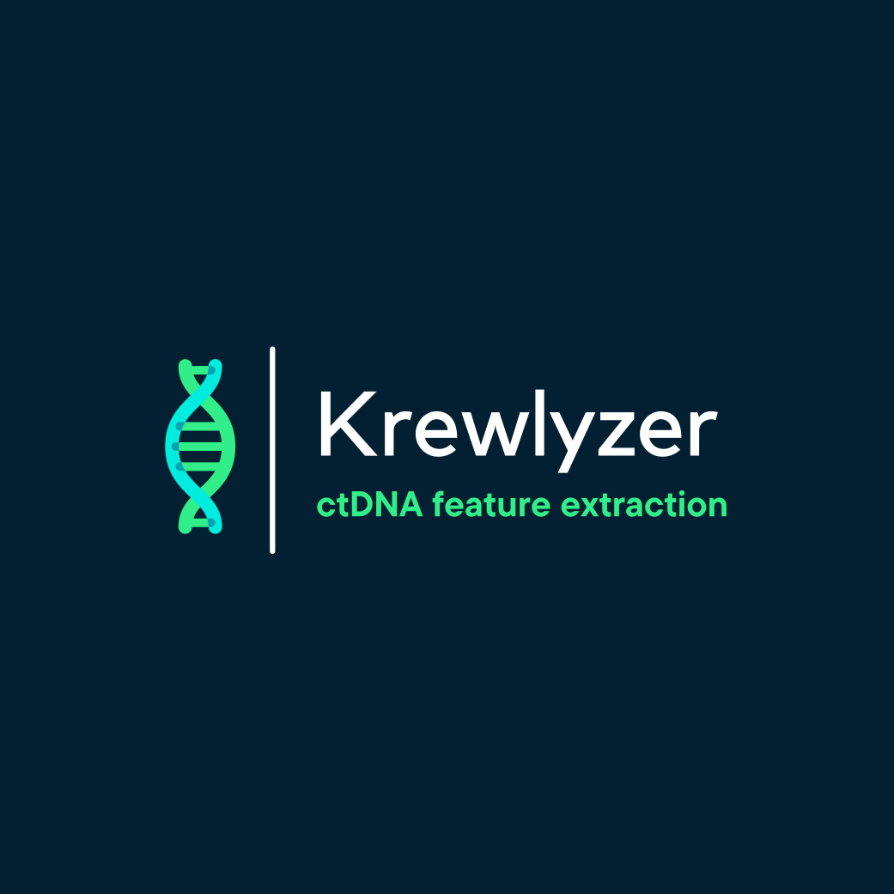

# Krewlyzer: Comprehensive cfDNA Feature Extraction Toolkit

<p align="center">
  
</p>

<p align="center">
  <a href="https://pypi.org/project/krewlyzer/"></a>
  <a href="https://github.com/msk-access/krewlyzer/actions"></a>
  <a href="https://github.com/msk-access/krewlyzer/pkgs/container/krewlyzer"></a>
</p>

**Krewlyzer** is a high-performance toolkit for extracting biological features from cell-free DNA (cfDNA) sequencing data. Designed for cancer genomics, liquid biopsy research, and clinical bioinformatics.

**Built with Python + Rust** for maximum performance. The compute-intensive core uses [PyO3](https://pyo3.rs/) to deliver 5-50x speedups over pure Python.

> [!TIP]
> **Full Documentation**: [msk-access.github.io/krewlyzer](https://msk-access.github.io/krewlyzer/)

---

## Why Krewlyzer?

Cancer cells leave molecular fingerprints in your blood. Krewlyzer finds them.

### The Fragmentomics Advantage

| Traditional Liquid Biopsy | Fragmentomics with Krewlyzer |
|---------------------------|------------------------------|
| Look for specific mutations | Analyze **how DNA is cut** |
| Need prior knowledge of tumor | Works without knowing mutations |
| Miss ~50% of early cancers | Detect more cancers, earlier |

**Key insight**: Tumor DNA fragments are **shorter** (~145bp) than healthy DNA (~166bp). Krewlyzer quantifies this difference and extracts ML-ready features.

### What You Get

| Feature | Clinical Use |
|---------|--------------|
| **Fragment size ratios** | Tumor burden estimation |
| **Cutting patterns** | Tissue of origin identification |
| **Nucleosome positioning** | Epigenetic profiling |
| **Mutation-specific sizes** | MRD monitoring |

> **New to cfDNA?** Read [Core Concepts](https://msk-access.github.io/krewlyzer/getting-started/concepts/) for background.

---

## Quick Install

```bash
# Docker (recommended - all data bundled)
docker pull ghcr.io/msk-access/krewlyzer:latest

# Clone + Install (development)
git clone https://github.com/msk-access/krewlyzer.git && cd krewlyzer
git lfs pull && pip install -e .

# pip + Data Clone (custom environments)
pip install krewlyzer
git clone --depth 1 https://github.com/msk-access/krewlyzer.git ~/.krewlyzer-data
cd ~/.krewlyzer-data && git lfs pull
export KREWLYZER_DATA_DIR=~/.krewlyzer-data/src/krewlyzer/data
```

> [!NOTE]
> **pip users**: The `KREWLYZER_DATA_DIR` env var is required to locate bundled assets. See [Installation Guide](https://msk-access.github.io/krewlyzer/getting-started/installation/) for details.

## Quick Start

```bash
# Run all fragmentomics features
krewlyzer run-all -i sample.bam --reference hg19.fa --output results/

# Generate unified JSON for ML pipelines
krewlyzer run-all -i sample.bam --reference hg19.fa --output results/ --generate-json

# Individual tools
krewlyzer extract -i sample.bam -r hg19.fa -o output/
krewlyzer fsc -i output/sample.bed.gz -o output/

# Panel data (MSK-ACCESS) with target regions
krewlyzer run-all -i sample.bam -r hg19.fa -o results/ \
    --target-regions panel_targets.bed \
    --pon-model msk-access.pon.parquet
```

---

## Features

| Command | Description | Output |
|---------|-------------|--------|
| `extract` | Extract fragments from BAM | `.bed.gz` |
| `motif` | End, breakpoint & MDS scores | `.EndMotif.tsv`, `.BreakPointMotif.tsv`, `.MDS.tsv` |
| `fsc` | Fragment size coverage | `.FSC.tsv` |
| `fsr` | Fragment size ratios | `.FSR.tsv` |
| `fsd` | Size distribution by arm | `.FSD.tsv` |
| `wps` | Windowed protection score | `.WPS.parquet` |
| `ocf` | Orientation-aware fragmentation | `.OCF.tsv` |
| `region-entropy` | TFBS/ATAC size entropy | `.TFBS.tsv`, `.ATAC.tsv` |
| `region-mds` | Gene- and exon-level MDS | `.MDS.gene.tsv`, `.MDS.exon.tsv` |
| `uxm` | Fragment-level methylation | `.UXM.tsv` |
| `mfsd` | Mutant vs wild-type sizes | `.mFSD.tsv` |
| `build-pon` | Build Panel of Normals (`--from-outputs` re-aggregates existing runs) | `.pon.parquet` |
| `build-gc-reference` | Build GC reference assets | `.gc_reference.tsv` |
| `run-all` | All features in one pass | All outputs |

Pass `--output-format parquet` to any of them, or `--generate-json` to `run-all`
for a single `.features.json` for ML pipelines.

### Inspecting and Validating

These read inputs or a finished output directory rather than producing features.

| Command | Description |
|---------|-------------|
| `validate` | Check input **assets** — BEDs, anchors, GC factors — before a run |
| `describe-output` | What is in each output file: shape, columns, ranges |
| `report` | Single-sample HTML report — verdict, charts, interpretation |
| `validate-output` | Check results against the downstream output contract |
| `validate-cohort` | Cross-sample degeneracy checks over fingerprints |
| `validate-pon` | Check a PON **before** anything is scored against it |
| `stamp-pon` | Record the release a built PON ships with |

```bash
krewlyzer validate -G hg19                        # assets are intact
krewlyzer validate-pon model.pon.parquet          # the reference is sound
krewlyzer validate-output results/                # results satisfy the contract
krewlyzer describe-output results/{sample_id}/    # what is in each file
pip install 'krewlyzer[report]'
krewlyzer report results/{sample_id}/ -o report.html
```

> [!NOTE]
> A `report` contains one sample's actual measurements — generate it on demand
> for internal use, and use `describe-output` for anything structural that needs
> to leave the machine. See the [CLI reference](https://msk-access.github.io/krewlyzer/cli/)
> for exit codes and options.

### Upgrading to 0.9.0 — your own PON will be refused

The bundled PONs were **rebuilt** for 0.9.0, not just re-stamped. A PON you
built yourself with an earlier version is refused rather than scored against:

```
my.pon.parquet was built for krewlyzer 0.8.3, older than the 0.9.0 floor.
Version 0.9.0 changed what the features mean, so its baselines measure
something else -- a fabricated wps_background, floored sigmas, and a
region-MDS fitted over a different fragment range. Rebuild it with
build-pon. To score against it anyway, set KREWLYZER_ALLOW_OLD_PON=1.
```

Every pre-0.9.0 model divided some z-scores by a σ of ~10⁻¹⁷ — floating-point
residue left where a position had no real spread, not a measurement. Rebuild
instead of overriding:

```bash
# Minutes, not hours: re-aggregates existing run-all outputs, no BAM re-read
krewlyzer build-pon --from-outputs /path/to/runall_dirs \
    --assay xs1 --genome hg19 -o new.pon.parquet
krewlyzer validate-pon new.pon.parquet
```

> [!WARNING]
> `KREWLYZER_ALLOW_OLD_PON=1` exists for reproducing an old analysis, not for
> getting past the error. Z-scores from an old model may be divided by residue,
> which produces values in the 10¹⁸ range that still look like numbers.

### Panel Mode (`--target-regions`)

For targeted sequencing panels (MSK-ACCESS):

```bash
krewlyzer run-all -i sample.bam -r hg19.fa -o results/ \
    --target-regions panel_targets.bed
```

- **GC model**: Trained on off-target fragments (unbiased)
- **Outputs**: Split into `.tsv` (off-target) and `.ontarget.tsv`
- **Auto-PON**: Use `-A xs2` to auto-load bundled PON for z-scores
- **ML negatives**: Use `-A xs2 --skip-pon` to output raw features (no z-scores)

---

## Documentation

- [Getting Started](https://msk-access.github.io/krewlyzer/getting-started/) - 5-minute quickstart
- [Installation](https://msk-access.github.io/krewlyzer/getting-started/installation/) - Docker, pip, development
- [CLI Reference](https://msk-access.github.io/krewlyzer/cli/) - Every command and option
- [Feature Details](https://msk-access.github.io/krewlyzer/features/core/extract/) - Per-feature documentation
- [Nextflow Pipeline](https://msk-access.github.io/krewlyzer/nextflow/) - Batch processing

---

## Citation

If you use Krewlyzer, please cite:

- **DELFI (FSR):** Cristiano S, et al. Nature 2019
- **WPS:** Snyder MW, et al. Cell 2016
- **OCF:** Sun K, et al. Genome Res 2019
- **UXM:** Loyfer N, et al. Nature 2022

See [Citation & Scientific Background](https://msk-access.github.io/krewlyzer/resources/citation/) for full references.

---

## License

GNU Affero General Public License v3.0 (AGPL-3.0). See [LICENSE](./LICENSE).

---

*Developed by Ronak Shah (@rhshah) at Memorial Sloan Kettering Cancer Center.*
