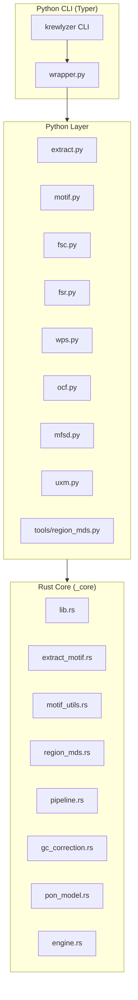
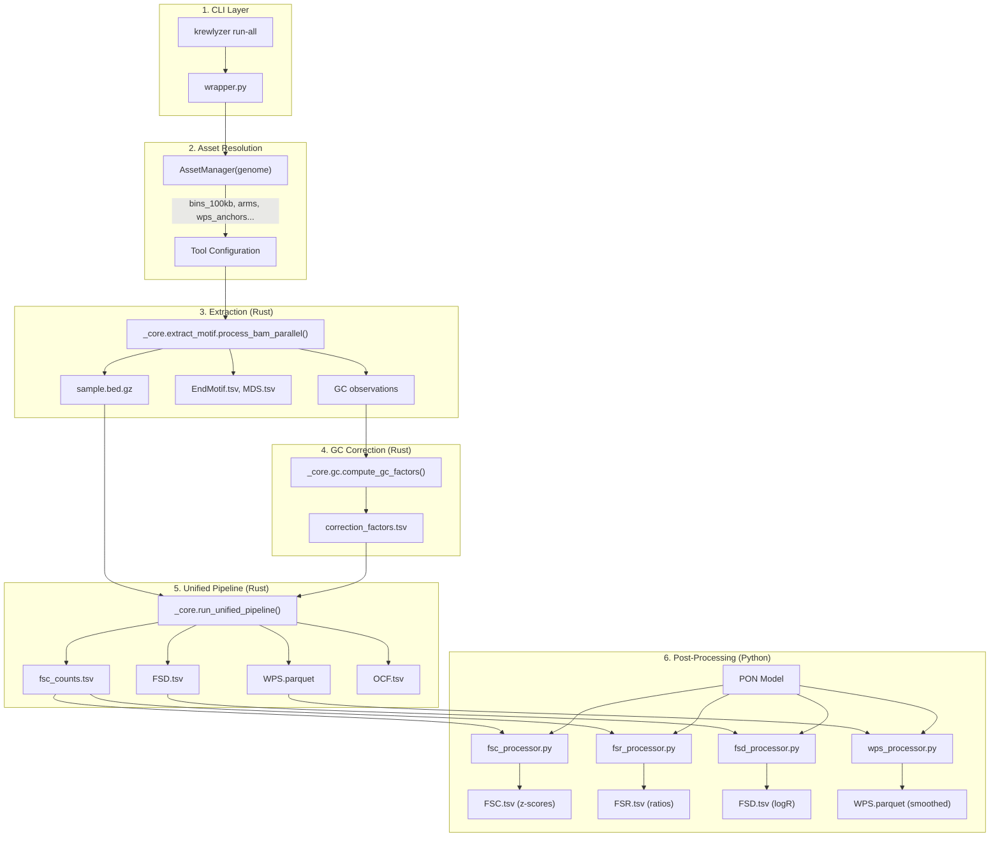

# Architecture

Krewlyzer uses a hybrid Python/Rust architecture for optimal performance and usability.

## Overview



---

## Rust Core (`krewlyzer._core`)

The performance-critical functions are implemented in Rust and exposed to Python via [PyO3](https://pyo3.rs/).

### Module Structure

| Module | Size | Purpose |
|--------|------|---------|
| `lib.rs` | 4KB | PyO3 module definition, thread config |
| `extract_motif.rs` | 17KB | BAM parsing, fragment extraction, motif counting |
| `motif_utils.rs` | 4KB | Shared 4-mer encoding and MDS calculation |
| `region_mds.rs` | 18KB | Per-region MDS analysis (Helzer et al.) |
| `pipeline.rs` | 10KB | Unified FSC/FSD/WPS/OCF pipeline |
| `fsc.rs` | 11KB | Fragment size coverage by bins |
| `fsd.rs` | 7KB | Size distribution per arm |
| `wps.rs` | 18KB | Windowed protection score |
| `ocf.rs` | 10KB | Orientation-aware fragmentation |
| `mfsd.rs` | 35KB | Mutant fragment size analysis |
| `gc_correction.rs` | 20KB | LOESS-based GC bias correction |
| `pon_model.rs` | 7KB | PON model loading and hybrid correction |
| `gc_reference.rs` | 20KB | Pre-computed GC reference generation |

### Shared Utilities: `motif_utils.rs`

The `motif_utils.rs` module provides shared DNA sequence manipulation functions used across multiple feature modules:

| Function | Signature | Description |
|----------|-----------|-------------|
| `reverse_complement` | `fn(seq: &[u8]) -> Vec<u8>` | Reverses and complements DNA sequence (A↔T, G↔C) |
| `kmer4_to_index` | `fn(kmer: &[u8]) -> Option<usize>` | Converts 4-mer to index 0-255 using 2-bit encoding |
| `calculate_mds` | `fn(counts: &[u64; 256]) -> f64` | Shannon entropy of 4-mer histogram, normalized to [0,1] |
| `calculate_gc` | `fn(seq: &[u8]) -> f64` | GC content as fraction of valid ACGT bases |

**Used by:**
- `extract_motif.rs` - Global MDS calculation from BAM
- `region_mds.rs` - Per-gene MDS at exon boundaries

**Example usage (Rust):**
```rust
use crate::motif_utils::{kmer4_to_index, calculate_mds};

// Count 4-mers
let mut counts = [0u64; 256];
if let Some(idx) = kmer4_to_index(b"ACGT") {
    counts[idx] += 1;
}

// Calculate MDS
let mds = calculate_mds(&counts);  // Range: 0.0 (uniform) to 1.0 (max diversity)
```

### Key Functions Exposed

```python
from krewlyzer import _core

# Thread configuration
_core.configure_threads(num_threads=8)

# Fragment extraction
_core.extract_motif.process_bam_parallel(
    bam_path, reference_path, filters, ...
)

# Unified pipeline
_core.run_unified_pipeline(
    bed_path, gc_ref, valid_regions, gc_factors_out,
    gc_factors_in, bin_file, fsc_out, wps_anchors, wps_out,
    wps_bg_anchors, wps_bg_out, wps_bg_flip,
    arms_file, fsd_out, ocr_file, ocf_out_dir,
    target_regions, bait_padding, silent
)

# GC correction
_core.gc.compute_and_write_gc_factors(...)
```

### run_unified_pipeline Parameters

| Parameter | Type | Description |
|-----------|------|-------------|
| `bed_path` | str | Input .bed.gz file path |
| `gc_ref` | str/None | GC reference parquet for computing factors |
| `valid_regions` | str/None | Valid regions BED for GC |
| `gc_factors_out` | str/None | Output path for computed GC factors |
| `gc_factors_in` | str/None | Pre-computed GC factors CSV |
| `bin_file` | str/None | FSC/FSR bins BED |
| `fsc_out` | str/None | FSC output TSV path |
| `wps_anchors` | str/None | WPS foreground anchors BED |
| `wps_out` | str/None | WPS foreground output parquet |
| `wps_bg_anchors` | str/None | WPS background (Alu) BED |
| `wps_bg_out` | str/None | WPS background output parquet |
| `wps_bg_flip` | bool | Flip WPS vectors for strand awareness |
| `arms_file` | str/None | Chromosome arms BED for FSD |
| `fsd_out` | str/None | FSD output TSV path |
| `ocr_file` | str/None | Open chromatin regions for OCF |
| `ocf_out_dir` | str/None | OCF output directory |
| `target_regions` | str/None | Panel target BED (on/off split) |
| `bait_padding` | int | Bait edge padding in bp (default: 50) |
| `silent` | bool | Suppress progress output |

---

## Python Layer

The Python layer provides:

1. **CLI Interface** (`cli.py`) - Typer-based commands
2. **Orchestration** (`wrapper.py`) - run-all coordination
3. **Asset Management** (`assets.py`) - Bundled data files
4. **Feature Modules** - Per-tool logic (`fsc.py`, `fsr.py`, etc.)
5. **PON Integration** (`pon/`) - Model loading and building
6. **Core Utilities** (`core/`) - Shared helpers

### Core Module (`core/`)

| File | Purpose |
|------|---------|
| `sample_processor.py` | **Unified BAM extraction** - `extract_sample()`, `write_motif_outputs()`, `write_extraction_outputs()` |
| `unified_processor.py` | **Central feature runner** - single-pass FSC/FSR/FSD/WPS/OCF via `run_features()` |
| `gc_assets.py` | Centralized GC asset resolution |
| `fsc_processor.py` | FSC z-score computation |
| `fsr_processor.py` | FSR ratio calculation |
| `wps_processor.py` | WPS post-processing |
| `wps_anchor_filter.py` | Panel-specific anchor filtering |
| `motif_processor.py` | Motif file writing (EDM, BPM, MDS) |
| `gene_bed.py` | Gene BED parsing for FSC gene aggregation |
| `feature_serializer.py` | Unified JSON output generation |

> **Architecture Note**: 
> - `sample_processor.py` provides `extract_sample()` for unified BAM extraction used by `extract.py`, `motif.py`, `wrapper.py`, and `build-pon`
> - `unified_processor.py` provides `run_features()` for unified feature extraction used by all CLI tools and `wrapper.py`

### Recent Improvements (2024-2025)

| Change | Files | Benefit |
|--------|-------|---------|
| **Unified Extraction** | `core/sample_processor.py` | Single `extract_sample()` for all BAM extraction, ~150 lines reduced |
| **Unified Processor** | `core/unified_processor.py` | Single entry point for all features, ~350 lines reduced |
| **GC Asset Helper** | `core/gc_assets.py` | Eliminated 100+ lines duplication |
| **Dual WPS Output** | `wps.py`, `wrapper.py` | Panel + genome-wide WPS |
| **JSON Serializer** | `core/feature_serializer.py` | Unified ML output |
| **Assay Support** | `assets.py`, `wrapper.py` | MSK-ACCESS v1/v2 auto-resolution |

---

## Asset Management

The `AssetManager` class in `assets.py` provides centralized resolution of bundled data files based on genome build.

### Initialization

```python
from krewlyzer.assets import AssetManager

assets = AssetManager("hg19")  # or "hg38", "GRCh37", "GRCh38"
print(assets.genome_dir)       # "GRCh37"
print(assets.file_prefix)      # "hg19"
```

### Asset Properties

| Property | Path Pattern | Used By |
|----------|--------------|---------|
| `bins_100kb` | `ChromosomeBins/{genome}/{prefix}_window_100kb.bed.gz` | FSC, FSR |
| `arms` | `ChromosomeArms/{genome}/{prefix}.arms.bed.gz` | FSD |
| `wps_anchors` | `WpsAnchors/{genome}/{prefix}.wps_anchors.bed.gz` | WPS |
| `wps_background` | `WpsBackground/{genome}/{prefix}.alu_consensus.bed.gz` | WPS |
| `ocf_regions` | `OpenChromatinRegion/{genome}/7specificTissue.all.OC.bed.gz` | OCF |
| `gc_ref` | `gc/{genome}/ref_genome_GC_{prefix}.parquet` | GC correction |
| `valid_regions` | `gc/{genome}/valid_regions_{prefix}.bed.gz` | GC correction |
| `exclude_regions` | `exclude-regions/{genome}/{prefix}-blacklist.v2.bed.gz` | Extract |

### Assay-Specific Assets

For MSK-ACCESS panels, `AssetManager` provides assay-aware resolution:

```python
# Get panel-specific WPS anchors
xs2_anchors = assets.get_wps_anchors("xs2")  
# → WpsAnchors/GRCh37/xs2.wps_anchors.bed.gz

# Get panel targets
xs2_targets = assets.get_targets("xs2")
# → targets/GRCh37/xs2.targets.bed

# Get panel PON
xs2_pon = assets.get_pon("xs2")
# → pon/GRCh37/xs2.pon.parquet
```

| Assay | WPS Anchors | Target Genes | PON |
|-------|:-----------:|:------------:|:---:|
| `xs1` (MSK-ACCESS v1) | 1,611 | 128 | ✓ |
| `xs2` (MSK-ACCESS v2) | 1,820 | 146 | ✓ |

### Data Folder Structure

```
data/
├── ChromosomeArms/{GRCh37,GRCh38}/
├── ChromosomeBins/{GRCh37,GRCh38}/
├── WpsAnchors/{GRCh37,GRCh38}/
│   ├── {hg19,hg38}.wps_anchors.bed.gz    # Genome-wide
│   ├── xs1.wps_anchors.bed.gz             # MSK-ACCESS v1
│   └── xs2.wps_anchors.bed.gz             # MSK-ACCESS v2
├── WpsBackground/{GRCh37,GRCh38}/
├── OpenChromatinRegion/{GRCh37}/          # hg19 only
├── gc/{GRCh37,GRCh38}/
├── genes/{GRCh37}/                         # Gene BEDs per assay
├── targets/{GRCh37}/                       # Target BEDs per assay
└── pon/{GRCh37}/                           # Pre-built PON models
```

---

## Python vs Rust Responsibilities

### By Feature

| Feature | Rust (Fast Path) | Python (Orchestration) |
|---------|------------------|------------------------|
| **Extract** | BAM parsing, fragment filtering, BED writing | File I/O orchestration |
| **Motif** | k-mer counting, GC observation | File writing, MDS calculation |
| **FSC** | Fragment counting per bin, GC correction | PON z-score overlay |
| **FSR** | Fragment ratio calculation | PON z-score overlay |
| **FSD** | Size histogram per arm, on/off-target split | PON log-ratio normalization |
| **WPS** | Protection score, Savitzky-Golay, FFT, NRL | PON z-score subtraction |
| **OCF** | Strand asymmetry calculation | PON z-score overlay |
| **mFSD** | Variant-level size profiles | Output formatting |
| **UXM** | Methylation state extraction | Output formatting |

### By Operation Type

| Operation | Language | File |
|-----------|----------|------|
| BAM reading | **Rust** | `extract_motif.rs` |
| Fragment extraction | **Rust** | `extract_motif.rs` |
| Target region intersection | **Rust** | `fsd.rs`, `extract_motif.rs` |
| GC observation collection | **Rust** | `extract_motif.rs` |
| GC LOESS fitting | **Rust** | `gc_correction.rs` |
| Correction factor application | **Rust** | Consumers in `pipeline.rs` |
| FSC/FSD/WPS/OCF counting | **Rust** | `pipeline.rs` |
| Savitzky-Golay smoothing | **Rust** | `wps.rs` |
| FFT periodicity (NRL) | **Rust** | `wps.rs` |
| PON z-score (FSD, WPS, OCF, TFBS/ATAC) | **Rust** | `fsd.rs`, `wps.rs`, `ocf.rs`, `region_entropy.rs` |
| Gene FSC aggregation | **Rust** | `fsc.rs` |
| PON baseline loading | **Rust** | via Parquet in z-score functions |
| PON building | **Python** | `pon/build.py` |
| File I/O coordination | **Python** | `wrapper.py`, feature modules |
| CLI parsing | **Python** | `cli.py`, Typer |

### Completed Rust Migrations ✅

| Component | Function | Speedup |
|-----------|----------|:-------:|
| FSD log-ratio normalization | `fsd.apply_pon_logratio` | 10-50x |
| WPS PON z-score subtraction | `wps.apply_pon_zscore` | 5-20x |
| GC bias aggregation | `pon_builder.compute_gc_bias_model` | 3-10x |
| FSD baseline aggregation | `pon_builder.compute_fsd_baseline` | 3-10x |
| WPS baseline aggregation | `pon_builder.compute_wps_baseline` | 3-10x |
| OCF PON z-score | `ocf.apply_pon_zscore` | 5-20x |
| TFBS/ATAC PON z-score | `region_entropy.apply_pon_zscore` | 5-20x |
| Gene FSC aggregation | `fsc.aggregate_by_gene` | 3-10x |

### Rust-First Fallback Strategy

All performance-critical functions use **Rust-first with Python fallback**:

```python
# Pattern used in fsd_processor.py, wps_processor.py, build.py
try:
    from krewlyzer import _core
    result = _core.module.function(args)  # Rust (10-50x faster)
    if result:
        return result
except Exception as e:
    logger.debug(f"Rust failed: {e}")

# Python fallback (slower but always available)
return python_implementation(args)
```

**Benefits**:
- ✅ **Performance**: Rust path is 3-50x faster
- ✅ **Reliability**: Python fallback if Rust extension fails
- ✅ **Debugging**: Python code is easier to step through
- ✅ **Accuracy**: Both paths produce identical results

### Execution Flow



**Key Points:**

1. **Single BAM Read**: Extraction reads BAM once, outputs BED.gz + motifs
2. **GC Correction First**: LOESS-based correction computed before features
3. **Single BED Pass**: `run_unified_pipeline()` processes BED.gz once for all features
4. **Python Post-processing**: PON normalization and z-scores added in Python
5. **Parallel Features**: FSC, FSD, WPS, OCF computed simultaneously in Rust

---

## Performance Characteristics

| Operation | Engine | Parallelism |
|-----------|--------|-------------|
| BAM reading | Rust (htslib) | Multi-threaded |
| Fragment extraction | Rust | Rayon parallel |
| Motif counting | Rust | Rayon parallel |
| FSC/FSD/WPS/OCF | Rust pipeline | Single-pass I/O |
| GC correction | Rust LOESS | Per-fragment-type |
| mFSD | Rust | Per-variant parallel |
| UXM | Rust | Per-region parallel |

### Speedup vs Pure Python

- **3-4x faster** for large BAM files (>100M reads)
- **Single-pass I/O** for unified pipeline (vs 4 separate passes)
- **Rayon parallelism** scales with CPU cores

---

## Building from Source

### Requirements

- Python 3.10+
- Rust toolchain (via [rustup](https://rustup.rs/))
- C compiler (clang recommended)
- htslib development headers

### Build Steps

```bash
# Clone and enter
git clone https://github.com/msk-access/krewlyzer.git
cd krewlyzer

# Create environment
uv venv .venv && source .venv/bin/activate

# Build Rust extension
cd rust && maturin develop --release
cd ..

# Install Python package
uv pip install -e ".[dev,test]"

# Verify
python -c "from krewlyzer import _core; print(_core.version())"
```

---

## Extending Krewlyzer

### Adding a New Rust Function

1. Add function in `rust/src/mymodule.rs`
2. Export via PyO3 in `rust/src/lib.rs`
3. Call from Python: `_core.mymodule.my_function(...)`

### Adding a New Feature Tool

1. Create `src/krewlyzer/myfeature.py`
2. Add CLI command in `src/krewlyzer/cli.py`
3. Optionally add to `wrapper.py` for run-all integration
