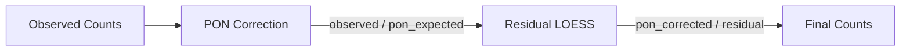

# GC Bias Correction

GC content bias is a major source of variability in cfDNA sequencing. Krewlyzer implements LOESS-based correction in Rust for high performance.

## Why GC Correction?

DNA fragments with extreme GC content (very AT-rich or GC-rich) are under-represented due to:

1. **PCR amplification bias** - GC-rich regions amplify less efficiently
2. **Sequencing bias** - Certain GC ranges have lower quality scores
3. **Capture bias** - Hybridization efficiency varies with GC

Without correction, fragment counts are confounded by GC content, obscuring biological signal.

---

## How It Works

### LOESS Regression

Krewlyzer uses **Locally Estimated Scatterplot Smoothing (LOESS)** to model the relationship between GC content and fragment count:

```
For each fragment type (short, intermediate, long):
1. Bin fragments by GC content (0.00-1.00 in 0.01 steps)
2. Fit LOESS curve: count = f(gc)
3. Compute correction factor: factor[gc] = median(count) / loess_fit[gc]
4. Apply: corrected_count = raw_count × factor[gc]
```

### Configuration

| Parameter | Default | Description |
|-----------|---------|-------------|
| LOESS fraction | 0.3 | Fraction of data for local fitting |
| LOESS iterations | 3 | Robustness iterations |
| Delta | 0.01 | Smoothing delta |

---

## Fragment Length Bins

GC correction is applied per fragment length bin (17 bins, 20bp width):

| Bin | Range | Fragment Type |
|-----|-------|---------------|
| 0 | 60-79bp | Ultra-short |
| 1 | 80-99bp | Ultra-short |
| 2-4 | 100-159bp | Short |
| 5-7 | 160-219bp | Intermediate |
| 8-16 | 220-400bp | Long |

---

## Usage

### Automatic (Default)

GC correction is **enabled by default** for most tools:

```bash
krewlyzer extract sample.bam -r hg19.fa -o output/
# Generates: sample.correction_factors.csv
```

### Disable GC Correction

```bash
krewlyzer fsc sample.bed.gz --no-gc-correct -o output/
```

### Using Pre-computed Factors

```bash
# mFSD can use factors from extract
krewlyzer mfsd sample.bam -i variants.vcf \
    --correction-factors output/sample.correction_factors.csv \
    -o output/
```

---

## Correction Factors File

The `extract` command generates `{sample}.correction_factors.csv`:

```csv
len_bin,gc_bin,factor,observed,expected,n_fragments
0,0.30,1.23,1234,1003,50000
0,0.31,1.21,1256,1038,51234
...
```

| Column | Description |
|--------|-------------|
| `len_bin` | Fragment length bin (0-16) |
| `gc_bin` | GC content (0.00-1.00) |
| `factor` | Correction multiplier |
| `observed` | Raw fragment count |
| `expected` | LOESS-predicted count |
| `n_fragments` | Number of fragments in bin |

---

## PON-based Hybrid Correction

When a PON model is provided, correction uses a **hybrid approach**:



**Algorithm:**
1. **PON correction**: Divide by assay-specific expected coverage
2. **Residual LOESS**: Fit sample-specific residual bias
3. **Final**: Divide PON-corrected counts by residual

This removes both assay-wide and sample-specific GC effects.

---

## Implementation Details

### Rust Module: `gc_correction.rs`

Key structures:

```rust
/// Fragment length bins (17 bins, 60-400bp)
pub struct LengthBin(u8);

/// GC correction factors lookup
pub struct CorrectionFactors {
    factors: HashMap<(LengthBin, u8), f64>,
    stats: HashMap<(LengthBin, u8), CorrectionBinStats>,
}

/// Apply LOESS-based correction
pub fn correct_gc_bias(
    gc_values: &[f64],
    counts: &[f64],
    config: Option<GcCorrectionConfig>
) -> Result<Vec<f64>>
```

### Python Interface

```python
from krewlyzer import _core

# Compute and save correction factors
_core.gc.compute_and_write_gc_factors(
    bed_path="sample.bed.gz",
    gc_reference_path="gc_reference.parquet",
    output_path="correction_factors.csv"
)
```

---

## When to Disable

Disable GC correction (`--no-gc-correct`) when:

- Comparing raw signal across samples with known GC differences
- Validating uncorrected patterns
- Working with very small regions where LOESS may be unstable

For most applications, **keep correction enabled** (default).
