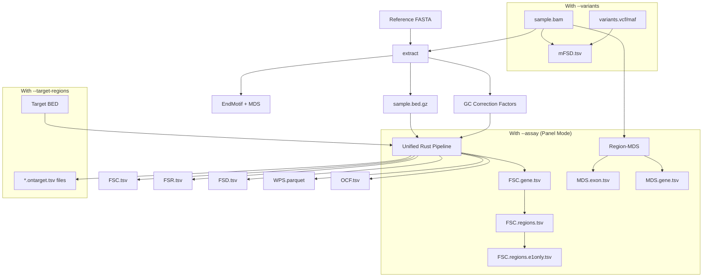
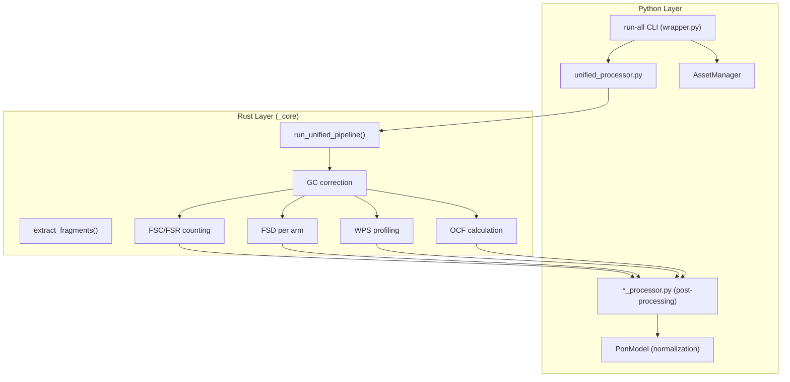

# Usage Guide

## Command Summary

| Command   | Description                                  |
|-----------|----------------------------------------------|
| `motif`   | Motif-based feature extraction               |
| `fsc`     | Fragment size coverage (`.FSC.tsv`)          |
| `fsr`     | Fragment size ratio (`.FSR.tsv`)             |
| `fsd`     | Fragment size distribution (`.FSD.tsv`)      |
| `wps`     | Windowed protection score (`.WPS.tsv.gz`)    |
| `ocf`     | Orientation-aware fragmentation (`.OCF.tsv`) |
| `uxm`     | Fragment-level methylation (`.UXM.tsv`)      |
| `mfsd`    | Mutant fragment size distribution (`.mFSD.tsv`)|
| `run-all` | Run all features for a BAM                   |

---

## Architecture Flowchart



### Python/Rust Boundary



---

## Reference Data
- **Reference Genome (FASTA):**
  - Download GRCh37/hg19 from [UCSC](https://hgdownload.soe.ucsc.edu/goldenPath/hg19/bigZips/)
  - BAMs must be sorted, indexed, and aligned to the same build
- **Bin/Region/Marker Files:**
  - Provided in `krewlyzer/data/` (see options for each feature)

## Typical Workflow
The recommended way to run krewlyzer is using the **Unified Pipeline** via `run-all`, which processes the BAM file in a single pass for maximum efficiency.

```bash
# Optimized Unified Pipeline
krewlyzer run-all sample.bam --reference hg19.fa --output output_dir \
    --variants variants.maf --bin-input targets.bed --threads 4
```

Alternatively, you can run tools individually. Note that most tools require a fragment BED file (`.bed.gz`) produced by the `extract` command.

```bash
# 1. Extract fragments (BAM -> BED.gz)
krewlyzer extract -i sample.bam -r hg19.fa -o output_dir

# 2. Run feature tools using the BED file
# 2. Run feature tools using the BED file
krewlyzer fsc -i output_dir/sample.bed.gz --output output_dir/
krewlyzer wps -i output_dir/sample.bed.gz --output output_dir/
# ... (fsd, ocf, etc.)

# 3. Motif analysis (Independent of BED, uses BAM directly)
krewlyzer motif -i sample.bam -r hg19.fa -o output_dir 
```

## Targeted Panel Usage (ACCESS, etc.)

For targeted sequencing panels (e.g., MSK-ACCESS), FSC/FSR require a custom regions BED file instead of the default genome-wide 100kb bins:

```bash
# Using run-all with custom target regions
krewlyzer run-all sample.bam --reference hg19.fa --output out/ \
  --bin-input /path/to/MSK-ACCESS-v2_canonicaltargets.bed

# Or run FSC/FSR individually with target regions
# Or run FSC/FSR individually with target regions
krewlyzer fsc -i motif_out/sample.bed.gz -b targets.bed -w 1 -c 1 --output out_dir/
krewlyzer fsr -i motif_out/sample.bed.gz -b targets.bed -w 1 -c 1 --output out_dir/
```

> **Note:** Without `--bin-input`, FSC/FSR will produce zeros for targeted panels since data only covers specific gene regions, not genome-wide bins. The `--output` argument for individual tools specifies the **output directory**, not a filename.

## PON and Z-Score Normalization

### Auto-PON with Assay Flag
When you specify an assay with `-A`, the bundled PON is automatically loaded:

```bash
# Auto-loads bundled PON for xs2 assay and applies z-scores
krewlyzer run-all -i sample.bam -r hg19.fa -o out/ -A xs2 -G hg19
```

### Skip Z-Score Normalization (`--skip-pon`)
For ML training workflows where PON samples are used as true negatives:

```bash
# Process PON samples as ML negatives (auto-loads PON but skips z-scores)
krewlyzer run-all -i pon_sample.bam -r hg19.fa -o out/ -A xs2 --skip-pon

# Individual tools also support --skip-pon
krewlyzer fsd -i sample.bed.gz -o out/ --skip-pon
```

> **Warning:** `-P/--pon-model` and `--skip-pon` are mutually exclusive.

### PON Variant Selection (`--pon-variant`)

For duplex sequencing workflows, select the appropriate PON variant:

```bash
# Default: all_unique PON (standard cfDNA, max coverage)
krewlyzer run-all -i sample.bam -r hg19.fa -o out/ -A xs2

# Duplex PON (highest accuracy for duplex consensus BAMs)
krewlyzer run-all -i sample.bam -r hg19.fa -o out/ -A xs2 --pon-variant duplex
```

> **Note:** `--pon-variant` controls PON file selection, while `--duplex` (mFSD only) enables cD tag weighting.

## Output Formats

Krewlyzer outputs support multiple formats for different use cases.

### Unified JSON for ML

```bash
# Generate single JSON with ALL features for ML pipelines
krewlyzer run-all sample.bam --reference hg19.fa --output out/ --generate-json
# Output: out/sample.features.json (contains FSD, FSR, WPS, Motif, OCF, etc.)
```

### Format Override

```bash
# Global format for all outputs
krewlyzer run-all ... --output-format parquet

# Per-tool format override
krewlyzer fsd -i sample.bed.gz -o out/ --format json
```

See [JSON Output](../features/output/json-output.md) for full documentation.

