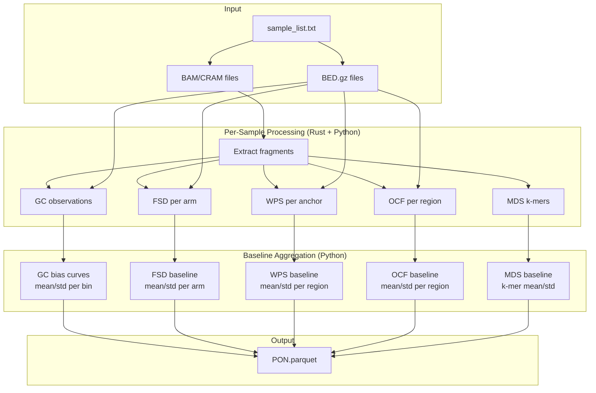

# build-pon

Build a unified Panel of Normals (PON) model from healthy plasma samples.

## Synopsis

```bash
krewlyzer build-pon SAMPLE_LIST --assay NAME -r REFERENCE -o OUTPUT [OPTIONS]
```

## Description

Creates a PON model containing all baselines needed for cfDNA analysis from a cohort of healthy samples:

- **GC Bias Model** - For coverage correction
- **FSD Baseline** - Fragment size distributions per arm
- **WPS Baseline** - Nucleosome protection per region
- **OCF Baseline** - Open chromatin footprinting per region
- **MDS Baseline** - Motif diversity and k-mer frequencies
- **TFBS Baseline** - Transcription factor binding site entropy (808 TFs)
- **ATAC Baseline** - ATAC-seq peak entropy (23 cancer types)

This model is used for bias correction and z-score normalization during sample processing.

## Arguments

| Argument | Description |
|----------|-------------|
| `SAMPLE_LIST` | Text file with paths to BAM or BED.gz files (one per line) |

## Required Options

| Option | Description |
|--------|-------------|
| `-a, --assay` | Assay name (e.g., `msk-access-v2`) |
| `-r, --reference` | Reference FASTA file (indexed) |
| `-o, --output` | Output PON model file (`.pon.parquet`) |

## Optional Parameters

| Option | Default | Description |
|--------|---------|-------------|
| `-G, --genome` | hg19 | Genome build (hg19/GRCh37/hg38/GRCh38) |
| `-T, --target-regions` | None | BED file with target regions (panel mode) |
| `--skip-target-regions` | False | Force WGS mode (ignore bundled targets from --assay) |
| `-W, --wps-anchors` | Built-in | WPS anchors BED.gz (merged TSS+CTCF) |
| `-b, --bin-file` | Built-in | Bin file for FSC/FSR |
| `--temp-dir` | System temp | Directory for temporary files |
| `-p, --threads` | 4 | Number of threads |
| `--require-proper-pair` | False | Only properly paired reads |
| `-v, --verbose` | False | Verbose output |

## Pipeline Flow



## Examples

**WGS Mode:**
```bash
krewlyzer build-pon healthy_samples.txt \
    --assay wgs-hg19 \
    --reference hg19.fa \
    --output wgs.pon.parquet
```

**Panel Mode (MSK-ACCESS):**
```bash
krewlyzer build-pon healthy_samples.txt \
    --assay msk-access-v2 \
    --reference hg19.fa \
    --target-regions msk_access_targets.bed \
    --output msk-access.pon.parquet \
    --threads 16
```

**HPC with custom temp directory:**
```bash
krewlyzer build-pon healthy_samples.txt \
    --assay xs1 \
    --reference hg19.fa \
    --target-regions msk_access_v1_targets.bed \
    --temp-dir /scratch/$USER/pon_tmp \
    --output xs1.pon.parquet \
    --threads 16 \
    --verbose
```


## Input Formats

**Sample list file (`samples.txt`):**
```
/path/to/sample1.bam
/path/to/sample2.bam
/path/to/sample3.bed.gz
```

Both BAM/CRAM and BED.gz inputs are supported:

| Input Type | Extraction | MDS Baseline | Speed |
|------------|------------|--------------|-------|
| **BAM/CRAM** | Full | ✓ Included | Slower |
| **BED.gz** | Skip | ✗ Not available | Faster |

> [!NOTE]
> **MDS baseline requires BAM/CRAM input** because it needs fragment end sequences for k-mer extraction. BED.gz files only contain coordinates.

## Output

The output is a Parquet file containing:

| Component | Description | Used By |
|-----------|-------------|---------|
| **Metadata** | assay, build_date, n_samples, reference, panel_mode | All |
| **GC Bias** | Expected coverage by GC bin for short/intermediate/long fragments | FSC, FSR |
| **FSD Baseline** | Mean/std size proportions per chromosome arm | FSD |
| **WPS Baseline** | Mean/std WPS per transcript region | WPS |
| **OCF Baseline** | Mean/std OCF per open chromatin region | OCF |
| **MDS Baseline** | K-mer frequencies and MDS mean/std | Motif |
| **TFBS Baseline** | Mean/std entropy per TF (808 factors) | Region Entropy |
| **ATAC Baseline** | Mean/std entropy per cancer type (23 types) | Region Entropy |

In **panel mode**, additional on-target baselines are included:

| Component | Description |
|-----------|-------------|
| **GC Bias (ontarget)** | On-target GC correction model |
| **FSD Baseline (ontarget)** | On-target FSD stats |
| **TFBS Baseline (ontarget)** | Panel-specific TF entropy |
| **ATAC Baseline (ontarget)** | Panel-specific ATAC entropy |

## Panel Mode

When `--target-regions` is provided:

1. GC model trained on **off-target fragments only** (unbiased by capture)
2. FSD/WPS include separate on-target statistics
3. Output model includes `panel_mode=true` in metadata

## Recommendations

- **Minimum samples**: 10+ for stable baselines
- **Same assay**: All samples must be from the same assay
- **Same reference**: Must match reference used for processing
- **Healthy samples**: Use confirmed non-cancer samples only

## MDS Baseline

The **MDS (Motif Diversity Score)** baseline is computed from k-mer frequencies at fragment ends:

| Metric | Description |
|--------|-------------|
| `kmer_expected` | Mean frequency per 4-mer across samples |
| `kmer_std` | Standard deviation per 4-mer |
| `mds_mean` | Mean MDS (Shannon entropy) |
| `mds_std` | MDS standard deviation |

> [!IMPORTANT]
> MDS baseline **requires BAM/CRAM input** because it needs fragment end sequences. BED.gz files cannot provide this data.

Z-score interpretation:

| mds_z | Interpretation |
|-------|----------------|
| -2 to +2 | Normal range |
| < -2 | Abnormally low diversity |
| > +2 | Rare, check data quality |
