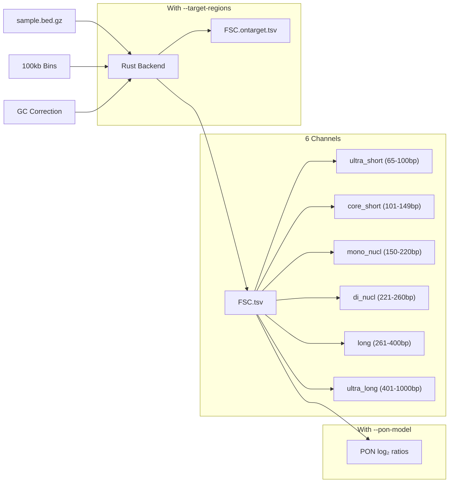
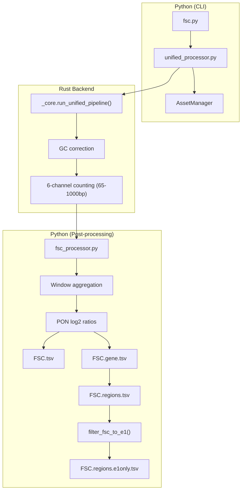
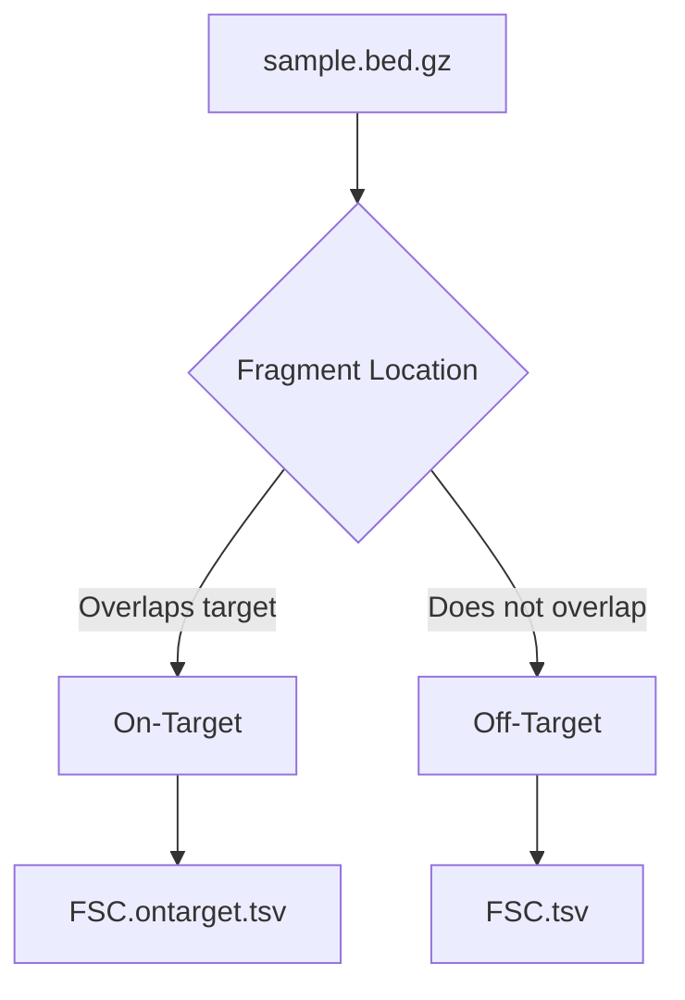

# Fragment Size Coverage (FSC)

**Command**: `krewlyzer fsc`

> **Plain English**: FSC counts how many DNA fragments of each size fall into each genomic region.
> Think of it as a "heatmap" of fragment sizes across the genome.
>
> **Use case**: Copy number detection - regions with more short fragments suggest tumor amplification.

---

## Purpose
Computes GC-corrected coverage of cfDNA fragments in 6 biologically-meaningful size channels per genomic bin. Designed for ML feature extraction in cancer detection.

---

## Biological Context

### Why Fragment Sizes Matter

cfDNA fragments are not random—their sizes reflect the chromatin state of their source cells:

| Fragment Size | Source | Biological Meaning |
|---------------|--------|-------------------|
| **Short (<100bp)** | Open chromatin, active transcription | TF footprints, regulatory elements |
| **~167bp** | Mono-nucleosome | "Classic" cfDNA peak |
| **~334bp** | Di-nucleosome | Linked nucleosomes |
| **Long (>260bp)** | Multi-nucleosome | Necrosis, incomplete digestion |

**Cancer signature**: Tumors release shorter cfDNA fragments than healthy cells due to:
- Altered nucleosome positioning
- Different apoptotic pathways
- Chromatin accessibility changes

### 6-Channel ML Features

FSC partitions fragments into **non-overlapping** channels optimized for ML:

| Channel | Size Range | Biological Meaning | Cancer Relevance |
|---------|------------|-------------------|------------------|
| **ultra_short** | 65-100bp | Di-nucleosomal debris | Early apoptosis markers |
| **core_short** | 101-149bp | Sub-nucleosomal | Specific chromatin states |
| **mono_nucl** | 150-220bp | Mono-nucleosomal | Classic cfDNA (reference) |
| **di_nucl** | 221-260bp | Di-nucleosomal | Transitional |
| **long** | 261-400bp | Multi-nucleosomal | Necrosis-associated |
| **ultra_long** | 401-1000bp | Extended fragments | Necrosis, fetal cfDNA, late apoptosis |

> **Non-overlapping**: Each fragment is counted in exactly one channel. This prevents multicollinearity in ML models.

---

## Implementation Details

### Counting Pipeline



### Python/Rust Architecture



### Aggregation Strategy

> **Critical**: Aggregation should match your analysis goal.

| Data Type | Bin Input | Aggregation | Use Case |
|-----------|-----------|-------------|----------|
| **WGS** | 100kb genome tiles | 50 bins → **5Mb** | Arm-level CNV |
| **WGS focal** | 100kb genome tiles | **No aggregation** | Focal amps (EGFR, MYC) |
| **Panel** | Exon/Gene targets | **No aggregation** | Gene-level resolution |

> **Auto-detection**: When `--target-regions` is provided in `run-all`, aggregation is **automatically disabled** to preserve gene-level resolution for panel data.

**Why this matters:**
- 5Mb aggregation is great for detecting **arm-level** events (e.g., 1p/19q co-deletion)
- Focal amplifications (e.g., EGFR amp <1Mb) are **washed out** by 5Mb aggregation
- Panel targets are already gene-resolution—aggregation destroys their value

**Recommendation:**
- For **broad CNV detection** (tumor fraction, aneuploidy): Use aggregated 5Mb windows
- For **focal analysis** (driver genes, amplicons): Preserve raw bin resolution


### GC Correction Details

Each fragment receives a **weight** based on its (length, GC%) bin:

```
weight = correction_factors[(length, gc_pct)]
channel_count += weight  # Instead of += 1
```

This removes GC bias **before** ML, not after. The correction factors come from:
- **WGS**: Computed from all genome-wide fragments
- **Panel**: Computed from **off-target reads only** (when `--target-regions` provided)

### Bin Assignment

Fragments are assigned to bins based on **overlap** (not midpoint):

```rust
// If fragment overlaps bin, count it
tree.query(start, end, |bin| {
    bin.channel_count += weight;
});
```

A fragment spanning two bins counts in **both**. This is intentional for coverage metrics.

---

## Usage

```bash
# Basic (auto-loads bundled 100kb bins)
krewlyzer fsc -i sample.bed.gz -o output/ --genome hg38

# With PoN for log2 ratios
krewlyzer fsc -i sample.bed.gz -o output/ --pon-model cohort.pon

# Custom bin size
krewlyzer fsc -i sample.bed.gz -o output/ --bin-input custom_bins.bed
```

## CLI Options

| Option | Short | Type | Default | Description |
|--------|-------|------|---------|-------------|
| `--input` | `-i` | PATH | *required* | Input .bed.gz file (output from extract) |
| `--output` | `-o` | PATH | *required* | Output directory |
| `--sample-name` | `-s` | TEXT | | Override sample name |
| `--bin-input` | `-b` | PATH | | Custom bin file (default: 100kb genome-wide) |
| `--pon-model` | `-P` | PATH | | PON model for hybrid GC correction |
| `--pon-variant` | | TEXT | all_unique | PON variant: `all_unique` or `duplex` |
| `--skip-pon` | | FLAG | | Skip PON z-score normalization |
| `--target-regions` | `-T` | PATH | | Target BED (for on/off-target FSC split) |
| `--skip-target-regions` | | FLAG | | Force WGS mode (ignore bundled targets) |
| `--assay` | `-A` | TEXT | | Assay type (xs1/xs2) for gene-centric FSC |
| `--windows` | `-w` | INT | 100000 | Window size for aggregation |
| `--continue-n` | `-c` | INT | 50 | Consecutive window number |
| `--genome` | `-G` | TEXT | hg19 | Genome build (hg19/hg38) |
| `--gc-correct` | | FLAG | True | Apply GC bias correction |
| `--threads` | `-t` | INT | 0 | Number of threads (0=all cores) |
| `--verbose` | `-v` | FLAG | | Enable verbose logging |

---


## Output Format

Output: `{sample}.FSC.tsv`

### Base Columns (always present)

| Column | Type | Description |
|--------|------|-------------|
| `chrom` | str | Chromosome |
| `start` | int | Window start (0-based) |
| `end` | int | Window end |
| `ultra_short` | float | GC-weighted count (65-100bp) |
| `core_short` | float | GC-weighted count (101-149bp) |
| `mono_nucl` | float | GC-weighted count (150-220bp) |
| `di_nucl` | float | GC-weighted count (221-260bp) |
| `long` | float | GC-weighted count (261-400bp) |
| `total` | float | GC-weighted total (65-400bp) |

### PoN Columns (when `--pon-model` provided)

| Column | Type | Description |
|--------|------|-------------|
| `*_log2` | float | log2(channel / PoN_mean) |
| `*_reliability` | float | 1 / (PoN_variance + k) |

> **Note**: Log2 ratios are signed: positive = above PoN mean, negative = below.

---

## WGS vs Panel Data (MSK-ACCESS)

| Aspect | WGS | Panel (MSK-ACCESS) |
|--------|-----|-------------------|
| **Coverage** | Uniform genome-wide | High on-target, sparse off-target |
| **GC correction source** | All fragments | **Off-target only** |
| **Typical depth** | ~30x genome | ~1000x on-target |
| **Best bins** | All bins reliable | On-target bins only |

### Panel Mode Details

When you provide `--target-regions` to `run-all`:

1. **GC model training**: Uses only off-target reads (unbiased by capture)
2. **Counting**: All reads are counted (on-target + off-target)
3. **Interpretation**: On-target bins have high counts, off-target bins are sparse

```bash
krewlyzer run-all sample.bam -g ref.fa -o out/ \
    --target-regions msk_access_baits.bed
```

### Panel Recommendations

| Feature | Recommendation |
|---------|----------------|
| **Which bins to use** | Filter to high-coverage bins (>100 fragments) |
| **Channel ratios** | More robust than absolute counts |
| **PoN** | Build from same panel type only |

---

## ML Feature Engineering

### Raw Features (per 5Mb window)
- 5 channel counts (ultra_short, core_short, mono_nucl, di_nucl, long)
- 1 total count

### Derived Features (recommended)
- **Channel ratios**: `short / long`, `mono_nucl / total`
- **Log2 ratios vs PoN**: Tumor-specific deviations
- **Reliability-weighted**: Use reliability scores in loss functions

### Example: Short-to-Long Ratio

```python
df['short_long_ratio'] = (df['ultra_short'] + df['core_short']) / (df['long'] + 1e-9)
```

Higher ratio = more short fragments = potential tumor signal

---

## Normalization Order

1. **GC-weighting** (Rust): Raw counts × correction factor per (length, GC) bin
2. **Window aggregation** (Python): 50 bins → 5Mb windows
3. **PoN log-ratio** (Python): log2(sample / PoN mean) when PoN model provided

> **Important**: GC correction is applied **first** in Rust, not after. This ensures all downstream features are GC-unbiased.

---

## Panel Mode (--target-regions)

For targeted sequencing panels (MSK-ACCESS), use `--target-regions` to generate **separate on/off-target outputs**:

```bash
krewlyzer fsc -i sample.bed.gz -o output/ \
    --target-regions MSK-ACCESS_targets.bed \
    --bin-input gene_level_bins.bed
```

### Processing with Target Regions



### Output Files

| File | Contents | Use Case |
|------|----------|----------|
| `{sample}.FSC.tsv` | **Off-target** fragments | Unbiased global signal (primary) |
| `{sample}.FSC.ontarget.tsv` | **On-target** fragments | Gene-level local signal |

> [!IMPORTANT]
> **Off-target = unbiased** – preferred for fragmentomics biomarkers.  
> **On-target = capture-biased** – reflects library prep + target selection.

### When to Use On-Target FSC

| Use Case | Recommended |
|----------|-------------|
| CNV detection | Off-target |
| Tumor fraction | Off-target |
| Gene-level amplification | **On-target** |
| Panel-specific features | Both |

---

## Gene-Centric FSC (MSK-ACCESS)

For MSK-ACCESS panels, use `--assay` to aggregate fragment counts by **gene** instead of genomic windows:

```bash
krewlyzer fsc -i sample.bed.gz -o output/ --assay xs2
```

### Output Files

| File | Description | Rows |
|------|-------------|------|
| `{sample}.FSC.tsv` | Standard window-based FSC | ~28,000 |
| `{sample}.FSC.gene.tsv` | Gene-level FSC | 146 (xs2) |
| `{sample}.FSC.regions.tsv` | Per-exon/target FSC | ~1,000 |

### Gene FSC Output Format

```
gene    n_regions  total_bp  ultra_short  core_short  mono_nucl  di_nucl  long  total  *_ratio  normalized_depth
ATM     62         8432      1234         5678        9012       3456     789   20169  ...      1245.67
BRCA2   42         5689      ...
```

### Region FSC Output Format (NEW)

Per-exon/target output for fine-grained copy number analysis:

```
chrom  start      end      gene  region_name     region_bp  ultra_short  ...  normalized_depth
1      11168235  11168345  MTOR  MTOR_target_02  110        8.0          ...  1272.71
1      11169344  11169429  MTOR  MTOR_target_03  85         6.0          ...  1553.68
```

### E1-Only FSC Output (NEW)

**File**: `{sample}.FSC.regions.e1only.tsv`

E1 (first exon) filtering extracts only the first exon per gene by genomic position. Per Helzer et al. (2025), promoter-proximal regions (E1) are Nucleosome Depleted Regions (NDRs) with distinct fragmentation patterns, often showing stronger cancer signal than whole-gene averages.

**Usage**:
```bash
# Default: E1-only file generated automatically with --assay
krewlyzer run-all -i sample.bam -r ref.fa -o out/ -A xs2

# Disable E1-only generation
krewlyzer run-all -i sample.bam -r ref.fa -o out/ -A xs2 --disable-e1-aggregation
```

> [!TIP]
> E1-only FSC is particularly useful for **early cancer detection** where promoter fragmentation changes are an early marker.

### Normalized Depth (RPKM-like)

Both gene and region outputs include `normalized_depth`:

$$
\text{normalized\_depth} = \frac{\text{count} \times 10^9}{\text{region\_bp} \times \text{total\_fragments}}
$$

This enables cross-sample depth comparisons independent of library size and region size.

### Supported Assays

| Assay | Flag | Genes |
|-------|------|:-----:|
| MSK-ACCESS v1 | `--assay xs1` | 128 |
| MSK-ACCESS v2 | `--assay xs2` | 146 |

> [!TIP]
> Gene-level FSC is useful for **gene-specific amplification** detection and **integration with variant calling** pipelines.

### GC Correction for Gene FSC

In panel mode, gene-level FSC uses **on-target GC correction factors** (`.correction_factors.ontarget.csv`) for accurate copy number estimates.

**Why this matters:**
- Different genes have different GC content
- High-GC genes (e.g., *EGFR*) capture with different efficiency than low-GC genes
- Without correction, high-GC genes appear **falsely deleted**, low-GC genes appear **amplified**

**How it works:**
```python
# Instead of raw counting (+= 1):
weight = correction_factors[(len_bin, gc_pct)]
gene_count += weight  # GC-corrected counting
```

**Log output example:**
```
Aggregating FSC by gene: 146 genes, GC correction: ON (weighted counting)
Processed 2.4M fragments, 2.4M assigned to genes
  GC correction: avg_weight=1.898, missing_gc=0
```

> [!NOTE]
> On-target factors are automatically used when available. If not found, raw counting is used with a debug log message.

---

## See Also

- **Citation**: [Cristiano et al. (2019)](../../resources/citation.md#fsc) - DELFI fragmentomics paper
- **PON**: [Z-Score Normalization](../../reference/pon-models.md) - Log2 ratio computation
- **Inputs**: [File Formats](../../reference/input-formats.md#bins) - Bin file format
- **Related**: [FSR](fsr.md) (ratios), [FSD](fsd.md) (distribution), [Extract](extract.md) (BED.gz source)
- **Guides**: [Panel Mode](../../guides/panel-mode.md), [GC Correction](../../guides/gc-correction.md)
- **CLI**: [`run-all`](../../cli/run-all.md) - Unified pipeline
- **Nextflow**: [Parameters](../../nextflow/parameters.md) - Batch processing

## References

> Snyder et al. (2016). Cell-free DNA comprises an in vivo nucleosome footprint that informs its tissues-of-origin. *Cell*, 164(1-2), 57-68.

> Cristiano et al. (2019). Genome-wide cell-free DNA fragmentation in patients with cancer. *Nature*, 570(7761), 385-389.

