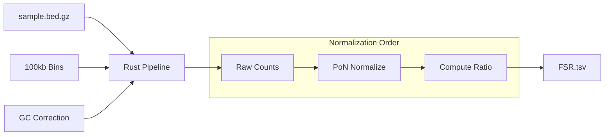
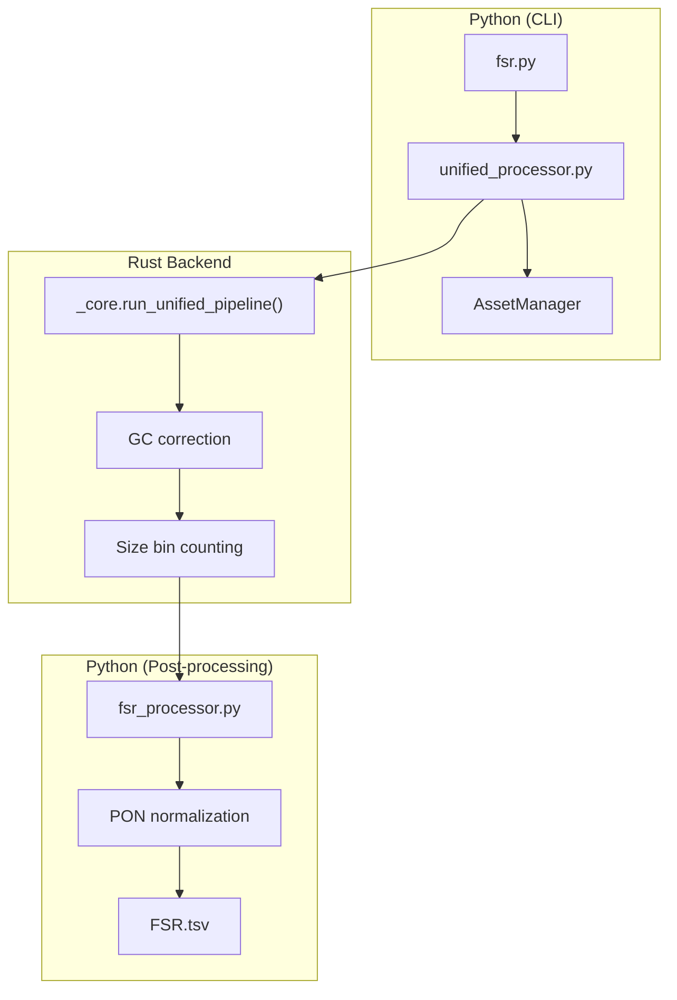
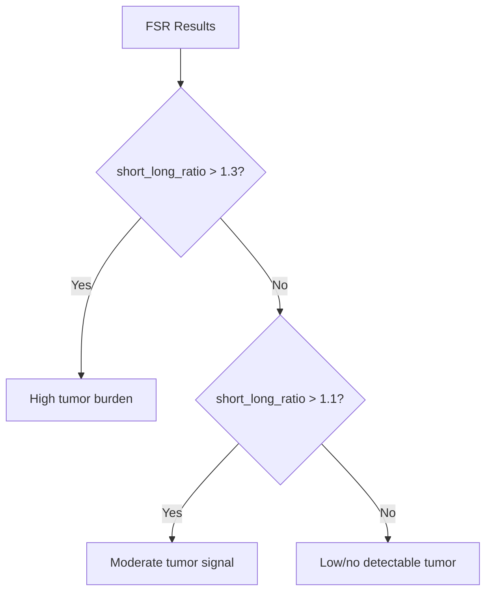

# Fragment Size Ratio (FSR)

**Command**: `krewlyzer fsr`

!!! info "Plain English"
    FSR measures the ratio of short (tumor-enriched) to long (healthy) DNA fragments.
    A higher `short_long_ratio` means more tumor-derived DNA in your sample.

    **Example**: `short_long_ratio = 1.5` suggests ~30% tumor burden (vs. ~0.9 in healthy plasma).

---

## Purpose
Computes short/long fragment ratios for cancer biomarker analysis. Uses PoN-normalization **before** ratio calculation for accurate cross-sample comparison.

---

## Processing Flowchart



### Python/Rust Architecture



---

## Biological Context

The ratio of short to long fragments is a key indicator of tumor burden in cfDNA:

| Fragment Type | Size Range | Biological Source |
|---------------|------------|-------------------|
| **ultra_short** | 65-99bp | TF footprints, highly tumor-specific |
| **core_short** | 100-149bp | Tumor DNA (sub-nucleosomal, ~145bp peak) |
| **mono_nucl** | 150-259bp | Standard mono-nucleosomal cfDNA |
| **di_nucl** | 260-399bp | Di-nucleosomal (healthy chromatin) |
| **long** | 400+bp | Very long fragments |

**Key Biomarker**: `short_long_ratio` — where "short" = ultra_short + core_short (65–149 bp) and "long" = di_nucl + long (221–400+ bp). Higher ratio = higher probability of tumor DNA.

### Why Short Fragments = Tumor?

Tumor cells have abnormal chromatin structure:
- **Disrupted nucleosome positioning** → non-canonical cutting
- **Smaller protected regions** → shorter fragments
- **Result**: Tumor cfDNA peaks at ~145bp vs. healthy cfDNA at ~166bp

---

## Usage
```bash
# Basic usage
krewlyzer fsr -i sample.bed.gz -o output_dir/ --sample-name SAMPLE

# With PON normalization (recommended)
krewlyzer fsr -i sample.bed.gz -o output/ -P cohort.pon.parquet

# Panel data with on/off-target split
krewlyzer fsr -i sample.bed.gz -o output/ \
    --target-regions MSK-ACCESS_targets.bed
```

## CLI Options

| Option | Short | Type | Default | Description |
|--------|-------|------|---------|-------------|
| `--input` | `-i` | PATH | *required* | Input .bed.gz file (output from extract) |
| `--output` | `-o` | PATH | *required* | Output directory |
| `--sample-name` | `-s` | TEXT | | Override sample name |
| `--bin-input` | `-b` | PATH | | Custom bin file |
| `--pon-model` | `-P` | PATH | | PON model for hybrid GC correction |
| `--pon-variant` | | TEXT | all_unique | PON variant: `all_unique` or `duplex` |
| `--skip-pon` | | FLAG | | Skip PON z-score normalization |
| `--target-regions` | `-T` | PATH | | Target BED (for on/off-target split) |
| `--skip-target-regions` | | FLAG | | Force WGS mode (ignore bundled targets) |
| `--assay` | `-A` | TEXT | | Assay code (xs1/xs2) for bundled assets |
| `--genome` | `-G` | TEXT | hg19 | Genome build (hg19/hg38) |
| `--windows` | `-w` | INT | 100000 | Window size |
| `--continue-n` | `-c` | INT | 50 | Consecutive window number |
| `--gc-correct` | | FLAG | True | Apply GC bias correction |
| `--threads` | `-t` | INT | 0 | Number of threads (0=all cores) |
| `--verbose` | `-v` | FLAG | | Enable verbose logging |

---

## Size Bin Definitions

FSR uses the Rust backend's 5-channel size bins:

| Bin Name | Size Range | Biological Meaning |
|----------|------------|-------------------|
| `ultra_short` | 65-99bp | TF footprints, highly tumor-specific |
| `core_short` | 100-149bp | **Primary tumor biomarker** |
| `mono_nucl` | 150-259bp | Standard mono-nucleosomal |
| `di_nucl` | 260-399bp | Di-nucleosomal, healthy-enriched |
| `long` | 400+bp | Multi-nucleosomal (rare) |

---

## Formulas

### Normalization Order (Critical)

!!! important
    FSR normalizes counts to PoN **BEFORE** computing ratios.

**Step 1 - Normalize short:**

$$
\text{short\_norm} = \frac{\text{short\_count}}{\text{PoN\_short\_mean}}
$$

where `short_count = ultra_short + core_short` (65–149 bp)

**Step 2 - Normalize long:**

$$
\text{long\_norm} = \frac{\text{long\_count}}{\text{PoN\_long\_mean}}
$$

where `long_count = di_nucl + long` (221–400+ bp)

**Step 3 - Compute ratio:**

$$
\text{short\_long\_ratio} = \frac{\text{short\_norm}}{\text{long\_norm}}
$$

This removes batch effects **before** ratio calculation, ensuring accurate cross-sample comparison.

**Step 4 - Log2 ratio (ML-ready):**

$$
\text{short\_long\_log2} = \log_2(\text{short\_long\_ratio})
$$

| log2 Value | Meaning |
|------------|---------|
| 0 | Equal short/long (baseline) |
| > 0.5 | **Elevated short fragments** (tumor signal) |
| < -0.5 | Depleted short fragments |

---

## Output Format

Output: `{sample}.FSR.tsv` / `{sample}.FSR.ontarget.tsv` (panel mode)

| Column | Type | Description |
|--------|------|-------------|
| `region` | str | Genomic region, e.g. `chr1:0-5000000` (WGS) or `chr1:0-100000` (panel) |
| `short_count` | int | Short fragments: ultra_short + core_short (65–149 bp) |
| `long_count` | int | Long fragments: di_nucl + long (221–400+ bp) |
| `total_count` | int | Total fragments in window |
| `short_norm` | float | `short_count / PON_short_mean` — PON-normalized short |
| `long_norm` | float | `long_count / PON_long_mean` — PON-normalized long |
| `short_long_ratio` | float | `short_norm / long_norm` — **primary biomarker** |
| `short_long_log2` | float | `log2(short_long_ratio)` — ML-ready signed metric |
| `short_frac` | float | `short_count / total_count` — raw proportion |
| `long_frac` | float | `long_count / total_count` — raw proportion |

---

## Panel Mode (--target-regions)

For targeted sequencing panels (MSK-ACCESS):

```bash
krewlyzer fsr -i sample.bed.gz -o output/ \
    --target-regions MSK-ACCESS_targets.bed
```

### Output Files

| File | Contents | Use Case |
|------|----------|----------|
| `{sample}.FSR.tsv` | **Off-target** fragment ratios (100kb windows) | Unbiased ratio (primary biomarker) |
| `{sample}.FSR.ontarget.tsv` | **On-target** fragment ratios (100kb windows) | Capture-region analysis |

!!! warning "Do not mix off-target and on-target in the same model"
    `FSR.tsv` and `FSR.ontarget.tsv` are not on the same scale — the on-target pool has different GC bias and fragment size distributions. Always use the same variant consistently across all samples in a cohort.

---

## Clinical Interpretation

| Metric | Healthy Plasma | Cancer (ctDNA) |
|--------|----------------|----------------|
| Modal fragment size | ~166bp | Left-shifted (~145bp) |
| `short_long_ratio` | ~0.8-1.0 (baseline) | **>1.2 elevated** |
| Interpretation | Normal profile | Elevated tumor burden |

### Decision Flowchart



!!! note
    Thresholds depend on your cohort and should be validated against known samples.

---

## See Also

- [FSC](fsc.md) – Full 5-channel coverage
- [FSD](fsd.md) – Size distribution by arm
- [PON Models](../../reference/pon-models.md) – Normalization baselines
- [Glossary](../../reference/glossary.md) – Terminology reference
- [Citation](../../resources/citation.md) – DELFI paper references
