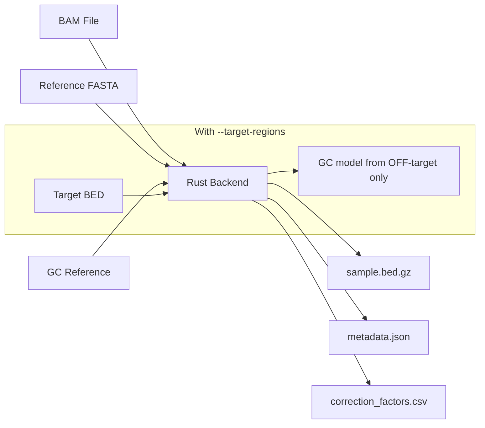
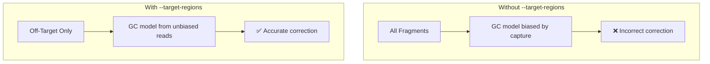

# Fragment Extraction

**Command**: `krewlyzer extract`

> **Plain English**: Extract converts your BAM file into cfDNA fragments with quality information.
> It's the first step for most analyses—think of it as "preprocessing" your sequencing data.
>
> **Key output**: `.bed.gz` file containing fragment coordinates and GC correction factors.

---

## Purpose
The `extract` module serves as the entry point for most analysis workflows. It processes a BAM file to extract valid cell-free DNA (cfDNA) fragments and saves them in a standardized, compressed BED format with GC content.

---

## Processing Flowchart



---

## Biological Context
Raw sequencing data (BAM) contains reads that must be paired and filtered to reconstruct physical DNA fragments. This step standardizes the data, removing PCR duplicates and low-quality mappings, ensuring downstream analysis focuses on high-confidence unique molecules.

---

## Usage
```bash
krewlyzer extract -i sample.bam -r hg19.fa -o output_dir/ [options]
```

## Options

| Option | Short | Type | Default | Description |
|--------|-------|------|---------|-------------|
| `--input` | `-i` | PATH | *required* | Input BAM file |
| `--reference` | `-r` | PATH | *required* | Reference genome FASTA (indexed) |
| `--output` | `-o` | PATH | *required* | Output directory |
| `--genome` | `-G` | TEXT | hg19 | Genome build for GC assets |
| `--target-regions` | `-T` | PATH | | Target BED (panel mode: GC from off-target) |
| `--gc-correct` | | FLAG | True | Compute GC correction factors |
| `--exclude-regions` | `-x` | PATH | | BED file of regions to exclude |
| `--mapq` | `-q` | INT | 20 | Minimum mapping quality |
| `--minlen` | | INT | 65 | Minimum fragment length |
| `--maxlen` | | INT | 400 | Maximum fragment length |
| `--skip-duplicates` | | FLAG | True | Skip duplicate reads |
| `--require-proper-pair` | | FLAG | True | Require proper read pairs |
| `--chromosomes` | | TEXT | | Comma-separated chromosomes to process |
| `--sample-name` | `-s` | TEXT | | Override sample name |
| `--verbose` | `-v` | FLAG | | Enable verbose logging |
| `--threads` | `-t` | INT | 0 | Number of threads (0=all) |

---

## Output Files

| File | Description |
|------|-------------|
| `{sample}.bed.gz` | Block-gzipped BED with fragment coordinates + GC |
| `{sample}.bed.gz.tbi` | Tabix index for random access |
| `{sample}.metadata.json` | Run statistics and configuration |
| `{sample}.correction_factors.csv` | GC correction factors (with --gc-correct) |

### GC Correction Factors Format

| Column | Description |
|--------|-------------|
| gc_bin | GC content bin (0.00-1.00) |
| short_factor | Correction for short fragments (65-149bp) |
| intermediate_factor | Correction for intermediate (150-220bp) |
| long_factor | Correction for long fragments (221-400bp) |

---

## Panel Mode (--target-regions)

For targeted sequencing panels (MSK-ACCESS), use `--target-regions` to ensure **unbiased GC correction**:

```bash
krewlyzer extract -i sample.bam -r hg19.fa -o output/ \
    --target-regions MSK-ACCESS_targets.bed
```

### Why This Matters



**Problem**: On-target fragments have GC bias from hybridization probes. Using all fragments for GC modeling contaminates the correction factors.

**Solution**: With `--target-regions`, only **off-target** fragments are used to compute GC correction factors, producing unbiased normalization for downstream analysis.

### Outputs in Panel Mode

| Output | Effect |
|--------|--------|
| `correction_factors.csv` | Computed from **off-target only** |
| `sample.bed.gz` | Contains **all** fragments (on + off) |

> [!IMPORTANT]
> The BED file contains all fragments. Target filtering happens **per-tool** using the same `--target-regions` flag in FSC, FSD, WPS, etc.

---

## BAM Compatibility

### Duplex/Consensus BAMs

If you're using duplex or consensus BAMs, disable the proper pair filter:

```bash
krewlyzer extract -i duplex.bam -r hg19.fa -o output/ \
    --no-require-proper-pair
```

| BAM Type | Proper Pairs? | Flag Needed? |
|----------|---------------|--------------|
| Standard WGS | ✅ Yes | Default works |
| Standard Panel | ✅ Yes | Default works |
| Duplex/UMI | ❌ No | `--no-require-proper-pair` |
| Consensus | ❌ No | `--no-require-proper-pair` |

### Auto-Detection

The `run-all` command automatically detects BAM compatibility issues and suggests the correct flags.

---

## See Also

- [GC Correction](../advanced/gc-correction.md) - LOESS algorithm details
- [Troubleshooting](../troubleshooting.md) - Common issues
- [Glossary](../glossary.md) - Terminology reference
