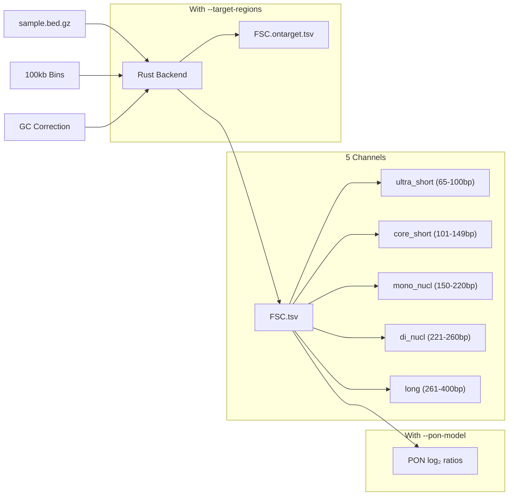
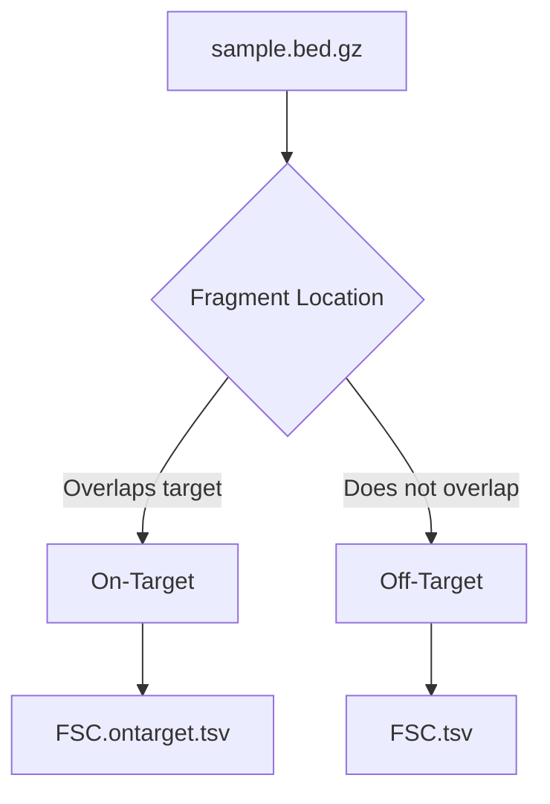

# Fragment Size Coverage (FSC)

**Command**: `krewlyzer fsc`

## Purpose
Computes GC-corrected coverage of cfDNA fragments in 5 biologically-meaningful size channels per genomic bin. Designed for ML feature extraction in cancer detection.

---

## Biological Context

### Why Fragment Sizes Matter

cfDNA fragments are not random—their sizes reflect the chromatin state of their source cells:

| Fragment Size | Source | Biological Meaning |
|---------------|--------|-------------------|
| **Short (<100bp)** | Open chromatin, active transcription | TF footprints, regulatory elements |
| **~167bp** | Mono-nucleosome | "Classic" cfDNA peak |
| **~334bp** | Di-nucleosome | Linked nucleosomes |
| **Long (>260bp)** | Multi-nucleosome | Necrosis, incomplete digestion |

**Cancer signature**: Tumors release shorter cfDNA fragments than healthy cells due to:
- Altered nucleosome positioning
- Different apoptotic pathways
- Chromatin accessibility changes

### 5-Channel ML Features

FSC partitions fragments into **non-overlapping** channels optimized for ML:

| Channel | Size Range | Biological Meaning | Cancer Relevance |
|---------|------------|-------------------|------------------|
| **ultra_short** | 65-100bp | Di-nucleosomal debris | Early apoptosis markers |
| **core_short** | 101-149bp | Sub-nucleosomal | Specific chromatin states |
| **mono_nucl** | 150-220bp | Mono-nucleosomal | Classic cfDNA (reference) |
| **di_nucl** | 221-260bp | Di-nucleosomal | Transitional |
| **long** | 261-400bp | Multi-nucleosomal | Necrosis-associated |

> **Non-overlapping**: Each fragment is counted in exactly one channel. This prevents multicollinearity in ML models.

---

## Implementation Details

### Counting Pipeline



### Aggregation Strategy

> **Critical**: Aggregation should match your analysis goal.

| Data Type | Bin Input | Aggregation | Use Case |
|-----------|-----------|-------------|----------|
| **WGS** | 100kb genome tiles | 50 bins → **5Mb** | Arm-level CNV |
| **WGS focal** | 100kb genome tiles | **No aggregation** | Focal amps (EGFR, MYC) |
| **Panel** | Exon/Gene targets | **No aggregation** | Gene-level resolution |

> **Auto-detection**: When `--target-regions` is provided in `run-all`, aggregation is **automatically disabled** to preserve gene-level resolution for panel data.

**Why this matters:**
- 5Mb aggregation is great for detecting **arm-level** events (e.g., 1p/19q co-deletion)
- Focal amplifications (e.g., EGFR amp <1Mb) are **washed out** by 5Mb aggregation
- Panel targets are already gene-resolution—aggregation destroys their value

**Recommendation:**
- For **broad CNV detection** (tumor fraction, aneuploidy): Use aggregated 5Mb windows
- For **focal analysis** (driver genes, amplicons): Preserve raw bin resolution


### GC Correction Details

Each fragment receives a **weight** based on its (length, GC%) bin:

```
weight = correction_factors[(length, gc_pct)]
channel_count += weight  # Instead of += 1
```

This removes GC bias **before** ML, not after. The correction factors come from:
- **WGS**: Computed from all genome-wide fragments
- **Panel**: Computed from **off-target reads only** (when `--target-regions` provided)

### Bin Assignment

Fragments are assigned to bins based on **overlap** (not midpoint):

```rust
// If fragment overlaps bin, count it
tree.query(start, end, |bin| {
    bin.channel_count += weight;
});
```

A fragment spanning two bins counts in **both**. This is intentional for coverage metrics.

---

## Usage

```bash
# Basic (auto-loads bundled 100kb bins)
krewlyzer fsc -i sample.bed.gz -o output/ --genome hg38

# With PoN for log2 ratios
krewlyzer fsc -i sample.bed.gz -o output/ --pon-model cohort.pon

# Custom bin size
krewlyzer fsc -i sample.bed.gz -o output/ --bin-input custom_bins.bed
```

## CLI Options

| Option | Short | Description |
|--------|-------|-------------|
| `--input` | `-i` | Input .bed.gz file (required) |
| `--output` | `-o` | Output directory (required) |
| `--sample-name` | `-s` | Override sample name |
| `--bin-input` | `-b` | Custom bin file (default: 100kb genome-wide) |
| `--target-regions` | `-T` | Target BED (for on/off-target FSC split) |
| `--pon-model` | `-P` | PoN model for log2 ratio normalization |
| `--genome` | `-G` | Genome build: hg19/hg38 (default: hg19) |
| `--gc-correct` | | Apply GC bias correction (default: enabled) |
| `--windows` | `-w` | Window size for aggregation (default: 100000) |
| `--continue-n` | `-c` | Consecutive window number (default: 50) |
| `--threads` | `-t` | Number of threads (0=all cores) |

---

## Output Format

Output: `{sample}.FSC.tsv`

### Base Columns (always present)

| Column | Type | Description |
|--------|------|-------------|
| `chrom` | str | Chromosome |
| `start` | int | Window start (0-based) |
| `end` | int | Window end |
| `ultra_short` | float | GC-weighted count (65-100bp) |
| `core_short` | float | GC-weighted count (101-149bp) |
| `mono_nucl` | float | GC-weighted count (150-220bp) |
| `di_nucl` | float | GC-weighted count (221-260bp) |
| `long` | float | GC-weighted count (261-400bp) |
| `total` | float | GC-weighted total (65-400bp) |

### PoN Columns (when `--pon-model` provided)

| Column | Type | Description |
|--------|------|-------------|
| `*_log2` | float | log2(channel / PoN_mean) |
| `*_reliability` | float | 1 / (PoN_variance + k) |

> **Note**: Log2 ratios are signed: positive = above PoN mean, negative = below.

---

## WGS vs Panel Data (MSK-ACCESS)

| Aspect | WGS | Panel (MSK-ACCESS) |
|--------|-----|-------------------|
| **Coverage** | Uniform genome-wide | High on-target, sparse off-target |
| **GC correction source** | All fragments | **Off-target only** |
| **Typical depth** | ~30x genome | ~1000x on-target |
| **Best bins** | All bins reliable | On-target bins only |

### Panel Mode Details

When you provide `--target-regions` to `run-all`:

1. **GC model training**: Uses only off-target reads (unbiased by capture)
2. **Counting**: All reads are counted (on-target + off-target)
3. **Interpretation**: On-target bins have high counts, off-target bins are sparse

```bash
krewlyzer run-all sample.bam -g ref.fa -o out/ \
    --target-regions msk_access_baits.bed
```

### Panel Recommendations

| Feature | Recommendation |
|---------|----------------|
| **Which bins to use** | Filter to high-coverage bins (>100 fragments) |
| **Channel ratios** | More robust than absolute counts |
| **PoN** | Build from same panel type only |

---

## ML Feature Engineering

### Raw Features (per 5Mb window)
- 5 channel counts (ultra_short, core_short, mono_nucl, di_nucl, long)
- 1 total count

### Derived Features (recommended)
- **Channel ratios**: `short / long`, `mono_nucl / total`
- **Log2 ratios vs PoN**: Tumor-specific deviations
- **Reliability-weighted**: Use reliability scores in loss functions

### Example: Short-to-Long Ratio

```python
df['short_long_ratio'] = (df['ultra_short'] + df['core_short']) / (df['long'] + 1e-9)
```

Higher ratio = more short fragments = potential tumor signal

---

## Normalization Order

1. **GC-weighting** (Rust): Raw counts × correction factor per (length, GC) bin
2. **Window aggregation** (Python): 50 bins → 5Mb windows
3. **PoN log-ratio** (Python): log2(sample / PoN mean) when PoN model provided

> **Important**: GC correction is applied **first** in Rust, not after. This ensures all downstream features are GC-unbiased.

---

## Panel Mode (--target-regions)

For targeted sequencing panels (MSK-ACCESS), use `--target-regions` to generate **separate on/off-target outputs**:

```bash
krewlyzer fsc -i sample.bed.gz -o output/ \
    --target-regions MSK-ACCESS_targets.bed \
    --bin-input gene_level_bins.bed
```

### Processing with Target Regions



### Output Files

| File | Contents | Use Case |
|------|----------|----------|
| `{sample}.FSC.tsv` | **Off-target** fragments | Unbiased global signal (primary) |
| `{sample}.FSC.ontarget.tsv` | **On-target** fragments | Gene-level local signal |

> [!IMPORTANT]
> **Off-target = unbiased** – preferred for fragmentomics biomarkers.  
> **On-target = capture-biased** – reflects library prep + target selection.

### When to Use On-Target FSC

| Use Case | Recommended |
|----------|-------------|
| CNV detection | Off-target |
| Tumor fraction | Off-target |
| Gene-level amplification | **On-target** |
| Panel-specific features | Both |

---

## References

> Snyder et al. (2016). Cell-free DNA comprises an in vivo nucleosome footprint that informs its tissues-of-origin. *Cell*, 164(1-2), 57-68.

> Cristiano et al. (2019). Genome-wide cell-free DNA fragmentation in patients with cancer. *Nature*, 570(7761), 385-389.

