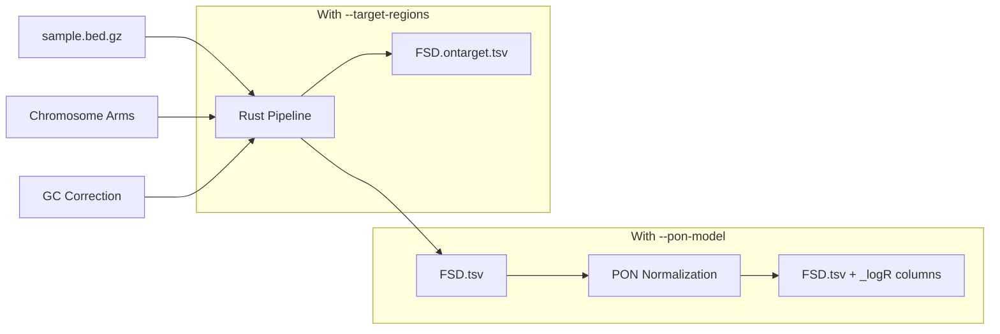
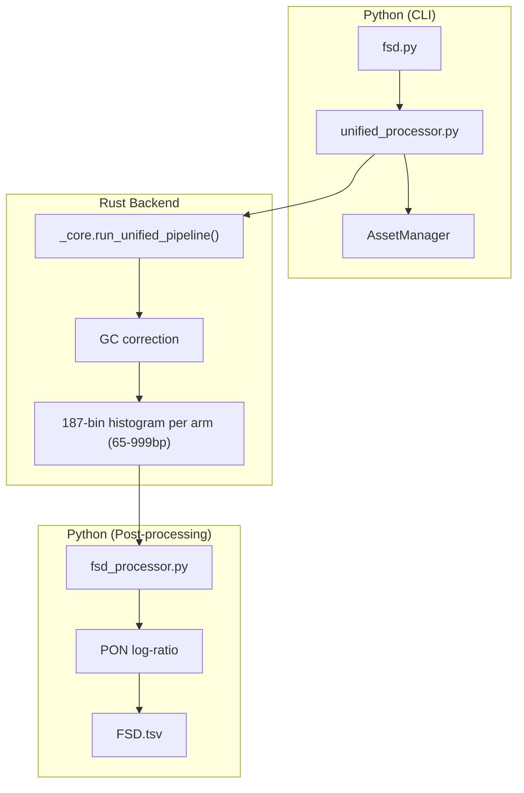

# Fragment Size Distribution (FSD)

**Command**: `krewlyzer fsd`

> **Plain English**: FSD creates a "histogram" of fragment sizes for each chromosome arm.
> Healthy samples have a peak at ~166bp. Cancer samples show a left-shifted peak (~145bp).
>
> **Use case**: Detect aneuploidy and copy number changes by comparing arm-level size distributions.

---

## Purpose

Computes high-resolution (5bp bins) fragment length distributions per chromosome arm. Produces ML-ready features with log-ratio normalization and on/off-target split for panel data.

---

## Processing Flowchart



### Python/Rust Architecture



## Biological Context

### Why Fragment Sizes Matter

cfDNA fragment sizes reflect nucleosome positioning and chromatin state in source cells:

| Fragment Size | Source | Biological Significance |
|---------------|--------|------------------------|
| **~145bp** | Core nucleosome | Minimal DNA protection |
| **~166bp** | Mono-nucleosome + linker | "Classic" cfDNA peak |
| **~334bp** | Di-nucleosome | Stable chromatin regions |
| **10bp periodicity** | DNA helical pitch | Rotational phasing |

### Cancer Signature

| Signal | Healthy Plasma | Cancer (ctDNA) |
|--------|----------------|----------------|
| Modal peak | ~166bp | Left-shifted (~145bp) |
| 10bp periodicity | Clear | Often disrupted |
| Arm-level variation | Minimal | Increased (correlates with CNAs) |

> **Why arm-level?** Chromosome arms have distinct chromatin environments. Tumor-derived cfDNA shows arm-specific fragmentation shifts that correlate with copy number alterations.

---

## Usage

```bash
# Basic usage
krewlyzer fsd -i sample.bed.gz -o output_dir/ --genome hg19

# With PON for log-ratio normalization
krewlyzer fsd -i sample.bed.gz -o output_dir/ -P msk-access.pon.parquet

# Panel data (MSK-ACCESS) with on/off-target split
krewlyzer run-all -i sample.bam -r ref.fa -o out/ \
    --target-regions panel_targets.bed
```

---

## Options

| Option | Short | Default | Description |
|--------|-------|---------|-------------|
| `--input` | `-i` | *required* | Input .bed.gz file (from extract) |
| `--output` | `-o` | *required* | Output directory |
| `--sample-name` | `-s` | Auto | Override sample name |
| `--arms-file` | `-a` | Bundled | Chromosome arms BED file |
| `--pon-model` | `-P` | None | PON model for log-ratio computation |
| `--target-regions` | `-T` | None | Target BED (enables on/off split) |
| `--skip-target-regions` | | False | Force WGS mode (ignore bundled targets from --assay) |
| `--genome` | `-G` | hg19 | Genome build (hg19/hg38) |
| `--gc-correct` | | True | Apply GC bias correction |
| `--threads` | `-t` | 0 | Threads (0=all cores) |
| `--verbose` | `-v` | False | Enable debug logging |
| `--format` | `-f` | tsv | Output format: tsv, parquet, json |

---

## Output Files

### `{sample}.FSD.tsv` (Off-Target / Default)

| Column | Type | Description |
|--------|------|-------------|
| `region` | str | Chromosome arm (e.g., "chr1:0-125000000") |
| `65-69`, `70-74`, ..., `995-999` | float | GC-weighted counts in 187 bins (5bp steps, 65-999bp) |
| `total` | float | Sum of all bins |
| `65-69_logR`, ... | float | log2(sample / PoN_expected) *(with -P)* |
| `pon_stability` | float | 1 / (variance + k) *(with -P)* |

### `{sample}.FSD.ontarget.tsv` (Panel Mode Only)

Same schema as above, but for fragments overlapping target regions.

> [!IMPORTANT]
> **Off-target = unbiased** (preferred for biomarkers)  
> **On-target = capture-biased** (use cautiously for local analysis only)

---

## GC Correction

When `--gc-correct` is enabled (default):

```
Normalization Order:
1. GC-weighting (Rust): raw_count × gc_correction_factor
2. PoN log-ratio (Python): log2((sample + 1) / (pon + 1))
```

| GC Option | Effect |
|-----------|--------|
| Enabled | Corrects for PCR/capture GC bias |
| Disabled (`--no-gc-correct`) | Raw counts (faster, biased) |

> See [GC Correction Details](../advanced/gc-correction.md) for the LOESS algorithm.

---

## PON Integration

With `--pon-model`, FSD outputs include log-ratio normalization:

| Column | Formula | Interpretation |
|--------|---------|----------------|
| `{bin}_logR` | `log2((sample + 1) / (PoN_expected + 1))` | > 0 = above normal |
| `pon_stability` | `1 / (variance + 0.01)` | Higher = more reliable |

**Formulas:**

**Log-Ratio:**

$$
\text{logR} = \log_2 \left( \frac{\text{sample\_count} + 1}{\text{PoN\_expected} + 1} \right)
$$

**PON Stability:**

$$
\text{stability} = \frac{1}{\text{variance} + 0.01}
$$

**Algorithm:**
1. For each arm and size bin, retrieve PoN expected value
2. Compute log-ratio with pseudocount (+1) for zero-handling
3. Calculate stability from PoN variance (inverse weighting)

> See [PON Models](../advanced/pon.md) for model structure and building.

---

## Clinical Interpretation

### Interpreting Log-Ratio Values

| `*_logR` Value | Meaning | Possible Cause |
|----------------|---------|----------------|
| **~0** | Normal | No deviation from healthy |
| **> 0.5** | Elevated short fragments | Tumor-derived cfDNA |
| **< -0.5** | Depleted | Copy number loss? |

### Arm-Level Variation

| Pattern | Interpretation |
|---------|----------------|
| Uniform across arms | Healthy profile |
| Single arm deviation | Focal CNA or arm-level event |
| Multiple arm deviations | High tumor fraction (aneuploidy) |

---

## 187-Bin Structure (65-999bp, 5bp steps)

| Bin Range | Size Range | Description |
|-----------|------------|-------------|
| 0 | 65-69bp | Ultra-short (sub-nucleosomal) |
| 1-6 | 70-99bp | Short fragments |
| 7-16 | 100-149bp | Core mono-nucleosomal |
| 17-30 | 150-219bp | Peak mono-nucleosomal |
| 31-50 | 220-319bp | Di-nucleosomal |
| 51-86 | 320-499bp | Multi-nucleosomal |
| 87-186 | 500-999bp | Extended range |

> **Note**: The pipeline uses 5bp bins from 65bp to 999bp, yielding 187 columns. This extended range (up to 1000bp) captures multi-nucleosomal fragments for comprehensive FSD analysis.

---

## Panel Data Mode

For targeted sequencing (MSK-ACCESS):

```bash
krewlyzer fsd -i sample.bed.gz -o output/ \
    --target-regions MSK-ACCESS-v2_targets.bed
```

| Output | Contents | Use Case |
|--------|----------|----------|
| `.FSD.tsv` | Off-target fragments | Unbiased arm-level biomarkers |
| `.FSD.ontarget.tsv` | On-target fragments | Local context (capture-biased) |

> [!WARNING]
> On-target FSD has capture bias and should not be used for global fragmentomics.

---

## See Also

- [Input File Formats](../advanced/input-formats.md#arms-bed) - Arms BED format for `--arms-file`
- [GC Correction](../advanced/gc-correction.md) - LOESS algorithm details
- [PON Models](../advanced/pon.md) - Building and using PON
- [Citation](../citation.md) - DELFI paper references
- [Troubleshooting](../troubleshooting.md) - Common issues
