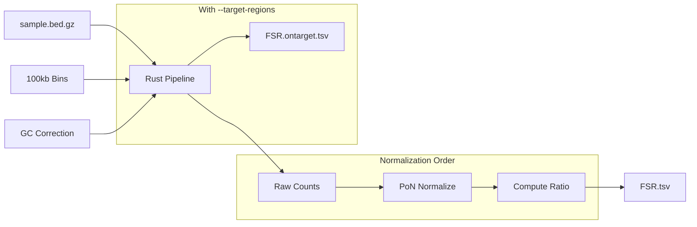
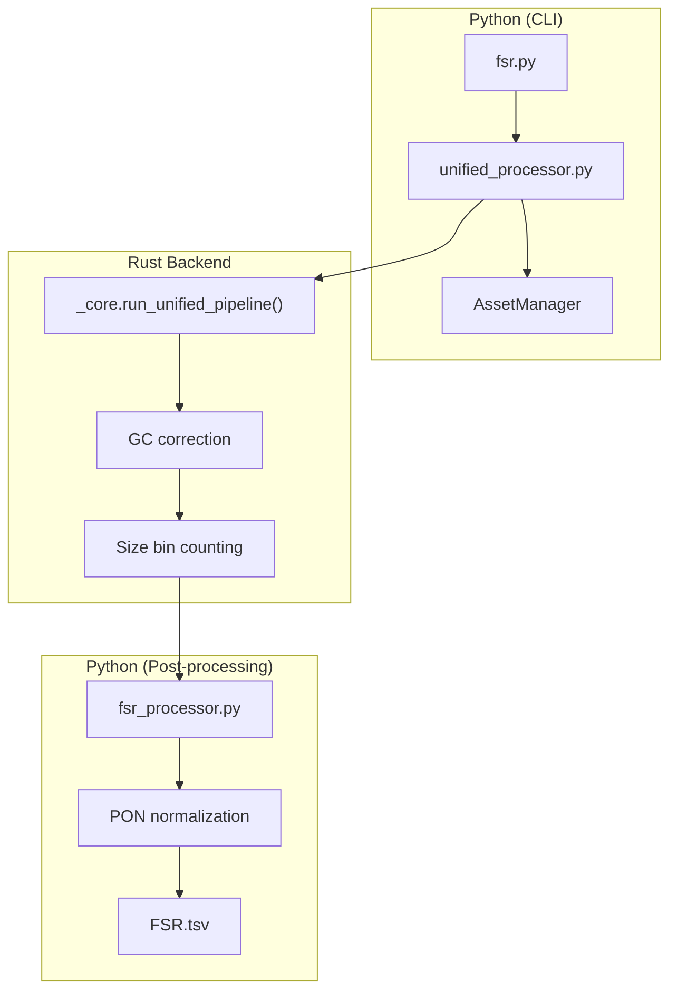
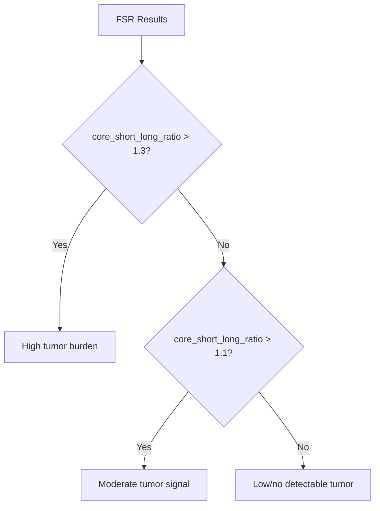

# Fragment Size Ratio (FSR)

**Command**: `krewlyzer fsr`

> **Plain English**: FSR measures the ratio of short (tumor-enriched) to long (healthy) DNA fragments.
> A higher `core_short_long_ratio` means more tumor-derived DNA in your sample.
>
> **Example**: `core_short_long_ratio = 1.5` suggests ~30% tumor burden (vs. ~0.9 in healthy plasma).

---

## Purpose
Computes short/long fragment ratios for cancer biomarker analysis. Uses PoN-normalization **before** ratio calculation for accurate cross-sample comparison.

---

## Processing Flowchart



### Python/Rust Architecture



---

## Biological Context

The ratio of short to long fragments is a key indicator of tumor burden in cfDNA:

| Fragment Type | Size Range | Biological Source |
|---------------|------------|-------------------|
| **core_short** | 100-149bp | Tumor DNA (sub-nucleosomal, ~145bp peak) |
| **mono_nucl** | 150-259bp | Standard mono-nucleosomal cfDNA |
| **di_nucl** | 260-399bp | Di-nucleosomal (healthy chromatin) |
| **long** | 400+bp | Very long fragments |

**Key Biomarker**: `core_short_long_ratio` – Higher ratio = higher probability of tumor DNA

### Why Short Fragments = Tumor?

Tumor cells have abnormal chromatin structure:
- **Disrupted nucleosome positioning** → non-canonical cutting
- **Smaller protected regions** → shorter fragments
- **Result**: Tumor cfDNA peaks at ~145bp vs. healthy cfDNA at ~166bp

---

## Usage
```bash
# Basic usage
krewlyzer fsr -i sample.bed.gz -o output_dir/ --sample-name SAMPLE

# With PON normalization (recommended)
krewlyzer fsr -i sample.bed.gz -o output/ -P cohort.pon.parquet

# Panel data with on/off-target split
krewlyzer fsr -i sample.bed.gz -o output/ \
    --target-regions MSK-ACCESS_targets.bed
```

## CLI Options

| Option | Short | Description |
|--------|-------|-------------|
| `--input` | `-i` | Input .bed.gz file (required) |
| `--output` | `-o` | Output directory (required) |
| `--sample-name` | `-s` | Override sample name |
| `--bin-input` | `-b` | Custom bin file |
| `--target-regions` | `-T` | Target BED (for on/off-target split) |
| `--skip-target-regions` | | Force WGS mode (ignore bundled targets from --assay) |
| `--pon-model` | `-P` | PON model for count normalization |
| `--pon-variant` | | PON variant: `all_unique` (default) or `duplex` |
| `--genome` | `-G` | Genome build: hg19/hg38 |
| `--gc-correct` | | Apply GC bias correction (default: enabled) |
| `--threads` | `-t` | Number of threads (0=all cores) |
| `--format` | `-f` | Output format: tsv, parquet, json |

---

## Size Bin Definitions

FSR uses the Rust backend's 5-channel size bins:

| Bin Name | Size Range | Biological Meaning |
|----------|------------|-------------------|
| `ultra_short` | 65-99bp | TF footprints, highly tumor-specific |
| `core_short` | 100-149bp | **Primary tumor biomarker** |
| `mono_nucl` | 150-259bp | Standard mono-nucleosomal |
| `di_nucl` | 260-399bp | Di-nucleosomal, healthy-enriched |
| `long` | 400+bp | Multi-nucleosomal (rare) |

---

## Formulas

### Normalization Order (Critical)

> [!IMPORTANT]
> FSR normalizes counts to PoN **BEFORE** computing ratios.

**Step 1 - Normalize short:**

$$
\text{core\_short\_norm} = \frac{\text{core\_short\_count}}{\text{PoN\_core\_short\_mean}}
$$

**Step 2 - Normalize long:**

$$
\text{long\_norm} = \frac{\text{long\_count}}{\text{PoN\_long\_mean}}
$$

**Step 3 - Compute ratio:**

$$
\text{core\_short\_long\_ratio} = \frac{\text{core\_short\_norm}}{\text{long\_norm}}
$$

This removes batch effects **before** ratio calculation, ensuring accurate cross-sample comparison.

**Step 4 - Log2 ratio (optional):**

$$
\text{short\_long\_log2} = \log_2(\text{core\_short\_long\_ratio})
$$

| log2 Value | Meaning |
|------------|---------|
| 0 | Equal short/long (baseline) |
| > 0.5 | **Elevated short fragments** (tumor signal) |
| < -0.5 | Depleted short fragments |

---

## Output Format

Output: `{sample}.FSR.tsv`

| Column | Type | Description |
|--------|------|-------------|
| `region` | str | Genomic region (chr:start-end) |
| `ultra_short_count` | int | Ultra-short fragments (65-99bp) |
| `core_short_count` | int | Core short fragments (100-149bp) |
| `mono_nucl_count` | int | Mono-nucleosomal fragments (150-259bp) |
| `di_nucl_count` | int | Di-nucleosomal fragments (260-399bp) |
| `long_count` | int | Long fragments (400+bp) |
| `total_count` | int | Total fragments |
| `ultra_short_ratio` | float | ultra_short / total |
| `core_short_ratio` | float | core_short / total |
| `mono_nucl_ratio` | float | mono_nucl / total |
| `di_nucl_ratio` | float | di_nucl / total |
| `long_ratio` | float | long / total |
| `core_short_long_ratio` | float | **core_short / long** (primary biomarker) |

---

## Panel Mode (--target-regions)

For targeted sequencing panels (MSK-ACCESS):

```bash
krewlyzer fsr -i sample.bed.gz -o output/ \
    --target-regions MSK-ACCESS_targets.bed
```

### Output Files

| File | Contents | Use Case |
|------|----------|----------|
| `{sample}.FSR.tsv` | **Off-target** fragments | Unbiased ratio (primary) |
| `{sample}.FSR.ontarget.tsv` | **On-target** fragments | Gene-level ratio |

> [!IMPORTANT]
> **Off-target = unbiased** – preferred for tumor detection.  
> **On-target = capture-biased** – reflects panel design, not true biology.

---

## Clinical Interpretation

| Metric | Healthy Plasma | Cancer (ctDNA) |
|--------|----------------|----------------|
| Modal fragment size | ~166bp | Left-shifted (~145bp) |
| `core_short_long_ratio` | ~0.8-1.0 (baseline) | **>1.2 elevated** |
| Interpretation | Normal profile | Elevated tumor burden |

### Decision Flowchart



> **Note**: Thresholds depend on your cohort and should be validated against known samples.

---

## See Also

- [FSC](fsc.md) – Full 5-channel coverage
- [FSD](fsd.md) – Size distribution by arm
- [PON Models](../advanced/pon.md) – Normalization baselines
- [Glossary](../glossary.md) – Terminology reference
- [Citation](../citation.md) – DELFI paper references
