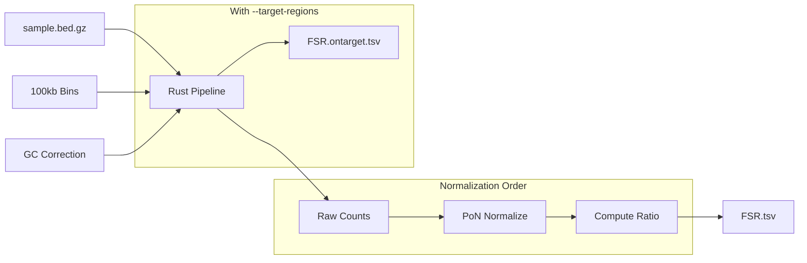

# Fragment Size Ratio (FSR)

**Command**: `krewlyzer fsr`

## Purpose
Computes short/long fragment ratios for cancer biomarker analysis. Uses PoN-normalization **before** ratio calculation for accurate cross-sample comparison.

---

## Processing Flowchart



---

## Biological Context

The ratio of short to long fragments is a key indicator of tumor burden in cfDNA:

| Fragment Type | Size Range | Source |
|---------------|------------|--------|
| **Short** | 65-149bp | Tumor DNA (~145bp peak) |
| **Long** | 221-400bp | Healthy chromatin |

**Key Biomarker**: `short_long_ratio` – Higher ratio = higher probability of tumor DNA

---

## Usage
```bash
# Basic usage
krewlyzer fsr -i sample.bed.gz -o output_dir/ --sample-name SAMPLE

# With PON normalization (recommended)
krewlyzer fsr -i sample.bed.gz -o output/ -P cohort.pon.parquet

# Panel data with on/off-target split
krewlyzer fsr -i sample.bed.gz -o output/ \
    --target-regions MSK-ACCESS_targets.bed
```

## CLI Options

| Option | Short | Description |
|--------|-------|-------------|
| `--input` | `-i` | Input .bed.gz file (required) |
| `--output` | `-o` | Output directory (required) |
| `--sample-name` | `-s` | Override sample name |
| `--bin-input` | `-b` | Custom bin file |
| `--target-regions` | `-T` | Target BED (for on/off-target split) |
| `--pon-model` | `-P` | PON model for count normalization |
| `--genome` | `-G` | Genome build: hg19/hg38 |
| `--gc-correct` | | Apply GC bias correction (default: enabled) |
| `--threads` | `-t` | Number of threads (0=all cores) |

---

## Formulas

### Normalization Order (Critical)

> [!IMPORTANT]
> FSR normalizes counts to PoN **BEFORE** computing ratios.

```
Step 1 - Normalize:
                    short_count
    short_norm = ─────────────────
                  PoN_short_mean

Step 2 - Normalize:
                   long_count
    long_norm = ─────────────────
                 PoN_long_mean

Step 3 - Ratio:
                       short_norm
    short_long_ratio = ────────────
                       long_norm
```

This removes batch effects **before** ratio calculation, ensuring accurate cross-sample comparison.

---

## Output Format

Output: `{sample}.FSR.tsv`

| Column | Type | Description |
|--------|------|-------------|
| `region` | str | Genomic region (chr:start-end) |
| `short_count` | int | Raw short fragment count (65-149bp) |
| `long_count` | int | Raw long fragment count (221-400bp) |
| `total_count` | int | Total fragments (65-400bp) |
| `short_norm` | float | short / PoN_short_mean |
| `long_norm` | float | long / PoN_long_mean |
| `short_long_ratio` | float | **short_norm / long_norm** (primary) |
| `short_long_log2` | float | log₂(short_long_ratio) for ML |
| `short_frac` | float | short / total |
| `long_frac` | float | long / total |

---

## Panel Mode (--target-regions)

For targeted sequencing panels (MSK-ACCESS):

```bash
krewlyzer fsr -i sample.bed.gz -o output/ \
    --target-regions MSK-ACCESS_targets.bed
```

### Output Files

| File | Contents | Use Case |
|------|----------|----------|
| `{sample}.FSR.tsv` | **Off-target** fragments | Unbiased ratio (primary) |
| `{sample}.FSR.ontarget.tsv` | **On-target** fragments | Gene-level ratio |

> [!IMPORTANT]
> **Off-target = unbiased** – preferred for tumor detection.  
> **On-target = capture-biased** – reflects panel design.

---

## Clinical Interpretation

| Metric | Healthy Plasma | Cancer (ctDNA) |
|--------|----------------|----------------|
| Modal fragment size | ~166bp | Left-shifted (~145bp) |
| `short_long_ratio` | Low (baseline) | **Elevated** |
| `short_long_log2` | ~0 | **Positive** |

---

## See Also

- [FSC](fsc.md) – Full 5-channel coverage
- [PON Models](../advanced/pon.md) – Normalization baselines
- [Citation](../citation.md#fsr) – DELFI paper references
