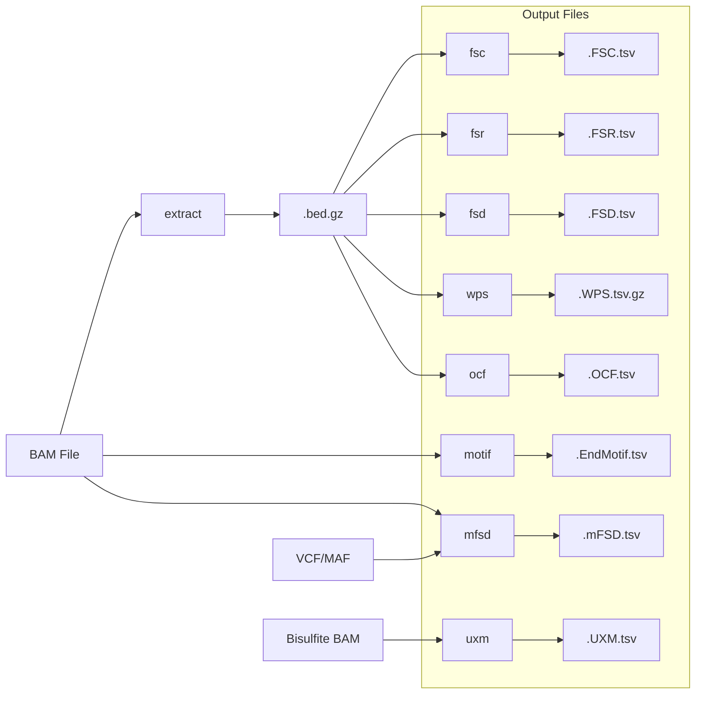

# Features Overview

Krewlyzer provides 10 standalone feature extraction commands plus a unified `run-all` pipeline.

## Quick Comparison

| Command | Input | Output | Primary Use Case |
|---------|-------|--------|------------------|
| [`extract`](extract.md) | BAM | `.bed.gz`, `.metadata.json` | Fragment extraction & GC factors |
| [`motif`](motif.md) | BAM | `.EndMotif.tsv`, `.MDS.tsv` | Fragmentation patterns |
| [`fsc`](fsc.md) | BED.gz | `.FSC.tsv` | Copy number detection |
| [`fsr`](fsr.md) | BED.gz | `.FSR.tsv` | Tumor fraction estimation |
| [`fsd`](fsd.md) | BED.gz | `.FSD.tsv` | Size distribution analysis |
| [`wps`](wps.md) | BED.gz | `.WPS.tsv.gz` | Nucleosome positioning |
| [`ocf`](ocf.md) | BED.gz | `.OCF.tsv` | Tissue of origin |
| [`uxm`](uxm.md) | Bisulfite BAM | `.UXM.tsv` | Methylation deconvolution |
| [`mfsd`](mfsd.md) | BAM + VCF/MAF | `.mFSD.tsv` | Mutant vs wild-type sizes |
| `run-all` | BAM | All outputs | Complete analysis |

---

## Workflow Diagram



---

## Feature Categories

### Fragmentation Features

| Feature | Biological Signal | Clinical Application |
|---------|-------------------|---------------------|
| **FSC** | Fragment coverage by size class | CNV detection, copy number profiling |
| **FSR** | Short/Long fragment ratios | Tumor fraction estimation |
| **FSD** | Size distribution per arm | Nucleosome patterns, ctDNA detection |

### Nucleosome & Chromatin

| Feature | Biological Signal | Clinical Application |
|---------|-------------------|---------------------|
| **WPS** | Nucleosome protection scores | Tissue of origin, gene regulation |
| **OCF** | Open chromatin fragmentation | Tissue-specific cfDNA detection |
| **Motif** | End motif diversity (MDS) | Fragmentation patterns, cancer detection |

### Specialized

| Feature | Biological Signal | Clinical Application |
|---------|-------------------|---------------------|
| **mFSD** | Mutant vs wild-type sizes | MRD monitoring, ctDNA quantification |
| **UXM** | Fragment methylation (U/X/M) | Cell-type deconvolution |

---

## Choosing Features

### For Cancer Detection
```bash
krewlyzer run-all sample.bam -r hg19.fa -o output/
# Focus on: FSR (tumor fraction), FSC (CNV), Motif (MDS)
```

### For Tissue of Origin
```bash
# Run WPS and OCF
krewlyzer wps -i sample.bed.gz -o output/
krewlyzer ocf -i sample.bed.gz -o output/
```

### For MRD Monitoring
```bash
# Compare mutant vs wild-type fragment sizes
krewlyzer mfsd -i sample.bam -V variants.vcf -o output/
```

### For Methylation Deconvolution
```bash
# Requires bisulfite sequencing BAM
krewlyzer uxm bisulfite.bam -o output/
```

---

## Common Options

All feature commands share these core options:

| Option | Description |
|--------|-------------|
| `-o, --output` | Output directory (required) |
| `-s, --sample-name` | Override sample name |
| `-G, --genome` | Genome build: hg19/hg38 |
| `-t, --threads` | Thread count (0=all) |
| `-v, --verbose` | Enable verbose logging |

See individual feature pages for command-specific options.
