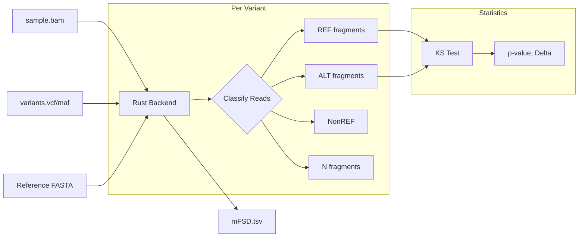
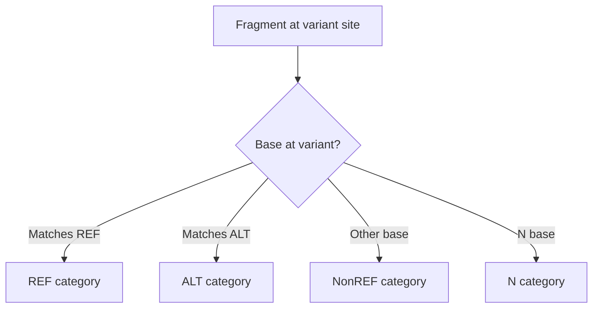

# Mutant Fragment Size Distribution (mFSD)

**Command**: `krewlyzer mfsd`

> **Plain English**: mFSD compares fragment sizes at known mutation sites.
> Fragments carrying the mutation (ALT) tend to be shorter than healthy fragments (REF).
>
> **Use case**: MRD monitoring - track tumor DNA by comparing mutant vs. wild-type fragment sizes.

---

## Purpose
Compares the size distribution of mutant vs. wild-type fragments at variant sites, with support for all small variant types and 4-way fragment classification.

---

## Processing Flowchart



---

## Biological Context

Mutant ctDNA fragments are typically **shorter** (~145bp) than wild-type cfDNA (~166bp) due to:
- Altered nucleosome positioning in tumor cells
- Different chromatin accessibility
- Enhanced apoptosis patterns

This module quantifies this difference using high-depth targeted sequencing data.

---

## Variant Types Supported

| Type | Example | Description |
|------|---------|-------------|
| **SNV** | A>T | Single nucleotide variant |
| **MNV** | AT>GC | Multi-nucleotide variant |
| **Insertion** | A>ATG | Pure insertion |
| **Deletion** | ATG>A | Pure deletion |
| **Complex** | ATG>CT | Mixed substitution + indel |

---

## Usage

```bash
# Basic usage with VCF
krewlyzer mfsd -i sample.bam -V variants.vcf -o output_dir/

# With MAF file and GC correction
krewlyzer mfsd -i sample.bam -V variants.maf -o output/ \
    -r hg19.fa --correction-factors factors.csv

# With per-variant distributions
krewlyzer mfsd -i sample.bam -V variants.vcf -o output/ \
    --output-distributions
```

## CLI Options

| Option | Short | Type | Default | Description |
|--------|-------|------|---------|-------------|
| `--input` | `-i` | PATH | *required* | Input BAM file |
| `--variants` | `-V` | PATH | *required* | VCF or MAF file with variants |
| `--output` | `-o` | PATH | *required* | Output directory |
| `--sample-name` | `-s` | TEXT | | Override sample name |
| `--reference` | `-r` | PATH | | Reference FASTA for GC correction |
| `--correction-factors` | `-F` | PATH | | Pre-computed correction factors CSV |
| `--mapq` | `-q` | INT | 20 | Minimum mapping quality |
| `--output-distributions` | `-d` | FLAG | | Output per-variant size distributions |
| `--verbose` | `-v` | FLAG | | Enable verbose logging |
| `--threads` | `-t` | INT | 0 | Number of threads (0=all) |

---

## Fragment Classification

Fragments are classified into 4 categories:



| Category | Description | Interpretation |
|----------|-------------|----------------|
| **REF** | Supports reference allele | Healthy cfDNA |
| **ALT** | Supports alternate allele | Tumor signal |
| **NonREF** | Other base (not REF/ALT/N) | Sequencing errors |
| **N** | Contains N at variant | Low quality |

---

## Formulas

### KS Test (Kolmogorov-Smirnov)

$$
\text{KS statistic} = \max |F_1(x) - F_2(x)|
$$

Where:
- $F_1(x)$ = CDF of ALT fragment sizes
- $F_2(x)$ = CDF of REF fragment sizes

### Size Delta

$$
\Delta_{\text{ALT-REF}} = \text{ALT\_MeanSize} - \text{REF\_MeanSize}
$$

**Expected:**
- Healthy: $\approx 0$
- Cancer: $< 0$ (ALT shorter)

### VAF Proxy

$$
\text{VAF\_Proxy} = \frac{\text{ALT\_Count}}{\text{REF\_Count} + \text{ALT\_Count}}
$$

---

## Output Format

### Main Output: `{sample}.mFSD.tsv`

| Column Group | Columns | Description |
|--------------|---------|-------------|
| **Variant Info** | Chrom, Pos, Ref, Alt, VarType | Variant details |
| **Counts** | REF/ALT/NonREF/N_Count | Fragment counts per category |
| **Mean Sizes** | REF/ALT/NonREF/N_MeanSize | Average fragment size |
| **KS Tests** | Delta_*, KS_*, KS_Pval_* | Pairwise comparisons |
| **Derived** | VAF_Proxy, Size_Ratio, Quality_Score | Computed metrics |
| **Flags** | ALT_Confidence, KS_Valid | Quality indicators |

### Optional: `{sample}.mFSD.distributions.tsv`

With `--output-distributions`:
```tsv
Chrom  Pos    Ref  Alt  Category  Size  Count
chr1   12345  A    T    REF       145   3
chr1   12345  A    T    REF       166   12
chr1   12345  A    T    ALT       142   2
```

---

## Clinical Interpretation

| Metric | Healthy | Cancer (ctDNA) |
|--------|---------|----------------|
| `Delta_ALT_REF` | ~0 | **Negative** (ALT shorter) |
| `Size_Ratio` | ~1.0 | **< 1.0** |
| `VAF_Proxy` | 0 | > 0 (correlates with TF) |

### MRD Settings
- Low fragment counts (1-2) produce `NA`
- `ALT_Confidence`: HIGH (≥5), LOW (1-4), NONE (0)
- `KS_Valid`: TRUE if REF and ALT ≥2 fragments each

---

## See Also

- [PON Models](../advanced/pon.md) – GC correction factors
- [Citation](../citation.md#mfsd) – Scientific references
