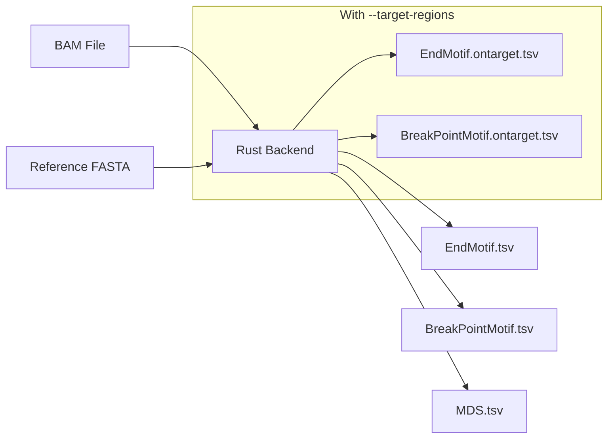
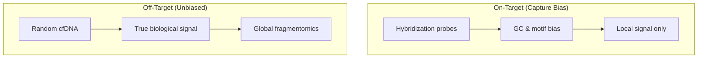

# Motif-based Feature Extraction

**Command**: `krewlyzer motif`

> **Plain English**: Motif analysis looks at the 4-letter DNA sequences at fragment ends.
> Different enzymes cut DNA at different sequences—tumors have more diverse cutting patterns.
>
> **Key metric**: MDS (Motif Diversity Score) - **higher MDS = more abnormal cutting = potential tumor signal**

---

## Purpose
Extracts end motif, breakpoint motif, and Motif Diversity Score (MDS) from sequencing fragments.

---

## Processing Flowchart



---

## Biological Context
Motif analysis of cfDNA fragment ends reveals tissue-of-origin, nucleosome positioning, and nuclease activity. MDS quantifies motif diversity, which may be altered in cancer. See [Zhou et al., 2020](../citation.md#motif) for details.

---

## Usage
```bash
krewlyzer motif -i /path/to/input.bam -r /path/to/reference.fa -o /path/to/output_dir \
    -k 4 --threads 4
```

## Options

| Option | Short | Type | Default | Description |
|--------|-------|------|---------|-------------|
| `--input` | `-i` | PATH | *required* | Input BAM file |
| `--reference` | `-r` | PATH | *required* | Reference genome FASTA (indexed) |
| `--output` | `-o` | PATH | *required* | Output directory |
| `--kmer` | `-k` | INT | 4 | K-mer size for motif extraction |
| `--target-regions` | `-T` | PATH | | Target BED (for on/off-target motifs) |
| `--chromosomes` | | TEXT | | Comma-separated chromosomes to process |
| `--sample-name` | `-s` | TEXT | | Override sample name |
| `--verbose` | `-v` | FLAG | | Enable verbose logging |
| `--threads` | `-t` | INT | 0 | Number of threads (0=all) |

---

## Output Files

| File | Description |
|------|-------------|
| `{sample}.EndMotif.tsv` | K-mer frequencies at fragment 5' ends |
| `{sample}.BreakPointMotif.tsv` | K-mer frequencies flanking breakpoints |
| `{sample}.MDS.tsv` | Motif Diversity Score |

---

## Formulas

### Motif Diversity Score (MDS)

MDS quantifies the randomness of 4-mer end motifs using normalized Shannon entropy:

$$
\text{MDS} = \frac{-\sum_{i} p_i \times \log_2(p_i)}{\log_2(4^k)}
$$

**Variables:**
- $p_i$ = frequency of the i-th motif
- $k$ = k-mer length (default: 4)
- Result range: $[0, 1]$

**Interpretation:**
| MDS Value | Meaning |
|-----------|---------|
| ~1.0 | Random/diverse (healthy-like) |
| < 0.8 | Stereotyped (possible tumor signal) |

---

## Panel Mode (--target-regions)

When `--target-regions` is provided, motif analysis produces **separate outputs** for on-target and off-target fragments:

```bash
krewlyzer motif -i sample.bam -r hg19.fa -o output/ \
    --target-regions MSK-ACCESS_targets.bed
```

### Outputs in Panel Mode

| File | Contents | Use Case |
|------|----------|----------|
| `{sample}.EndMotif.tsv` | **Off-target** fragments | Unbiased global motif signal |
| `{sample}.EndMotif.ontarget.tsv` | **On-target** fragments | Local capture region analysis |
| `{sample}.MDS.tsv` | Off-target MDS | Primary biomarker |

> [!IMPORTANT]
> **Off-target = unbiased** – preferred for fragmentomics biomarkers.  
> **On-target = capture-biased** – use cautiously; reflects library prep artifacts.

### Why Split?



For panel data (MSK-ACCESS), on-target fragments have capture bias from hybridization probes. Off-target reads represent unbiased cfDNA and should be used for motif biomarkers.

---

## Clinical Interpretation

| Metric | Healthy | Cancer (ctDNA) |
|--------|---------|----------------|
| MDS | Higher (random) | Lower (stereotyped) |
| Jagged ends | Lower | **Higher** (87.8% jagged) |
| Specific motifs | Baseline | Cancer-associated enriched |

### Biological Basis
- cfDNA fragmentation driven by nucleases (DNASE1, DNASE1L3)
- ~87.8% of cfDNA molecules have jagged (single-stranded) ends
- Tumor-derived fragments show higher jaggedness than wild-type

---

## See Also

- [Citation & Scientific Background](../citation.md#motif) - Zhou et al. paper
- [Troubleshooting](../troubleshooting.md) - Common issues
