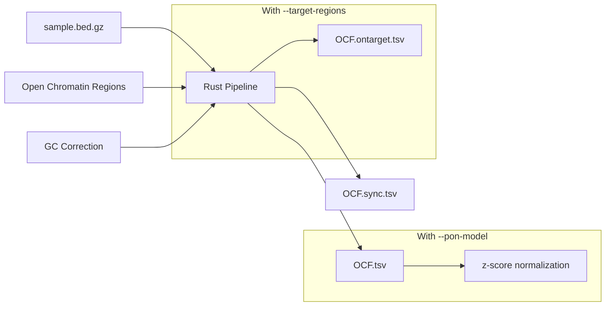
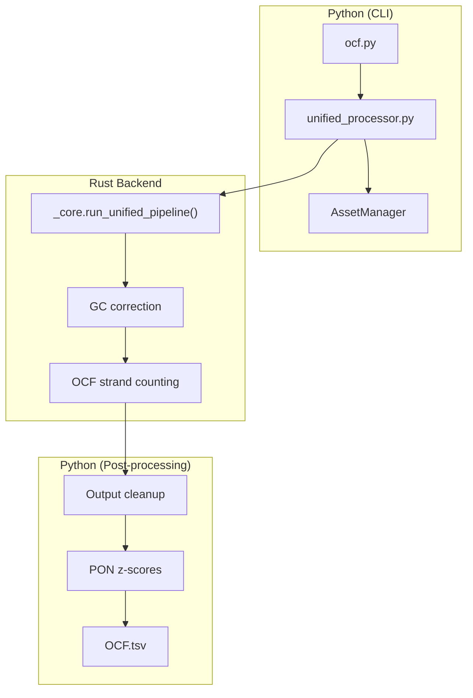
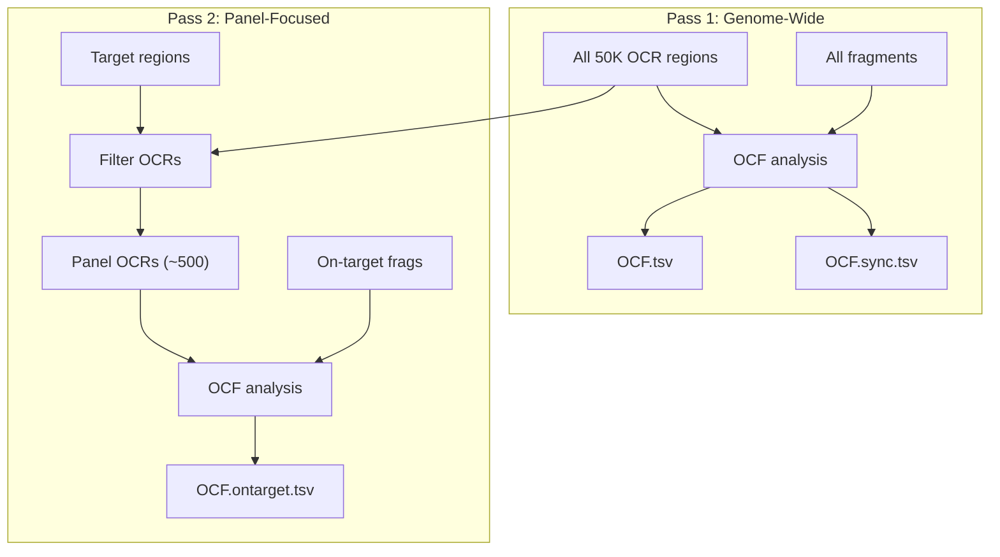
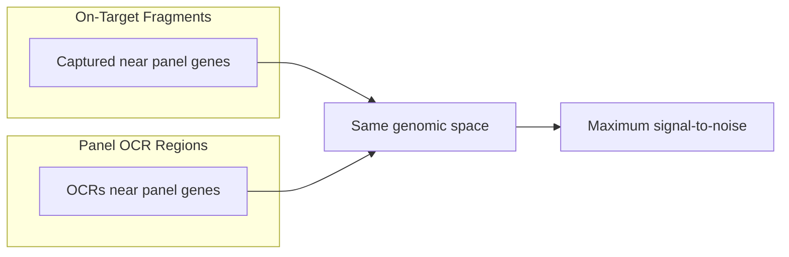

# Orientation-aware Fragmentation (OCF)

**Command**: `krewlyzer ocf`

> **Plain English**: OCF detects where cfDNA fragments came from by looking at their "orientation" near regulatory regions.
> Different tissues cut DNA in different directions—OCF captures this signal for tissue-of-origin detection.
>
> **Use case**: Identify liver cancer vs. colon cancer based on cfDNA fragmentation patterns.

---

## Purpose
Computes orientation-aware cfDNA fragmentation (OCF) values in tissue-specific open chromatin regions. Enables tissue-of-origin analysis from cfDNA.

---

## Processing Flowchart



> [!WARNING]
> OCF regions are **only available for GRCh37/hg19**. For hg38, you must provide a custom OCR file with `-r/--ocr-input`.

### Python/Rust Architecture



---

## Biological Context

OCF ([Sun et al., 2019](../citation.md#ocf)) measures the phasing of upstream (U) and downstream (D) fragment ends in open chromatin regions, informing tissue-of-origin of cfDNA.

---

## Usage
```bash
# Basic usage
krewlyzer ocf -i sample.bed.gz -o output_dir/ --genome hg19

# With PON for z-scores
krewlyzer ocf -i sample.bed.gz -o output/ -P tissue.pon.parquet

# Panel data with on/off-target split
krewlyzer ocf -i sample.bed.gz -o output/ \
    --target-regions MSK-ACCESS_targets.bed
```

## CLI Options

| Option | Short | Type | Default | Description |
|--------|-------|------|---------|-------------|
| `--input` | `-i` | PATH | *required* | Input .bed.gz file |
| `--output` | `-o` | PATH | *required* | Output directory |
| `--sample-name` | `-s` | TEXT | | Override sample name |
| `--ocr-input` | `-r` | PATH | | Open chromatin regions file |
| `--pon-model` | `-P` | PATH | | PON model for z-score computation |
| `--pon-variant` | | TEXT | all_unique | PON variant: `all_unique` or `duplex` |
| `--target-regions` | `-T` | PATH | | Target BED (for on/off-target split) |
| `--skip-target-regions` | | FLAG | False | Force WGS mode (ignore bundled targets from --assay) |
| `--genome` | `-G` | TEXT | hg19 | Genome build (hg19/hg38) |
| `--gc-correct` | | FLAG | True | Apply GC bias correction |
| `--verbose` | `-v` | FLAG | | Enable verbose logging |
| `--threads` | `-t` | INT | 0 | Number of threads (0=all) |

---

## Output Files

| File | Description |
|------|-------------|
| `{sample}.OCF.tsv` | Summary OCF per tissue type |
| `{sample}.OCF.sync.tsv` | Detailed sync scores |

---

## Formulas

### OCF Score Calculation

$$
\text{OCF} = \sum \left( \text{Right}_{-60} + \text{Left}_{+60} \right) - \sum \left( \text{Left}_{-60} + \text{Right}_{+60} \right)
$$

Where:
- $\text{Right}_{-60}$ = Right fragment ends at -60bp from OCR center (phased)
- $\text{Left}_{+60}$ = Left fragment ends at +60bp from OCR center (phased)
- $\text{Left}_{-60}$, $\text{Right}_{+60}$ = Background (unphased)

**Calculation Details:**
1. Fragments are mapped relative to the **center** of the Open Chromatin Region (OCR)
2. Left/Right ends counted in 10bp bins across ±1000bp window
3. Counts normalized by total sequencing depth

---

## PON Normalization

When `--pon-model` is provided, OCF output includes z-score columns:

### Output Columns with PON

| Column | Formula | Description |
|--------|---------|-------------|
| `OCF` | Raw OCF score | Phased fragment orientation |
| `ocf_z` | `(OCF - PON_mean) / PON_std` | Z-score vs healthy baseline |

### Z-Score Interpretation

| ocf_z | Meaning |
|-------|---------|
| -2 to +2 | Normal tissue contribution |
| > +2 | **Elevated tissue signal** (possible tumor origin) |
| < -2 | Decreased tissue contribution |

---

## Panel Mode

For targeted sequencing panels (MSK-ACCESS):

```bash
krewlyzer ocf -i sample.bed.gz -o output/ \
    --target-regions MSK-ACCESS_targets.bed
```

### How Panel OCF Works

In panel mode, OCF produces two complementary outputs using a sophisticated two-pass approach:



### Panel OCF Regions

Before the ontarget OCF run, the genome-wide OCR atlas (~50,000 regions) is filtered to keep only regions that overlap with panel targets (+2kb promoter extension). For a typical panel like MSK-ACCESS:

| | Genome-Wide | Panel-Filtered |
|--|------------|----------------|
| **OCR regions** | ~50,000 | ~500 |
| **Noise reduction** | - | ~99% |

### Output Files

| File | Fragment Source | OCR Regions | Use Case |
|------|-----------------|-------------|----------|
| `{sample}.OCF.tsv` | All fragments | All ~50K | Unbiased genome-wide tissue signal |
| `{sample}.OCF.ontarget.tsv` | **On-target only** | **Panel ~500** | Panel-focused tissue signal |
| `{sample}.OCF.sync.tsv` | All fragments | All ~50K | Debugging/visualization |
| `{sample}.OCF.ontarget.sync.tsv` | On-target only | Panel ~500 | Panel OCF detail |
| `{sample}.OCF.offtarget.tsv` | Off-target only | All ~50K | Off-target baseline |
| `{sample}.OCF.offtarget.sync.tsv` | Off-target only | All ~50K | Off-target detail |

> [!NOTE]
> The `ontarget` naming is consistent with other features (FSD.ontarget, FSC.ontarget).
> For OCF, ontarget means **both** on-target fragments **AND** panel-filtered OCR regions.

### Why Both Filters?



On-target fragments and panel OCR regions both focus on the same genomic space (near panel target genes), so combining both filters maximizes the signal-to-noise ratio for tissue-of-origin detection.

### Example: MSK-ACCESS Panel

| Tissue | OCF.tsv (Genome-Wide) | OCF.ontarget.tsv (Panel) |
|--------|----------------------|--------------------------|
| Liver | 265.3 | 52.8 |
| Intestine | 224.4 | -20.9 |
| Lung | 173.0 | -9.6 |
| Breast | 108.5 | 19.0 |
| Ovary | 123.1 | 88.9 |
| Placenta | -25.1 | -51.6 |
| T-cell | 8.9 | 86.7 |

> [!TIP]
> **Genome-wide OCF** provides the unbiased baseline for tissue-of-origin analysis.
> **Panel OCF** provides a focused view specific to your assay's target regions.

---

## Clinical Interpretation

### Healthy Plasma Baseline

| Tissue | OCF Value |
|--------|-----------|
| **T-cells (hematopoietic)** | Highest |
| **Liver** | Second highest |
| Other tissues | Near zero |

### Cancer-Specific Patterns

| Cancer Type | Expected OCF Change |
|-------------|---------------------|
| Hepatocellular carcinoma | ↑ Liver OCF |
| Colorectal cancer | ↑ Intestine OCF, ↓ T-cell OCF |
| Lung cancer | ↑ Lung OCF, ↓ T-cell OCF |

### Interpretation Guide

| Pattern | Interpretation |
|---------|----------------|
| ↑ Tissue-specific OCF | Tumor shedding from that tissue |
| ↓ T-cell OCF | Dilution by tumor DNA |
| OCF correlates with tumor fraction | Higher ctDNA → stronger signal |

---

## See Also

- [Input File Formats](../advanced/input-formats.md#region-bed) - Region BED format for `--ocr-input`
- [PON Models](../advanced/pon.md) – Tissue baseline models
- [Citation](../citation.md#ocf) – Sun et al. paper
- [Troubleshooting](../troubleshooting.md) – hg38 issues
