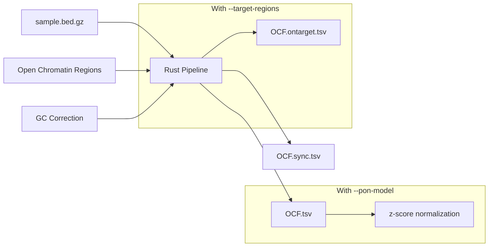

# Orientation-aware Fragmentation (OCF)

**Command**: `krewlyzer ocf`

## Purpose
Computes orientation-aware cfDNA fragmentation (OCF) values in tissue-specific open chromatin regions. Enables tissue-of-origin analysis from cfDNA.

---

## Processing Flowchart



> [!WARNING]
> OCF regions are **only available for GRCh37/hg19**. For hg38, you must provide a custom OCR file with `-r/--ocr-input`.

---

## Biological Context

OCF ([Sun et al., 2019](../citation.md#ocf)) measures the phasing of upstream (U) and downstream (D) fragment ends in open chromatin regions, informing tissue-of-origin of cfDNA.

---

## Usage
```bash
# Basic usage
krewlyzer ocf -i sample.bed.gz -o output_dir/ --genome hg19

# With PON for z-scores
krewlyzer ocf -i sample.bed.gz -o output/ -P tissue.pon.parquet

# Panel data with on/off-target split
krewlyzer ocf -i sample.bed.gz -o output/ \
    --target-regions MSK-ACCESS_targets.bed
```

## CLI Options

| Option | Short | Type | Default | Description |
|--------|-------|------|---------|-------------|
| `--input` | `-i` | PATH | *required* | Input .bed.gz file |
| `--output` | `-o` | PATH | *required* | Output directory |
| `--sample-name` | `-s` | TEXT | | Override sample name |
| `--ocr-input` | `-r` | PATH | | Open chromatin regions file |
| `--pon-model` | `-P` | PATH | | PON model for z-score computation |
| `--target-regions` | `-T` | PATH | | Target BED (for on/off-target split) |
| `--genome` | `-G` | TEXT | hg19 | Genome build (hg19/hg38) |
| `--gc-correct` | | FLAG | True | Apply GC bias correction |
| `--verbose` | `-v` | FLAG | | Enable verbose logging |
| `--threads` | `-t` | INT | 0 | Number of threads (0=all) |

---

## Output Files

| File | Description |
|------|-------------|
| `{sample}.OCF.tsv` | Summary OCF per tissue type |
| `{sample}.OCF.sync.tsv` | Detailed sync scores |

---

## Formulas

### OCF Score Calculation

```
                    Signal                      Background
OCF = Σ (Right ends at -60bp + Left ends at +60bp) - Σ (Left ends at -60bp + Right ends at +60bp)
          └── Phased nucleosome boundaries ──┘         └── Unphased (background) ──┘
```

**Calculation Details:**
1. Fragments are mapped relative to the **center** of the Open Chromatin Region (OCR)
2. Left/Right ends counted in 10bp bins across ±1000bp window
3. Counts normalized by total sequencing depth

---

## Panel Mode (--target-regions)

For targeted sequencing panels (MSK-ACCESS):

```bash
krewlyzer ocf -i sample.bed.gz -o output/ \
    --target-regions MSK-ACCESS_targets.bed
```

### Output Files

| File | Contents | Use Case |
|------|----------|----------|
| `{sample}.OCF.tsv` | **Off-target** fragments | Unbiased tissue signal |
| `{sample}.OCF.ontarget.tsv` | **On-target** fragments | Local OCF context |

> [!IMPORTANT]
> **Off-target = unbiased** – preferred for tissue-of-origin analysis.  
> **On-target = capture-biased** – may reflect panel design artifacts.

---

## Clinical Interpretation

### Healthy Plasma Baseline

| Tissue | OCF Value |
|--------|-----------|
| **T-cells (hematopoietic)** | Highest |
| **Liver** | Second highest |
| Other tissues | Near zero |

### Cancer-Specific Patterns

| Cancer Type | Expected OCF Change |
|-------------|---------------------|
| Hepatocellular carcinoma | ↑ Liver OCF |
| Colorectal cancer | ↑ Intestine OCF, ↓ T-cell OCF |
| Lung cancer | ↑ Lung OCF, ↓ T-cell OCF |

### Interpretation Guide

| Pattern | Interpretation |
|---------|----------------|
| ↑ Tissue-specific OCF | Tumor shedding from that tissue |
| ↓ T-cell OCF | Dilution by tumor DNA |
| OCF correlates with tumor fraction | Higher ctDNA → stronger signal |

---

## See Also

- [PON Models](../advanced/pon.md) – Tissue baseline models
- [Citation](../citation.md#ocf) – Sun et al. paper
- [Troubleshooting](../troubleshooting.md) – hg38 issues
