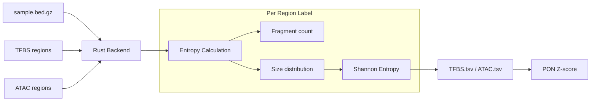

# Region Entropy (TFBS/ATAC Size Entropy)

**Command**: `krewlyzer region-entropy`

> **Plain English**: Region Entropy calculates the diversity of fragment sizes at regulatory regions.
> A high entropy value indicates many different fragment sizes; low entropy indicates uniform sizes.
>
> **Use case**: Cancer detection and subtyping - tumor cfDNA shows altered nucleosome positioning at specific regulatory elements.

> [!NOTE]
> This feature is based on **Helzer KT, et al. (2025)** "Analysis of cfDNA fragmentomics metrics and commercial targeted sequencing panels" published in *Nature Communications*.

---

## Purpose

Calculates Shannon entropy of fragment size distributions at:
- **TFBS**: Transcription Factor Binding Sites (808 factors from GTRD)
- **ATAC**: Cancer-specific ATAC-seq peaks (23 cancer types from TCGA)

These metrics enable cancer phenotyping from targeted sequencing panels without requiring whole genome sequencing.

---

## Scientific Background

### From Helzer et al. 2025

Fragmentomics-based analysis of cell-free DNA (cfDNA) has emerged as a method to infer epigenetic and transcriptional data. While many reports analyze whole genome sequencing (WGS), **targeted exon panels can be similarly employed for cancer phenotyping with minimal decrease in performance** despite their smaller genomic coverage.

The study assessed 13 fragmentomics metrics including:
- Fragment length proportions (small fragments, Shannon entropy)
- Normalized fragment read depth
- End motif diversity score (MDS)
- **TFBS entropy** - fragments overlapping transcription factor binding sites
- **ATAC entropy** - fragments overlapping cancer-specific open chromatin regions

Key findings relevant to TFBS/ATAC entropy:
- Diversity metrics like Shannon entropy measure the **spread of fragment sizes** in a region
- TFBS and ATAC entropy work well for **cancer detection and subtyping**
- These metrics can be applied to **commercial targeted sequencing panels**

### Biological Mechanism

Fragment size distributions at regulatory regions reflect **nucleosome positioning**:

- **Nucleosome-bound DNA**: ~147bp core + ~20bp linker = ~167bp
- **Open chromatin (active TF binding)**: Variable sizes due to transcription factor binding
- **Tumor alterations**: Aberrant nucleosome positioning → altered size distributions

Cancer cells exhibit:
- **Epigenetic dysregulation** → Changed TFBS accessibility
- **Altered enhancer usage** → Different ATAC peak patterns  
- **Tissue-specific signatures** → Cancer type identification

---

## Processing Flowchart



---

## Shannon Entropy Formula

$$
H = -\sum_{i} p_i \log_2(p_i)
$$

Where:
- $p_i$ = Proportion of fragments with size $i$
- High entropy = Many equally represented sizes (diverse)
- Low entropy = One dominant size (uniform)

As described in Helzer et al.: "Shannon entropy was calculated on the frequency of the fragment lengths... This yielded a single entropy value for each [TF/cancer type] in each sample."

---

## Usage

```bash
# Basic usage (computes both TFBS and ATAC)
krewlyzer region-entropy -i sample.bed.gz -o output_dir/

# TFBS only
krewlyzer region-entropy -i sample.bed.gz -o output/ --no-atac

# ATAC only with PON normalization
krewlyzer region-entropy -i sample.bed.gz -o output/ \
    --no-tfbs --pon-model healthy.pon.parquet

# Via run-all (automatic when assets available)
krewlyzer run-all -i sample.bam -r hg19.fa -o output/
```

---

## CLI Options

| Option | Short | Type | Default | Description |
|--------|-------|------|---------|-------------|
| `--input` | `-i` | PATH | *required* | Input .bed.gz file (from extract) |
| `--output` | `-o` | PATH | *required* | Output directory |
| `--sample-name` | `-s` | TEXT | | Override sample name |
| `--tfbs/--no-tfbs` | | FLAG | `--tfbs` | Enable/disable TFBS entropy |
| `--atac/--no-atac` | | FLAG | `--atac` | Enable/disable ATAC entropy |
| `--tfbs-regions` | | PATH | | Custom TFBS regions BED.gz |
| `--atac-regions` | | PATH | | Custom ATAC regions BED.gz |
| `--genome` | `-G` | TEXT | hg19 | Genome build (hg19/GRCh37/hg38/GRCh38) |
| `--gc-factors` | `-F` | PATH | | GC correction factors TSV |
| `--pon-model` | `-P` | PATH | | PON model for z-score normalization |
| `--skip-pon` | | FLAG | | Skip PON z-score normalization (for ML negatives) |
| `--target-regions` | `-T` | PATH | | Target regions BED (panel mode: generates .ontarget.tsv) |
| `--threads` | `-t` | INT | 0 | Number of threads (0 = all cores) |
| `--verbose` | `-v` | FLAG | | Enable verbose logging |

---

## Assets

### TFBS Regions

**Source**: [Gene Transcription Regulation Database (GTRD)](https://gtrd.biouml.org/) v19.10

As described in Helzer et al.: "A collection of consensus Homo sapiens TFBSs was downloaded from the Gene Transcription Regulation Database (GTRD, v19.10). For each TF, the **top 5000 sites with the greatest amount of experimental support** were used for analysis. TFs with fewer than 5000 sites were discarded, leaving a total of **808 TFs** used for the analysis."

| Genome | File | TF Count | Sites per TF |
|--------|------|----------|--------------|
| GRCh37 | `TFBS.GRCh37.bed.gz` | 808 | 5,000 |
| GRCh38 | `TFBS.GRCh38.bed.gz` | 808 | 5,000 |

**Format:**
```
chr1  10000  10500  CTCF
chr1  15000  15200  FOXA1
```

### ATAC Regions

**Source**: [TCGA ATAC-seq Pan-Cancer Atlas](https://gdc.cancer.gov/about-data/publications/ATACseq-AWG)

As described in Helzer et al.: "Consensus genomic regions from Assay for Transposase Accessible Chromatin with sequencing (ATAC-seq) data was downloaded from The Cancer Genome Atlas (TCGA) for **23 different cancer types**."

| Genome | File | Cancer Types |
|--------|------|--------------|
| GRCh37 | `ATAC.GRCh37.bed.gz` | 23 |
| GRCh38 | `ATAC.GRCh38.bed.gz` | 23 |

**Cancer Types:**
ACC, BLCA, BRCA, CESC, CHOL, COAD, ESCA, GBM, HNSC, KIRC, KIRP, LAML, LGG, LIHC, LUAD, LUSC, MESO, PCPG, PRAD, SKCM, STAD, TGCT, THCA, UCEC

**Format:**
```
chr1  10000  10500  BRCA
chr1  15000  15200  LUAD
```

**Data Source**: Region files are from [Zhao-Lab-UW-DHO/fragmentomics_metrics](https://github.com/Zhao-Lab-UW-DHO/fragmentomics_metrics/)

---

## Panel Mode (On-Target)

For targeted sequencing panels, on-target analysis only includes:
- TFBS/ATAC regions overlapping panel target regions
- On-target GC correction factors

```bash
# With target regions → generates .ontarget.tsv files
krewlyzer run-all -i sample.bam -r hg19.fa -o out/ \
    -T msk-access-v1.targets.bed
```

**Outputs:**
- `{sample}.TFBS.tsv` - All genome-wide TFBS regions
- `{sample}.TFBS.ontarget.tsv` - TFBS regions in panel targets
- `{sample}.ATAC.tsv` - All genome-wide ATAC regions
- `{sample}.ATAC.ontarget.tsv` - ATAC regions in panel targets

---

## PON Normalization

With a PON model, raw entropy is converted to Z-scores:

$$
Z = \frac{\text{entropy} - \mu_{\text{PON}}}{\sigma_{\text{PON}}}
$$

### Building PON with TFBS/ATAC

```bash
krewlyzer build-pon -i samples.txt -r hg19.fa -o healthy.pon.parquet
```

The PON model stores:
- `tfbs_baseline`: Per-TF mean/std entropy from healthy samples
- `atac_baseline`: Per-cancer-type mean/std entropy from healthy samples

### Applying PON

```bash
krewlyzer region-entropy -i sample.bed.gz -o out/ \
    -P healthy.pon.parquet
```

**Output with PON:**
```tsv
label   count   mean_size   entropy   z_score
CTCF    1234    167.2       5.23      1.45
FOXA1   892     165.8       4.98      -0.32
```

---

## Output Format

### TFBS Output: `{sample}.TFBS.tsv`

| Column | Type | Description |
|--------|------|-------------|
| `label` | TEXT | Transcription factor name (e.g., CTCF, FOXA1) |
| `count` | INT | Number of fragments overlapping TF regions |
| `mean_size` | FLOAT | Mean fragment size at these regions |
| `entropy` | FLOAT | Shannon entropy of size distribution (bits) |
| `z_score` | FLOAT | PON-normalized z-score (0 if no PON) |

### ATAC Output: `{sample}.ATAC.tsv`

| Column | Type | Description |
|--------|------|-------------|
| `label` | TEXT | Cancer type (e.g., BRCA, LUAD, COAD) |
| `count` | INT | Number of fragments overlapping cancer peaks |
| `mean_size` | FLOAT | Mean fragment size at these regions |
| `entropy` | FLOAT | Shannon entropy of size distribution (bits) |
| `z_score` | FLOAT | PON-normalized z-score (0 if no PON) |

---

## Interpretation

### Entropy Values

| Range | Interpretation | Clinical Significance |
|-------|----------------|----------------------|
| 0-2 | Very low entropy | Single dominant fragment size |
| 2-4 | Low entropy | Few distinct sizes |
| 4-6 | Moderate entropy | Normal healthy range |
| 6-8 | High entropy | Many distinct sizes |
| > 8 | Very high entropy | Possible tumor signal |

### Z-Scores

| Z-Score | Interpretation |
|---------|----------------|
| -2 to +2 | Within normal range |
| +2 to +3 | Elevated (possible cancer signal) |
| > +3 | Significantly elevated |
| < -2 | Significantly reduced |

---

## Algorithm Details

### Rust Backend (`region_entropy.rs`)

Following the methodology from Helzer et al.:

1. **Load regions**: Read BED.gz with label in 4th column
2. **Intersect fragments**: For each region, collect fragments with minimum 1bp overlap
3. **Build histograms**: Count fragments per size (20-500bp) per label
4. **Compute entropy**: Shannon entropy from normalized histogram
5. **Output**: TSV with label, count, mean_size, entropy

### Python Processing (`region_entropy_processor.py`)

1. **Load raw output**: Read Rust-generated TSV
2. **Apply PON baseline**: If model provided, compute Z-scores
3. **Write final output**: TSV with z_score column

---

## Performance

| Dataset | Regions | Time | Memory |
|---------|---------|------|--------|
| TFBS (808 TFs) | ~4M regions | ~30s | ~500MB |
| ATAC (23 types) | ~700K regions | ~20s | ~400MB |

---

## Citation

If you use this feature, please cite:

> **Helzer KT, Sharifi MN, Sperger JM, et al.** Analysis of cfDNA fragmentomics metrics and commercial targeted sequencing panels. *Nat Commun* **16**, 9122 (2025). https://doi.org/10.1038/s41467-025-64153-z

**Data source:**
- GitHub: [Zhao-Lab-UW-DHO/fragmentomics_metrics](https://github.com/Zhao-Lab-UW-DHO/fragmentomics_metrics/)

---

## See Also

- [Extract](extract.md) – Generate input .bed.gz files
- [Build PON](build-pon.md) – Create PON models with TFBS/ATAC baselines
- [OCF](ocf.md) – Related open chromatin feature
- [Citation](../citation.md#region-entropy) – All scientific references
