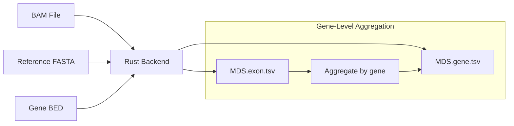

# Region MDS — Per-Exon Motif Diversity Score

**Command**: `krewlyzer region-mds`

!!! info "Plain English"
    Region MDS calculates motif diversity at each gene's exons individually.
    This reveals *where* aberrant fragmentation is occurring rather than just *if* it's happening globally.

    **Key metric**: E1 MDS - **lower E1 MDS = aberrant fragmentation at first exon = possible cancer signal**

---

## Purpose

Calculates per-region Motif Diversity Score (Shannon entropy of 4-mer end motifs) from BAM files, enabling detection of localized fragmentation patterns at individual genes.

---

## Processing Flowchart



---

## Biological Context

Based on **Helzer et al. (2025)**, cfDNA fragments show characteristic 4-mer end motif patterns that vary by genomic location. In cancer:

- E1 (first exon) near promoters shows most pronounced MDS changes
- Lower MDS indicates restricted motif usage (potentially tumor-derived)
- Per-gene analysis enables detection of specific aberrant loci

See [Citation & Scientific Background](../../resources/citation.md#region-mds) for methodology details.

---

## Usage

```bash
# Panel mode with bundled gene BED
krewlyzer region-mds sample.bam ref.fa output/ --assay xs2

# WGS mode
krewlyzer region-mds sample.bam ref.fa output/ --assay wgs

# Custom gene BED
krewlyzer region-mds sample.bam ref.fa output/ --gene-bed custom.bed
```

---

## Options

| Option | Short | Type | Default | Description |
|--------|-------|------|---------|-------------|
| `bam_input` | | PATH | *required* | Input BAM file (indexed) |
| `reference` | | PATH | *required* | Reference genome FASTA |
| `output` | | PATH | *required* | Output directory |
| `--sample-name` | `-s` | TEXT | | Override sample name (default: derived from BAM filename) |
| `--gene-bed` | `-g` | PATH | | Custom gene/exon BED file |
| `--genome` | `-G` | TEXT | hg19 | Genome build (hg19/hg38) |
| `--assay` | `-a` | TEXT | | Assay code (xs1, xs2, wgs) for bundled gene BED |
| `--e1-only` | | FLAG | | Only output E1 (first exon) results |
| `--mapq` | | INT | 20 | Minimum mapping quality |
| `--minlen` | | INT | 65 | Minimum fragment length |
| `--maxlen` | | INT | 1000 | Maximum fragment length |
| `--pon-model` | `-P` | PATH | | PON model for z-score computation |
| `--pon-variant` | | TEXT | all_unique | PON variant: `all_unique` or `duplex` |
| `--skip-pon` | | FLAG | | Skip PON z-score normalization |
| `--threads` | `-t` | INT | 0 | Number of threads (0 = all cores) |
| `--verbose` | `-v` | FLAG | | Enable verbose logging |
| `--silent` | | FLAG | | Suppress progress bar |

---

## Output Files

| File | Description |
|------|-------------|
| `{sample}.MDS.exon.tsv` | Per-exon/target MDS scores |
| `{sample}.MDS.gene.tsv` | Gene-level aggregated MDS |

### MDS.exon.tsv Columns

| Column | Description |
|--------|-------------|
| `gene` | Gene symbol |
| `name` | Exon/region name |
| `chrom` | Chromosome |
| `start` | Start position |
| `end` | End position |
| `strand` | Strand (+/-) |
| `n_fragments` | Fragment count |
| `mds` | Motif Diversity Score |

### MDS.gene.tsv Columns

| Column | Description |
|--------|-------------|
| `gene` | Gene symbol |
| `n_exons` | Number of exons |
| `n_fragments` | Total fragment count |
| `mds_mean` | Mean MDS across exons |
| `mds_e1` | MDS of first exon (E1) |
| `mds_std` | Standard deviation |
| `mds_z` | Z-score vs PON (with `--pon-model`) |
| `mds_e1_z` | E1 z-score vs PON (with `--pon-model`) |

---

## Formulas

### Motif Diversity Score (MDS)

MDS quantifies the randomness of 4-mer end motifs using Shannon entropy:

$$
\text{MDS} = -\sum_{i} p_i \times \log_2(p_i)
$$

**Variables:**
- $p_i$ = frequency of the i-th 4-mer motif (256 possible)
- Result range: ~6.0 to ~8.0 (higher = more diverse)

**Interpretation:**

| MDS Value | Meaning |
|-----------|---------|
| Higher (~7.5-8.0) | Random/diverse motifs (healthy) |
| Lower (~6.0-7.0) | Stereotyped motifs (potentially aberrant) |

---

## E1 (First Exon) Significance

The first exon of each gene is identified by genomic position and tracked separately:

1. **Promoter proximity**: E1 is closest to the promoter region
2. **Transcription start**: Contains or abuts the TSS
3. **Cancer sensitivity**: Shows most pronounced MDS changes in cancer

!!! tip
    Focus on `mds_e1` in the gene output for maximum sensitivity to promoter-proximal aberrations.

---

## PON Z-Score Normalization

When `--pon-model` is provided, z-scores enable comparison against healthy baseline:

```bash
krewlyzer region-mds sample.bam ref.fa output/ --assay xs2 \
    --pon-model healthy_cohort.pon.parquet
```

### Z-Score Formula

```
z = (observed_mds - expected_mds) / std_mds
```

### Z-Score Interpretation

| Z-Score | Meaning |
|---------|---------|
| -2 to +2 | Within normal range |
| < -2 | **Abnormally low diversity** (possible tumor) |
| > +2 | Unusually high (check data quality) |

---

## Gene BED Format

The tool supports two formats (see [Input Formats](../../reference/input-formats.md)):

### Panel Format (5 columns)
```
chr1	1000	2000	TP53	exon_01
chr1	3000	4000	TP53	exon_02
```

### WGS Format (8 columns)
```
chr1	1000	2000	ENSG00000141510	NM_000546	TP53	1	+
chr1	3000	4000	ENSG00000141510	NM_000546	TP53	2	+
```

---

## Integration with run-all

Region MDS runs automatically when `--assay` is specified:

```bash
krewlyzer run-all -i sample.bam -r ref.fa -o output/ --assay xs2 --generate-json
```

### E1-Only Mode

For promoter-focused analysis, use `--region-mds-e1-only` to process only first exons:

```bash
# Standalone
krewlyzer region-mds sample.bam ref.fa output/ --assay xs2 --e1-only

# Via run-all
krewlyzer run-all -i sample.bam -r ref.fa -o output/ --assay xs2 --region-mds-e1-only
```

!!! tip
    E1-only mode reduces processing time and output size for promoter-centric cancer detection.

See [Panel Mode](../../guides/panel-mode.md) for details on panel-specific processing.

---

## Clinical Interpretation

| Metric | Healthy | Cancer (ctDNA) |
|--------|---------|----------------|
| Gene MDS Mean | Higher (~7.5-8.0) | Lower at affected genes |
| E1 MDS | Similar to mean | **Decreased at oncogenes/TSGs** |
| Cross-gene std | Low (consistent) | Variable (heterogeneous) |

### Biological Basis

- cfDNA fragmentation reflects chromatin accessibility and nuclease activity
- Promoter-proximal regions (E1) are sensitive to transcriptional state
- Cancer-associated genes show altered fragmentation near promoters

---

## See Also

- [Citation & Scientific Background](../../resources/citation.md#region-mds) - Helzer et al. (2025)
- [Motif Extraction](motif.md) - Global MDS analysis
- [OCF](ocf.md) - Orientation-aware fragmentation
- [JSON Output](../output/json-output.md) - File format details
