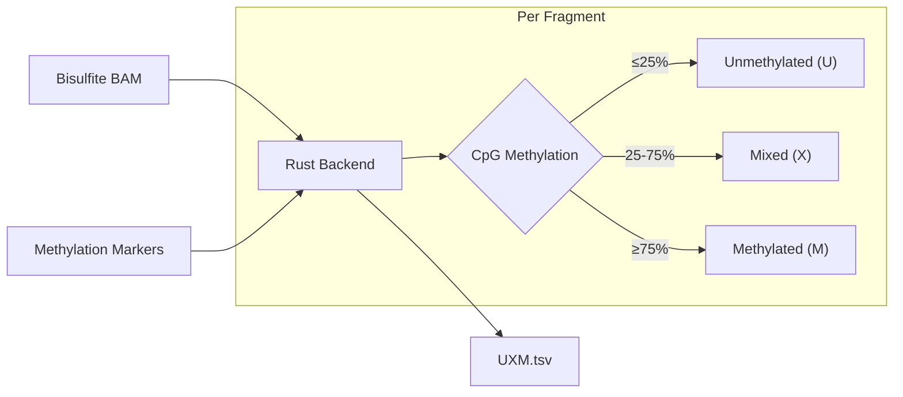

# Fragment-level Methylation (UXM)

**Command**: `krewlyzer uxm`

> **Plain English**: UXM analyzes methylation patterns to determine which cell types contributed cfDNA.
> Different tissues have unique methylation signatures—like a "fingerprint" for each cell type.
>
> **Use case**: Cell-type deconvolution - determine if cfDNA comes from liver, immune cells, tumor, etc.

---

## Purpose
Computes the proportions of Unmethylated (U), Mixed (X), and Methylated (M) fragments per genomic region for cell-type deconvolution.

---

## Processing Flowchart



---

## Biological Context

Fragment-level methylation (UXM, [Loyfer et al., 2022](../citation.md#uxm)) reveals cell-of-origin and cancer-specific methylation patterns in cfDNA. Each fragment is classified by its CpG methylation level within marker regions.

---

## Usage

```bash
# Basic usage
krewlyzer uxm -i bisulfite.bam -o output_dir/ --genome hg19

# With custom marker file
krewlyzer uxm -i bisulfite.bam -o output/ \
    --mark-input custom_markers.bed.gz

# Paired-end mode
krewlyzer uxm -i bisulfite.bam -o output/ --type PE
```

## CLI Options

| Option | Short | Type | Default | Description |
|--------|-------|------|---------|-------------|
| `--input` | `-i` | PATH | *required* | Bisulfite sequencing BAM |
| `--output` | `-o` | PATH | *required* | Output directory |
| `--sample-name` | `-s` | TEXT | | Override sample name |
| `--mark-input` | `-m` | PATH | Auto | Path to genomic marker file |
| `--type` | | TEXT | SE | Sequencing type: SE or PE |
| `--genome` | `-G` | TEXT | hg19 | Genome build (hg19/hg38) |
| `--verbose` | `-v` | FLAG | | Enable verbose logging |
| `--threads` | `-t` | INT | 0 | Number of threads (0=all) |

---

## Output Format

Output: `{sample}.UXM.tsv`

| Column | Type | Description |
|--------|------|-------------|
| `region` | str | Marker region ID |
| `U_count` | int | Unmethylated fragments |
| `X_count` | int | Mixed fragments |
| `M_count` | int | Methylated fragments |
| `total` | int | Total fragments |
| `U_frac` | float | U / total |
| `X_frac` | float | X / total |
| `M_frac` | float | M / total |

---

## Fragment Classification

```
                   CpG Methylation Level
    ├──────────────┬──────────────┬──────────────┤
    0%            25%            75%           100%
    │      U      │      X       │      M      │
    │ Unmethylated│    Mixed     │ Methylated  │
```

| Class | Threshold | Interpretation |
|-------|-----------|----------------|
| **U** | ≤25% CpGs methylated | Cell-type specific unmethylated |
| **X** | 25-75% | Heterogeneous/mosaic |
| **M** | ≥75% CpGs methylated | Stably methylated |

---

## Clinical Interpretation

### Healthy cfDNA Composition

Based on the Human Methylation Atlas:

| Cell Type | Contribution |
|-----------|--------------|
| Megakaryocytes | ~31% |
| Granulocytes | ~30% |
| Monocytes/Macrophages | ~20% |
| Endothelial | ~6% |
| Hepatocytes | ~3% |
| Lymphocytes | ~3% |

### Cancer Detection

| Pattern | Interpretation |
|---------|----------------|
| Altered tissue proportions | Tumor shifts composition |
| Non-hematopoietic increase | Possible tumor cfDNA |
| Resolution | Can detect ~0.1% tumor fractions |

---

## See Also

- [Citation](../citation.md#uxm) - Loyfer et al. paper
- [Troubleshooting](../troubleshooting.md) - Common issues
