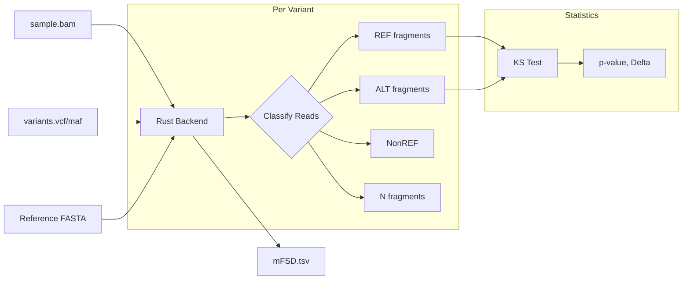
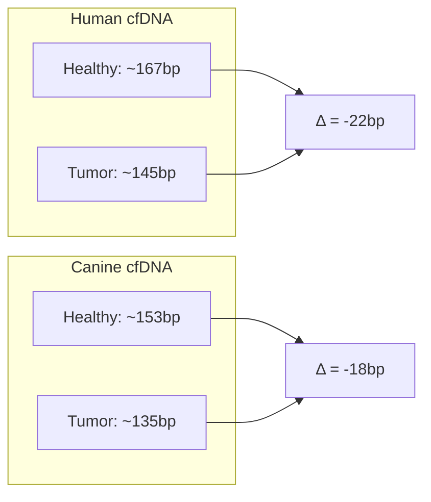
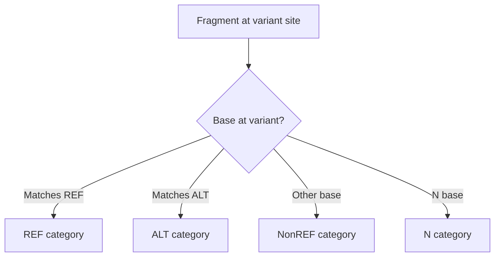

# Mutant Fragment Size Distribution (mFSD)

**Command**: `krewlyzer mfsd`

> **Plain English**: mFSD compares fragment sizes at known mutation sites.
> Fragments carrying the mutation (ALT) tend to be shorter than healthy fragments (REF).
>
> **Use case**: MRD monitoring - track tumor DNA by comparing mutant vs. wild-type fragment sizes.

---

## Purpose
Compares the size distribution of mutant vs. wild-type fragments at variant sites, with support for all small variant types and 4-way fragment classification.

---

## Processing Flowchart



---

## Biological Context

Mutant ctDNA fragments are typically **shorter** (~145bp) than wild-type cfDNA (~166bp) due to:
- Altered nucleosome positioning in tumor cells
- Different chromatin accessibility
- Enhanced apoptosis patterns

This module quantifies this difference using high-depth targeted sequencing data.

---

## Variant Types Supported

| Type | Example | Description |
|------|---------|-------------|
| **SNV** | A>T | Single nucleotide variant |
| **MNV** | AT>GC | Multi-nucleotide variant |
| **Insertion** | A>ATG | Pure insertion |
| **Deletion** | ATG>A | Pure deletion |
| **Complex** | ATG>CT | Mixed substitution + indel |

---

## Usage

```bash
# Basic usage with VCF
krewlyzer mfsd -i sample.bam -V variants.vcf -o output_dir/

# With MAF file and GC correction
krewlyzer mfsd -i sample.bam -V variants.maf -o output/ \
    -r hg19.fa --correction-factors factors.tsv

# With per-variant distributions
krewlyzer mfsd -i sample.bam -V variants.vcf -o output/ \
    --output-distributions
```

---

## Dual BAM Support

For optimal results with duplex sequencing panels (e.g., MSK-ACCESS), use separate BAMs:

| BAM Type | Use Case | Why |
|----------|----------|-----|
| `all_unique` | FSC, FSD, WPS, OCF | Maximum coverage for background features |
| `duplex` | mFSD | Highest accuracy for variant detection |

### Via run-all CLI

```bash
# Provide dedicated duplex BAM for mFSD
krewlyzer run-all -i sample.all_unique.bam --mfsd-bam sample.duplex.bam \
    -r hg19.fa -o out/ --assay xs2 --variants sample.maf
```

!!! note
    When `--mfsd-bam` is provided, duplex weighting is **auto-enabled**.
    If no duplex tags (cD/Marianas) are found, a warning is logged but processing continues with weight=1.0.

### Via Nextflow Samplesheet

```csv
sample,bam,mfsd_bam,meth_bam,vcf,bed,maf,single_sample_maf,assay,pon,targets
ACCESS_001,/path/to/sample.all_unique.bam,/path/to/sample.duplex.bam,,,/path/to/variants.maf,true,XS2,,
```

---

## CLI Options

| Option | Short | Type | Default | Description |
|--------|-------|------|---------|-------------|
| `--input` | `-i` | PATH | *required* | Input BAM file |
| `--variants` | `-V` | PATH | *required* | VCF or MAF file with variants |
| `--output` | `-o` | PATH | *required* | Output directory |
| `--sample-name` | `-s` | TEXT | | Override sample name |
| `--reference` | `-r` | PATH | | Reference FASTA for GC correction |
| `--correction-factors` | `-F` | PATH | | Pre-computed correction factors CSV |
| `--duplex` | `-D` | FLAG | | Enable duplex consensus weighting (fgbio/Marianas) |
| `--mapq` | `-q` | INT | 20 | Minimum mapping quality |
| `--minlen` | | INT | 65 | Minimum fragment length |
| `--maxlen` | | INT | 1000 | Maximum fragment length |
| `--skip-duplicates` | | FLAG | True | Skip duplicate reads (always enabled in backend) |
| `--require-proper-pair` | | FLAG | False | Require proper pairs (disable for duplex BAMs) |
| `--output-distributions` | `-d` | FLAG | | Output per-variant size distributions |
| `--verbose` | `-v` | FLAG | | Enable verbose logging |
| `--threads` | `-t` | INT | 0 | Number of threads (0=all) |

---

!!! note "Base Quality Filtering"
    Base quality filtering (`--min-baseq`) is available when mFSD is invoked via `krewlyzer run-all --min-baseq <N>`.
    The standalone `krewlyzer mfsd` command does not expose this flag directly.

---

## Duplex Sequencing Support

mFSD supports **duplex consensus sequencing** for ultra-sensitive variant detection. When `--duplex` is enabled, fragments from high-confidence duplex families receive higher weight in statistical calculations.

### Supported Duplex Formats

#### XS2: fgbio/Picard

Uses SAM auxiliary tags set by [fgbio CallDuplexConsensusReads](https://fulcrumgenomics.github.io/fgbio/tools/latest/CallDuplexConsensusReads.html):

| Tag | Meaning | Use in mFSD |
|-----|---------|-------------|
| `aD` | Max depth of strand A single-strand consensus | SS-A depth |
| `bD` | Max depth of strand B single-strand consensus | SS-B depth |
| `cD` | **Max depth of duplex consensus** | **Primary weight source** |
| `aM/bM/cM` | Min depth at any point | Quality check |
| `aE/bE/cE` | Error rate | Quality filter |

**Example SAM record:**
```
read1   0   chr1   1000   60   100M   *   0   150   ACGT...   IIII...   cD:i:5   aD:i:8   bD:i:7
```

#### XS1: Marianas

Encodes family size in the read name per [Marianas documentation](https://cmo-ci.gitbook.io/marianas/read-name-information):

```
Marianas:UMI1+UMI2:contig:start:posCount:negCount:contig2:start2:pos2:neg2
```

| Position | Field | Example |
|----------|-------|---------|
| 0 | `Marianas` | Marianas |
| 1 | UMI | ACT+TTA |
| 2 | Read1 contig | 2 |
| 3 | Read1 start | 48033828 |
| 4 | Read1 (+) count | 4 |
| 5 | Read1 (-) count | 3 |

**Family size = posCount + negCount** (e.g., 4 + 3 = 7)

### Duplex Weighting Formula

When `--duplex` is enabled, each fragment receives a weight based on its duplex family size:

$$
\text{weight} = \max(\ln(\text{family_size}), 1.0)
$$

| Family Size | Weight | Interpretation |
|-------------|--------|----------------|
| 1 | 1.0 | Single read (no UMI collapse) |
| 2 | 1.0 | Minimum duplex (capped) |
| 3 | 1.1 | Low-confidence duplex |
| 5 | 1.6 | Moderate confidence |
| 10 | 2.3 | High confidence |
| 50 | 3.9 | Very high confidence |

### Interpretation in Duplex Mode

!!! important
    When `--duplex` is enabled, `ALT_Weighted` and `REF_Weighted` will exceed raw counts.
    A ratio of **~1.6x** indicates typical duplex family sizes of 3-5.

| Column | Without Duplex | With Duplex |
|--------|----------------|-------------|
| `ALT_Count` | Raw fragment count | Raw fragment count |
| `ALT_Weighted` | = ALT_Count | = Σ(weight × fragment) |
| `VAF_GC_Corrected` | Based on raw | Based on weighted counts |

**Example:**
```
Variant at chr1:156845927
  ALT_Count    = 393
  ALT_Weighted = 691  (ratio = 1.76)
  → Indicates high-confidence duplex families
```

---

## Log-Likelihood Ratio (LLR) Scoring

For **low fragment count scenarios** (common in duplex/panel sequencing), traditional KS tests are unreliable. mFSD provides LLR scoring as a probabilistic alternative.

### LLR Formula

$$
\text{LLR} = \sum_{i=1}^{n} \left[ \log P(\text{size}_i | \text{Tumor}) - \log P(\text{size}_i | \text{Healthy}) \right]
$$

Using Gaussian models:
- **Healthy**: μ = 167bp, σ = 35bp (nucleosomal periodicity)
- **Tumor**: μ = 145bp, σ = 25bp (sub-nucleosomal fragments)

### LLR Output Columns

| Column | Range | Interpretation |
|--------|-------|----------------|
| `ALT_LLR` | any | Log-likelihood ratio for ALT fragments |
| `REF_LLR` | any | Log-likelihood ratio for REF fragments |

### LLR Interpretation Guide

| LLR Value | Interpretation | Action |
|-----------|----------------|--------|
| **> 5** | Strong tumor signal | High confidence in tumor-derived fragments |
| **0 to 5** | Weak tumor signal | Possible tumor, verify with other evidence |
| **-5 to 0** | Weak healthy signal | Likely healthy, low tumor content |
| **< -5** | Strong healthy signal | Consistent with healthy cfDNA |

!!! tip
    For low-N variants (ALT_Count < 5), use `ALT_LLR` instead of `KS_Pval_ALT_REF`.
    The LLR is robust with even 1-2 fragments, while KS tests require ≥5.

### Clinical Example: MRD Detection

```
Variant at TP53:chr17:7577539
  ALT_Count = 3           # Too few for KS test
  KS_Valid  = FALSE       # KS test unreliable
  ALT_LLR   = 4.2         # Positive = tumor-like fragments
  REF_LLR   = -89.5       # Negative = healthy-like REF population
  
  → Interpretation: ALT fragments show tumor signature despite low count
```

---

## Cross-Species and Assay Support

The LLR model uses Gaussian distributions for healthy and tumor fragment length peaks. These parameters can be customized for different species or library preparations.

### Built-in Presets

| Preset | Healthy μ | Healthy σ | Tumor μ | Tumor σ | Use Case |
|--------|-----------|-----------|---------|---------|----------|
| **human** (default) | 167bp | 35bp | 145bp | 25bp | Human cfDNA |
| **canine** | 153bp | 30bp | 135bp | 22bp | Canine cfDNA |
| **ssdna** | 160bp | 40bp | 140bp | 30bp | Single-stranded library prep |

### Biological Rationale

Fragment length peaks vary across species due to:
- **Nucleosome spacing differences** - Canine nucleosomes are more tightly packed
- **Chromatin structure** - Different histone modifications
- **Library preparation** - ssDNA preps capture shorter fragments



### Python API Access

```python
from krewlyzer._core import LLRModelParams

# Use built-in presets
human_params = LLRModelParams.human()
canine_params = LLRModelParams.canine()
ssdna_params = LLRModelParams.ssdna()

# Custom parameters
custom = LLRModelParams(
    healthy_mu=160.0,
    healthy_sigma=32.0,
    tumor_mu=140.0,
    tumor_sigma=20.0
)
```

!!! note
    CLI support for preset selection is planned for a future release.
    Currently, the Rust backend defaults to human parameters.

---


## Fragment Classification

Fragments are classified into 4 categories:



| Category | Description | Interpretation |
|----------|-------------|----------------|
| **REF** | Supports reference allele | Healthy cfDNA |
| **ALT** | Supports alternate allele | Tumor signal |
| **NonREF** | Other base (not REF/ALT/N) | Sequencing errors |
| **N** | Contains N at variant | Low quality |

---

## Formulas

### KS Test (Kolmogorov-Smirnov)

$$
\text{KS statistic} = \max |F_1(x) - F_2(x)|
$$

Where:
- $F_1(x)$ = CDF of ALT fragment sizes
- $F_2(x)$ = CDF of REF fragment sizes

### Size Delta

$$
\Delta_{\text{ALT-REF}} = \text{ALT_MeanSize} - \text{REF_MeanSize}
$$

**Expected:**
- Healthy: $\approx 0$
- Cancer: $< 0$ (ALT shorter)

### VAF Proxy

$$
\text{VAF_Proxy} = \frac{\text{ALT_Count}}{\text{REF_Count} + \text{ALT_Count}}
$$

---

## Output Format

### Main Output: `{sample}.mFSD.tsv`

| Column Group | Columns | Description |
|--------------|---------|-------------|
| **Variant Info** (5) | `Chrom`, `Pos`, `Ref`, `Alt`, `VarType` | Variant coordinates and type |
| **Raw Counts** (5) | `REF_Count`, `ALT_Count`, `NonREF_Count`, `N_Count`, `Total_Count` | Fragment counts per allele class |
| **GC-Weighted Counts** (5) | `REF_Weighted`, `ALT_Weighted`, `NonREF_Weighted`, `N_Weighted`, `VAF_GC_Corrected` | GC-bias corrected counts and VAF |
| **Log-Likelihood Ratio** (2) | `ALT_LLR`, `REF_LLR` | Log-likelihood ratios (useful for low-N duplex variants where KS unreliable) |
| **Mean Sizes** (4) | `REF_MeanSize`, `ALT_MeanSize`, `NonREF_MeanSize`, `N_MeanSize` | Mean fragment size per allele class |
| **KS Tests** (18) | `Delta_*/KS_*/KS_Pval_*` × 6 allele pairings | Kolmogorov–Smirnov distance + p-value for: ALT-REF, ALT-NonREF, REF-NonREF, ALT-N, REF-N, NonREF-N |
| **Derived** (5) | `VAF_Proxy`, `Error_Rate`, `N_Rate`, `Size_Ratio`, `Quality_Score` | Computed summary biomarkers |
| **Flags** (2) | `ALT_Confidence`, `KS_Valid` | Quality indicators (`HIGH`/`LOW`/`NONE`; TRUE/FALSE) |

### Optional: `{sample}.mFSD.distributions.tsv`

With `--output-distributions`:
```tsv
Chrom  Pos    Ref  Alt  Category  Size  Count
chr1   12345  A    T    REF       145   3
chr1   12345  A    T    REF       166   12
chr1   12345  A    T    ALT       142   2
```

---

## Clinical Interpretation

| Metric | Healthy | Cancer (ctDNA) |
|--------|---------|----------------|
| `Delta_ALT_REF` | ~0 | **Negative** (ALT shorter) |
| `Size_Ratio` | ~1.0 | **< 1.0** |
| `VAF_Proxy` | 0 | > 0 (correlates with TF) |

### MRD Settings
- Low fragment counts (1-2) produce `NA`
- `ALT_Confidence`: HIGH (≥5), LOW (1-4), NONE (0)
- `KS_Valid`: TRUE if REF and ALT ≥2 fragments each

---

## See Also

- [PON Models](../../reference/pon-models.md) – GC correction factors
- [Citation](../../resources/citation.md#mfsd) – Scientific references
