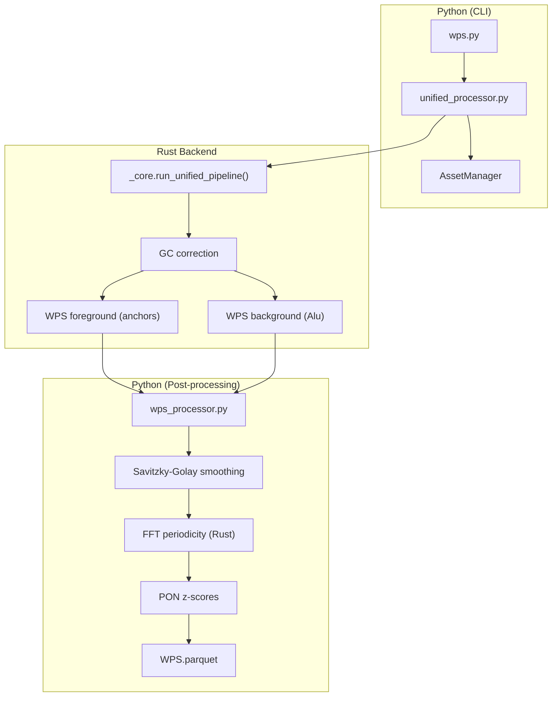

# Windowed Protection Score (WPS)

**Command**: `krewlyzer wps`

> **Plain English**: WPS measures how well nucleosomes protect DNA from cutting.
> Healthy cfDNA shows a regular ~190bp spacing pattern.
> Cancer disrupts this pattern - **lower `nrl_quality` = more tumor burden**.
>
> **Quick metric**: `nrl_quality > 0.7` = healthy, `< 0.5` = potentially abnormal

---

## Purpose
Computes ML-ready nucleosome and transcription factor protection profiles from cfDNA fragments around genomic anchors (TSS, CTCF sites) and global chromatin metrics from Alu elements.

---

## Biological Context

### What is WPS?

When DNA wraps around a nucleosome, the histone core **protects** ~147bp from enzymatic digestion. In cfDNA, fragments that span a nucleosome are "protected" (whole), while fragments that end at nucleosome boundaries are "fragmented" (cut).

**WPS Formula:**

$$
\text{WPS} = \text{Fragments}_{\text{spanning}} - \text{Fragments}_{\text{ending}}
$$

| WPS Value | Meaning | Biological Interpretation |
|-----------|---------|---------------------------|
| **Positive** | Protected | Nucleosome present (stable chromatin) |
| **Zero** | Balanced | Transition zone |
| **Negative** | Fragmented | Open chromatin (accessible DNA) |

### Dual-Stream Processing

Krewlyzer separates fragments into two biological signals:

| Stream | Window | Fragment Size | Weight | Biological Signal |
|--------|--------|---------------|--------|-------------------|
| **WPS-Nuc** | 120bp | [160-175bp] | 1.0 (primary) | **Nucleosome positioning** |
| | | [120-159] ∪ [176-180bp] | 0.5 (secondary) | Flanking nucleosomes |
| **WPS-TF** | 16bp | [35-80bp] | 1.0 | **Transcription factor footprints** |

The tiered weights for nucleosome fragments prioritize "perfect" mono-nucleosome sizes (~167bp) over edge cases.

### Python/Rust Architecture



---

## Foreground vs Background

WPS generates **two complementary outputs** that capture different biological scales:

### Foreground (`sample.WPS.parquet`)

**What it is**: High-resolution WPS profiles around specific genomic anchors (TSS, CTCF sites).

**Why it matters**: Gene promoters and CTCF sites have characteristic nucleosome patterns:
- **Active promoters**: Nucleosome-depleted region (NDR) upstream of TSS
- **Silent promoters**: Packed nucleosomes across TSS
- **CTCF sites**: Sharp nucleosome boundaries (insulator function)

**ML use**: These 200-bin vectors are gene-specific signatures. Comparing them across cancer types reveals tissue-of-origin and tumor-specific disruptions.

```
                          TSS
                           |
    ←───── -1kb ─────      ↓      ───── +1kb ─────→
    [bin 0] ... [bin 99] [100] [bin 101] ... [bin 199]
```

### Background (`sample.WPS_background.parquet`)

**What it is**: Stacked WPS profiles from ~770,000 Alu elements across the genome.

**Why Alu elements?**

1. **Ubiquitous**: Alu elements are everywhere (~11% of human genome)
2. **Consistent size**: ~300bp (perfect for 2-nucleosome periodicity)
3. **No gene bias**: Not restricted to specific genes or pathways
4. **Robust signal**: Stacking 770K elements averages out noise

**What it measures**: When you stack all Alu WPS profiles, a **periodic wave** emerges at ~190bp (nucleosome repeat length). This periodicity reflects **global chromatin health**:

| Periodicity | Meaning | Cancer Implication |
|-------------|---------|-------------------|
| **Strong (~190bp)** | Regular nucleosome spacing | Healthy chromatin |
| **Weak/disrupted** | Irregular chromatin | Tumor burden, genomic instability |

**Hierarchical Groups**:
- `Global_All`: All Alu (highest SNR, best for QC)
- `Family_AluY/S/J`: Subfamily ages (~15M / ~35M / ~65M years)
- `Chr1_All` ... `ChrY_All`: Per-chromosome (CNV context)

---

## Post-Processing: Smoothing and FFT

### Savitzky-Golay Smoothing

**Purpose**: Reduce high-frequency noise while preserving peak shapes.

**How it works**: Fits a polynomial (order=3) to sliding windows (size=11) and uses the fitted value. Unlike moving average, it preserves peak heights and widths.

| Column | Description |
|--------|-------------|
| `wps_nuc_smooth` | Smoothed nucleosome profile |
| `wps_tf_smooth` | Smoothed TF profile |

**When to use**: Always use smoothed columns for visualization. Raw columns for debugging.

### FFT Periodicity Extraction

**Purpose**: Quantify the ~190bp nucleosome repeat length (NRL) from Alu stacking.

**How it works**:
1. **Detrend**: Remove linear trends from stacked profile
2. **Normalize**: Z-score to make amplitude comparable across samples
3. **Window**: Apply Hann window to reduce spectral leakage
4. **FFT**: Find dominant frequency in 150-250bp range
5. **SNR**: Compare peak amplitude to background

| Column | Description |
|--------|-------------|
| `nrl_period_bp` | Detected nucleosome repeat length |
| `nrl_amplitude` | FFT amplitude at dominant frequency |
| `nrl_snr` | Signal-to-noise ratio (peak vs background) |
| `nrl_quality` | 0-1 quality score (SNR/3, capped) |

**Expected values**:
- Healthy samples: NRL ~190bp, quality > 0.7
- Cancer samples: NRL shifted, quality < 0.5

---

## Usage

```bash
# Basic (auto-loads bundled assets)
krewlyzer wps -i sample.bed.gz -o output/ --genome hg38

# With explicit background override
krewlyzer wps -i sample.bed.gz -o output/ --background custom_alu.bed.gz

# Panel data (MSK-ACCESS)
krewlyzer wps -i sample.bed.gz -o output/ --target-regions msk_access_baits.bed --bait-padding 20

# Panel data with panel-specific anchors (recommended for MSK-ACCESS)
krewlyzer wps -i sample.bed.gz -o output/ \
    --wps-anchors /path/to/xs2.wps_anchors.bed.gz \
    --target-regions msk_access_baits.bed
```

### Panel-Specific WPS Anchors

For targeted panels like MSK-ACCESS, genome-wide WPS anchors include many regions with no coverage. Use **panel-specific anchors** for focused analysis:

| Assay | Bundled File | Anchors | Genes |
|-------|--------------|:-------:|:-----:|
| MSK-ACCESS v1 | `xs1.wps_anchors.bed.gz` | 1,611 | 128 |
| MSK-ACCESS v2 | `xs2.wps_anchors.bed.gz` | 1,820 | 146 |

**What's included:**
- **TSS anchors** for genes in the panel
- **CTCF anchors** within 100kb of panel genes

**Benefits:**
- Reduced noise from off-target regions
- Faster processing
- More interpretable ML features

## CLI Options

| Option | Short | Description |
|--------|-------|-------------|
| `--input` | `-i` | Input .bed.gz file (required) |
| `--output` | `-o` | Output directory (required) |
| `--sample-name` | `-s` | Override sample name |
| `--wps-anchors` | | WPS anchors BED (TSS+CTCF), auto-loaded if not specified |
| `--background` | `-B` | Background Alu BED for hierarchical stacking, auto-loaded if not specified |
| `--target-regions` | `-T` | Panel capture BED (enables bait edge masking) |
| `--skip-target-regions` | | Force WGS mode (ignore bundled targets from --assay) |
| `--bait-padding` | | Bait edge padding in bp (default: 50, see below) |
| `--genome` | `-G` | Genome build: hg19/hg38 (default: hg19) |
| `--pon-model` | `-P` | PON model for z-score computation |
| `--gc-correct` | | Apply GC bias correction (default: enabled) |
| `--threads` | `-t` | Number of threads (0=all cores) |
| `--format` | `-f` | Output format: tsv, parquet, json |
| `--verbose` | `-v` | Enable verbose logging |

### Bait Padding Trade-Off

The `--bait-padding` option controls how many bp to trim from bait edges to avoid capture artifacts.

| Value | Effect | Best For |
|-------|--------|----------|
| **50** (default) | Maximum artifact removal | WGS, large targets (>200bp) |
| **15-20** | Preserves data in small exons | Dense exon panels (MSK-ACCESS) |
| **0** | No trimming (not recommended) | Debugging only |

**Adaptive Safety**: The tool automatically reduces padding for small targets:
```
effective_trim = min(user_trim, target_length / 4)
```
This ensures you never mask more than 50% of a small exon (25% per side).

---

## Dual WPS Output (with `--assay`)

When using `--assay` (e.g., for MSK-ACCESS), Krewlyzer generates **two** WPS output files:

```bash
krewlyzer wps -i sample.bed.gz -o output/ --assay xs2
```

### Output Files

| File | Anchors | Purpose |
|------|---------|---------|
| `{sample}.WPS.parquet` | Genome-wide (~15k) | Global cancer detection signature |
| `{sample}.WPS.panel.parquet` | Panel genes (~2k) | Targeted gene-level profiling |

### Why Dual Output?

| Scenario | Use |
|----------|-----|
| **Pan-cancer detection** | Use `WPS.parquet` (genome-wide) |
| **Specific gene analysis** | Use `WPS.panel.parquet` (focused) |
| **Feature vectors for ML** | Combine both via [JSON output](json-output.md) |

### How It Works

1. **First pass**: Genome-wide anchors (TSS+CTCF for ~5,000 genes)
2. **Second pass**: Panel-specific anchors (genes in your assay)

Both use the same pre-computed GC correction factors for consistency.

## Output Files

### Foreground: `sample.WPS.parquet`

Per-region profiles centered on TSS/CTCF anchors (±1kb, 200 bins × 10bp).

| Column | Type | Description |
|--------|------|-------------|
| `region_id` | string | Anchor identifier |
| `chrom` | string | Chromosome |
| `center` | int64 | Anchor center position |
| `strand` | string | +/- strand |
| `region_type` | string | TSS/CTCF |
| `wps_nuc` | float32[200] | Nucleosome WPS profile |
| `wps_tf` | float32[200] | TF WPS profile |
| `wps_nuc_smooth` | float32[200] | Savitzky-Golay smoothed |
| `wps_tf_smooth` | float32[200] | Savitzky-Golay smoothed |
| `prot_frac_nuc` | float32[200] | Protection fraction (nuc) |
| `prot_frac_tf` | float32[200] | Protection fraction (TF) |
| `capture_mask` | uint8[200] | Panel mask (1=reliable, 0=edge/off-target) |
| `local_depth` | float32 | Local fragment coverage |

> **Strand Correction**: All profiles are strand-corrected.
> - Genes on `+` strand are stored 5' → 3'
> - Genes on `-` strand are **reversed** so they are also 5' → 3'
> - **Result**: Bin 100 is always the TSS, and Bin 110 is always "+100bp downstream", regardless of gene orientation.

### Background: `sample.WPS_background.parquet`

Hierarchical stacking of ~770K Alu elements into 29 groups.

| Column | Type | Description |
|--------|------|-------------|
| `group_id` | string | Group name (e.g., Global_All, Chr1_H, AluJb) |
| `stacked_wps_nuc` | float32[30] | Stacked nucleosome profile (200 bins) |
| `stacked_wps_tf` | float32[30] | Stacked TF profile |
| `stacked_wps_nuc_smooth` | float32[30] | Savitzky-Golay smoothed profile |
| `alu_count` | int64 | Number of Alu elements in group |
| `nrl_bp` | float32 | Nucleosome Repeat Length in bp (expected ~190bp) |
| `nrl_deviation_bp` | float32 | **NEW**: Absolute deviation from expected 190bp |
| `periodicity_score` | float32 | Raw SNR-based quality score (0-1) |
| `adjusted_score` | float32 | **NEW**: periodicity_score × deviation_penalty |

> **NRL Deviation Scoring**: The `adjusted_score` penalizes samples with abnormal NRL values.
> A sample with strong periodicity but wrong NRL (e.g., 170bp instead of 190bp) will have lower `adjusted_score`.

$$
\text{adjusted\_score} = \text{periodicity\_score} \times \max\left(0, 1 - \frac{|\text{nrl\_bp} - 190|}{50}\right)
$$

---

## WGS vs Panel Data (MSK-ACCESS)

| Aspect | WGS | Panel (MSK-ACCESS) |
|--------|-----|-------------------|
| **Foreground coverage** | All regions | Sparse off-target |
| **capture_mask** | All 1s | 1=on-target, 0=off-target |
| **Background Alu** | Full stacking | **Still works!** (Alu is global) |
| **Best ML features** | Gene-specific vectors | Global periodicity metrics |

**Key insight**: Background Alu stacking works for panels because Alu elements are genome-wide, not restricted to capture regions.

---

## ML Feature Summary

### From Foreground
- Gene-specific nucleosome disruption patterns
- TF binding footprints at promoters
- Tissue-of-origin signatures

### From Background
- **Global tumor burden**: Loss of periodicity correlates with tumor fraction
- **Subfamily ratios**: `Family_AluY / Family_AluJ` → Tissue context
- **Per-chromosome**: Chromatin disruption → CNV context

---

## References

> Snyder et al. (2016). Cell-free DNA comprises an in vivo nucleosome footprint that informs its tissues-of-origin. *Cell*, 164(1-2), 57-68.

## See Also

- [Input File Formats](../advanced/input-formats.md#wps-anchors) - WPS anchors BED6 format for `--wps-anchors`
- [PON Models](../advanced/pon.md) - Building and using PON
- [Troubleshooting](../troubleshooting.md) - Common issues
