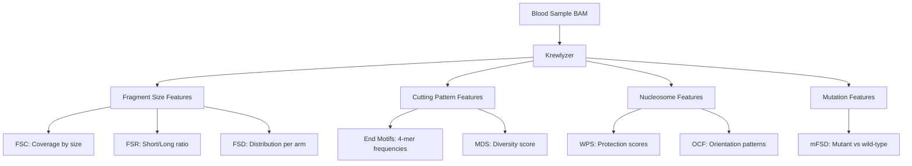

# What is Cell-Free DNA?

> **New to liquid biopsy?** This page explains the biological foundation of cfDNA analysis.
> Already familiar? Skip to [Getting Started](quickstart.md).

---

## The Liquid Biopsy Revolution

When cells in your body die—whether from normal turnover, injury, or disease—they release tiny pieces of their DNA into the bloodstream. These fragments, called **cell-free DNA (cfDNA)**, circulate briefly before being cleared by the liver and kidneys.

Here's the breakthrough: **cfDNA carries information about its source tissue**.

For cancer patients, this means tumor DNA fragments (called **ctDNA** - circulating tumor DNA) mix with healthy cfDNA in the blood. By analyzing a simple blood draw, we can:

- Detect cancer without a tissue biopsy
- Monitor treatment response in real-time
- Catch cancer recurrence earlier than imaging
- Identify the tissue of origin for cancers of unknown primary

```
     ┌─────────────────────────────────────────────────────┐
     │                    Blood Sample                     │
     │  ┌───────────────────────────────────────────────┐  │
     │  │  cfDNA Pool                                   │  │
     │  │                                               │  │
     │  │  ~~~~  Normal cell DNA (~95-99%)             │  │
     │  │  ▓▓▓▓  Tumor DNA (ctDNA, ~1-5%)              │  │
     │  │                                               │  │
     │  └───────────────────────────────────────────────┘  │
     └─────────────────────────────────────────────────────┘
```

---

## Why Fragment Sizes Matter

This is where it gets interesting. Cancer cells don't just release different DNA sequences—they release **differently-sized fragments**.

### The Nucleosome Connection

DNA in your cells isn't floating freely—it's wrapped around protein spools called **nucleosomes**. Each nucleosome protects about 147 base pairs (bp) of DNA. When cells die, enzymes cut the DNA between nucleosomes, creating fragments.

```
                          Nucleosome (~147bp protected)
                          ┌──────────────────────┐
     ═══════════════════════════════════════════════════════
                 ▲                            ▲
                 │                            │
              Cut here                     Cut here
              (linker DNA)                (linker DNA)
```

**The result**: Most cfDNA fragments are ~166bp long (147bp nucleosome + ~20bp linker DNA).

### Cancer Changes the Pattern

Tumor cells have abnormal chromatin (DNA packaging). This leads to:

| Characteristic | Healthy cfDNA | Tumor cfDNA (ctDNA) |
|---------------|---------------|---------------------|
| **Dominant size** | ~166bp | ~145bp (shorter!) |
| **Size distribution** | Sharp peak | Broader, left-shifted |
| **10bp periodicity** | Strong (DNA helix twist) | Often disrupted |
| **Nucleosome pattern** | Regular spacing | Irregular |

**Key insight**: By measuring the ratio of short fragments (tumor-enriched) to long fragments (healthy-enriched), we can estimate tumor burden.

---

## What Krewlyzer Extracts

Krewlyzer analyzes cfDNA sequencing data to extract **fragmentomics features**—numerical signatures that capture these biological patterns.

### The Feature Categories



### What Each Feature Tells You

| Feature | What It Measures | Clinical Application |
|---------|------------------|---------------------|
| **FSR** | Short vs long fragment ratio | **Tumor burden estimation** |
| **FSD** | Size distribution per chromosome arm | Copy number changes, aneuploidy |
| **WPS** | Nucleosome protection patterns | Tissue of origin, gene regulation |
| **OCF** | Fragment orientation at open chromatin | Tissue-specific cfDNA detection |
| **MDS** | Diversity of fragment end sequences | Chromatin accessibility changes |
| **mFSD** | Fragment sizes at known mutations | MRD monitoring, variant tracking |

---

## A Real-World Example

Let's walk through what happens when you analyze a cancer patient's blood:

### 1. Input: Sequenced Blood Sample
You have a BAM file from sequencing cfDNA extracted from a blood draw.

### 2. Run Krewlyzer
```bash
krewlyzer run-all -i patient_blood.bam -r hg19.fa -o results/
```

### 3. Examine Key Outputs

**FSR (Fragment Size Ratio):**
```
region              core_short_count  long_count  core_short_long_ratio
chr1:0-5000000      12,450           8,200       1.52
chr1:5000000-10M    11,890           7,950       1.50
...
```

A `core_short_long_ratio` of **1.5** (vs. ~0.9 in healthy samples) suggests elevated tumor burden.

**FSD (Fragment Size Distribution):**
The size histogram shows a left-shifted peak at ~148bp instead of the healthy ~166bp.

**WPS (Windowed Protection Score):**
Disrupted periodicity at ~190bp suggests abnormal nucleosome spacing—a hallmark of cancer.

---

## Who Uses Krewlyzer?

| User Type | Use Case |
|-----------|----------|
| **Cancer researchers** | Studying tumor evolution, treatment resistance |
| **Clinical lab developers** | Building liquid biopsy diagnostic assays |
| **Bioinformaticians** | Creating ML models for early cancer detection |
| **Pharmaceutical teams** | Monitoring drug response in clinical trials |
| **Translational scientists** | Connecting fragmentomics to biology |

---

## Next Steps

Ready to start analyzing your data?

1. **[Installation](installation.md)** - Get Krewlyzer running
2. **[Getting Started](quickstart.md)** - Your first analysis in 5 minutes
3. **[Glossary](../reference/glossary.md)** - Terminology reference
4. **[Features Overview](../features/index.md)** - Detailed feature documentation

---

## Further Reading

### Key Papers

- **DELFI (2019)**: [Cristiano et al., Nature](https://doi.org/10.1038/s41586-019-1272-6) - Genome-wide fragment analysis for cancer detection
- **Nucleosome Footprinting (2016)**: [Snyder et al., Cell](https://doi.org/10.1016/j.cell.2015.11.050) - WPS and tissue-of-origin
- **OCF (2019)**: [Sun et al., Genome Research](https://doi.org/10.1101/gr.239616.118) - Orientation-aware fragmentation

See [Citation & Scientific Background](../resources/citation.md) for complete references.
