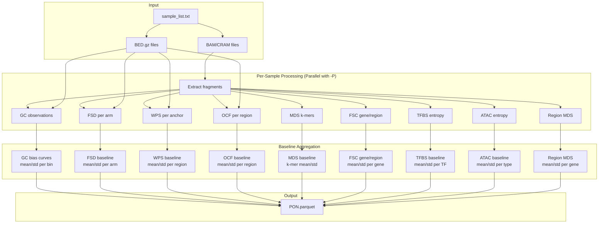

# build-pon

Build a unified Panel of Normals (PON) model from healthy plasma samples.

## Synopsis

```bash
krewlyzer build-pon SAMPLE_LIST --assay NAME -r REFERENCE -o OUTPUT [OPTIONS]
```

## Description

Creates a PON model containing all baselines needed for cfDNA analysis from a cohort of healthy samples:

- **GC Bias Model** - For coverage correction
- **FSD Baseline** - Fragment size distributions per arm
- **WPS Baseline** - Nucleosome protection per region
- **OCF Baseline** - Open chromatin footprinting per region
- **MDS Baseline** - Motif diversity and k-mer frequencies
- **TFBS Baseline** - Transcription factor binding site entropy (808 TFs)
- **ATAC Baseline** - ATAC-seq peak entropy (23 cancer types)

This model is used for bias correction and z-score normalization during sample processing.

## Arguments

| Argument | Description |
|----------|-------------|
| `SAMPLE_LIST` | Text file with paths to BAM or BED.gz files (one per line) |

## Required Options

| Option | Description |
|--------|-------------|
| `-a, --assay` | Assay name (e.g., `msk-access-v2`) |
| `-r, --reference` | Reference FASTA file (indexed) |
| `-o, --output` | Output PON model file (`.pon.parquet`) |

## Optional Parameters

| Option | Default | Description |
|--------|---------|-------------|
| `-G, --genome` | hg19 | Genome build (hg19/GRCh37/hg38/GRCh38) |
| `-T, --target-regions` | None | BED file with target regions (panel mode) |
| `--skip-target-regions` | False | Force WGS mode (ignore bundled targets from --assay) |
| `-W, --wps-anchors` | Built-in | WPS anchors BED.gz (merged TSS+CTCF) |
| `-b, --bin-file` | Built-in | Bin file for FSC/FSR |
| `--temp-dir` | System temp | Directory for temporary files |
| `-p, --threads` | 4 | Total threads (divided among parallel samples) |
| `-P, --parallel-samples` | 1 | Number of samples to process in parallel |
| `--memory-per-sample` | 12 | Expected memory per sample in GB (panel: 12-20, WGS: 4-8) |
| `--sample-timeout` | 3600 | Max seconds per sample (0=no timeout) |
| `--allow-failures` | False | Continue if a sample fails |
| `--require-proper-pair` | False | Only properly paired reads |
| `-v, --verbose` | False | Verbose output |

## Pipeline Flow



## Examples

**WGS Mode:**
```bash
krewlyzer build-pon healthy_samples.txt \
    --assay wgs-hg19 \
    --reference hg19.fa \
    --output wgs.pon.parquet
```

**Panel Mode (MSK-ACCESS):**
```bash
krewlyzer build-pon healthy_samples.txt \
    --assay msk-access-v2 \
    --reference hg19.fa \
    --target-regions msk_access_targets.bed \
    --output msk-access.pon.parquet \
    --threads 16
```

**HPC with custom temp directory:**
```bash
krewlyzer build-pon healthy_samples.txt \
    --assay xs1 \
    --reference hg19.fa \
    --target-regions msk_access_v1_targets.bed \
    --temp-dir /scratch/$USER/pon_tmp \
    --output xs1.pon.parquet \
    --threads 16 \
    --verbose
```


## Input Formats

**Sample list file (`samples.txt`):**
```
/path/to/sample1.bam
/path/to/sample2.bam
/path/to/sample3.bed.gz
```

Both BAM/CRAM and BED.gz inputs are supported:

| Input Type | Extraction | MDS Baseline | Speed |
|------------|------------|--------------|-------|
| **BAM/CRAM** | Full | ✓ Included | Slower |
| **BED.gz** | Skip | ✗ Not available | Faster |

!!! note
    **MDS baseline requires BAM/CRAM input** because it needs fragment end sequences for k-mer extraction. BED.gz files only contain coordinates.

## Output

!!! note "Intermediate file format"
    `build-pon` always uses **TSV format** for per-sample intermediate scratch files written
    to `--temp-dir`, regardless of any global `--output-format` setting. This is by design:
    the aggregation loop reads these files with `pd.read_csv(sep="\t")` and they are deleted
    after aggregation completes. The final output (`*.pon.parquet`) is always Parquet.

The output is a Parquet file containing:

| Component | Description | Used By |
|-----------|-------------|---------|
| **Metadata** | assay, build_date, n_samples, reference, panel_mode | All |
| **GC Bias** | Expected coverage by GC bin for short/intermediate/long fragments | FSC, FSR |
| **FSD Baseline** | Mean/std size proportions per chromosome arm | FSD |
| **WPS Baseline** | Mean/std WPS per transcript region | WPS |
| **OCF Baseline** | Mean/std OCF per open chromatin region | OCF |
| **MDS Baseline** | K-mer frequencies and MDS mean/std | Motif |
| **TFBS Baseline** | Mean/std entropy per TF (808 factors) | Region Entropy |
| **ATAC Baseline** | Mean/std entropy per cancer type (23 types) | Region Entropy |
| **Region MDS Baseline** | Per-gene MDS mean/std for E1 | Region MDS |
| **FSC Gene Baseline** | Per-gene normalized depth mean/std | FSC Gene |
| **FSC Region Baseline** | Per-exon normalized depth mean/std | FSC Region |

In **panel mode**, additional on-target baselines are included:

| Component | Description |
|-----------|-------------|
| **GC Bias (ontarget)** | On-target GC correction model |
| **FSD Baseline (ontarget)** | On-target FSD stats |
| **TFBS Baseline (ontarget)** | Panel-specific TF entropy |
| **ATAC Baseline (ontarget)** | Panel-specific ATAC entropy |

## Panel Mode

When `--target-regions` is provided:

1. GC model trained on **off-target fragments only** (unbiased by capture)
2. FSD/WPS include separate on-target statistics
3. Output model includes `panel_mode=true` in metadata

## Recommendations

- **Minimum samples**: 10+ for stable baselines
- **FSC gene/region**: Requires minimum **3 samples** per gene for statistics
- **Same assay**: All samples must be from the same assay
- **Same reference**: Must match reference used for processing
- **Healthy samples**: Use confirmed non-cancer samples only

## MDS Baseline

The **MDS (Motif Diversity Score)** baseline is computed from k-mer frequencies at fragment ends:

| Metric | Description |
|--------|-------------|
| `kmer_expected` | Mean frequency per 4-mer across samples |
| `kmer_std` | Standard deviation per 4-mer |
| `mds_mean` | Mean MDS (Shannon entropy) |
| `mds_std` | MDS standard deviation |

!!! important
    MDS baseline **requires BAM/CRAM input** because it needs fragment end sequences. BED.gz files cannot provide this data.

Z-score interpretation:

| mds_z | Interpretation |
|-------|----------------|
| -2 to +2 | Normal range |
| < -2 | Abnormally low diversity |
| > +2 | Rare, check data quality |

## HPC Usage (SLURM)

For running `build-pon` on HPC clusters with SLURM, use one of these approaches:

### Resource Planning

| Parallel Samples | Memory | CPUs | Est. Time (50 samples) |
|-----------------|--------|------|------------------------|
| 2 | 50 GB | 16 | ~48 hours |
| 4 | 100 GB | 32 | ~24 hours |
| 6 | 150 GB | 48 | ~12 hours |

!!! tip
    High-coverage panel data (e.g., MSK-ACCESS) typically uses **15-20 GB per sample** during peak extraction. WGS data may use less. Start conservative and adjust based on memory logs.

### sbatch Script (Recommended)

Create `run_pon.sh`:

```bash
#!/bin/bash
#SBATCH --partition=your_partition
#SBATCH --job-name=build_pon
#SBATCH --nodes=1
#SBATCH --ntasks=1
#SBATCH --cpus-per-task=48
#SBATCH --mem=150G
#SBATCH --time=12:00:00
#SBATCH --output=pon_build_%j.out
#SBATCH --error=pon_build_%j.err

# Create temp directory
mkdir -p ./pon_temp

krewlyzer build-pon samples.txt \
  --assay your-assay \
  -r /path/to/reference.fasta \
  -o output.pon.parquet \
  --temp-dir ./pon_temp \
  --threads 48 \
  -P 6 \
  --memory-per-sample 20 \
  --sample-timeout 7200 \
  --allow-failures \
  -v
```

Submit with:
```bash
sbatch run_pon.sh
```

### srun One-liner

```bash
mkdir -p ./pon_temp && srun \
  --partition=your_partition \
  --job-name=build_pon \
  --nodes=1 \
  --ntasks=1 \
  --cpus-per-task=48 \
  --mem=150G \
  --time=12:00:00 \
  krewlyzer build-pon samples.txt \
    --assay your-assay \
    -r /path/to/reference.fasta \
    -o output.pon.parquet \
    --temp-dir ./pon_temp \
    --threads 48 -P 6 --memory-per-sample 20 \
    --sample-timeout 7200 --allow-failures -v \
  2>&1 | tee pon_build.log
```

### Key SLURM Parameters

| Parameter | Value | Explanation |
|-----------|-------|-------------|
| `--nodes=1` | 1 | Single node (Python multiprocessing doesn't span nodes) |
| `--ntasks=1` | 1 | One main process (parallelism handled internally) |
| `--cpus-per-task` | 48 | All CPUs available to the process |
| `--mem` | 150G | 6 samples × 20 GB + buffer |

### Key krewlyzer Parameters

| Parameter | Example | Description |
|-----------|---------|-------------|
| `-P` / `--parallel-samples` | 6 | Concurrent samples (internal workers) |
| `--threads` | 48 | Total threads (divided among workers) |
| `--memory-per-sample` | 20 | Memory hint for auto-mode (panel: 15-20 GB) |
| `--sample-timeout` | 7200 | Per-sample timeout in seconds (2 hours) |
| `--temp-dir` | ./pon_temp | Local scratch directory |
| `--allow-failures` | - | Continue if a sample fails |

!!! warning
    If jobs are OOM-killed, reduce `-P` or increase `--mem`. The new memory monitoring will log usage at each processing stage.

---

## Rebuilding the bundled PONs

`scripts/build_pon.sh` takes the two things that differ between the four
models as arguments:

!!! danger "Check the environment first — and don't use the version string"
    ```bash
    micromamba activate krewlyzer
    krewlyzer validate-pon --help >/dev/null && echo "has the PON work"
    ```

    **`krewlyzer --version` will not tell you.** It reports `0.8.3` on current
    `develop` and will keep doing so until the release bump, so a version
    comparison rejects exactly the build you want. The presence of
    `validate-pon` is the honest test: it answers "does this code have the PON
    fixes", which is the actual question.

    It matters because the failure is silent. A `build-pon` without these fixes
    exits 0 on a model whose `wps_background` is a hardcoded `167.0/5.0` —
    which is how four of them shipped. The first attempt at this rebuild ran 18
    minutes on such a build before the banner was noticed.

    The script refuses in that case, but check anyway.

```bash
sbatch scripts/build_pon.sh xs1 all_unique
sbatch scripts/build_pon.sh xs2 all_unique
sbatch scripts/build_pon.sh xs1 duplex
sbatch scripts/build_pon.sh xs2 duplex
```

The variant comes from the sample list, not a flag — `build-pon` has none.
`all_unique` and `duplex` differ only in which BAMs the list points at, so each
needs its own:

| variant | list |
|---|---|
| `duplex` | `{assay}_pon.txt` — the unsuffixed default |
| `all_unique` | `{assay}_allUniq_pon.txt` |

Override with `SAMPLE_LIST=...` if yours are named differently. The script
exits 2 naming the path it looked for, so a wrong guess costs seconds rather
than a four-hour build.

Overridable by environment variable: `SAMPLE_LIST`, `REFERENCE`, `OUTPUT_DIR`,
`KEEP_DIR`, `COHORT_LABEL`, `KREWLYZER_ENV`.

Each run ends by calling `krewlyzer validate-pon` on what it produced. **A
build that produces a model the gate rejects has not succeeded**, whatever
`build-pon`'s exit code said — that check is why four models carrying a
fabricated baseline shipped for months.

### What to watch in the log

| Line | What it means if it looks wrong |
|------|--------------------------------|
| `WPS background baseline: N/28 group_ids with a measured spread` | Anything below 28/28 on a real cohort means the source columns are not what the builder expects |
| `WPS baseline skipped N of M anchors` | Expected to be large for **duplex** (~36–38%), small for all_unique (~4.5%). Large for all_unique is worth stopping for |
| `Region MDS exon baseline: N/M exons` | Should be all of them; exon coverage is dense, not sparse |
| `... every {key} has the identical std` | The fabricated-baseline signature. Stop |

### Why `--keep-sample-outputs`

Per-sample features used to be extracted to a temp directory and deleted on
success, so every rebuild re-ran extraction over every BAM — hours — and
leave-one-out calibration would have cost *n* of those. The script keeps them,
and they survive a failed build so a rerun skips what finished.

### After the build

1. `krewlyzer validate-pon` on all four (the script does one; check the set).
2. Diff each new model against the one it replaces, per block, and keep it as
   the acceptance record.
3. `git lfs push --all` **before** pushing the branch, or the pointers land
   without the objects.

!!! warning "Expect the numbers to move"
    0.9.0 changes what several features mean — reverse-strand fragment
    placement moves ~half of all fragments, FSC bands were realigned, E1 comes
    from GENCODE flags, and NRL is data-dependent for the first time. Do not
    compare a 0.9.0 PON against an older one value-by-value; the old values
    were measuring something else.
