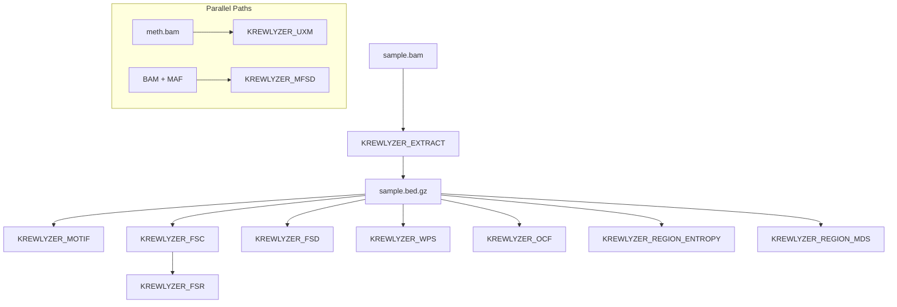

# Nextflow Pipeline

Run Krewlyzer at scale with the Nextflow pipeline.

## Quick Start

```bash
nextflow run msk-access/krewlyzer \
    --samplesheet samples.csv \
    --ref /path/to/hg19.fa \
    --outdir results/
```

## Workflow Architecture

The pipeline uses a Nextflow-native parallel pattern:



## Documentation

| Page | Description |
|------|-------------|
| [Samplesheet](samplesheet.md) | Input samplesheet format |
| [Parameters](parameters.md) | All pipeline parameters |
| [Outputs](outputs.md) | Output channels and files |
| [Examples](examples.md) | Workflow examples |

## Features

- **Parallel processing** - Process multiple samples simultaneously
- **Resume support** - Resume failed runs
- **Container support** - Docker/Singularity
- **Cloud ready** - AWS, Google Cloud, Azure

## See Also

- [CLI Reference](../cli/index.md) - Command-line usage
- [Panel Mode](../guides/panel-mode.md) - MSK-ACCESS workflows

