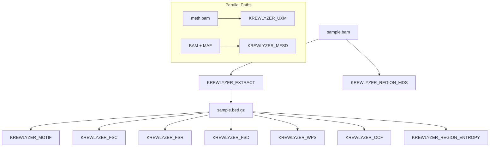

# Nextflow Pipeline

Run Krewlyzer at scale with the Nextflow pipeline.

## Quick Start

```bash
nextflow run msk-access/krewlyzer \
    --samplesheet samples.csv \
    --ref /path/to/hg19.fa \
    --outdir results/
```

## Workflow Architecture

The pipeline uses a Nextflow-native parallel pattern:



## Documentation

| Page | Description |
|------|-------------|
| [Samplesheet](samplesheet.md) | Input samplesheet format |
| [Parameters](parameters.md) | All pipeline parameters |
| [Outputs](outputs.md) | Output channels and files |
| [Examples](examples.md) | Workflow examples |

## Features

- **Parallel processing** - Process multiple samples simultaneously
- **Resume support** - Resume failed runs
- **Container support** - Docker/Singularity
- **Cloud ready** - AWS, Google Cloud, Azure

## Performance Benchmarks

Real-world performance from MSK-ACCESS v1/v2 duplex plasma samples:

| Sample Type | Duration | CPU Usage | Peak Memory |
|-------------|----------|-----------|-------------|
| Healthy control | 2-5 min | 90-140% | 1.7-1.9 GB |
| ctDNA plasma | 4-6 min | 190-300% | 2.8-3.2 GB |

!!! note "Tested Configuration"
    - Docker with amd64 emulation on Apple Silicon
    - 8 CPUs, 32 GB memory
    - Panel mode with `--skip-pon` and `--duplex` enabled

## See Also

- [CLI Reference](../cli/index.md) - Command-line usage
- [Panel Mode](../guides/panel-mode.md) - MSK-ACCESS workflows

