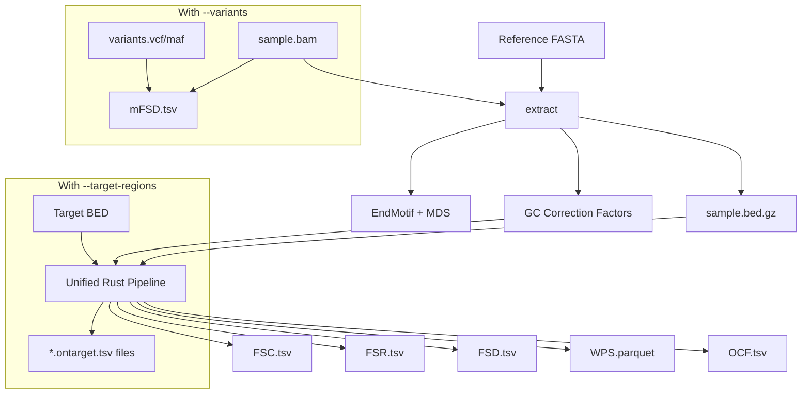
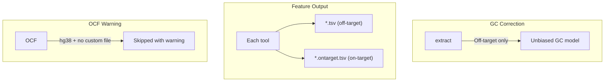

# Pipeline Integration

## Run All Features

**Command**: `krewlyzer run-all`

The unified pipeline executes all feature extraction modules for a single BAM file in one optimized pass.

---

## Architecture Flowchart



---

## Usage

```bash
# Basic run-all
krewlyzer run-all -i sample.bam -r hg19.fa -o output/

# With variant analysis
krewlyzer run-all -i sample.bam -r hg19.fa -o output/ \
    --variants mutations.maf

# Panel data (MSK-ACCESS)
krewlyzer run-all -i sample.bam -r hg19.fa -o output/ \
    --target-regions panel_targets.bed \
    --bin-input gene_bins.bed

# Full options
krewlyzer run-all -i sample.bam -r hg19.fa -o output/ \
    --variants mutations.vcf \
    --target-regions targets.bed \
    --pon-model cohort.pon.parquet \
    --threads 8
```

---

## CLI Options

| Option | Short | Type | Default | Description |
|--------|-------|------|---------|-------------|
| `--input` | `-i` | PATH | *required* | Input BAM file (sorted, indexed) |
| `--reference` | `-r` | PATH | *required* | Reference genome FASTA |
| `--output` | `-o` | PATH | *required* | Output directory |
| `--variants` | `-v` | PATH | | VCF/MAF for mFSD analysis |
| `--target-regions` | `-T` | PATH | | Target BED (panel mode) |
| `--bin-input` | `-b` | PATH | | Custom bins for FSC/FSR |
| `--pon-model` | `-P` | PATH | | PON model for normalization |
| `--genome` | `-G` | TEXT | hg19 | Genome build (hg19/hg38) |
| `--output-format` | `-F` | TEXT | auto | Output format: auto, tsv, parquet, json |
| `--generate-json` | | FLAG | | Generate unified sample.features.json |
| `--threads` | `-t` | INT | 0 | Number of threads (0=all) |
| `--mapq` | `-q` | INT | 20 | Minimum mapping quality |
| `--minlen` | | INT | 65 | Minimum fragment length |
| `--maxlen` | | INT | 400 | Maximum fragment length |
| `--gc-correct` | | FLAG | True | Apply GC bias correction |
| `--verbose` | `-v` | FLAG | | Enable verbose logging |

---

## Output Files

| File | Module | Description |
|------|--------|-------------|
| `{sample}.bed.gz` | extract | Fragments with GC content |
| `{sample}.EndMotif.tsv` | extract | 4-mer end motif frequencies |
| `{sample}.MDS.tsv` | extract | Motif Diversity Score |
| `{sample}.FSC.tsv` | fsc | 5-channel coverage per bin |
| `{sample}.FSR.tsv` | fsr | Short/long fragment ratios |
| `{sample}.FSD.tsv` | fsd | Size distribution per arm |
| `{sample}.WPS.parquet` | wps | Nucleosome protection profiles |
| `{sample}.WPS_background.parquet` | wps | Alu element stacking |
| `{sample}.OCF.tsv` | ocf | Tissue-of-origin OCF |
| `{sample}.mFSD.tsv` | mfsd | Mutant vs WT sizes (with -v) |
| `{sample}.features.json` | run-all | Unified JSON (with --generate-json) |

---

## Panel Mode (--target-regions)

For targeted sequencing panels (MSK-ACCESS):

```bash
krewlyzer run-all -i sample.bam -r hg19.fa -o output/ \
    --target-regions MSK-ACCESS_targets.bed \
    --bin-input MSK-ACCESS_genes.bed
```

### What Happens in Panel Mode



| Effect | Description |
|--------|-------------|
| GC model | Built from **off-target** fragments only |
| FSC/FSR aggregation | **Disabled** (preserves gene resolution) |
| All outputs | Split into `.tsv` (off) and `.ontarget.tsv` (on) |
| OCF (hg38) | Skipped unless custom OCR file provided |

> [!IMPORTANT]
> **Off-target = unbiased** – preferred for fragmentomics biomarkers.

---

## Nextflow Pipeline

For batch processing, use the Nextflow pipeline:

```bash
nextflow run main.nf \
    --samplesheet samples.csv \
    --ref /path/to/hg19.fa \
    --asset_dir /path/to/krewlyzer/data/ \
    --outdir results/
```

### Parameters

| Parameter | Default | Description |
|-----------|---------|-------------|
| `--samplesheet` | *required* | CSV with sample information |
| `--ref` | *required* | Reference genome FASTA |
| `--outdir` | `./results` | Output directory |
| `--asset_dir` | | Base directory for PON/targets (enables assay resolution) |
| `--targets` | | Global target BED (fallback) |
| `--genome` | `hg19` | Genome build |
| `--pon_model` | | Global PON model (fallback) |
| `--bait_padding` | `50` | Bait edge padding for WPS |
| `--verbose` | `false` | Enable verbose logging |
| `--threads` | `8` | Threads per process |

### Samplesheet Format

```csv
sample,bam,meth_bam,vcf,bed,maf,single_sample_maf,assay,pon,targets
```

| Column | Type | Description |
|--------|------|-------------|
| `sample` | TEXT | Sample identifier |
| `bam` | PATH | WGS/Panel BAM file |
| `meth_bam` | PATH | Bisulfite BAM for UXM |
| `vcf` | PATH | VCF for mFSD |
| `bed` | PATH | Pre-extracted .bed.gz |
| `maf` | PATH | MAF for mFSD |
| `single_sample_maf` | BOOL | Skip MAF filtering if `true` |
| `assay` | TEXT | Assay code: `XS1`, `XS2`, `WGS` |
| `pon` | PATH | Sample-specific PON (overrides assay) |
| `targets` | PATH | Sample-specific targets (overrides assay) |

### Assay Resolution (XS1/XS2)

When `assay` is set and `--asset_dir` is provided, the pipeline auto-resolves:

| Assay | PON File | Targets File |
|-------|----------|--------------|
| `XS1` | `{asset_dir}/pon/msk-access-v1.pon.parquet` | `{asset_dir}/targets/XS1_targets.bed` |
| `XS2` | `{asset_dir}/pon/msk-access-v2.pon.parquet` | `{asset_dir}/targets/XS2_targets.bed` |
| `WGS` | `{asset_dir}/pon/wgs.pon.parquet` | None |

### Example Samplesheet

```csv
sample,bam,meth_bam,vcf,bed,maf,single_sample_maf,assay,pon,targets
# MSK-ACCESS V1 samples (auto-resolve PON/targets)
ACCESS_001,/data/sample1.bam,,,,,false,XS1,,

# MSK-ACCESS V2 with MAF
ACCESS_002,/data/sample2.bam,,,,/data/cohort.maf,false,XS2,,

# WGS (no targets)
WGS_001,/data/wgs.bam,,/data/wgs.vcf,,,,WGS,,

# Custom PON/targets override
CUSTOM,/data/custom.bam,,,,,,,/data/custom.pon.parquet,/data/custom.bed
```

### Pipeline Logic

| Input | Triggered Workflow |
|-------|-------------------|
| `bam` only | Full run-all (extract → features) |
| `bam` + `vcf`/`maf` | run-all + mFSD |
| `meth_bam` only | UXM methylation |
| `bed` only | FSC, FSR, FSD, WPS, OCF (no extract) |

### Profiles
- `-profile docker` – Docker container
- `-profile slurm` – SLURM clusters (cmobic_cpu)

---

## See Also

- [Feature Documentation](features/extract.md) – Per-tool details
- [Architecture](advanced/architecture.md) – Rust/Python structure
- [PON Models](advanced/pon.md) – Normalization baselines
