---

# FILE: docs/changelog.md

# Changelog

--8<-- "CHANGELOG.md"

---

# FILE: docs/cli/index.md

# CLI Reference

Krewlyzer provides a command-line interface for all feature extraction tools.

## Main Command

```bash
krewlyzer run-all -i sample.bam --reference hg19.fa --output results/
```

See [run-all](run-all.md) for the unified command that runs all features.

## Individual Commands

| Command | Description |
|---------|-------------|
| `extract` | Extract fragments from BAM |
| `fsc` | Fragment Size Coverage |
| `fsd` | Fragment Size Distribution |
| `fsr` | Fragment Size Ratio |
| `wps` | Windowed Protection Score |
| `motif` | End Motif extraction |
| `ocf` | Orientation-aware Fragmentation |
| `region-entropy` | TFBS/ATAC entropy |
| `region-mds` | Per-gene MDS |
| `mfsd` | Mutant Fragment Size Distribution |
| `uxm` | Fragment-level Methylation |
| `build-pon` | Build Panel of Normals |

## See Also

- [Nextflow Pipeline](../nextflow/index.md) - Batch processing
- [Features](../features/index.md) - Feature documentation

---

# FILE: docs/cli/run-all.md

# Usage Guide

## Command Summary

| Command   | Description                                  |
|-----------|----------------------------------------------|
| `motif`   | Motif-based feature extraction               |
| `fsc`     | Fragment size coverage (`.FSC.tsv`)          |
| `fsr`     | Fragment size ratio (`.FSR.tsv`)             |
| `fsd`     | Fragment size distribution (`.FSD.tsv`)      |
| `wps`     | Windowed protection score (`.WPS.tsv.gz`)    |
| `ocf`     | Orientation-aware fragmentation (`.OCF.tsv`) |
| `uxm`     | Fragment-level methylation (`.UXM.tsv`)      |
| `mfsd`    | Mutant fragment size distribution (`.mFSD.tsv`)|
| `run-all` | Run all features for a BAM                   |

---

## Architecture Flowchart

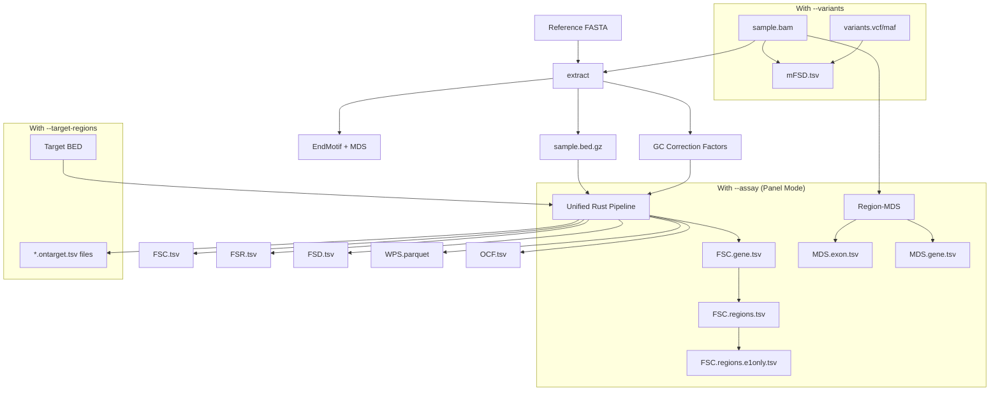
```mermaid
flowchart TB
    BAM["sample.bam"] --> EXTRACT["extract"]
    REF["Reference FASTA"] --> EXTRACT
    
    EXTRACT --> BED["sample.bed.gz"]
    EXTRACT --> MOTIF["EndMotif + MDS"]
    EXTRACT --> GC["GC Correction Factors"]
    
    BED --> PIPELINE["Unified Rust Pipeline"]
    GC --> PIPELINE
    
    PIPELINE --> FSC["FSC.tsv"]
    PIPELINE --> FSR["FSR.tsv"]
    PIPELINE --> FSD["FSD.tsv"]
    PIPELINE --> WPS["WPS.parquet"]
    PIPELINE --> OCF["OCF.tsv"]
    
    subgraph "With --variants"
        BAM --> MFSD["mFSD.tsv"]
        VCF["variants.vcf/maf"] --> MFSD
    end
    
    subgraph "With --assay (Panel Mode)"
        PIPELINE --> FSCG["FSC.gene.tsv"]
        FSCG --> FSCR["FSC.regions.tsv"]
        FSCR --> E1["FSC.regions.e1only.tsv"]
        BAM --> RMDS["Region-MDS"]
        RMDS --> MDSE["MDS.exon.tsv"]
        RMDS --> MDSG["MDS.gene.tsv"]
    end
    
    subgraph "With --target-regions"
        TARGETS["Target BED"] --> PIPELINE
        PIPELINE --> ON["*.ontarget.tsv files"]
    end
```

### Python/Rust Boundary

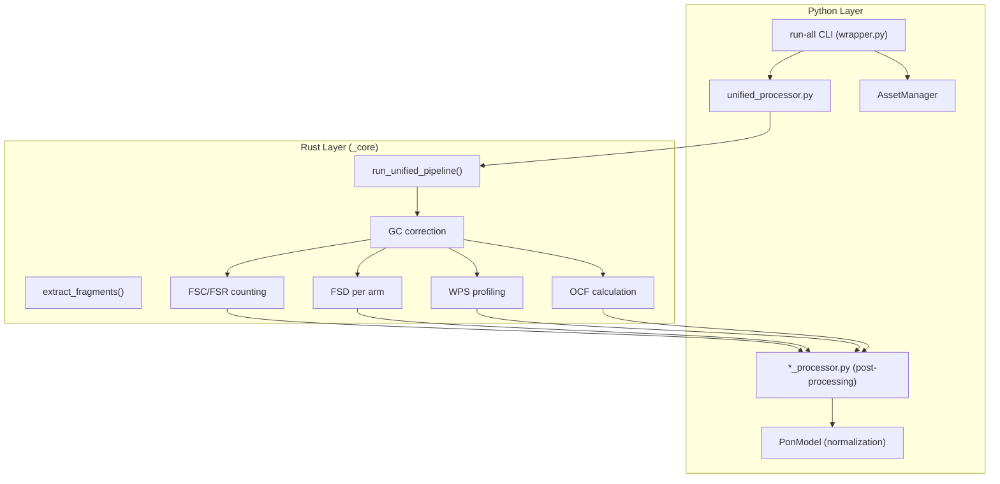
```mermaid
flowchart TB
    subgraph "Python Layer"
        CLI["run-all CLI (wrapper.py)"]
        UP["unified_processor.py"]
        PROC["*_processor.py (post-processing)"]
        PON["PonModel (normalization)"]
        ASSETS["AssetManager"]
    end
    
    subgraph "Rust Layer (_core)"
        EXTRACT["extract_fragments()"]
        UNIFIED["run_unified_pipeline()"]
        GC["GC correction"]
        FSC_R["FSC/FSR counting"]
        FSD_R["FSD per arm"]
        WPS_R["WPS profiling"]
        OCF_R["OCF calculation"]
    end
    
    CLI --> ASSETS
    CLI --> UP
    UP --> UNIFIED
    
    UNIFIED --> GC --> FSC_R & FSD_R & WPS_R & OCF_R
    
    FSC_R --> PROC
    FSD_R --> PROC
    WPS_R --> PROC
    OCF_R --> PROC
    
    PROC --> PON
```

---

## Reference Data
- **Reference Genome (FASTA):**
  - Download GRCh37/hg19 from [UCSC](https://hgdownload.soe.ucsc.edu/goldenPath/hg19/bigZips/)
  - BAMs must be sorted, indexed, and aligned to the same build
- **Bin/Region/Marker Files:**
  - Provided in `krewlyzer/data/` (see options for each feature)

## Typical Workflow
The recommended way to run krewlyzer is using the **Unified Pipeline** via `run-all`, which processes the BAM file in a single pass for maximum efficiency.

```bash
# Optimized Unified Pipeline
krewlyzer run-all sample.bam --reference hg19.fa --output output_dir \
    --variants variants.maf --bin-input targets.bed --threads 4
```

Alternatively, you can run tools individually. Note that most tools require a fragment BED file (`.bed.gz`) produced by the `extract` command.

```bash
# 1. Extract fragments (BAM -> BED.gz)
krewlyzer extract -i sample.bam -r hg19.fa -o output_dir

# 2. Run feature tools using the BED file
# 2. Run feature tools using the BED file
krewlyzer fsc -i output_dir/sample.bed.gz --output output_dir/
krewlyzer wps -i output_dir/sample.bed.gz --output output_dir/
# ... (fsd, ocf, etc.)

# 3. Motif analysis (Independent of BED, uses BAM directly)
krewlyzer motif -i sample.bam -r hg19.fa -o output_dir 
```

## Targeted Panel Usage (ACCESS, etc.)

For targeted sequencing panels (e.g., MSK-ACCESS), FSC/FSR require a custom regions BED file instead of the default genome-wide 100kb bins:

```bash
# Using run-all with custom target regions
krewlyzer run-all sample.bam --reference hg19.fa --output out/ \
  --bin-input /path/to/MSK-ACCESS-v2_canonicaltargets.bed

# Or run FSC/FSR individually with target regions
# Or run FSC/FSR individually with target regions
krewlyzer fsc -i motif_out/sample.bed.gz -b targets.bed -w 1 -c 1 --output out_dir/
krewlyzer fsr -i motif_out/sample.bed.gz -b targets.bed -w 1 -c 1 --output out_dir/
```

> **Note:** Without `--bin-input`, FSC/FSR will produce zeros for targeted panels since data only covers specific gene regions, not genome-wide bins. The `--output` argument for individual tools specifies the **output directory**, not a filename.

## PON and Z-Score Normalization

### Auto-PON with Assay Flag
When you specify an assay with `-A`, the bundled PON is automatically loaded:

```bash
# Auto-loads bundled PON for xs2 assay and applies z-scores
krewlyzer run-all -i sample.bam -r hg19.fa -o out/ -A xs2 -G hg19
```

### Skip Z-Score Normalization (`--skip-pon`)
For ML training workflows where PON samples are used as true negatives:

```bash
# Process PON samples as ML negatives (auto-loads PON but skips z-scores)
krewlyzer run-all -i pon_sample.bam -r hg19.fa -o out/ -A xs2 --skip-pon

# Individual tools also support --skip-pon
krewlyzer fsd -i sample.bed.gz -o out/ --skip-pon
```

> **Warning:** `-P/--pon-model` and `--skip-pon` are mutually exclusive.

### PON Variant Selection (`--pon-variant`)

For duplex sequencing workflows, select the appropriate PON variant:

```bash
# Default: all_unique PON (standard cfDNA, max coverage)
krewlyzer run-all -i sample.bam -r hg19.fa -o out/ -A xs2

# Duplex PON (highest accuracy for duplex consensus BAMs)
krewlyzer run-all -i sample.bam -r hg19.fa -o out/ -A xs2 --pon-variant duplex
```

> **Note:** `--pon-variant` controls PON file selection, while `--duplex` (mFSD only) enables cD tag weighting.

## Output Formats

Krewlyzer outputs support multiple formats for different use cases.

### Unified JSON for ML

```bash
# Generate single JSON with ALL features for ML pipelines
krewlyzer run-all sample.bam --reference hg19.fa --output out/ --generate-json
# Output: out/sample.features.json (contains FSD, FSR, WPS, Motif, OCF, etc.)
```

### Format Override

```bash
# Global format for all outputs
krewlyzer run-all ... --output-format parquet

# Per-tool format override
krewlyzer fsd -i sample.bed.gz -o out/ --format json
```

See [JSON Output](../features/output/json-output.md) for full documentation.


---

# FILE: docs/development/contributing-data.md

# Contributing Data Files

This guide explains how to add or modify data files in the Krewlyzer repository.

## Git LFS Setup

The `src/krewlyzer/data/` folder uses **Git LFS** (Large File Storage) for binary files.

### File Types Tracked

```gitattributes
src/krewlyzer/data/**/*.gz filter=lfs diff=lfs merge=lfs -text
src/krewlyzer/data/**/*.parquet filter=lfs diff=lfs merge=lfs -text
src/krewlyzer/data/**/*.bed filter=lfs diff=lfs merge=lfs -text
```

### Prerequisites

1. Install Git LFS:
   ```bash
   # macOS
   brew install git-lfs
   
   # Ubuntu
   apt-get install git-lfs
   ```

2. Initialize LFS in your clone:
   ```bash
   cd krewlyzer
   git lfs install
   ```

### Cloning with LFS

```bash
# Clone with LFS files
git clone https://github.com/msk-access/krewlyzer.git

# If LFS files weren't pulled, fetch them
git lfs pull
```

---

## Adding New Panel Assets

### 1. Target Regions

Place in `src/krewlyzer/data/targets/GRCh37/`:

```bash
# File: {assay}.targets.bed.gz
# Format: BED3 or BED4
chr1  11166102  11166202  MTOR_exon1
chr1  27022522  27022622  ARID1A_exon1
```

### 2. TFBS Regions (Pre-intersected)

Place in `src/krewlyzer/data/TFBS/GRCh37/`:

```bash
# Create panel-specific TFBS by intersecting with targets
bedtools intersect -u \
    -a Homo_sapiens_meta_clusters_hg19.bed.gz \
    -b ../targets/GRCh37/{assay}.targets.bed.gz \
    | bgzip > {assay}.meta_clusters_hg19.bed.gz
tabix -p bed {assay}.meta_clusters_hg19.bed.gz
```

### 3. ATAC Regions (Pre-intersected)

Place in `src/krewlyzer/data/ATAC/GRCh37/`:

```bash
# Create panel-specific ATAC by intersecting with targets
bedtools intersect -u \
    -a TCGA_ATAC_peak.hg19.bed.gz \
    -b ../targets/GRCh37/{assay}.targets.bed.gz \
    | bgzip > {assay}.TCGA_ATAC_peak.hg19.bed.gz
tabix -p bed {assay}.TCGA_ATAC_peak.hg19.bed.gz
```

### 4. WPS Anchors

Place in `src/krewlyzer/data/WpsAnchors/GRCh37/`:

```bash
# File: {assay}.wps_anchors.bed.gz
# Format: BED6 with TSS/CTCF annotations
chr1  10000  10500  TSS  100  +
chr1  15000  15500  CTCF  100  -
```

---

## File Format Requirements

| File Type | Format | Index | Notes |
|-----------|--------|-------|-------|
| Targets | BED3/4 | Optional | 0-based coordinates |
| TFBS | BED4 | `.tbi` | Col4 = TF name |
| ATAC | BED4 | `.tbi` | Col4 = cancer type |
| WPS Anchors | BED6 | `.tbi` | TSS/CTCF regions |
| Gene BEDs | BED6 | None | Per-gene exon regions |

### Compression

- Use **bgzip** (not gzip) for indexed files:
  ```bash
  bgzip file.bed
  tabix -p bed file.bed.gz
  ```

- BGZF format is required for tabix indexing

---

## Registering Assets

After adding files, update `src/krewlyzer/assets.py`:

```python
# In AssetManager.get_targets()
if assay == "new_assay":
    return self.targets_dir / "new_assay.targets.bed.gz"
```

---

## Committing LFS Files

```bash
# Stage new files
git add src/krewlyzer/data/targets/GRCh37/new_assay.targets.bed.gz

# Verify LFS tracking
git lfs status

# Commit
git commit -m "feat: add new_assay target regions"

# Push (uploads to LFS)
git push origin main
```

---

## Troubleshooting

### "LFS object not found"

```bash
git lfs fetch --all
git lfs checkout
```

### Large clone size

```bash
# Clone without LFS content (faster)
GIT_LFS_SKIP_SMUDGE=1 git clone https://github.com/msk-access/krewlyzer.git

# Pull only needed LFS files
git lfs pull --include="src/krewlyzer/data/gc/**"
```

---

# FILE: docs/development/contributing.md

# Contributing

--8<-- "CONTRIBUTING.md"

---

# FILE: docs/development/developer-guide.md

# Developer Guide

This guide covers the Krewlyzer codebase architecture for contributors.

## Repository Structure

```
krewlyzer/
├── src/krewlyzer/          # Python package
│   ├── cli.py              # Typer CLI entry point
│   ├── wrapper.py          # run-all orchestration (750 lines)
│   ├── assets.py           # AssetManager for bundled data
│   ├── extract.py          # BAM → BED extraction
│   ├── fsc.py, fsd.py, ... # Standalone tools
│   ├── core/               # Shared processors
│   │   ├── asset_resolution.py  # Target/PON resolution logic
│   │   ├── logging.py      # Startup banner and logging
│   │   ├── gc_assets.py    # GC resolution helper
│   │   ├── fsc_processor.py
│   │   ├── wps_processor.py
│   │   └── feature_serializer.py  # JSON output
│   ├── pon/                # PON model code
│   │   ├── model.py        # PonModel dataclass
│   │   └── build.py        # PON building logic
│   └── data/               # Bundled assets
├── rust/                   # Rust backend
│   ├── Cargo.toml
│   └── src/
│       ├── lib.rs          # PyO3 module exports
│       ├── pipeline.rs     # Unified pipeline entry
│       ├── fsc.rs, wps.rs  # Feature modules
│       └── gc_correction.rs
├── tests/                  # Test suite
├── docs/                   # MkDocs documentation
└── nextflow/               # Nextflow pipeline
```

---

## Rust Backend Architecture

### Module Structure

```
lib.rs
├── extract_motif     # BAM extraction module
├── gc                # GC correction module  
├── run_unified_pipeline  # Main pipeline function
└── configure_threads # Thread pool setup
```

### Key Rust Modules

| Module | Lines | Purpose |
|--------|------:|---------|\n| `wps.rs` | 2000+ | Dual-stream WPS, FFT, smoothing |
| `gc_correction.rs` | 590 | LOESS GC bias correction |
| `gc_reference.rs` | 658 | Asset generation (once per genome) |
| `fsc.rs` | 500+ | 5-bin fragment counting |
| `fsd.rs` | 600+ | Per-arm size distribution |
| `pipeline.rs` | 400+ | Unified pipeline coordination |
| `extract_motif.rs` | 1200+ | BAM reading, motif extraction |
| `motif_utils.rs` | 176 | Shared 4-mer encoding, MDS, GC utils |
| `region_mds.rs` | 800+ | Per-gene MDS at exon boundaries |
| `region_entropy.rs` | 600+ | TFBS/ATAC size entropy |


### Unified Pipeline

All feature computation goes through `run_unified_pipeline`:

```rust
pub fn run_unified_pipeline(
    bedgz_path: &str,
    gc_ref_path: Option<&str>,
    valid_regions_path: Option<&str>,
    gc_factors_out: Option<&str>,
    gc_factors_in: Option<&str>,
    fsc_bins_path: Option<&str>,
    fsc_out_path: Option<&str>,
    wps_anchors_path: Option<&str>,
    wps_out_path: Option<&str>,
    wps_bg_path: Option<&str>,
    wps_bg_out_path: Option<&str>,
    include_empty: bool,
    fsd_arms_path: Option<&str>,
    fsd_out_path: Option<&str>,
    ocf_regions_path: Option<&str>,
    ocf_out_path: Option<&str>,
    target_regions_path: Option<&str>,
    bait_padding: u32,
    silent: bool,
) -> PyResult<()>
```

### Adding a New Feature

1. **Create Rust module** (`rust/src/new_feature.rs`)
2. **Add to lib.rs** module exports
3. **Create Python wrapper** (`src/krewlyzer/new_feature.py`)
4. **Add to CLI** in `cli.py`
5. **Integrate with run_unified_pipeline** if applicable
6. **Add to FeatureSerializer** for JSON output
7. **Write tests** in `tests/unit/` and `tests/integration/`

---

## Python Architecture

### Tool Pattern

All standalone tools follow this pattern:

```python
def tool_name(
    input: Path = typer.Option(...),
    output: Path = typer.Option(...),
    # ... options
):
    # 1. Initialize AssetManager
    assets = AssetManager(genome)
    
    # 2. Resolve GC assets (use helper)
    from .core.gc_assets import resolve_gc_assets
    gc = resolve_gc_assets(assets, output, sample_name, input, gc_correct, genome)
    
    # 3. Call Rust backend
    _core.run_unified_pipeline(...)
    
    # 4. Post-process (Python)
    from .core.tool_processor import process_tool
    process_tool(output_file, ...)
```

### AssetManager

Centralizes access to bundled data:

```python
assets = AssetManager("hg19")

# Properties
assets.gc_reference      # GC ref parquet
assets.valid_regions     # Valid regions BED
assets.bins_100kb        # Default bins
assets.wps_anchors       # WPS anchors BED

# Assay-aware methods
assets.get_gene_bed("xs2")     # Panel gene BED
assets.get_wps_anchors("xs2")  # Panel WPS anchors
assets.get_pon("xs2")          # Bundled PON
```

### FeatureSerializer

Collects all features into unified JSON:

```python
serializer = FeatureSerializer(sample_id)
serializer.add_fsc(fsc_df)
serializer.add_wps(wps_df)
serializer.add_motif(edm_dict, bpm_dict, mds)
# ...
serializer.save(output_file)

# Or load from existing outputs
serializer = FeatureSerializer.from_outputs(output_dir, sample_id)
```

---

## Testing

Krewlyzer has **239 tests** across unit, integration, and e2e categories.

**→ [Testing Guide](testing-guide.md)** for complete documentation including:
- Feature → test file mapping
- Fixture reference
- Test writing examples

### Quick Commands

```bash
# All tests
pytest tests/

# Fast unit tests only
pytest tests/unit/

# Specific feature
pytest tests/unit/test_fsc.py

# With coverage
pytest tests/ --cov=krewlyzer --cov-report=html
```

> [!TIP]
> **Modifying a feature?** Check the [Feature → Test Map](testing-guide.md#feature--test-map) to find which test file to update.

---

## Rust Development

### Building

```bash
cd rust

# Debug build (fast compile, slow run)
maturin develop

# Release build (slow compile, fast run)
maturin develop --release
```

### Testing Rust

```bash
# Run Rust tests (currently minimal)
cargo test

# Check before committing
cargo clippy
cargo fmt --check
```

### Debugging

```bash
# Enable verbose logging
RUST_LOG=debug krewlyzer run-all -i sample.bam ...

# Or in Python
python -c "
import logging
logging.basicConfig(level=logging.DEBUG)
from krewlyzer import _core
# ... your test code
"
```

---

## Code Style

### Python

- Use `typer` for CLIs
- Use `rich` for logging/progress
- Type hints for all public functions
- Docstrings (Google style)

### Rust

- Run `cargo fmt` before committing
- Address `cargo clippy` warnings
- Use `anyhow::Result` for error handling
- Log with `log::info!`, `log::debug!`

---

## Contributing Checklist

- [ ] Code follows existing patterns
- [ ] Added/updated tests
- [ ] Updated documentation
- [ ] Ran `pytest tests/`
- [ ] Ran `cargo fmt && cargo clippy`
- [ ] Updated CHANGELOG.md

See [CONTRIBUTING.md](contributing.md) for full guidelines.

---

# FILE: docs/development/release-guide.md

# Release Guide

This guide documents the process for releasing new versions of Krewlyzer following Git Flow.

---

## Prerequisites

- Git LFS installed and configured
- Access to push to `origin`
- All tests passing on develop branch

---

## Git Flow Overview

```mermaid
gitGraph
    commit id: "develop"
    branch release/X.Y.Z
    commit id: "bump version"
    commit id: "update CHANGELOG"
    checkout main
    merge release/X.Y.Z tag: "vX.Y.Z"
    checkout develop
    merge release/X.Y.Z
```

---

## Phase 1: Create Release Branch

```bash
# Ensure you're on latest develop
git checkout develop
git pull origin develop

# Create release branch
git checkout -b release/X.Y.Z

# Verify
git branch --show-current
```

---

## Phase 2: Update Version Files

### Version Locations (37 total)

| Category | File | Line(s) |
|----------|------|---------|
| **Python** | `src/krewlyzer/__init__.py` | 3 |
| **Python** | `pyproject.toml` | 3 |
| **Python** | `src/krewlyzer/wrapper.py` | 674 |
| **Python** | `src/krewlyzer/core/feature_serializer.py` | 54, 291 |
| **Rust** | `rust/Cargo.toml` | 3 |
| **Rust** | `rust/Cargo.lock` | Auto-updated |
| **Nextflow** | `nextflow/nextflow.config` | 171 |
| **Nextflow** | `nextflow/main.nf` | 36 |
| **Modules** | `nextflow/modules/local/krewlyzer/*/main.nf` | 2 per module |

### Quick Update Script

```bash
VERSION="X.Y.Z"
OLD_VERSION="0.3.2"  # Current version

# Python
sed -i '' "s/__version__ = \".*\"/__version__ = \"${VERSION}\"/g" src/krewlyzer/__init__.py
sed -i '' "s/version = \"${OLD_VERSION}\"/version = \"${VERSION}\"/g" pyproject.toml
sed -i '' "s/version=\"${OLD_VERSION}\"/version=\"${VERSION}\"/g" src/krewlyzer/wrapper.py
sed -i '' "s/\"${OLD_VERSION}\"/\"${VERSION}\"/g" src/krewlyzer/core/feature_serializer.py

# Rust
sed -i '' "s/version = \"${OLD_VERSION}\"/version = \"${VERSION}\"/g" rust/Cargo.toml
cd rust && cargo check && cd ..

# Nextflow
sed -i '' "s/${OLD_VERSION}/${VERSION}/g" nextflow/nextflow.config
sed -i '' "s/${OLD_VERSION}/${VERSION}/g" nextflow/main.nf
find nextflow/modules -name "main.nf" -exec sed -i '' "s/${OLD_VERSION}/${VERSION}/g" {} \;
```

---

## Phase 3: Update CHANGELOG

Add new entry at the top of `CHANGELOG.md`:

```markdown
## [X.Y.Z] - YYYY-MM-DD

### Added
- Feature descriptions

### Changed
- Breaking changes and modifications

### Fixed
- Bug fixes

### Documentation
- Doc updates
```

---

## Phase 4: Verify and Commit

```bash
# Run tests
pytest tests/ -v --tb=short

# Verify Rust compiles
cd rust && cargo check && cd ..

# Check version
python -c "from krewlyzer import __version__; print(__version__)"

# Commit
git add -A
git commit -m "chore: bump version to X.Y.Z"

# Push release branch for review
git push -u origin release/X.Y.Z
```

---

## Phase 5: Finalize Release

After review and approval:

```bash
# Merge to main
git checkout main
git pull origin main
git merge --no-ff release/X.Y.Z -m "Release vX.Y.Z"

# Create annotated tag
git tag -a vX.Y.Z -m "Release vX.Y.Z"

# Push main and tag (triggers CI release)
git push origin main
git push origin vX.Y.Z

# Merge back to develop
git checkout develop
git merge --no-ff release/X.Y.Z -m "Merge release/X.Y.Z back to develop"
git push origin develop

# Delete release branch
git branch -d release/X.Y.Z
git push origin --delete release/X.Y.Z
```

---

## Git LFS

Large files are tracked via Git LFS (see `.gitattributes`):

```
src/krewlyzer/data/**/*.gz filter=lfs diff=lfs merge=lfs -text
src/krewlyzer/data/**/*.parquet filter=lfs diff=lfs merge=lfs -text
src/krewlyzer/data/**/*.bed filter=lfs diff=lfs merge=lfs -text
```

Ensure Git LFS is installed before cloning:

```bash
git lfs install
git clone https://github.com/msk-access/krewlyzer.git
```

---

## Nextflow Module Locations

Each module has 2 version references:

| Module | Container Line | versions.yml Line |
|--------|----------------|-------------------|
| build_pon | 13 | 63 |
| extract | 13 | 68 |
| fsc | 14 | 67 |
| fsd | 13 | 60 |
| fsr | 13 | 63 |
| mfsd | 13 | 62 |
| motif | 13 | 55 |
| ocf | 13 | 63 |
| region_entropy | 14 | 73 |
| region_mds | 14 | 79 |
| runall | 18 | 183 |
| uxm | 13 | 55 |
| wps | 14 | 76 |

---

# FILE: docs/development/testing-guide.md

# Testing Guide

## Overview

Krewlyzer has **245 tests** covering all features via pytest.

| Category | Tests | Speed | Location |
|----------|:-----:|-------|----------|
| **Unit** | 155 | <1s | `tests/unit/` |
| **Integration** | 52 | 5-30s | `tests/integration/` |
| **CLI** | 10 | 2-5s | `tests/cli/` |
| **E2E** | 3 | 30-60s | `tests/e2e/` |
| **Asset Resolution** | 19 | <1s | `tests/test_asset_resolution.py` |

> [!NOTE]
> **Rust code is tested via Python.** The `test_rust_python_equivalence.py` suite verifies Rust output matches Python implementations.

---

<a id="feature--test-map"></a>
## Feature → Test Map

**When modifying a feature, update the corresponding test file:**

| Feature | Test File(s) | Tests |
|---------|--------------|:-----:|
| **FSC** | `unit/test_fsc.py` | 7 |
| **FSD** | `unit/test_fsd.py`, `integration/test_fsd_cli.py` | 8 |
| **FSR** | `integration/test_fsr_cli.py` | 3 |
| **WPS** | `unit/test_wps.py`, `integration/test_wps_cli.py` | 19 |
| **Motif** | `integration/test_motif.py` | 3 |
| **OCF** | `integration/test_ocf.py` | 1 |
| **mFSD** | `integration/test_mfsd.py` | 9 |
| **UXM** | `integration/test_uxm.py` | 1 |
| **Region Entropy** | `integration/test_region_entropy.py` | 10 |
| **Extract** | `integration/test_extract.py` | 4 |
| **PON Model** | `unit/test_pon_model.py` | 51 |
| **PON Validation** | `unit/test_pon_validation.py` | 14 |
| **PON Build** | `integration/test_pon.py`, `test_pon_dual_gc.py` | 8 |
| **Gene BED** | `unit/test_gene_bed.py` | 25 |
| **Asset Manager** | `unit/test_asset_manager.py` | 10 |
| **External Data Dir** | `unit/test_external_data_dir.py` | 6 |
| **Asset Resolution** | `test_asset_resolution.py` | 19 |
| **BGZF Reader** | `unit/test_bgzf_reader.py` | 5 |
| **Normalization** | `unit/test_normalization.py` | 6 |
| **run-all flags** | `unit/test_run_all_flags.py` | 6 |
| **Rust/Python** | `unit/test_rust_python_equivalence.py` | 11 |
| **Real Data** | `integration/test_real_data.py` | 5 |

---

## Running Tests

```bash
# All tests
pytest tests/

# By category
pytest tests/unit/           # Fast unit tests
pytest tests/integration/    # Tool integration
pytest tests/e2e/            # Full pipeline

# Specific feature
pytest tests/unit/test_fsc.py
pytest tests/unit/test_wps.py -v

# Stop on first failure
pytest -x

# With coverage
pytest tests/ --cov=krewlyzer --cov-report=html
```

---

## Test Markers

```bash
pytest -m unit           # Unit tests only
pytest -m integration    # Integration tests
pytest -m "not slow"     # Skip slow tests
```

---

## Fixtures

Key fixtures from `tests/conftest.py`:

| Fixture | Description |
|---------|-------------|
| `temp_bam` | Minimal BAM with proper pair |
| `temp_bedgz` | Minimal BED.gz (3 fragments) |
| `temp_reference` | FASTA reference (12kb chr1) |
| `temp_bins` | FSC bins file |
| `temp_arms` | FSD arms file |
| `temp_transcripts` | WPS transcripts file |
| `temp_ocr` | OCF regions file |
| `temp_vcf` | mFSD variants file |
| `full_test_data` | Bundle for run-all |
| `real_bam` | Production data (3144 reads) |
| `real_pon` | MSK-ACCESS v1 PON |

---

## Adding Tests

### Naming Convention
- **File**: `test_<feature>.py`
- **Function**: `test_<action>_<expected>()`

### Example Unit Test
```python
@pytest.mark.unit
def test_fsc_counts_fragments_by_size(temp_bedgz, temp_bins):
    """FSC should categorize fragments into size bins."""
    result = fsc.count_fragments(temp_bedgz, temp_bins)
    
    assert "core_short" in result.columns
    assert result["total"].sum() > 0
```

### Example Integration Test
```python
@pytest.mark.integration
def test_fsc_cli_produces_output(temp_bedgz, temp_bins, tmp_path):
    """FSC CLI should write TSV output."""
    from typer.testing import CliRunner
    from krewlyzer.cli import app
    
    runner = CliRunner()
    result = runner.invoke(app, [
        "fsc", "-i", str(temp_bedgz), 
        "-b", str(temp_bins), "-o", str(tmp_path)
    ])
    
    assert result.exit_code == 0
    assert (tmp_path / "test.FSC.tsv").exists()
```

---

## See Also

- [Developer Guide](developer-guide.md) - Setup and architecture
- [Contributing](contributing.md) - PR process

---

# FILE: docs/features/core/extract.md

# Fragment Extraction

**Command**: `krewlyzer extract`

> **Plain English**: Extract converts your BAM file into cfDNA fragments with quality information.
> It's the first step for most analyses—think of it as "preprocessing" your sequencing data.
>
> **Key output**: `.bed.gz` file containing fragment coordinates and GC correction factors.

---

## Purpose
The `extract` module serves as the entry point for most analysis workflows. It processes a BAM file to extract valid cell-free DNA (cfDNA) fragments and saves them in a standardized, compressed BED format with GC content.

---

## Processing Flowchart

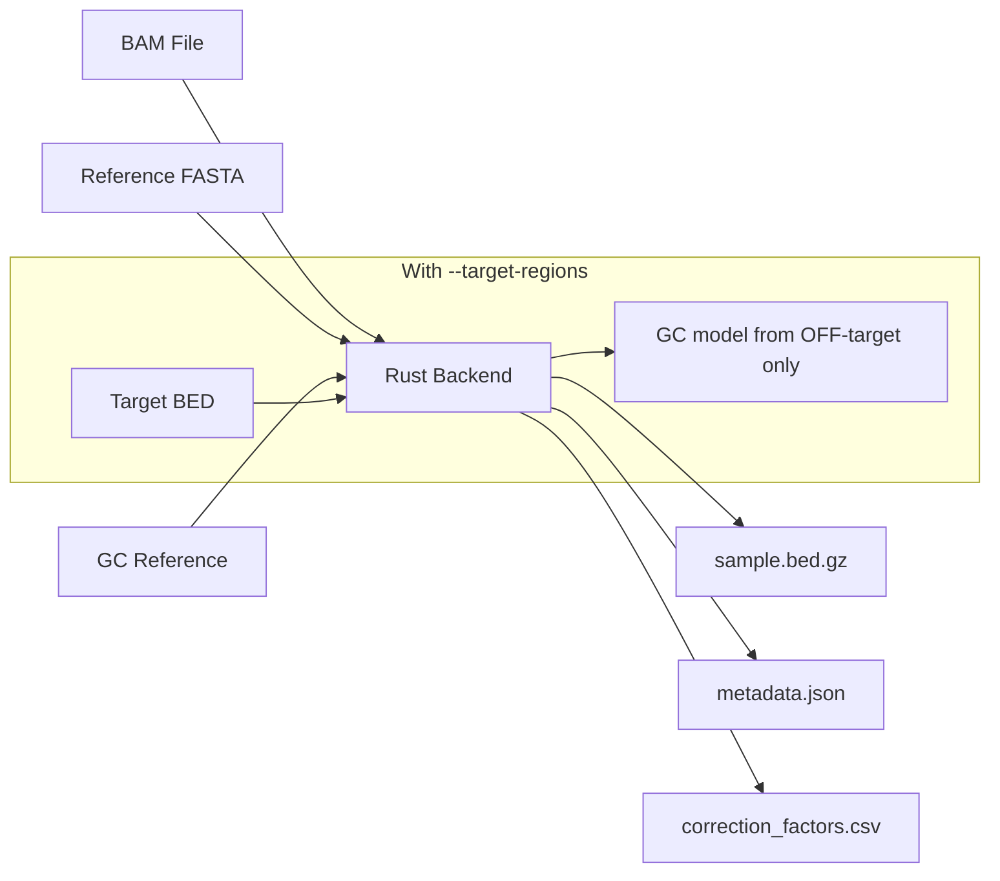
```mermaid
flowchart LR
    BAM[BAM File] --> RUST[Rust Backend]
    REF[Reference FASTA] --> RUST
    GC_REF[GC Reference] --> RUST
    
    RUST --> BED["sample.bed.gz"]
    RUST --> META["metadata.json"]
    RUST --> FACTORS["correction_factors.csv"]
    
    subgraph "With --target-regions"
        TARGETS[Target BED] --> RUST
        RUST --> GC_OFF["GC model from OFF-target only"]
    end
```

---

## Biological Context
Raw sequencing data (BAM) contains reads that must be paired and filtered to reconstruct physical DNA fragments. This step standardizes the data, removing PCR duplicates and low-quality mappings, ensuring downstream analysis focuses on high-confidence unique molecules.

---

## Usage
```bash
krewlyzer extract -i sample.bam -r hg19.fa -o output_dir/ [options]
```

## Options

| Option | Short | Type | Default | Description |
|--------|-------|------|---------|-------------|
| `--input` | `-i` | PATH | *required* | Input BAM file |
| `--reference` | `-r` | PATH | *required* | Reference genome FASTA (indexed) |
| `--output` | `-o` | PATH | *required* | Output directory |
| `--genome` | `-G` | TEXT | hg19 | Genome build for GC assets |
| `--assay` | `-A` | TEXT | | Assay code (xs1/xs2) for auto-loading bundled targets |
| `--target-regions` | `-T` | PATH | | Target BED (panel mode: GC from off-target) |
| `--skip-target-regions` | | FLAG | | Disable panel mode even when --assay is specified |
| `--gc-correct` | | FLAG | True | Compute GC correction factors |
| `--exclude-regions` | `-x` | PATH | | BED file of regions to exclude |
| `--mapq` | `-q` | INT | 20 | Minimum mapping quality |
| `--minlen` | | INT | 65 | Minimum fragment length |
| `--maxlen` | | INT | 1000 | Maximum fragment length |
| `--skip-duplicates` | | FLAG | True | Skip duplicate reads |
| `--require-proper-pair` | | FLAG | True | Require proper read pairs |
| `--chromosomes` | | TEXT | | Comma-separated chromosomes to process |
| `--sample-name` | `-s` | TEXT | | Override sample name |
| `--verbose` | `-v` | FLAG | | Enable verbose logging |
| `--threads` | `-t` | INT | 0 | Number of threads (0=all) |

---

## Output Files

| File | Description |
|------|-------------|
| `{sample}.bed.gz` | Block-gzipped BED with fragment coordinates + GC |
| `{sample}.bed.gz.tbi` | Tabix index for random access |
| `{sample}.metadata.json` | Run statistics and configuration |
| `{sample}.correction_factors.csv` | GC correction factors (with --gc-correct) |

### GC Correction Factors Format

| Column | Description |
|--------|-------------|
| gc_bin | GC content bin (0.00-1.00) |
| short_factor | Correction for short fragments (65-149bp) |
| intermediate_factor | Correction for intermediate (150-220bp) |
| long_factor | Correction for long fragments (221-400bp) |

---

## Panel Mode (--assay or --target-regions)

For targeted sequencing panels (MSK-ACCESS), use `--assay` to auto-load bundled targets, or `--target-regions` for a custom target file:

```bash
# Recommended: Auto-load bundled targets for xs2 assay
krewlyzer extract -i sample.bam -r hg19.fa -o output/ --assay xs2

# Alternative: Explicit target file
krewlyzer extract -i sample.bam -r hg19.fa -o output/ \
    --target-regions MSK-ACCESS_targets.bed
```

### Why This Matters

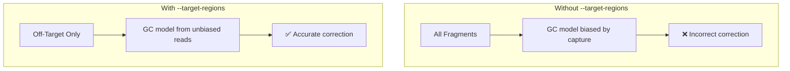
```mermaid
flowchart TB
    subgraph "Without --target-regions"
        ALL[All Fragments] --> GC_ALL["GC model biased by capture"]
        GC_ALL --> BAD["❌ Incorrect correction"]
    end
    
    subgraph "With --target-regions"
        OFF[Off-Target Only] --> GC_OFF["GC model from unbiased reads"]
        GC_OFF --> GOOD["✅ Accurate correction"]
    end
```

**Problem**: On-target fragments have GC bias from hybridization probes. Using all fragments for GC modeling contaminates the correction factors.

**Solution**: With `--target-regions`, only **off-target** fragments are used to compute GC correction factors, producing unbiased normalization for downstream analysis.

### Outputs in Panel Mode

| Output | Description |
|--------|-------------|
| `correction_factors.tsv` | GC factors from **off-target only** (unbiased) |
| `correction_factors.ontarget.csv` | GC factors from **on-target only** (for mFSD) |
| `sample.bed.gz` | All fragments (on + off-target) |

> [!TIP]
> Use `.correction_factors.ontarget.csv` with `krewlyzer mfsd --correction-factors` for panel variant calling—it's trained on the same capture regions as your variants.

> [!IMPORTANT]
> The BED file contains all fragments. Target filtering happens **per-tool** using the same `--target-regions` flag in FSC, FSD, WPS, etc.

---

## BAM Compatibility

### Duplex/Consensus BAMs

If you're using duplex or consensus BAMs, disable the proper pair filter:

```bash
krewlyzer extract -i duplex.bam -r hg19.fa -o output/ \
    --no-require-proper-pair
```

| BAM Type | Proper Pairs? | Flag Needed? |
|----------|---------------|--------------|
| Standard WGS | ✅ Yes | Default works |
| Standard Panel | ✅ Yes | Default works |
| Duplex/UMI | ❌ No | `--no-require-proper-pair` |
| Consensus | ❌ No | `--no-require-proper-pair` |

### Auto-Detection

The `run-all` command automatically detects BAM compatibility issues and suggests the correct flags.

---

## See Also

- [GC Correction](../../guides/gc-correction.md) - LOESS algorithm details
- [Troubleshooting](../../resources/troubleshooting.md) - Common issues
- [Glossary](../../reference/glossary.md) - Terminology reference

---

# FILE: docs/features/core/fsc.md

# Fragment Size Coverage (FSC)

**Command**: `krewlyzer fsc`

> **Plain English**: FSC counts how many DNA fragments of each size fall into each genomic region.
> Think of it as a "heatmap" of fragment sizes across the genome.
>
> **Use case**: Copy number detection - regions with more short fragments suggest tumor amplification.

---

## Purpose
Computes GC-corrected coverage of cfDNA fragments in 6 biologically-meaningful size channels per genomic bin. Designed for ML feature extraction in cancer detection.

---

## Biological Context

### Why Fragment Sizes Matter

cfDNA fragments are not random—their sizes reflect the chromatin state of their source cells:

| Fragment Size | Source | Biological Meaning |
|---------------|--------|-------------------|
| **Short (<100bp)** | Open chromatin, active transcription | TF footprints, regulatory elements |
| **~167bp** | Mono-nucleosome | "Classic" cfDNA peak |
| **~334bp** | Di-nucleosome | Linked nucleosomes |
| **Long (>260bp)** | Multi-nucleosome | Necrosis, incomplete digestion |

**Cancer signature**: Tumors release shorter cfDNA fragments than healthy cells due to:
- Altered nucleosome positioning
- Different apoptotic pathways
- Chromatin accessibility changes

### 6-Channel ML Features

FSC partitions fragments into **non-overlapping** channels optimized for ML:

| Channel | Size Range | Biological Meaning | Cancer Relevance |
|---------|------------|-------------------|------------------|
| **ultra_short** | 65-100bp | Di-nucleosomal debris | Early apoptosis markers |
| **core_short** | 101-149bp | Sub-nucleosomal | Specific chromatin states |
| **mono_nucl** | 150-220bp | Mono-nucleosomal | Classic cfDNA (reference) |
| **di_nucl** | 221-260bp | Di-nucleosomal | Transitional |
| **long** | 261-400bp | Multi-nucleosomal | Necrosis-associated |
| **ultra_long** | 401-1000bp | Extended fragments | Necrosis, fetal cfDNA, late apoptosis |

> **Non-overlapping**: Each fragment is counted in exactly one channel. This prevents multicollinearity in ML models.

---

## Implementation Details

### Counting Pipeline

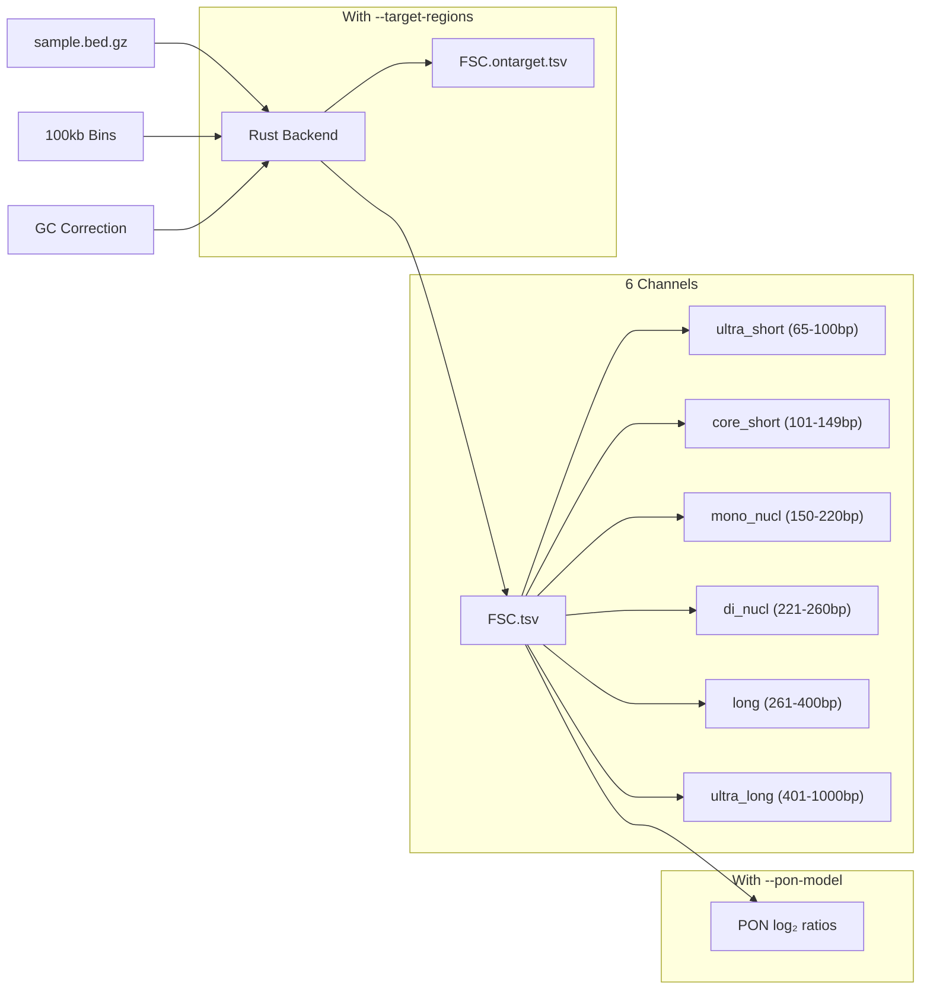
```mermaid
flowchart LR
    BED["sample.bed.gz"] --> RUST["Rust Backend"]
    BINS["100kb Bins"] --> RUST
    GC["GC Correction"] --> RUST
    
    RUST --> FSC["FSC.tsv"]
    
    subgraph "6 Channels"
        FSC --> US["ultra_short (65-100bp)"]
        FSC --> CS["core_short (101-149bp)"]
        FSC --> MN["mono_nucl (150-220bp)"]
        FSC --> DN["di_nucl (221-260bp)"]
        FSC --> LG["long (261-400bp)"]
        FSC --> UL["ultra_long (401-1000bp)"]
    end
    
    subgraph "With --pon-model"
        FSC --> PON["PON log₂ ratios"]
    end
    
    subgraph "With --target-regions"
        RUST --> FSC_ON["FSC.ontarget.tsv"]
    end
```

### Python/Rust Architecture

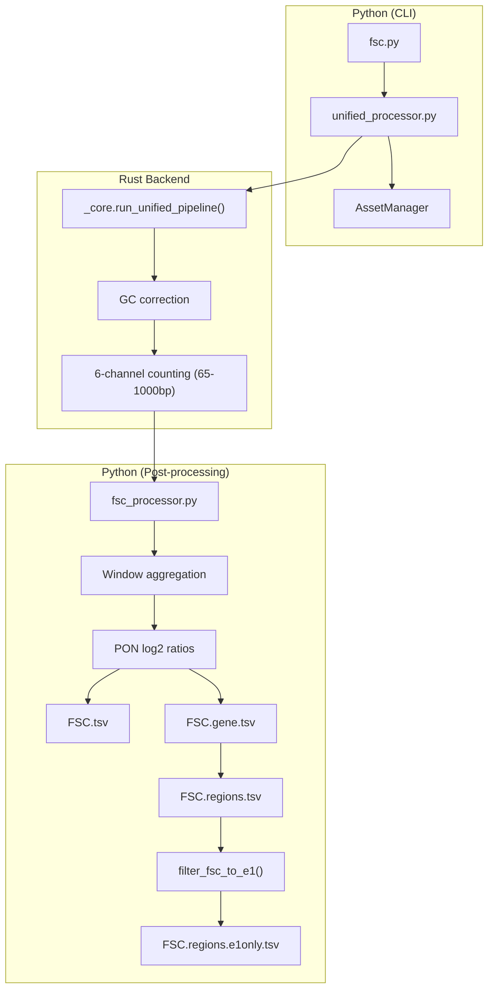
```mermaid
flowchart TB
    subgraph "Python (CLI)"
        CLI["fsc.py"] --> UP["unified_processor.py"]
        UP --> ASSETS["AssetManager"]
    end
    
    subgraph "Rust Backend"
        UP --> RUST["_core.run_unified_pipeline()"]
        RUST --> GC["GC correction"]
        GC --> COUNT["6-channel counting (65-1000bp)"]
    end
    
    subgraph "Python (Post-processing)"
        COUNT --> PROC["fsc_processor.py"]
        PROC --> AGG["Window aggregation"]
        AGG --> PON["PON log2 ratios"]
        PON --> OUT["FSC.tsv"]
        PON --> GENE["FSC.gene.tsv"]
        GENE --> REG["FSC.regions.tsv"]
        REG --> E1["filter_fsc_to_e1()"]
        E1 --> E1OUT["FSC.regions.e1only.tsv"]
    end
```

### Aggregation Strategy

> **Critical**: Aggregation should match your analysis goal.

| Data Type | Bin Input | Aggregation | Use Case |
|-----------|-----------|-------------|----------|
| **WGS** | 100kb genome tiles | 50 bins → **5Mb** | Arm-level CNV |
| **WGS focal** | 100kb genome tiles | **No aggregation** | Focal amps (EGFR, MYC) |
| **Panel** | Exon/Gene targets | **No aggregation** | Gene-level resolution |

> **Auto-detection**: When `--target-regions` is provided in `run-all`, aggregation is **automatically disabled** to preserve gene-level resolution for panel data.

**Why this matters:**
- 5Mb aggregation is great for detecting **arm-level** events (e.g., 1p/19q co-deletion)
- Focal amplifications (e.g., EGFR amp <1Mb) are **washed out** by 5Mb aggregation
- Panel targets are already gene-resolution—aggregation destroys their value

**Recommendation:**
- For **broad CNV detection** (tumor fraction, aneuploidy): Use aggregated 5Mb windows
- For **focal analysis** (driver genes, amplicons): Preserve raw bin resolution


### GC Correction Details

Each fragment receives a **weight** based on its (length, GC%) bin:

```
weight = correction_factors[(length, gc_pct)]
channel_count += weight  # Instead of += 1
```

This removes GC bias **before** ML, not after. The correction factors come from:
- **WGS**: Computed from all genome-wide fragments
- **Panel**: Computed from **off-target reads only** (when `--target-regions` provided)

### Bin Assignment

Fragments are assigned to bins based on **overlap** (not midpoint):

```rust
// If fragment overlaps bin, count it
tree.query(start, end, |bin| {
    bin.channel_count += weight;
});
```

A fragment spanning two bins counts in **both**. This is intentional for coverage metrics.

---

## Usage

```bash
# Basic (auto-loads bundled 100kb bins)
krewlyzer fsc -i sample.bed.gz -o output/ --genome hg38

# With PoN for log2 ratios
krewlyzer fsc -i sample.bed.gz -o output/ --pon-model cohort.pon

# Custom bin size
krewlyzer fsc -i sample.bed.gz -o output/ --bin-input custom_bins.bed
```

## CLI Options

| Option | Short | Type | Default | Description |
|--------|-------|------|---------|-------------|
| `--input` | `-i` | PATH | *required* | Input .bed.gz file (output from extract) |
| `--output` | `-o` | PATH | *required* | Output directory |
| `--sample-name` | `-s` | TEXT | | Override sample name |
| `--bin-input` | `-b` | PATH | | Custom bin file (default: 100kb genome-wide) |
| `--pon-model` | `-P` | PATH | | PON model for hybrid GC correction |
| `--pon-variant` | | TEXT | all_unique | PON variant: `all_unique` or `duplex` |
| `--skip-pon` | | FLAG | | Skip PON z-score normalization |
| `--target-regions` | `-T` | PATH | | Target BED (for on/off-target FSC split) |
| `--skip-target-regions` | | FLAG | | Force WGS mode (ignore bundled targets) |
| `--assay` | `-A` | TEXT | | Assay type (xs1/xs2) for gene-centric FSC |
| `--windows` | `-w` | INT | 100000 | Window size for aggregation |
| `--continue-n` | `-c` | INT | 50 | Consecutive window number |
| `--genome` | `-G` | TEXT | hg19 | Genome build (hg19/hg38) |
| `--gc-correct` | | FLAG | True | Apply GC bias correction |
| `--threads` | `-t` | INT | 0 | Number of threads (0=all cores) |
| `--verbose` | `-v` | FLAG | | Enable verbose logging |

---


## Output Format

Output: `{sample}.FSC.tsv`

### Base Columns (always present)

| Column | Type | Description |
|--------|------|-------------|
| `chrom` | str | Chromosome |
| `start` | int | Window start (0-based) |
| `end` | int | Window end |
| `ultra_short` | float | GC-weighted count (65-100bp) |
| `core_short` | float | GC-weighted count (101-149bp) |
| `mono_nucl` | float | GC-weighted count (150-220bp) |
| `di_nucl` | float | GC-weighted count (221-260bp) |
| `long` | float | GC-weighted count (261-400bp) |
| `total` | float | GC-weighted total (65-400bp) |

### PoN Columns (when `--pon-model` provided)

| Column | Type | Description |
|--------|------|-------------|
| `*_log2` | float | log2(channel / PoN_mean) |
| `*_reliability` | float | 1 / (PoN_variance + k) |

> **Note**: Log2 ratios are signed: positive = above PoN mean, negative = below.

---

## WGS vs Panel Data (MSK-ACCESS)

| Aspect | WGS | Panel (MSK-ACCESS) |
|--------|-----|-------------------|
| **Coverage** | Uniform genome-wide | High on-target, sparse off-target |
| **GC correction source** | All fragments | **Off-target only** |
| **Typical depth** | ~30x genome | ~1000x on-target |
| **Best bins** | All bins reliable | On-target bins only |

### Panel Mode Details

When you provide `--target-regions` to `run-all`:

1. **GC model training**: Uses only off-target reads (unbiased by capture)
2. **Counting**: All reads are counted (on-target + off-target)
3. **Interpretation**: On-target bins have high counts, off-target bins are sparse

```bash
krewlyzer run-all sample.bam -g ref.fa -o out/ \
    --target-regions msk_access_baits.bed
```

### Panel Recommendations

| Feature | Recommendation |
|---------|----------------|
| **Which bins to use** | Filter to high-coverage bins (>100 fragments) |
| **Channel ratios** | More robust than absolute counts |
| **PoN** | Build from same panel type only |

---

## ML Feature Engineering

### Raw Features (per 5Mb window)
- 5 channel counts (ultra_short, core_short, mono_nucl, di_nucl, long)
- 1 total count

### Derived Features (recommended)
- **Channel ratios**: `short / long`, `mono_nucl / total`
- **Log2 ratios vs PoN**: Tumor-specific deviations
- **Reliability-weighted**: Use reliability scores in loss functions

### Example: Short-to-Long Ratio

```python
df['short_long_ratio'] = (df['ultra_short'] + df['core_short']) / (df['long'] + 1e-9)
```

Higher ratio = more short fragments = potential tumor signal

---

## Normalization Order

1. **GC-weighting** (Rust): Raw counts × correction factor per (length, GC) bin
2. **Window aggregation** (Python): 50 bins → 5Mb windows
3. **PoN log-ratio** (Python): log2(sample / PoN mean) when PoN model provided

> **Important**: GC correction is applied **first** in Rust, not after. This ensures all downstream features are GC-unbiased.

---

## Panel Mode (--target-regions)

For targeted sequencing panels (MSK-ACCESS), use `--target-regions` to generate **separate on/off-target outputs**:

```bash
krewlyzer fsc -i sample.bed.gz -o output/ \
    --target-regions MSK-ACCESS_targets.bed \
    --bin-input gene_level_bins.bed
```

### Processing with Target Regions

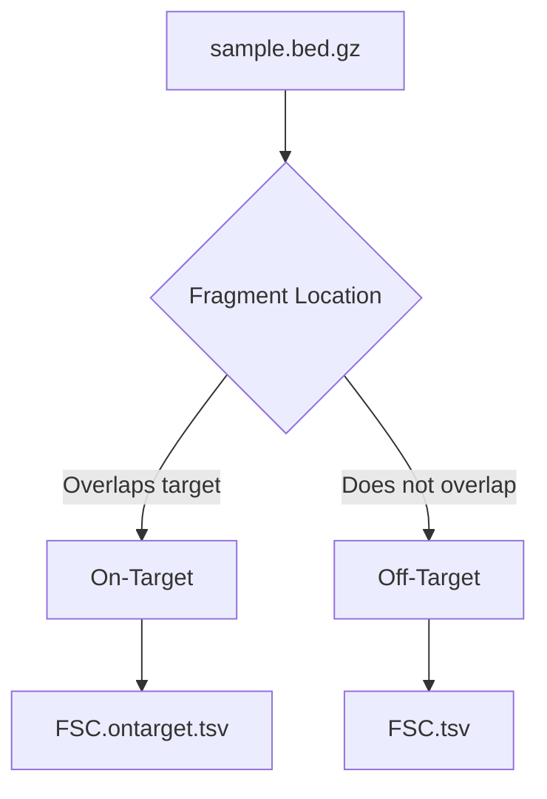
```mermaid
flowchart TB
    BED["sample.bed.gz"] --> SPLIT{"Fragment Location"}
    
    SPLIT -->|"Overlaps target"| ON["On-Target"]
    SPLIT -->|"Does not overlap"| OFF["Off-Target"]
    
    ON --> FSC_ON["FSC.ontarget.tsv"]
    OFF --> FSC_OFF["FSC.tsv"]
```

### Output Files

| File | Contents | Use Case |
|------|----------|----------|
| `{sample}.FSC.tsv` | **Off-target** fragments | Unbiased global signal (primary) |
| `{sample}.FSC.ontarget.tsv` | **On-target** fragments | Gene-level local signal |

> [!IMPORTANT]
> **Off-target = unbiased** – preferred for fragmentomics biomarkers.  
> **On-target = capture-biased** – reflects library prep + target selection.

### When to Use On-Target FSC

| Use Case | Recommended |
|----------|-------------|
| CNV detection | Off-target |
| Tumor fraction | Off-target |
| Gene-level amplification | **On-target** |
| Panel-specific features | Both |

---

## Gene-Centric FSC (MSK-ACCESS)

For MSK-ACCESS panels, use `--assay` to aggregate fragment counts by **gene** instead of genomic windows:

```bash
krewlyzer fsc -i sample.bed.gz -o output/ --assay xs2
```

### Output Files

| File | Description | Rows |
|------|-------------|------|
| `{sample}.FSC.tsv` | Standard window-based FSC | ~28,000 |
| `{sample}.FSC.gene.tsv` | Gene-level FSC | 146 (xs2) |
| `{sample}.FSC.regions.tsv` | Per-exon/target FSC | ~1,000 |

### Gene FSC Output Format

```
gene    n_regions  total_bp  ultra_short  core_short  mono_nucl  di_nucl  long  total  *_ratio  normalized_depth
ATM     62         8432      1234         5678        9012       3456     789   20169  ...      1245.67
BRCA2   42         5689      ...
```

### Region FSC Output Format (NEW)

Per-exon/target output for fine-grained copy number analysis:

```
chrom  start      end      gene  region_name     region_bp  ultra_short  ...  normalized_depth
1      11168235  11168345  MTOR  MTOR_target_02  110        8.0          ...  1272.71
1      11169344  11169429  MTOR  MTOR_target_03  85         6.0          ...  1553.68
```

### E1-Only FSC Output (NEW)

**File**: `{sample}.FSC.regions.e1only.tsv`

E1 (first exon) filtering extracts only the first exon per gene by genomic position. Per Helzer et al. (2025), promoter-proximal regions (E1) are Nucleosome Depleted Regions (NDRs) with distinct fragmentation patterns, often showing stronger cancer signal than whole-gene averages.

**Usage**:
```bash
# Default: E1-only file generated automatically with --assay
krewlyzer run-all -i sample.bam -r ref.fa -o out/ -A xs2

# Disable E1-only generation
krewlyzer run-all -i sample.bam -r ref.fa -o out/ -A xs2 --disable-e1-aggregation
```

> [!TIP]
> E1-only FSC is particularly useful for **early cancer detection** where promoter fragmentation changes are an early marker.

### Normalized Depth (RPKM-like)

Both gene and region outputs include `normalized_depth`:

$$
\text{normalized\_depth} = \frac{\text{count} \times 10^9}{\text{region\_bp} \times \text{total\_fragments}}
$$

This enables cross-sample depth comparisons independent of library size and region size.

### Supported Assays

| Assay | Flag | Genes |
|-------|------|:-----:|
| MSK-ACCESS v1 | `--assay xs1` | 128 |
| MSK-ACCESS v2 | `--assay xs2` | 146 |

> [!TIP]
> Gene-level FSC is useful for **gene-specific amplification** detection and **integration with variant calling** pipelines.

### GC Correction for Gene FSC

In panel mode, gene-level FSC uses **on-target GC correction factors** (`.correction_factors.ontarget.csv`) for accurate copy number estimates.

**Why this matters:**
- Different genes have different GC content
- High-GC genes (e.g., *EGFR*) capture with different efficiency than low-GC genes
- Without correction, high-GC genes appear **falsely deleted**, low-GC genes appear **amplified**

**How it works:**
```python
# Instead of raw counting (+= 1):
weight = correction_factors[(len_bin, gc_pct)]
gene_count += weight  # GC-corrected counting
```

**Log output example:**
```
Aggregating FSC by gene: 146 genes, GC correction: ON (weighted counting)
Processed 2.4M fragments, 2.4M assigned to genes
  GC correction: avg_weight=1.898, missing_gc=0
```

> [!NOTE]
> On-target factors are automatically used when available. If not found, raw counting is used with a debug log message.

---

## See Also

- **Citation**: [Cristiano et al. (2019)](../../resources/citation.md#fsc) - DELFI fragmentomics paper
- **PON**: [Z-Score Normalization](../../reference/pon-models.md) - Log2 ratio computation
- **Inputs**: [File Formats](../../reference/input-formats.md#bins) - Bin file format
- **Related**: [FSR](fsr.md) (ratios), [FSD](fsd.md) (distribution), [Extract](extract.md) (BED.gz source)
- **Guides**: [Panel Mode](../../guides/panel-mode.md), [GC Correction](../../guides/gc-correction.md)
- **CLI**: [`run-all`](../../cli/run-all.md) - Unified pipeline
- **Nextflow**: [Parameters](../../nextflow/parameters.md) - Batch processing

## References

> Snyder et al. (2016). Cell-free DNA comprises an in vivo nucleosome footprint that informs its tissues-of-origin. *Cell*, 164(1-2), 57-68.

> Cristiano et al. (2019). Genome-wide cell-free DNA fragmentation in patients with cancer. *Nature*, 570(7761), 385-389.


---

# FILE: docs/features/core/fsd.md

# Fragment Size Distribution (FSD)

**Command**: `krewlyzer fsd`

> **Plain English**: FSD creates a "histogram" of fragment sizes for each chromosome arm.
> Healthy samples have a peak at ~166bp. Cancer samples show a left-shifted peak (~145bp).
>
> **Use case**: Detect aneuploidy and copy number changes by comparing arm-level size distributions.

---

## Purpose

Computes high-resolution (5bp bins) fragment length distributions per chromosome arm. Produces ML-ready features with log-ratio normalization and on/off-target split for panel data.

---

## Processing Flowchart

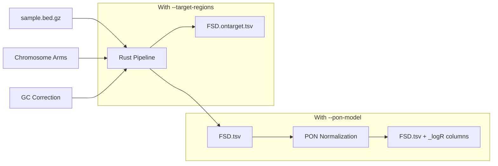
```mermaid
flowchart LR
    BED["sample.bed.gz"] --> PIPELINE["Rust Pipeline"]
    ARMS["Chromosome Arms"] --> PIPELINE
    GC["GC Correction"] --> PIPELINE
    PIPELINE --> FSD["FSD.tsv"]
    
    subgraph "With --pon-model"
        FSD --> PON["PON Normalization"]
        PON --> LOGR["FSD.tsv + _logR columns"]
    end
    
    subgraph "With --target-regions"
        PIPELINE --> FSD_ON["FSD.ontarget.tsv"]
    end
```

### Python/Rust Architecture

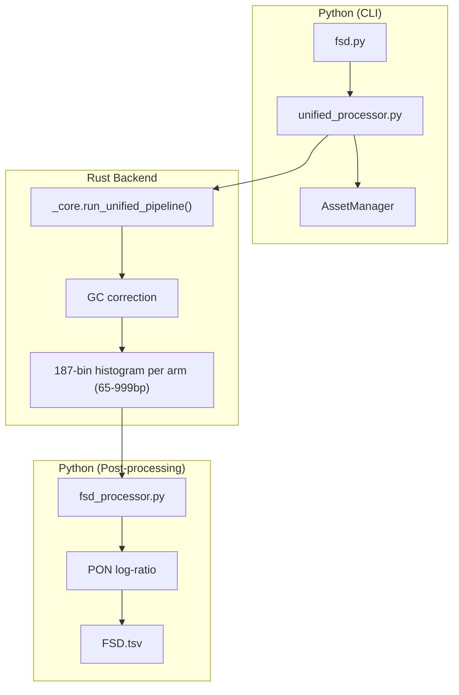
```mermaid
flowchart TB
    subgraph "Python (CLI)"
        CLI["fsd.py"] --> UP["unified_processor.py"]
        UP --> ASSETS["AssetManager"]
    end
    
    subgraph "Rust Backend"
        UP --> RUST["_core.run_unified_pipeline()"]
        RUST --> GC["GC correction"]
        GC --> HIST["187-bin histogram per arm (65-999bp)"]
    end
    
    subgraph "Python (Post-processing)"
        HIST --> PROC["fsd_processor.py"]
        PROC --> PON["PON log-ratio"]
        PON --> OUT["FSD.tsv"]
    end
```

## Biological Context

### Why Fragment Sizes Matter

cfDNA fragment sizes reflect nucleosome positioning and chromatin state in source cells:

| Fragment Size | Source | Biological Significance |
|---------------|--------|------------------------|
| **~145bp** | Core nucleosome | Minimal DNA protection |
| **~166bp** | Mono-nucleosome + linker | "Classic" cfDNA peak |
| **~334bp** | Di-nucleosome | Stable chromatin regions |
| **10bp periodicity** | DNA helical pitch | Rotational phasing |

### Cancer Signature

| Signal | Healthy Plasma | Cancer (ctDNA) |
|--------|----------------|----------------|
| Modal peak | ~166bp | Left-shifted (~145bp) |
| 10bp periodicity | Clear | Often disrupted |
| Arm-level variation | Minimal | Increased (correlates with CNAs) |

> **Why arm-level?** Chromosome arms have distinct chromatin environments. Tumor-derived cfDNA shows arm-specific fragmentation shifts that correlate with copy number alterations.

---

## Usage

```bash
# Basic usage
krewlyzer fsd -i sample.bed.gz -o output_dir/ --genome hg19

# With PON for log-ratio normalization
krewlyzer fsd -i sample.bed.gz -o output_dir/ -P msk-access.pon.parquet

# Panel data (MSK-ACCESS) with on/off-target split
krewlyzer run-all -i sample.bam -r ref.fa -o out/ \
    --target-regions panel_targets.bed
```

---

## Options

| Option | Short | Type | Default | Description |
|--------|-------|------|---------|-------------|
| `--input` | `-i` | PATH | *required* | Input .bed.gz file (from extract) |
| `--output` | `-o` | PATH | *required* | Output directory |
| `--sample-name` | `-s` | TEXT | | Override sample name |
| `--arms-file` | `-a` | PATH | | Chromosome arms BED file |
| `--target-regions` | `-T` | PATH | | Target BED (enables on/off split) |
| `--skip-target-regions` | | FLAG | | Force WGS mode (ignore bundled targets) |
| `--assay` | `-A` | TEXT | | Assay code (xs1/xs2) for bundled assets |
| `--genome` | `-G` | TEXT | hg19 | Genome build (hg19/hg38) |
| `--pon-model` | `-P` | PATH | | PON model for z-score computation |
| `--pon-variant` | | TEXT | all_unique | PON variant: `all_unique` or `duplex` |
| `--skip-pon` | | FLAG | | Skip PON z-score normalization |
| `--gc-correct` | | FLAG | True | Apply GC bias correction |
| `--threads` | `-t` | INT | 0 | Threads (0=all cores) |
| `--verbose` | `-v` | FLAG | | Enable verbose logging |

---


## Output Files

### `{sample}.FSD.tsv` (Off-Target / Default)

| Column | Type | Description |
|--------|------|-------------|
| `region` | str | Chromosome arm (e.g., "chr1:0-125000000") |
| `65-69`, `70-74`, ..., `995-999` | float | GC-weighted counts in 187 bins (5bp steps, 65-999bp) |
| `total` | float | Sum of all bins |
| `65-69_logR`, ... | float | log2(sample / PoN_expected) *(with -P)* |
| `pon_stability` | float | 1 / (variance + k) *(with -P)* |

### `{sample}.FSD.ontarget.tsv` (Panel Mode Only)

Same schema as above, but for fragments overlapping target regions.

> [!IMPORTANT]
> **Off-target = unbiased** (preferred for biomarkers)  
> **On-target = capture-biased** (use cautiously for local analysis only)

---

## GC Correction

When `--gc-correct` is enabled (default):

```
Normalization Order:
1. GC-weighting (Rust): raw_count × gc_correction_factor
2. PoN log-ratio (Python): log2((sample + 1) / (pon + 1))
```

| GC Option | Effect |
|-----------|--------|
| Enabled | Corrects for PCR/capture GC bias |
| Disabled (`--no-gc-correct`) | Raw counts (faster, biased) |

> See [GC Correction Details](../../guides/gc-correction.md) for the LOESS algorithm.

---

## PON Integration

With `--pon-model`, FSD outputs include log-ratio normalization:

| Column | Formula | Interpretation |
|--------|---------|----------------|
| `{bin}_logR` | `log2((sample + 1) / (PoN_expected + 1))` | > 0 = above normal |
| `pon_stability` | `1 / (variance + 0.01)` | Higher = more reliable |

**Formulas:**

**Log-Ratio:**

$$
\text{logR} = \log_2 \left( \frac{\text{sample\_count} + 1}{\text{PoN\_expected} + 1} \right)
$$

**PON Stability:**

$$
\text{stability} = \frac{1}{\text{variance} + 0.01}
$$

**Algorithm:**
1. For each arm and size bin, retrieve PoN expected value
2. Compute log-ratio with pseudocount (+1) for zero-handling
3. Calculate stability from PoN variance (inverse weighting)

> See [PON Models](../../reference/pon-models.md) for model structure and building.

---

## Clinical Interpretation

### Interpreting Log-Ratio Values

| `*_logR` Value | Meaning | Possible Cause |
|----------------|---------|----------------|
| **~0** | Normal | No deviation from healthy |
| **> 0.5** | Elevated short fragments | Tumor-derived cfDNA |
| **< -0.5** | Depleted | Copy number loss? |

### Arm-Level Variation

| Pattern | Interpretation |
|---------|----------------|
| Uniform across arms | Healthy profile |
| Single arm deviation | Focal CNA or arm-level event |
| Multiple arm deviations | High tumor fraction (aneuploidy) |

---

## 187-Bin Structure (65-999bp, 5bp steps)

| Bin Range | Size Range | Description |
|-----------|------------|-------------|
| 0 | 65-69bp | Ultra-short (sub-nucleosomal) |
| 1-6 | 70-99bp | Short fragments |
| 7-16 | 100-149bp | Core mono-nucleosomal |
| 17-30 | 150-219bp | Peak mono-nucleosomal |
| 31-50 | 220-319bp | Di-nucleosomal |
| 51-86 | 320-499bp | Multi-nucleosomal |
| 87-186 | 500-999bp | Extended range |

> **Note**: The pipeline uses 5bp bins from 65bp to 999bp, yielding 187 columns. This extended range (up to 1000bp) captures multi-nucleosomal fragments for comprehensive FSD analysis.

---

## Panel Data Mode

For targeted sequencing (MSK-ACCESS):

```bash
krewlyzer fsd -i sample.bed.gz -o output/ \
    --target-regions MSK-ACCESS-v2_targets.bed
```

| Output | Contents | Use Case |
|--------|----------|----------|
| `.FSD.tsv` | Off-target fragments | Unbiased arm-level biomarkers |
| `.FSD.ontarget.tsv` | On-target fragments | Local context (capture-biased) |

> [!WARNING]
> On-target FSD has capture bias and should not be used for global fragmentomics.

---

## See Also

- [Input File Formats](../../reference/input-formats.md#arms-bed) - Arms BED format for `--arms-file`
- [GC Correction](../../guides/gc-correction.md) - LOESS algorithm details
- [PON Models](../../reference/pon-models.md) - Building and using PON
- [Citation](../../resources/citation.md) - DELFI paper references
- [Troubleshooting](../../resources/troubleshooting.md) - Common issues

---

# FILE: docs/features/core/fsr.md

# Fragment Size Ratio (FSR)

**Command**: `krewlyzer fsr`

> **Plain English**: FSR measures the ratio of short (tumor-enriched) to long (healthy) DNA fragments.
> A higher `core_short_long_ratio` means more tumor-derived DNA in your sample.
>
> **Example**: `core_short_long_ratio = 1.5` suggests ~30% tumor burden (vs. ~0.9 in healthy plasma).

---

## Purpose
Computes short/long fragment ratios for cancer biomarker analysis. Uses PoN-normalization **before** ratio calculation for accurate cross-sample comparison.

---

## Processing Flowchart

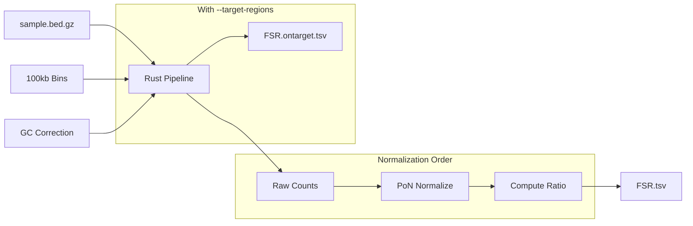
```mermaid
flowchart LR
    BED["sample.bed.gz"] --> RUST["Rust Pipeline"]
    BINS["100kb Bins"] --> RUST
    GC["GC Correction"] --> RUST
    
    RUST --> COUNTS["Raw Counts"]
    
    subgraph "Normalization Order"
        COUNTS --> NORM["PoN Normalize"]
        NORM --> RATIO["Compute Ratio"]
    end
    
    RATIO --> FSR["FSR.tsv"]
    
    subgraph "With --target-regions"
        RUST --> FSR_ON["FSR.ontarget.tsv"]
    end
```

### Python/Rust Architecture

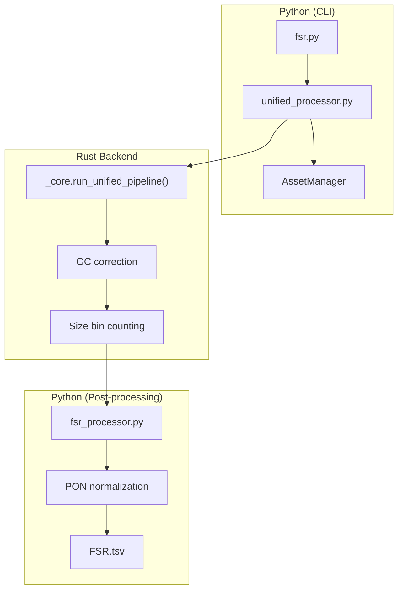
```mermaid
flowchart TB
    subgraph "Python (CLI)"
        CLI["fsr.py"] --> UP["unified_processor.py"]
        UP --> ASSETS["AssetManager"]
    end
    
    subgraph "Rust Backend"
        UP --> RUST["_core.run_unified_pipeline()"]
        RUST --> GC["GC correction"]
        GC --> COUNT["Size bin counting"]
    end
    
    subgraph "Python (Post-processing)"
        COUNT --> PROC["fsr_processor.py"]
        PROC --> PON["PON normalization"]
        PON --> OUT["FSR.tsv"]
    end
```

---

## Biological Context

The ratio of short to long fragments is a key indicator of tumor burden in cfDNA:

| Fragment Type | Size Range | Biological Source |
|---------------|------------|-------------------|
| **core_short** | 100-149bp | Tumor DNA (sub-nucleosomal, ~145bp peak) |
| **mono_nucl** | 150-259bp | Standard mono-nucleosomal cfDNA |
| **di_nucl** | 260-399bp | Di-nucleosomal (healthy chromatin) |
| **long** | 400+bp | Very long fragments |

**Key Biomarker**: `core_short_long_ratio` – Higher ratio = higher probability of tumor DNA

### Why Short Fragments = Tumor?

Tumor cells have abnormal chromatin structure:
- **Disrupted nucleosome positioning** → non-canonical cutting
- **Smaller protected regions** → shorter fragments
- **Result**: Tumor cfDNA peaks at ~145bp vs. healthy cfDNA at ~166bp

---

## Usage
```bash
# Basic usage
krewlyzer fsr -i sample.bed.gz -o output_dir/ --sample-name SAMPLE

# With PON normalization (recommended)
krewlyzer fsr -i sample.bed.gz -o output/ -P cohort.pon.parquet

# Panel data with on/off-target split
krewlyzer fsr -i sample.bed.gz -o output/ \
    --target-regions MSK-ACCESS_targets.bed
```

## CLI Options

| Option | Short | Type | Default | Description |
|--------|-------|------|---------|-------------|
| `--input` | `-i` | PATH | *required* | Input .bed.gz file (output from extract) |
| `--output` | `-o` | PATH | *required* | Output directory |
| `--sample-name` | `-s` | TEXT | | Override sample name |
| `--bin-input` | `-b` | PATH | | Custom bin file |
| `--pon-model` | `-P` | PATH | | PON model for hybrid GC correction |
| `--pon-variant` | | TEXT | all_unique | PON variant: `all_unique` or `duplex` |
| `--skip-pon` | | FLAG | | Skip PON z-score normalization |
| `--target-regions` | `-T` | PATH | | Target BED (for on/off-target split) |
| `--skip-target-regions` | | FLAG | | Force WGS mode (ignore bundled targets) |
| `--assay` | `-A` | TEXT | | Assay code (xs1/xs2) for bundled assets |
| `--genome` | `-G` | TEXT | hg19 | Genome build (hg19/hg38) |
| `--windows` | `-w` | INT | 100000 | Window size |
| `--continue-n` | `-c` | INT | 50 | Consecutive window number |
| `--gc-correct` | | FLAG | True | Apply GC bias correction |
| `--threads` | `-t` | INT | 0 | Number of threads (0=all cores) |
| `--verbose` | `-v` | FLAG | | Enable verbose logging |

---

## Size Bin Definitions

FSR uses the Rust backend's 5-channel size bins:

| Bin Name | Size Range | Biological Meaning |
|----------|------------|-------------------|
| `ultra_short` | 65-99bp | TF footprints, highly tumor-specific |
| `core_short` | 100-149bp | **Primary tumor biomarker** |
| `mono_nucl` | 150-259bp | Standard mono-nucleosomal |
| `di_nucl` | 260-399bp | Di-nucleosomal, healthy-enriched |
| `long` | 400+bp | Multi-nucleosomal (rare) |

---

## Formulas

### Normalization Order (Critical)

> [!IMPORTANT]
> FSR normalizes counts to PoN **BEFORE** computing ratios.

**Step 1 - Normalize short:**

$$
\text{core\_short\_norm} = \frac{\text{core\_short\_count}}{\text{PoN\_core\_short\_mean}}
$$

**Step 2 - Normalize long:**

$$
\text{long\_norm} = \frac{\text{long\_count}}{\text{PoN\_long\_mean}}
$$

**Step 3 - Compute ratio:**

$$
\text{core\_short\_long\_ratio} = \frac{\text{core\_short\_norm}}{\text{long\_norm}}
$$

This removes batch effects **before** ratio calculation, ensuring accurate cross-sample comparison.

**Step 4 - Log2 ratio (optional):**

$$
\text{short\_long\_log2} = \log_2(\text{core\_short\_long\_ratio})
$$

| log2 Value | Meaning |
|------------|---------|
| 0 | Equal short/long (baseline) |
| > 0.5 | **Elevated short fragments** (tumor signal) |
| < -0.5 | Depleted short fragments |

---

## Output Format

Output: `{sample}.FSR.tsv`

| Column | Type | Description |
|--------|------|-------------|
| `region` | str | Genomic region (chr:start-end) |
| `ultra_short_count` | int | Ultra-short fragments (65-99bp) |
| `core_short_count` | int | Core short fragments (100-149bp) |
| `mono_nucl_count` | int | Mono-nucleosomal fragments (150-259bp) |
| `di_nucl_count` | int | Di-nucleosomal fragments (260-399bp) |
| `long_count` | int | Long fragments (400+bp) |
| `total_count` | int | Total fragments |
| `ultra_short_ratio` | float | ultra_short / total |
| `core_short_ratio` | float | core_short / total |
| `mono_nucl_ratio` | float | mono_nucl / total |
| `di_nucl_ratio` | float | di_nucl / total |
| `long_ratio` | float | long / total |
| `core_short_long_ratio` | float | **core_short / long** (primary biomarker) |

---

## Panel Mode (--target-regions)

For targeted sequencing panels (MSK-ACCESS):

```bash
krewlyzer fsr -i sample.bed.gz -o output/ \
    --target-regions MSK-ACCESS_targets.bed
```

### Output Files

| File | Contents | Use Case |
|------|----------|----------|
| `{sample}.FSR.tsv` | **Off-target** fragments | Unbiased ratio (primary) |
| `{sample}.FSR.ontarget.tsv` | **On-target** fragments | Gene-level ratio |

> [!IMPORTANT]
> **Off-target = unbiased** – preferred for tumor detection.  
> **On-target = capture-biased** – reflects panel design, not true biology.

---

## Clinical Interpretation

| Metric | Healthy Plasma | Cancer (ctDNA) |
|--------|----------------|----------------|
| Modal fragment size | ~166bp | Left-shifted (~145bp) |
| `core_short_long_ratio` | ~0.8-1.0 (baseline) | **>1.2 elevated** |
| Interpretation | Normal profile | Elevated tumor burden |

### Decision Flowchart

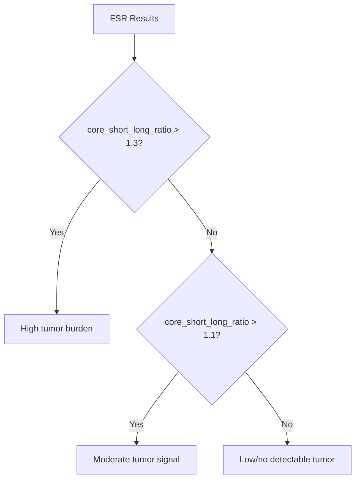
```mermaid
flowchart TD
    FSR[FSR Results] --> Q1{core_short_long_ratio > 1.3?}
    Q1 -->|Yes| HIGH[High tumor burden]
    Q1 -->|No| Q2{core_short_long_ratio > 1.1?}
    Q2 -->|Yes| MOD[Moderate tumor signal]
    Q2 -->|No| LOW[Low/no detectable tumor]
```

> **Note**: Thresholds depend on your cohort and should be validated against known samples.

---

## See Also

- [FSC](fsc.md) – Full 5-channel coverage
- [FSD](fsd.md) – Size distribution by arm
- [PON Models](../../reference/pon-models.md) – Normalization baselines
- [Glossary](../../reference/glossary.md) – Terminology reference
- [Citation](../../resources/citation.md) – DELFI paper references

---

# FILE: docs/features/core/wps.md

# Windowed Protection Score (WPS)

**Command**: `krewlyzer wps`

> **Plain English**: WPS measures how well nucleosomes protect DNA from cutting.
> Healthy cfDNA shows a regular ~190bp spacing pattern.
> Cancer disrupts this pattern - **lower `nrl_quality` = more tumor burden**.
>
> **Quick metric**: `nrl_quality > 0.7` = healthy, `< 0.5` = potentially abnormal

---

## Purpose
Computes ML-ready nucleosome and transcription factor protection profiles from cfDNA fragments around genomic anchors (TSS, CTCF sites) and global chromatin metrics from Alu elements.

---

## Biological Context

### What is WPS?

When DNA wraps around a nucleosome, the histone core **protects** ~147bp from enzymatic digestion. In cfDNA, fragments that span a nucleosome are "protected" (whole), while fragments that end at nucleosome boundaries are "fragmented" (cut).

**WPS Formula:**

$$
\text{WPS} = \text{Fragments}_{\text{spanning}} - \text{Fragments}_{\text{ending}}
$$

| WPS Value | Meaning | Biological Interpretation |
|-----------|---------|---------------------------|
| **Positive** | Protected | Nucleosome present (stable chromatin) |
| **Zero** | Balanced | Transition zone |
| **Negative** | Fragmented | Open chromatin (accessible DNA) |

### Dual-Stream Processing

Krewlyzer separates fragments into two biological signals:

| Stream | Window | Fragment Size | Weight | Biological Signal |
|--------|--------|---------------|--------|-------------------|
| **WPS-Nuc** | 120bp | [160-175bp] | 1.0 (primary) | **Nucleosome positioning** |
| | | [120-159] ∪ [176-180bp] | 0.5 (secondary) | Flanking nucleosomes |
| **WPS-TF** | 16bp | [35-80bp] | 1.0 | **Transcription factor footprints** |

The tiered weights for nucleosome fragments prioritize "perfect" mono-nucleosome sizes (~167bp) over edge cases.

### Python/Rust Architecture

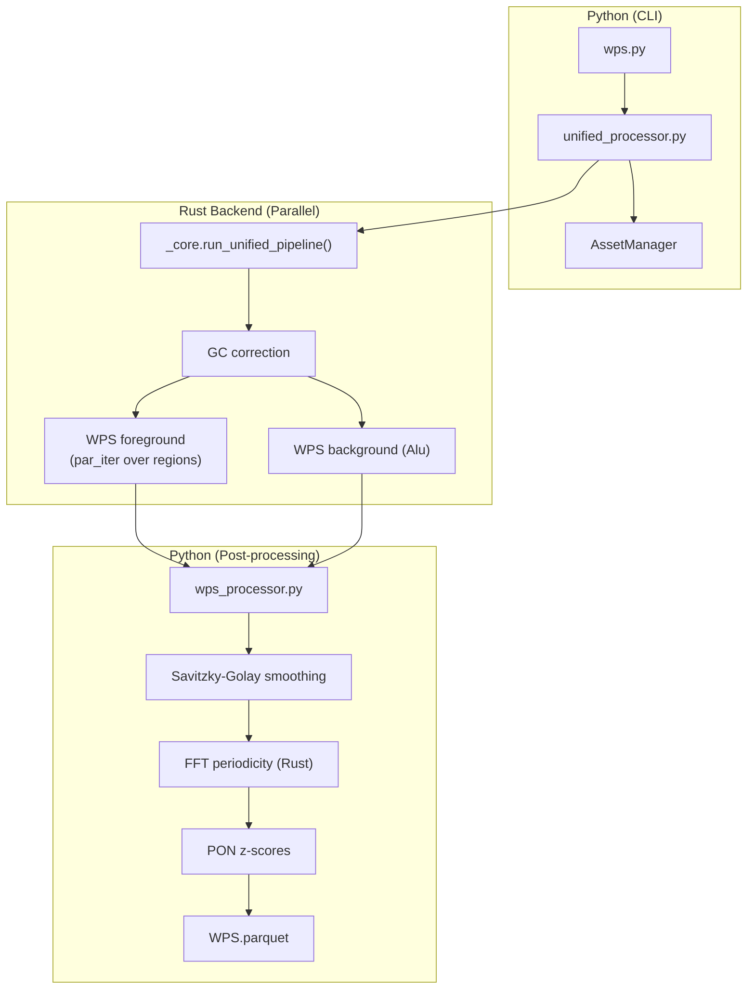
```mermaid
flowchart TB
    subgraph "Python (CLI)"
        CLI["wps.py"] --> UP["unified_processor.py"]
        UP --> ASSETS["AssetManager"]
    end
    
    subgraph "Rust Backend (Parallel)"
        UP --> RUST["_core.run_unified_pipeline()"]
        RUST --> GC["GC correction"]
        GC --> WPS_NUC["WPS foreground<br/>(par_iter over regions)"]
        GC --> WPS_BG["WPS background (Alu)"]
    end
    
    subgraph "Python (Post-processing)"
        WPS_NUC --> PROC["wps_processor.py"]
        WPS_BG --> PROC
        PROC --> SMOOTH["Savitzky-Golay smoothing"]
        SMOOTH --> FFT["FFT periodicity (Rust)"]
        FFT --> PON["PON z-scores"]
        PON --> OUT["WPS.parquet"]
    end
```

> **Performance**: Region-level parallelization via Rayon `par_iter()` enables efficient multi-core processing of anchor regions.

---

## Foreground vs Background

WPS generates **two complementary outputs** that capture different biological scales:

### Foreground (`sample.WPS.parquet`)

**What it is**: High-resolution WPS profiles around specific genomic anchors (TSS, CTCF sites).

**Why it matters**: Gene promoters and CTCF sites have characteristic nucleosome patterns:
- **Active promoters**: Nucleosome-depleted region (NDR) upstream of TSS
- **Silent promoters**: Packed nucleosomes across TSS
- **CTCF sites**: Sharp nucleosome boundaries (insulator function)

**ML use**: These 200-bin vectors are gene-specific signatures. Comparing them across cancer types reveals tissue-of-origin and tumor-specific disruptions.

```
                          TSS
                           |
    ←───── -1kb ─────      ↓      ───── +1kb ─────→
    [bin 0] ... [bin 99] [100] [bin 101] ... [bin 199]
```

### Background (`sample.WPS_background.parquet`)

**What it is**: Stacked WPS profiles from ~770,000 Alu elements across the genome.

**Why Alu elements?**

1. **Ubiquitous**: Alu elements are everywhere (~11% of human genome)
2. **Consistent size**: ~300bp (perfect for 2-nucleosome periodicity)
3. **No gene bias**: Not restricted to specific genes or pathways
4. **Robust signal**: Stacking 770K elements averages out noise

**What it measures**: When you stack all Alu WPS profiles, a **periodic wave** emerges at ~190bp (nucleosome repeat length). This periodicity reflects **global chromatin health**:

| Periodicity | Meaning | Cancer Implication |
|-------------|---------|-------------------|
| **Strong (~190bp)** | Regular nucleosome spacing | Healthy chromatin |
| **Weak/disrupted** | Irregular chromatin | Tumor burden, genomic instability |

**Hierarchical Groups**:
- `Global_All`: All Alu (highest SNR, best for QC)
- `Family_AluY/S/J`: Subfamily ages (~15M / ~35M / ~65M years)
- `Chr1_All` ... `ChrY_All`: Per-chromosome (CNV context)

---

## Post-Processing: Smoothing and FFT

### Savitzky-Golay Smoothing

**Purpose**: Reduce high-frequency noise while preserving peak shapes.

**How it works**: Fits a polynomial (order=3) to sliding windows (size=11) and uses the fitted value. Unlike moving average, it preserves peak heights and widths.

| Column | Description |
|--------|-------------|
| `wps_nuc_smooth` | Smoothed nucleosome profile |
| `wps_tf_smooth` | Smoothed TF profile |

**When to use**: Always use smoothed columns for visualization. Raw columns for debugging.

### FFT Periodicity Extraction

**Purpose**: Quantify the ~190bp nucleosome repeat length (NRL) from Alu stacking.

**How it works**:
1. **Detrend**: Remove linear trends from stacked profile
2. **Normalize**: Z-score to make amplitude comparable across samples
3. **Window**: Apply Hann window to reduce spectral leakage
4. **FFT**: Find dominant frequency in 150-250bp range
5. **SNR**: Compare peak amplitude to background

| Column | Description |
|--------|-------------|
| `nrl_period_bp` | Detected nucleosome repeat length |
| `nrl_amplitude` | FFT amplitude at dominant frequency |
| `nrl_snr` | Signal-to-noise ratio (peak vs background) |
| `nrl_quality` | 0-1 quality score (SNR/3, capped) |

**Expected values**:
- Healthy samples: NRL ~190bp, quality > 0.7
- Cancer samples: NRL shifted, quality < 0.5

---

## Usage

```bash
# Basic (auto-loads bundled assets)
krewlyzer wps -i sample.bed.gz -o output/ --genome hg38

# With explicit background override
krewlyzer wps -i sample.bed.gz -o output/ --background custom_alu.bed.gz

# Panel data (MSK-ACCESS)
krewlyzer wps -i sample.bed.gz -o output/ --target-regions msk_access_baits.bed --bait-padding 20

# Panel data with panel-specific anchors (recommended for MSK-ACCESS)
krewlyzer wps -i sample.bed.gz -o output/ \
    --wps-anchors /path/to/xs2.wps_anchors.bed.gz \
    --target-regions msk_access_baits.bed
```

### Panel-Specific WPS Anchors

For targeted panels like MSK-ACCESS, genome-wide WPS anchors include many regions with no coverage. Use **panel-specific anchors** for focused analysis:

| Assay | Bundled File | Anchors | Genes |
|-------|--------------|:-------:|:-----:|
| MSK-ACCESS v1 | `xs1.wps_anchors.bed.gz` | 1,611 | 128 |
| MSK-ACCESS v2 | `xs2.wps_anchors.bed.gz` | 1,820 | 146 |

**What's included:**
- **TSS anchors** for genes in the panel
- **CTCF anchors** within 100kb of panel genes

**Benefits:**
- Reduced noise from off-target regions
- Faster processing
- More interpretable ML features

## CLI Options

| Option | Short | Type | Default | Description |
|--------|-------|------|---------|-------------|
| `--input` | `-i` | PATH | *required* | Input .bed.gz file (output from extract) |
| `--output` | `-o` | PATH | *required* | Output directory |
| `--sample-name` | `-s` | TEXT | | Override sample name |
| `--wps-anchors` | | PATH | | WPS anchors BED (TSS+CTCF) for dual-stream profiling |
| `--assay` | `-A` | TEXT | | Assay code (xs1/xs2) for bundled assets |
| `--target-regions` | `-T` | PATH | | Panel capture BED (enables bait edge masking) |
| `--skip-target-regions` | | FLAG | | Force WGS mode (ignore bundled targets) |
| `--bait-padding` | | INT | 50 | Bait edge padding in bp |
| `--background` | `-B` | PATH | | Background Alu BED for hierarchical stacking |
| `--genome` | `-G` | TEXT | hg19 | Genome build (hg19/hg38) |
| `--pon-model` | `-P` | PATH | | PON model for z-score computation |
| `--pon-variant` | | TEXT | all_unique | PON variant: `all_unique` or `duplex` |
| `--skip-pon` | | FLAG | | Skip PON z-score normalization |
| `--empty` | | FLAG | False | Include regions with no coverage |
| `--gc-correct` | | FLAG | True | Apply GC bias correction |
| `--threads` | `-t` | INT | 0 | Number of threads (0=all cores) |
| `--verbose` | `-v` | FLAG | | Enable verbose logging |


### Bait Padding Trade-Off

The `--bait-padding` option controls how many bp to trim from bait edges to avoid capture artifacts.

| Value | Effect | Best For |
|-------|--------|----------|
| **50** (default) | Maximum artifact removal | WGS, large targets (>200bp) |
| **15-20** | Preserves data in small exons | Dense exon panels (MSK-ACCESS) |
| **0** | No trimming (not recommended) | Debugging only |

**Adaptive Safety**: The tool automatically reduces padding for small targets:
```
effective_trim = min(user_trim, target_length / 4)
```
This ensures you never mask more than 50% of a small exon (25% per side).

---

## Dual WPS Output (with `--assay`)

When using `--assay` (e.g., for MSK-ACCESS), Krewlyzer generates **two** WPS output files:

```bash
krewlyzer wps -i sample.bed.gz -o output/ --assay xs2
```

### Output Files

| File | Anchors | Purpose |
|------|---------|---------|
| `{sample}.WPS.parquet` | Genome-wide (~15k) | Global cancer detection signature |
| `{sample}.WPS.panel.parquet` | Panel genes (~2k) | Targeted gene-level profiling |

### Why Dual Output?

| Scenario | Use |
|----------|-----|
| **Pan-cancer detection** | Use `WPS.parquet` (genome-wide) |
| **Specific gene analysis** | Use `WPS.panel.parquet` (focused) |
| **Feature vectors for ML** | Combine both via [JSON output](../output/json-output.md) |

### How It Works

1. **First pass**: Genome-wide anchors (TSS+CTCF for ~5,000 genes)
2. **Second pass**: Panel-specific anchors (genes in your assay)

Both use the same pre-computed GC correction factors for consistency.

## Output Files

### Foreground: `sample.WPS.parquet`

Per-region profiles centered on TSS/CTCF anchors (±1kb, 200 bins × 10bp).

| Column | Type | Description |
|--------|------|-------------|
| `region_id` | string | Anchor identifier |
| `chrom` | string | Chromosome |
| `center` | int64 | Anchor center position |
| `strand` | string | +/- strand |
| `region_type` | string | TSS/CTCF |
| `wps_nuc` | float32[200] | Nucleosome WPS profile |
| `wps_tf` | float32[200] | TF WPS profile |
| `wps_nuc_smooth` | float32[200] | Savitzky-Golay smoothed |
| `wps_tf_smooth` | float32[200] | Savitzky-Golay smoothed |
| `prot_frac_nuc` | float32[200] | Protection fraction (nuc) |
| `prot_frac_tf` | float32[200] | Protection fraction (TF) |
| `capture_mask` | uint8[200] | Panel mask (1=reliable, 0=edge/off-target) |
| `local_depth` | float32 | Local fragment coverage |

> **Strand Correction**: All profiles are strand-corrected.
> - Genes on `+` strand are stored 5' → 3'
> - Genes on `-` strand are **reversed** so they are also 5' → 3'
> - **Result**: Bin 100 is always the TSS, and Bin 110 is always "+100bp downstream", regardless of gene orientation.

#### PON-Normalized Columns (v2.0)

When using a v2.0 vector PON, these additional columns are computed:

| Column | Type | Description |
|--------|------|-------------|
| `z_vector` | float32[200] | Position-wise z-scores vs healthy baseline |
| `shape_score` | float32 | Pearson correlation with healthy shape [-1, 1] |
| `z_amplitude` | float32 | Mean of abs(z_vector) for backward compat |

> [!TIP]
> **Shape Score Interpretation:**
> - **0.9-1.0**: Healthy nucleosome positioning
> - **0.5-0.9**: Mild chromatin disorganization
> - **<0.5**: Significant disruption (cancer signal)

See [PON v2.0](../../reference/pon-models.md#wps-baseline-wps_baseline) for baseline details.

### Background: `sample.WPS_background.parquet`

Hierarchical stacking of ~770K Alu elements into 29 groups.

| Column | Type | Description |
|--------|------|-------------|
| `group_id` | string | Group name (e.g., Global_All, Chr1_H, AluJb) |
| `stacked_wps_nuc` | float32[30] | Stacked nucleosome profile (200 bins) |
| `stacked_wps_tf` | float32[30] | Stacked TF profile |
| `stacked_wps_nuc_smooth` | float32[30] | Savitzky-Golay smoothed profile |
| `alu_count` | int64 | Number of Alu elements in group |
| `nrl_bp` | float32 | Nucleosome Repeat Length in bp (expected ~190bp) |
| `nrl_deviation_bp` | float32 | **NEW**: Absolute deviation from expected 190bp |
| `periodicity_score` | float32 | Raw SNR-based quality score (0-1) |
| `adjusted_score` | float32 | **NEW**: periodicity_score × deviation_penalty |

> **NRL Deviation Scoring**: The `adjusted_score` penalizes samples with abnormal NRL values.
> A sample with strong periodicity but wrong NRL (e.g., 170bp instead of 190bp) will have lower `adjusted_score`.

$$
\text{adjusted\_score} = \text{periodicity\_score} \times \max\left(0, 1 - \frac{|\text{nrl\_bp} - 190|}{50}\right)
$$

---

## WGS vs Panel Data (MSK-ACCESS)

| Aspect | WGS | Panel (MSK-ACCESS) |
|--------|-----|-------------------|
| **Foreground coverage** | All regions | Sparse off-target |
| **capture_mask** | All 1s | 1=on-target, 0=off-target |
| **Background Alu** | Full stacking | **Still works!** (Alu is global) |
| **Best ML features** | Gene-specific vectors | Global periodicity metrics |

**Key insight**: Background Alu stacking works for panels because Alu elements are genome-wide, not restricted to capture regions.

---

## ML Feature Summary

### From Foreground
- Gene-specific nucleosome disruption patterns
- TF binding footprints at promoters
- Tissue-of-origin signatures

### From Background
- **Global tumor burden**: Loss of periodicity correlates with tumor fraction
- **Subfamily ratios**: `Family_AluY / Family_AluJ` → Tissue context
- **Per-chromosome**: Chromatin disruption → CNV context

---

## References

> Snyder et al. (2016). Cell-free DNA comprises an in vivo nucleosome footprint that informs its tissues-of-origin. *Cell*, 164(1-2), 57-68.

## See Also

- [Input File Formats](../../reference/input-formats.md#wps-anchors) - WPS anchors BED6 format for `--wps-anchors`
- [PON Models](../../reference/pon-models.md) - Building and using PON
- [Troubleshooting](../../resources/troubleshooting.md) - Common issues

---

# FILE: docs/features/index.md

# Features Overview

Krewlyzer provides 11 standalone feature extraction commands plus a unified `run-all` pipeline.

## Quick Comparison

| Command | Input | Output | Primary Use Case |
|---------|-------|--------|------------------|
| [`extract`](core/extract.md) | BAM | `.bed.gz`, `.metadata.json` | Fragment extraction & GC factors |
| [`motif`](regulatory/motif.md) | BAM | `.EndMotif.tsv`, `.MDS.tsv` | Fragmentation patterns |
| [`fsc`](core/fsc.md) | BED.gz | `.FSC.tsv` | Copy number detection |
| [`fsr`](core/fsr.md) | BED.gz | `.FSR.tsv` | Tumor fraction estimation |
| [`fsd`](core/fsd.md) | BED.gz | `.FSD.tsv` | Size distribution analysis |
| [`wps`](core/wps.md) | BED.gz | `.WPS.tsv.gz` | Nucleosome positioning |
| [`ocf`](regulatory/ocf.md) | BED.gz | `.OCF.tsv` | Tissue of origin |
| [`region-entropy`](regulatory/region-entropy.md) | BED.gz | `.TFBS.tsv`, `.ATAC.tsv` | Regulatory region analysis |
| [`uxm`](methylation/uxm.md) | Bisulfite BAM | `.UXM.tsv` | Methylation deconvolution |
| [`mfsd`](core/fsd.md) | BAM + VCF/MAF | `.mFSD.tsv` | Mutant vs wild-type sizes |
| `run-all` | BAM | All outputs | Complete analysis |

---

## Workflow Diagram

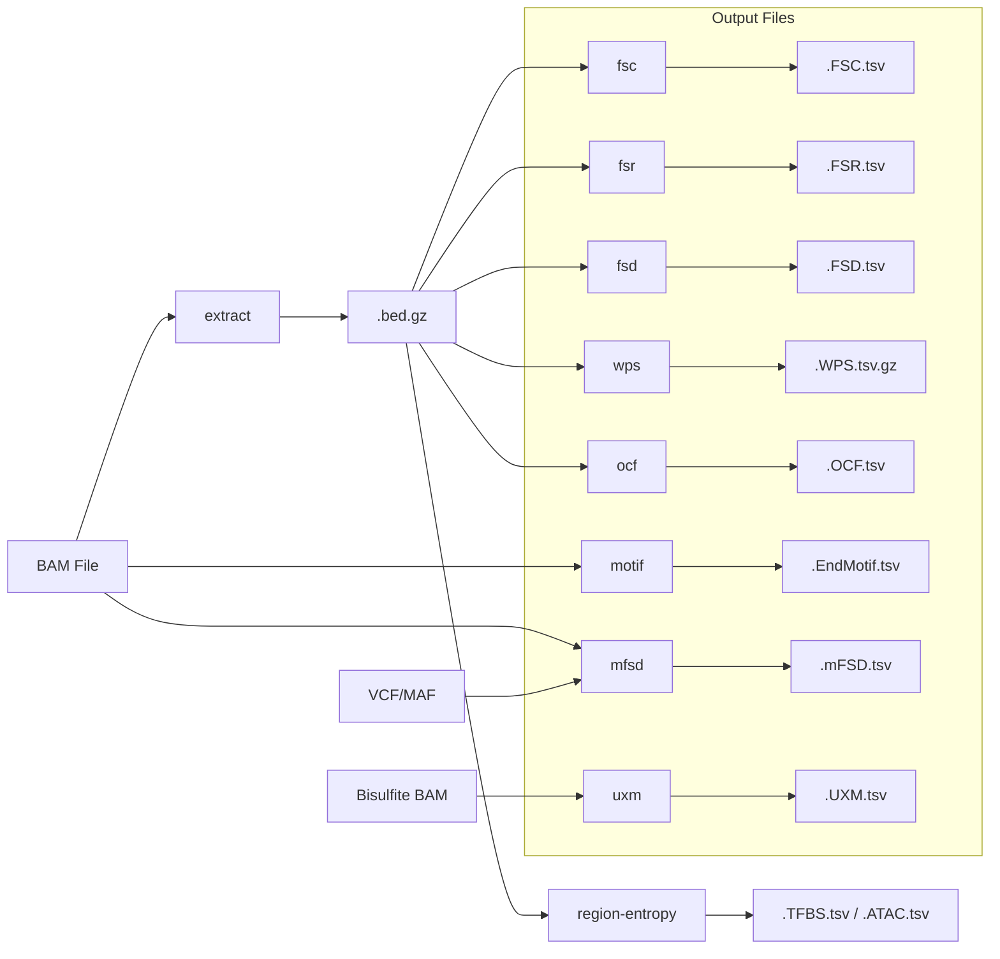
```mermaid
flowchart LR
    BAM[BAM File] --> extract
    extract --> BED[.bed.gz]
    BAM --> motif
    
    BED --> fsc
    BED --> fsr
    BED --> fsd
    BED --> wps
    BED --> ocf
    
    BAM --> mfsd
    VCF[VCF/MAF] --> mfsd
    
    BS_BAM[Bisulfite BAM] --> uxm
    
    subgraph outputs[Output Files]
        fsc --> FSC[.FSC.tsv]
        fsr --> FSR[.FSR.tsv]
        fsd --> FSD[.FSD.tsv]
        wps --> WPS[.WPS.tsv.gz]
        ocf --> OCF[.OCF.tsv]
        motif --> MOTIF[.EndMotif.tsv]
        mfsd --> MFSD[.mFSD.tsv]
        uxm --> UXM[.UXM.tsv]
    end
    
    BED --> tfbs[region-entropy]
    tfbs --> TFBS[.TFBS.tsv / .ATAC.tsv]
```

---

## Feature Categories

### Fragmentation Features

| Feature | Biological Signal | Clinical Application |
|---------|-------------------|---------------------|
| **FSC** | Fragment coverage by size class | CNV detection, copy number profiling |
| **FSR** | Short/Long fragment ratios | Tumor fraction estimation |
| **FSD** | Size distribution per arm | Nucleosome patterns, ctDNA detection |

### Nucleosome & Chromatin

| Feature | Biological Signal | Clinical Application |
|---------|-------------------|---------------------|
| **WPS** | Nucleosome protection scores | Tissue of origin, gene regulation |
| **OCF** | Open chromatin fragmentation | Tissue-specific cfDNA detection |
| **Motif** | End motif diversity (MDS) | Fragmentation patterns, cancer detection |
| **Region Entropy** | TFBS/ATAC size distribution | Regulatory element alterations, cancer detection |

### Specialized

| Feature | Biological Signal | Clinical Application |
|---------|-------------------|---------------------|
| **mFSD** | Mutant vs wild-type sizes | MRD monitoring, ctDNA quantification |
| **UXM** | Fragment methylation (U/X/M) | Cell-type deconvolution |

---

## Choosing Features

### For Cancer Detection
```bash
krewlyzer run-all sample.bam -r hg19.fa -o output/
# Focus on: FSR (tumor fraction), FSC (CNV), Motif (MDS)
```

### For Tissue of Origin
```bash
# Run WPS and OCF
krewlyzer wps -i sample.bed.gz -o output/
krewlyzer ocf -i sample.bed.gz -o output/
```

### For MRD Monitoring
```bash
# Compare mutant vs wild-type fragment sizes
krewlyzer mfsd -i sample.bam -V variants.vcf -o output/
```

### For Methylation Deconvolution
```bash
# Requires bisulfite sequencing BAM
krewlyzer uxm bisulfite.bam -o output/
```

---

## Common Options

All feature commands share these core options:

| Option | Description |
|--------|-------------|
| `-o, --output` | Output directory (required) |
| `-s, --sample-name` | Override sample name |
| `-G, --genome` | Genome build: hg19/hg38 |
| `-t, --threads` | Thread count (0=all) |
| `-v, --verbose` | Enable verbose logging |
| `-f, --format` | Output format: tsv, parquet, json |

See individual feature pages for command-specific options, or [JSON Output](output/json-output.md) for format details.

---

## Additional Resources

- **[JSON Output](output/json-output.md)** - Unified JSON for ML pipelines (`--generate-json`)
- **[Panel Mode](../guides/panel-mode.md)** - MSK-ACCESS and targeted panel analysis (`--assay`)
- **[PON Building](../guides/building-pon.md)** - Creating cohort baselines for z-score normalization

---

# FILE: docs/features/methylation/uxm.md

# Fragment-level Methylation (UXM)

**Command**: `krewlyzer uxm`

> **Plain English**: UXM analyzes methylation patterns to determine which cell types contributed cfDNA.
> Different tissues have unique methylation signatures—like a "fingerprint" for each cell type.
>
> **Use case**: Cell-type deconvolution - determine if cfDNA comes from liver, immune cells, tumor, etc.

---

## Purpose
Computes the proportions of Unmethylated (U), Mixed (X), and Methylated (M) fragments per genomic region for cell-type deconvolution.

---

## Processing Flowchart

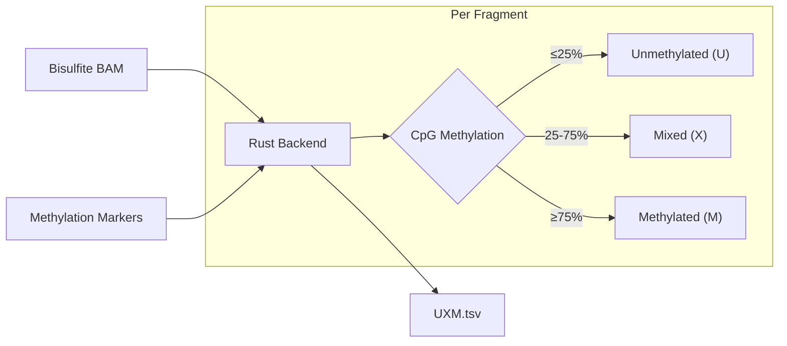
```mermaid
flowchart LR
    BAM["Bisulfite BAM"] --> RUST["Rust Backend"]
    MARKERS["Methylation Markers"] --> RUST
    
    RUST --> UXM["UXM.tsv"]
    
    subgraph "Per Fragment"
        RUST --> CLASS{"CpG Methylation"}
        CLASS -->|"≤25%"| U["Unmethylated (U)"]
        CLASS -->|"25-75%"| X["Mixed (X)"]
        CLASS -->|"≥75%"| M["Methylated (M)"]
    end
```

---

## Biological Context

Fragment-level methylation (UXM, [Loyfer et al., 2022](../../resources/citation.md#uxm)) reveals cell-of-origin and cancer-specific methylation patterns in cfDNA. Each fragment is classified by its CpG methylation level within marker regions.

---

## Usage

```bash
# Basic usage
krewlyzer uxm -i bisulfite.bam -o output_dir/ --genome hg19

# With custom marker file
krewlyzer uxm -i bisulfite.bam -o output/ \
    --mark-input custom_markers.bed.gz

# Paired-end mode
krewlyzer uxm -i bisulfite.bam -o output/ --type PE
```

## CLI Options

| Option | Short | Type | Default | Description |
|--------|-------|------|---------|-------------|
| `--input` | `-i` | PATH | *required* | Bisulfite sequencing BAM |
| `--output` | `-o` | PATH | *required* | Output directory |
| `--sample-name` | `-s` | TEXT | | Override sample name |
| `--mark-input` | `-m` | PATH | Auto | Path to genomic marker file |
| `--type` | | TEXT | SE | Sequencing type: SE or PE |
| `--genome` | `-G` | TEXT | hg19 | Genome build (hg19/hg38) |
| `--verbose` | `-v` | FLAG | | Enable verbose logging |
| `--threads` | `-t` | INT | 0 | Number of threads (0=all) |

---

## Output Format

Output: `{sample}.UXM.tsv`

| Column | Type | Description |
|--------|------|-------------|
| `region` | str | Marker region ID |
| `U_count` | int | Unmethylated fragments |
| `X_count` | int | Mixed fragments |
| `M_count` | int | Methylated fragments |
| `total` | int | Total fragments |
| `U_frac` | float | U / total |
| `X_frac` | float | X / total |
| `M_frac` | float | M / total |

---

## Fragment Classification

```
                   CpG Methylation Level
    ├──────────────┬──────────────┬──────────────┤
    0%            25%            75%           100%
    │      U      │      X       │      M      │
    │ Unmethylated│    Mixed     │ Methylated  │
```

| Class | Threshold | Interpretation |
|-------|-----------|----------------|
| **U** | ≤25% CpGs methylated | Cell-type specific unmethylated |
| **X** | 25-75% | Heterogeneous/mosaic |
| **M** | ≥75% CpGs methylated | Stably methylated |

---

## Clinical Interpretation

### Healthy cfDNA Composition

Based on the Human Methylation Atlas:

| Cell Type | Contribution |
|-----------|--------------|
| Megakaryocytes | ~31% |
| Granulocytes | ~30% |
| Monocytes/Macrophages | ~20% |
| Endothelial | ~6% |
| Hepatocytes | ~3% |
| Lymphocytes | ~3% |

### Cancer Detection

| Pattern | Interpretation |
|---------|----------------|
| Altered tissue proportions | Tumor shifts composition |
| Non-hematopoietic increase | Possible tumor cfDNA |
| Resolution | Can detect ~0.1% tumor fractions |

---

## See Also

- [Citation](../../resources/citation.md#uxm) - Loyfer et al. paper
- [Troubleshooting](../../resources/troubleshooting.md) - Common issues

---

# FILE: docs/features/output/json-output.md

# Unified JSON Output

The `--generate-json` flag produces a single JSON file containing all features for ML integration.

## Enabling JSON Output

```bash
krewlyzer run-all -i sample.bam -r hg19.fa -o out/ \
    --generate-json
```

This generates `{sample}.features.json` alongside the standard TSV/Parquet outputs.

## Output Structure

```json
{
  "sample_id": "sample_001",
  "metadata": {
    "genome": "hg19",
    "assay": "xs2",
    "panel_mode": true,
    "on_target_rate": 0.45,
    "timestamp": "2024-01-20T00:00:00"
  },
  "fsc": { ... },
  "fsc_gene": { ... },
  "fsc_region": { ... },
  "fsc_region_e1": { ... },
  "fsr": { ... },
  "fsd": { ... },
  "wps": { ... },
  "wps_panel": { ... },
  "wps_background": { ... },
  "motif": { ... },
  "ocf": { ... },
  "tfbs": { ... },
  "atac": { ... },
  "gc_factors": { ... }
}
```

---

## Feature Schemas

### FSC (Fragment Size Coverage)

Window-based fragment size counts with z-scores.

```json
"fsc": {
  "n_windows": 2534,
  "data": [
    {
      "region": "chr1:0-500000",
      "ultra_short": 123,
      "core_short": 4567,
      "mono_nucl": 8901,
      "di_nucl": 2345,
      "long": 678,
      "total": 16614,
      "log_ratio_core_short": -0.15,
      "log_ratio_mono_nucl": 0.02,
      "zscore_core_short": -1.23
    }
  ]
}
```

| Field | Type | Description |
|-------|------|-------------|
| `region` | string | Genomic window coordinates |
| `ultra_short` | int | Fragments 65-99bp |
| `core_short` | int | Fragments 100-149bp |
| `mono_nucl` | int | Fragments 150-259bp |
| `di_nucl` | int | Fragments 260-399bp |
| `long` | int | Fragments 400+bp |
| `log_ratio_*` | float | Log2(observed/expected) vs PON |
| `zscore_*` | float | Z-score vs PON (if PON provided) |

---

### FSC Gene (Panel Mode Only)

Gene-level fragment size aggregation. Only present with `--assay`.

```json
"fsc_gene": [
  {
    "gene": "ATM",
    "n_regions": 62,
    "total_bp": 8432,
    "ultra_short": 1234,
    "core_short": 5678,
    "mono_nucl": 9012,
    "core_short_ratio": 0.282,
    "normalized_depth": 1245.67,
    "z_core_short": -0.45
  }
]
```

---

### FSC Region (Panel Mode Only)

Per-exon/target fragment size data. More granular than gene-level.

```json
"fsc_region": [
  {
    "chrom": "1",
    "start": 11168235,
    "end": 11168345,
    "gene": "MTOR",
    "region_name": "MTOR_target_02",
    "region_bp": 110,
    "ultra_short": 8.0,
    "core_short": 229.0,
    "mono_nucl": 804.0,
    "di_nucl": 88.0,
    "total": 1129.0,
    "normalized_depth": 1272.71
  }
]
```

| Field | Type | Description |
|-------|------|-------------|
| `region_name` | string | Unique exon/target identifier |
| `normalized_depth` | float | RPKM-like depth: (count × 10⁹) / (bp × total_frags) |

---

### FSC Region E1 (Panel Mode Only)

First exon (E1) per gene, filtered from `fsc_region`. E1 serves as a promoter-proximal proxy with stronger cancer signal (Helzer et al. 2025).

```json
"fsc_region_e1": [
  {
    "chrom": "14",
    "start": 105238685,
    "end": 105238805,
    "gene": "AKT1",
    "region_name": "exon_AKT1_15a_1",
    "region_bp": 120,
    "ultra_short": 19.0,
    "mono_nucl": 635.0,
    "total": 1082.0,
    "normalized_depth": 3039.77
  }
]
```

> [!TIP]
> Use `fsc_region_e1` for **early cancer detection** models where promoter fragmentation changes are a primary signal.

### FSR (Fragment Size Ratios)

Biomarker ratios for tumor detection.

```json
"fsr": {
  "n_windows": 2534,
  "data": [
    {
      "region": "chr1:0-500000",
      "ultra_short_ratio": 0.0074,
      "core_short_ratio": 0.275,
      "mono_nucl_ratio": 0.536,
      "di_nucl_ratio": 0.141,
      "long_ratio": 0.041,
      "core_short_long_ratio": 6.73
    }
  ]
}
```

| Field | Type | Description |
|-------|------|-------------|
| `*_ratio` | float | Fraction of total fragments |
| `core_short_long_ratio` | float | Primary cancer biomarker (higher = more tumor) |

---

### FSD (Fragment Size Distribution)

Per-arm size distribution profiles.

```json
"fsd": {
  "arms": ["1p", "1q", "2p", ...],
  "size_bins": [65, 70, 75, ..., 395, 400],
  "data": {
    "1p": {
      "counts": [123, 456, 789, ...],
      "proportions": [0.001, 0.004, 0.007, ...]
    }
  }
}
```

---

### WPS (Windowed Protection Score)

Nucleosome positioning profiles around gene TSS/CTCF sites.

```json
"wps": {
  "n_anchors": 15234,
  "columns": ["region_id", "chrom", "start", "end", 
              "wps_nuc_mean", "wps_tf_mean", "prot_frac_nuc", "prot_frac_tf",
              "wps_nuc_z", "wps_tf_z", "ndr_depth"],
  "data": [
    {
      "region_id": "ENSG00000142611_TSS",
      "chrom": "chr1",
      "start": 11166102,
      "end": 11166502,
      "wps_nuc_mean": 24.5,
      "wps_tf_mean": -3.2,
      "prot_frac_nuc": 0.62,
      "prot_frac_tf": 0.41,
      "wps_nuc_z": 1.2,
      "ndr_depth": 15.3
    }
  ]
}
```

| Field | Type | Description |
|-------|------|-------------|
| `wps_nuc_mean` | float | Mean nucleosomal WPS (120-180bp fragments) |
| `wps_tf_mean` | float | Mean TF footprint WPS (35-80bp fragments) |
| `prot_frac_*` | float | Protected fraction (values > 0) |
| `wps_*_z` | float | Z-score vs PON |
| `ndr_depth` | float | Nucleosome-depleted region depth |

---

### WPS Panel (Panel Mode Only)

Same schema as `wps`, but filtered to panel gene anchors.

```json
"wps_panel": {
  "n_anchors": 1820,
  "data": [ ... ]
}
```

---

### WPS Background

Alu element stacking scores for global fragmentation.

```json
"wps_background": {
  "n_elements": 142567,
  "data": [
    {
      "region_id": "AluSx_chr1_12345",
      "stacking_score": 0.78,
      "coverage": 45.2
    }
  ]
}
```

---

### Motif

End motif (EDM) k-mer frequencies and diversity score.

```json
"motif": {
  "end_motif": {
    "AAAA": 0.0042,
    "AAAC": 0.0039,
    ...
  },
  "breakpoint_motif": {
    "AAAA": 0.0038,
    ...
  },
  "mds": 0.8234,
  "mds_z": -1.23
}
```

| Field | Type | Description |
|-------|------|-------------|
| `end_motif` | dict | 256 4-mer frequencies (fragment ends) |
| `breakpoint_motif` | dict | 256 4-mer frequencies (breakpoints) |
| `mds` | float | Motif Diversity Score |
| `mds_z` | float | MDS z-score vs PON (if PON with MDS baseline) |

---

### OCF (Orientation-aware cfDNA Fragmentation)

Open chromatin footprint scores by tissue type.

```json
"ocf": {
  "tissues": ["Liver", "Lung", "Colon", "Placenta", ...],
  "scores": {
    "Liver": 0.42,
    "Lung": 0.31,
    "Colon": 0.28
  }
}
```

---

### TFBS (Transcription Factor Binding Site Entropy)

Fragment size entropy at TFBS regions.

```json
"tfbs": {
  "off_target": [
    {
      "region": "CTCF_chr1_12345",
      "entropy": 3.45,
      "n_fragments": 234,
      "mean_size": 167.5
    }
  ],
  "on_target": [ ... ]
}
```

---

### ATAC (Chromatin Accessibility Regions)

Fragment size entropy at ATAC-seq accessible regions.

```json
"atac": {
  "off_target": [
    {
      "region": "peak_chr1_23456",
      "entropy": 3.21,
      "n_fragments": 189,
      "mean_size": 145.2
    }
  ],
  "on_target": [ ... ]
}
```

---

### GC Factors (Diagnostic)

GC bias correction factors used internally during processing.

> [!NOTE]
> **Not recommended for ML features.** These are intermediate diagnostic data, not predictive features.
> The GC correction is already applied to FSC/FSR/FSD counts. Use those corrected values instead.

```json
"gc_factors": {
  "off_target": [
    {
      "len_bin": 100,
      "gc_pct": 45,
      "correction_factor": 1.12
    }
  ],
  "on_target": [ ... ]
}
```

**When to use GC factors:**
- **QC/Diagnostics**: Visualize library prep bias, capture efficiency
- **Batch Effect Detection**: Compare correction factors across runs
- **Panel Development**: Characterize probe GC performance

**When NOT to use:**
- **ML models**: Skip these—use GC-corrected FSC/FSR/FSD instead

---

## ML Integration Example

```python
import json
import pandas as pd

# Load features
with open("sample.features.json") as f:
    features = json.load(f)

# Extract FSC gene-level for panel analysis
if "fsc_gene" in features:
    df_genes = pd.DataFrame(features["fsc_gene"])
    print(f"Gene FSC: {len(df_genes)} genes")

# Extract WPS for nucleosome signature
wps_data = pd.DataFrame(features["wps"]["data"])
print(f"WPS anchors: {len(wps_data)}")

# Use motif MDS z-score as feature
mds_z = features["motif"].get("mds_z", 0)
print(f"MDS z-score: {mds_z:.2f}")
```

---

## JSON Generation with Panel Mode

For MSK-ACCESS panels:

```bash
krewlyzer run-all -i sample.bam -r hg19.fa -o out/ \
    --assay xs2 \
    --target-regions targets.bed \
    --pon-model xs2.pon.parquet \
    --generate-json
```

This produces JSON with all panel-specific features:
- `fsc_gene`: 146 genes
- `wps_panel`: 1,820 anchors
- `wps_background`: Alu stacking
- PON z-scores across all features

---

## Output File Structure

Krewlyzer generates TSV/Parquet files alongside the optional unified JSON:

### Core Fragmentomics

```
out/
├── sample.FSD.tsv                   # Fragment size distribution (arm-level)
├── sample.FSD.ontarget.tsv          # Panel mode: on-target FSD
├── sample.FSR.tsv                   # Fragment size ratio (short/long)
├── sample.FSR.ontarget.tsv          # Panel mode: on-target FSR
├── sample.FSC.tsv                   # Fragment size coverage (bin-level)
├── sample.FSC.ontarget.tsv          # Panel mode: on-target FSC
├── sample.FSC.gene.tsv              # Gene-level FSC (with --assay)
├── sample.FSC.regions.tsv           # Exon-level FSC (aggregate_by='region')
├── sample.FSC.regions.e1only.tsv    # E1-only FSC (first exon per gene)
└── sample.correction_factors.tsv    # GC correction factors
```

### WPS (Windowed Protection Score)

```
out/
├── sample.WPS.parquet               # Per-region WPS profiles (foreground)
├── sample.WPS.panel.parquet         # Panel-specific anchors (with --assay)
└── sample.WPS_background.parquet    # Alu stacking profiles (background)
```

### Motif & Tissue-of-Origin

```
out/
├── sample.EndMotif.tsv              # 4-mer end motif frequencies
├── sample.MDS.tsv                   # Motif diversity score
├── sample.OCF.tsv                   # Orientation-aware fragmentation
├── sample.OCF.ontarget.tsv          # Panel mode: on-target OCF
└── sample.OCF.sync.tsv              # OCF sync scores
```

### Region Entropy (TFBS/ATAC)

```
out/
├── sample.TFBS.tsv                  # TF binding site entropy (808 factors)
├── sample.TFBS.ontarget.tsv         # Panel mode: on-target TFBS
├── sample.ATAC.tsv                  # ATAC-seq peak entropy (23 cancer types)
└── sample.ATAC.ontarget.tsv         # Panel mode: on-target ATAC
```

### Unified Output

```
out/
├── sample.metadata.json             # Run metadata and QC metrics
└── sample.features.json             # All features (with --generate-json)
```

> [!NOTE]
> The `--generate-json` flag produces the unified JSON **in addition to** the standard TSV/Parquet outputs.

---

## See Also

- [Pipeline Integration](../../nextflow/index.md) - `run-all` command and `--generate-json` flag
- [Input File Formats](../../reference/input-formats.md) - Custom input file specifications
- [Troubleshooting](../../resources/troubleshooting.md) - Common format issues


---

# FILE: docs/features/regulatory/motif.md

# Motif-based Feature Extraction

**Command**: `krewlyzer motif`

> **Plain English**: Motif analysis looks at the 4-letter DNA sequences at fragment ends.
> Different enzymes cut DNA at different sequences—tumors have more diverse cutting patterns.
>
> **Key metric**: MDS (Motif Diversity Score) - **higher MDS = more abnormal cutting = potential tumor signal**

---

## Purpose
Extracts end motif, breakpoint motif, and Motif Diversity Score (MDS) from sequencing fragments.

---

## Processing Flowchart

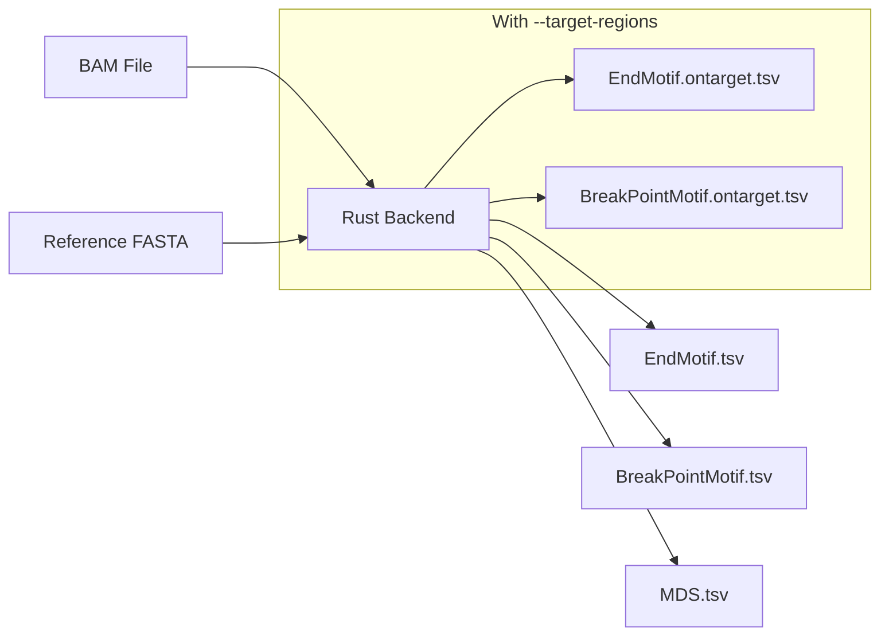
```mermaid
flowchart LR
    BAM[BAM File] --> RUST[Rust Backend]
    REF[Reference FASTA] --> RUST
    RUST --> EM["EndMotif.tsv"]
    RUST --> BM["BreakPointMotif.tsv"]
    RUST --> MDS["MDS.tsv"]
    
    subgraph "With --target-regions"
        RUST --> EM_ON["EndMotif.ontarget.tsv"]
        RUST --> BM_ON["BreakPointMotif.ontarget.tsv"]
    end
```

---

## Biological Context
Motif analysis of cfDNA fragment ends reveals tissue-of-origin, nucleosome positioning, and nuclease activity. MDS quantifies motif diversity, which may be altered in cancer. See [Zhou et al., 2020](../../resources/citation.md#motif) for details.

---

## Usage
```bash
krewlyzer motif -i /path/to/input.bam -r /path/to/reference.fa -o /path/to/output_dir \
    -k 4 --threads 4
```

## Options

| Option | Short | Type | Default | Description |
|--------|-------|------|---------|-------------|
| `--input` | `-i` | PATH | *required* | Input BAM file |
| `--reference` | `-r` | PATH | *required* | Reference genome FASTA (indexed) |
| `--output` | `-o` | PATH | *required* | Output directory |
| `--genome` | `-G` | TEXT | hg19 | Genome build (hg19/hg38) |
| `--target-regions` | `-T` | PATH | | Target BED (for on/off-target motifs) |
| `--skip-target-regions` | | FLAG | | Force WGS mode (ignore bundled targets) |
| `--assay` | `-A` | TEXT | | Assay code (xs1/xs2) for bundled assets |
| `--pon-model` | `-P` | PATH | | PON model for MDS z-score computation |
| `--pon-variant` | | TEXT | all_unique | PON variant: `all_unique` or `duplex` |
| `--skip-pon` | | FLAG | | Skip PON z-score normalization |
| `--kmer` | `-k` | INT | 4 | K-mer size for motif extraction |
| `--chromosomes` | | TEXT | | Comma-separated chromosomes to process |
| `--sample-name` | `-s` | TEXT | | Override sample name |
| `--require-proper-pair` | | FLAG | True | Require proper pairs (disable for duplex) |
| `--verbose` | `-v` | FLAG | | Enable verbose logging |
| `--threads` | `-t` | INT | 0 | Number of threads (0=all) |

---

## Output Files

| File | Description |
|------|-------------|
| `{sample}.EndMotif.tsv` | K-mer frequencies at fragment 5' ends |
| `{sample}.BreakPointMotif.tsv` | K-mer frequencies flanking breakpoints |
| `{sample}.MDS.tsv` | Motif Diversity Score |
| `{sample}.EndMotif1mer.tsv` | **NEW** 1-mer frequencies with C-end fraction (Jagged Index) |

---

## Jagged Index (1-mer End Motifs)

The Jagged Index captures the fraction of fragment ends terminating with Cytosine (C), which is elevated in tumor-derived cfDNA with "jagged" single-stranded overhangs.

### Output: EndMotif1mer.tsv

```tsv
base    count     fraction
A       661428    0.188214
C       1261449   0.358953    # ← C-end fraction
G       849433    0.241712
T       741931    0.211121
# c_fraction    0.358953
# entropy       1.952998
# c_bias        0.108953
```

### Metrics

| Metric | Formula | Interpretation |
|--------|---------|----------------|
| `c_fraction` | C_count / total_count | Fraction of C-ending fragments |
| `entropy` | Shannon entropy (0-2 bits) | Randomness of 1-mer distribution |
| `c_bias` | c_fraction - 0.25 | Deviation from expected 25% |

### C-End Fraction Interpretation

| c_fraction | c_bias | Interpretation |
|------------|--------|----------------|
| 0.25-0.30 | 0 to +0.05 | Normal / healthy-like |
| 0.30-0.35 | +0.05 to +0.10 | Mildly elevated (possible tumor) |
| >0.35 | >0.10 | **Elevated** (tumor signal) |

### Biological Basis

cfDNA fragmentation by DNASE1L3 produces fragments with single-stranded 5' overhangs ("jagged ends"). Tumor-derived cfDNA shows:
- **~87.8% jagged ends** (vs lower in healthy)
- **Higher C-end fraction** due to preferential C-terminal cutting

> [!TIP]
> The C-end fraction complements MDS for detecting tumor-derived cfDNA.
> Use both metrics together for improved sensitivity.

---

## Formulas

### Motif Diversity Score (MDS)

MDS quantifies the randomness of 4-mer end motifs using normalized Shannon entropy:

$$
\text{MDS} = \frac{-\sum_{i} p_i \times \log_2(p_i)}{\log_2(4^k)}
$$

**Variables:**
- $p_i$ = frequency of the i-th motif
- $k$ = k-mer length (default: 4)
- Result range: $[0, 1]$

**Interpretation:**
| MDS Value | Meaning |
|-----------|---------|
| ~1.0 | Random/diverse (healthy-like) |
| < 0.8 | Stereotyped (possible tumor signal) |

---

## PON Normalization

When `--pon-model` is provided, MDS output includes z-score normalization:

```bash
krewlyzer motif -i sample.bam -r hg19.fa -o output/ \
    --pon-model healthy_cohort.pon.parquet
```

### Output Columns with PON

| Column | Formula | Description |
|--------|---------|-------------|
| `MDS` | Shannon entropy | Raw score (0-1) |
| `mds_z` | `(MDS - PON_mean) / PON_std` | Z-score vs healthy baseline |

### Z-Score Interpretation

| mds_z | Meaning |
|-------|---------|
| -2 to +2 | Within normal range |
| < -2 | **Abnormally low diversity** (possible tumor) |
| > +2 | Rare (check data quality) |

> [!TIP]
> Lower MDS (negative z-score) indicates stereotyped cutting patterns often associated with tumor-derived cfDNA.

---

## Panel Mode (--target-regions)

When `--target-regions` is provided, motif analysis produces **separate outputs** for on-target and off-target fragments:

```bash
krewlyzer motif -i sample.bam -r hg19.fa -o output/ \
    --target-regions MSK-ACCESS_targets.bed
```

### Outputs in Panel Mode

| File | Contents | Use Case |
|------|----------|----------|
| `{sample}.EndMotif.tsv` | **Off-target** fragments | Unbiased global motif signal |
| `{sample}.EndMotif.ontarget.tsv` | **On-target** fragments | Local capture region analysis |
| `{sample}.MDS.tsv` | Off-target MDS | Primary biomarker |

> [!IMPORTANT]
> **Off-target = unbiased** – preferred for fragmentomics biomarkers.  
> **On-target = capture-biased** – use cautiously; reflects library prep artifacts.

### Why Split?

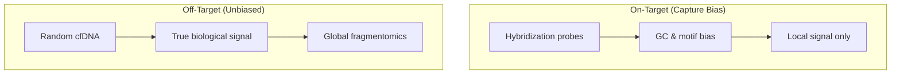
```mermaid
flowchart TB
    subgraph "On-Target (Capture Bias)"
        CAP["Hybridization probes"] --> BIAS["GC & motif bias"]
        BIAS --> LOCAL["Local signal only"]
    end
    
    subgraph "Off-Target (Unbiased)"
        WGS["Random cfDNA"] --> PURE["True biological signal"]
        PURE --> GLOBAL["Global fragmentomics"]
    end
```

For panel data (MSK-ACCESS), on-target fragments have capture bias from hybridization probes. Off-target reads represent unbiased cfDNA and should be used for motif biomarkers.

---

## Clinical Interpretation

| Metric | Healthy | Cancer (ctDNA) |
|--------|---------|----------------|
| MDS | Higher (random) | Lower (stereotyped) |
| Jagged ends | Lower | **Higher** (87.8% jagged) |
| Specific motifs | Baseline | Cancer-associated enriched |

### Biological Basis
- cfDNA fragmentation driven by nucleases (DNASE1, DNASE1L3)
- ~87.8% of cfDNA molecules have jagged (single-stranded) ends
- Tumor-derived fragments show higher jaggedness than wild-type

---

## See Also

- [Citation & Scientific Background](../../resources/citation.md#motif) - Zhou et al. paper
- [Troubleshooting](../../resources/troubleshooting.md) - Common issues

---

# FILE: docs/features/regulatory/ocf.md

# Orientation-aware Fragmentation (OCF)

**Command**: `krewlyzer ocf`

> **Plain English**: OCF detects where cfDNA fragments came from by looking at their "orientation" near regulatory regions.
> Different tissues cut DNA in different directions—OCF captures this signal for tissue-of-origin detection.
>
> **Use case**: Identify liver cancer vs. colon cancer based on cfDNA fragmentation patterns.

---

## Purpose
Computes orientation-aware cfDNA fragmentation (OCF) values in tissue-specific open chromatin regions. Enables tissue-of-origin analysis from cfDNA.

---

## Processing Flowchart

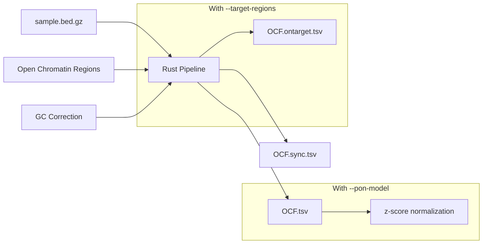
```mermaid
flowchart LR
    BED["sample.bed.gz"] --> RUST["Rust Pipeline"]
    OCR["Open Chromatin Regions"] --> RUST
    GC["GC Correction"] --> RUST
    
    RUST --> OCF["OCF.tsv"]
    RUST --> SYNC["OCF.sync.tsv"]
    
    subgraph "With --pon-model"
        OCF --> PON["z-score normalization"]
    end
    
    subgraph "With --target-regions"
        RUST --> OCF_ON["OCF.ontarget.tsv"]
    end
```

> [!WARNING]
> OCF regions are **only available for GRCh37/hg19**. For hg38, you must provide a custom OCR file with `-r/--ocr-input`.

### Python/Rust Architecture

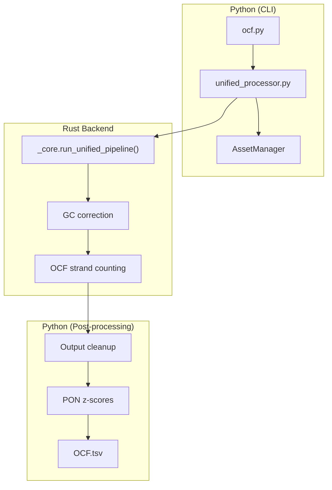
```mermaid
flowchart TB
    subgraph "Python (CLI)"
        CLI["ocf.py"] --> UP["unified_processor.py"]
        UP --> ASSETS["AssetManager"]
    end
    
    subgraph "Rust Backend"
        UP --> RUST["_core.run_unified_pipeline()"]
        RUST --> GC["GC correction"]
        GC --> OCF_CALC["OCF strand counting"]
    end
    
    subgraph "Python (Post-processing)"
        OCF_CALC --> PROC["Output cleanup"]
        PROC --> PON["PON z-scores"]
        PON --> OUT["OCF.tsv"]
    end
```

---

## Biological Context

OCF ([Sun et al., 2019](../../resources/citation.md#ocf)) measures the phasing of upstream (U) and downstream (D) fragment ends in open chromatin regions, informing tissue-of-origin of cfDNA.

---

## Usage
```bash
# Basic usage
krewlyzer ocf -i sample.bed.gz -o output_dir/ --genome hg19

# With PON for z-scores
krewlyzer ocf -i sample.bed.gz -o output/ -P tissue.pon.parquet

# Panel data with on/off-target split
krewlyzer ocf -i sample.bed.gz -o output/ \
    --target-regions MSK-ACCESS_targets.bed
```

## CLI Options

| Option | Short | Type | Default | Description |
|--------|-------|------|---------|-------------|
| `--input` | `-i` | PATH | *required* | Input .bed.gz file |
| `--output` | `-o` | PATH | *required* | Output directory |
| `--sample-name` | `-s` | TEXT | | Override sample name |
| `--ocr-input` | `-r` | PATH | | Open chromatin regions file |
| `--target-regions` | `-T` | PATH | | Target BED (for on/off-target split) |
| `--skip-target-regions` | | FLAG | | Force WGS mode (ignore bundled targets) |
| `--assay` | `-A` | TEXT | | Assay code (xs1/xs2) for bundled assets |
| `--genome` | `-G` | TEXT | hg19 | Genome build (hg19/hg38) |
| `--pon-model` | `-P` | PATH | | PON model for z-score computation |
| `--pon-variant` | | TEXT | all_unique | PON variant: `all_unique` or `duplex` |
| `--skip-pon` | | FLAG | | Skip PON z-score normalization |
| `--gc-correct` | | FLAG | True | Apply GC bias correction |
| `--verbose` | `-v` | FLAG | | Enable verbose logging |
| `--threads` | `-t` | INT | 0 | Number of threads (0=all) |

---

## Output Files

| File | Description |
|------|-------------|
| `{sample}.OCF.tsv` | Summary OCF per tissue type |
| `{sample}.OCF.sync.tsv` | Detailed sync scores |

---

## Formulas

### OCF Score Calculation

$$
\text{OCF} = \sum \left( \text{Right}_{-60} + \text{Left}_{+60} \right) - \sum \left( \text{Left}_{-60} + \text{Right}_{+60} \right)
$$

Where:
- $\text{Right}_{-60}$ = Right fragment ends at -60bp from OCR center (phased)
- $\text{Left}_{+60}$ = Left fragment ends at +60bp from OCR center (phased)
- $\text{Left}_{-60}$, $\text{Right}_{+60}$ = Background (unphased)

**Calculation Details:**
1. Fragments are mapped relative to the **center** of the Open Chromatin Region (OCR)
2. Left/Right ends counted in 10bp bins across ±1000bp window
3. Counts normalized by total sequencing depth

---

## PON Normalization

When `--pon-model` is provided, OCF output includes z-score columns:

### Output Columns with PON

| Column | Formula | Description |
|--------|---------|-------------|
| `OCF` | Raw OCF score | Phased fragment orientation |
| `ocf_z` | `(OCF - PON_mean) / PON_std` | Z-score vs healthy baseline |

### Z-Score Interpretation

| ocf_z | Meaning |
|-------|---------|
| -2 to +2 | Normal tissue contribution |
| > +2 | **Elevated tissue signal** (possible tumor origin) |
| < -2 | Decreased tissue contribution |

---

## Panel Mode

For targeted sequencing panels (MSK-ACCESS):

```bash
krewlyzer ocf -i sample.bed.gz -o output/ \
    --target-regions MSK-ACCESS_targets.bed
```

### How Panel OCF Works

In panel mode, OCF produces two complementary outputs using a sophisticated two-pass approach:

```mermaid
flowchart TB
    subgraph "Pass 1: Genome-Wide"
        OCR1["All 50K OCR regions"] --> RUN1["OCF analysis"]
        FRAGS1["All fragments"] --> RUN1
        RUN1 --> OCF["OCF.tsv"]
        RUN1 --> SYNC["OCF.sync.tsv"]
    end
    
    subgraph "Pass 2: Panel-Focused"
        OCR2["Panel OCRs (~500)"] --> RUN2["OCF analysis"]
        TARGET["Target regions"] --> FILTER["Filter OCRs"]
        OCR1 --> FILTER
        FILTER --> OCR2
        FRAGS2["On-target frags"] --> RUN2
        RUN2 --> OCFON["OCF.ontarget.tsv"]
    end
```

### Panel OCF Regions

Before the ontarget OCF run, the genome-wide OCR atlas (~50,000 regions) is filtered to keep only regions that overlap with panel targets (+2kb promoter extension). For a typical panel like MSK-ACCESS:

| | Genome-Wide | Panel-Filtered |
|--|------------|----------------|
| **OCR regions** | ~50,000 | ~500 |
| **Noise reduction** | - | ~99% |

### Output Files

| File | Fragment Source | OCR Regions | Use Case |
|------|-----------------|-------------|----------|
| `{sample}.OCF.tsv` | All fragments | All ~50K | Unbiased genome-wide tissue signal |
| `{sample}.OCF.ontarget.tsv` | **On-target only** | **Panel ~500** | Panel-focused tissue signal |
| `{sample}.OCF.sync.tsv` | All fragments | All ~50K | Debugging/visualization |
| `{sample}.OCF.ontarget.sync.tsv` | On-target only | Panel ~500 | Panel OCF detail |
| `{sample}.OCF.offtarget.tsv` | Off-target only | All ~50K | Off-target baseline |
| `{sample}.OCF.offtarget.sync.tsv` | Off-target only | All ~50K | Off-target detail |

> [!NOTE]
> The `ontarget` naming is consistent with other features (FSD.ontarget, FSC.ontarget).
> For OCF, ontarget means **both** on-target fragments **AND** panel-filtered OCR regions.

### Why Both Filters?

```mermaid
flowchart LR
    subgraph "On-Target Fragments"
        CAP["Captured near panel genes"]
    end
    
    subgraph "Panel OCR Regions"
        POCR["OCRs near panel genes"]
    end
    
    CAP --> BOTH["Same genomic space"]
    POCR --> BOTH
    BOTH --> SIGNAL["Maximum signal-to-noise"]
```

On-target fragments and panel OCR regions both focus on the same genomic space (near panel target genes), so combining both filters maximizes the signal-to-noise ratio for tissue-of-origin detection.

### Example: MSK-ACCESS Panel

| Tissue | OCF.tsv (Genome-Wide) | OCF.ontarget.tsv (Panel) |
|--------|----------------------|--------------------------|
| Liver | 265.3 | 52.8 |
| Intestine | 224.4 | -20.9 |
| Lung | 173.0 | -9.6 |
| Breast | 108.5 | 19.0 |
| Ovary | 123.1 | 88.9 |
| Placenta | -25.1 | -51.6 |
| T-cell | 8.9 | 86.7 |

> [!TIP]
> **Genome-wide OCF** provides the unbiased baseline for tissue-of-origin analysis.
> **Panel OCF** provides a focused view specific to your assay's target regions.

---

## Clinical Interpretation

### Healthy Plasma Baseline

| Tissue | OCF Value |
|--------|-----------|
| **T-cells (hematopoietic)** | Highest |
| **Liver** | Second highest |
| Other tissues | Near zero |

### Cancer-Specific Patterns

| Cancer Type | Expected OCF Change |
|-------------|---------------------|
| Hepatocellular carcinoma | ↑ Liver OCF |
| Colorectal cancer | ↑ Intestine OCF, ↓ T-cell OCF |
| Lung cancer | ↑ Lung OCF, ↓ T-cell OCF |

### Interpretation Guide

| Pattern | Interpretation |
|---------|----------------|
| ↑ Tissue-specific OCF | Tumor shedding from that tissue |
| ↓ T-cell OCF | Dilution by tumor DNA |
| OCF correlates with tumor fraction | Higher ctDNA → stronger signal |

---

## See Also

- [Input File Formats](../../reference/input-formats.md#region-bed) - Region BED format for `--ocr-input`
- [PON Models](../../reference/pon-models.md) – Tissue baseline models
- [Citation](../../resources/citation.md#ocf) – Sun et al. paper
- [Troubleshooting](../../resources/troubleshooting.md) – hg38 issues

---

# FILE: docs/features/regulatory/region-entropy.md

# Region Entropy (TFBS/ATAC Size Entropy)

**Command**: `krewlyzer region-entropy`

> **Plain English**: Region Entropy calculates the diversity of fragment sizes at regulatory regions.
> A high entropy value indicates many different fragment sizes; low entropy indicates uniform sizes.
>
> **Use case**: Cancer detection and subtyping - tumor cfDNA shows altered nucleosome positioning at specific regulatory elements.

> [!NOTE]
> This feature is based on **Helzer KT, et al. (2025)** "Analysis of cfDNA fragmentomics metrics and commercial targeted sequencing panels" published in *Nature Communications*.

---

## Purpose

Calculates Shannon entropy of fragment size distributions at:
- **TFBS**: Transcription Factor Binding Sites (808 factors from GTRD)
- **ATAC**: Cancer-specific ATAC-seq peaks (23 cancer types from TCGA)

These metrics enable cancer phenotyping from targeted sequencing panels without requiring whole genome sequencing.

---

## Scientific Background

### From Helzer et al. 2025

Fragmentomics-based analysis of cell-free DNA (cfDNA) has emerged as a method to infer epigenetic and transcriptional data. While many reports analyze whole genome sequencing (WGS), **targeted exon panels can be similarly employed for cancer phenotyping with minimal decrease in performance** despite their smaller genomic coverage.

The study assessed 13 fragmentomics metrics including:
- Fragment length proportions (small fragments, Shannon entropy)
- Normalized fragment read depth
- End motif diversity score (MDS)
- **TFBS entropy** - fragments overlapping transcription factor binding sites
- **ATAC entropy** - fragments overlapping cancer-specific open chromatin regions

Key findings relevant to TFBS/ATAC entropy:
- Diversity metrics like Shannon entropy measure the **spread of fragment sizes** in a region
- TFBS and ATAC entropy work well for **cancer detection and subtyping**
- These metrics can be applied to **commercial targeted sequencing panels**

### Biological Mechanism

Fragment size distributions at regulatory regions reflect **nucleosome positioning**:

- **Nucleosome-bound DNA**: ~147bp core + ~20bp linker = ~167bp
- **Open chromatin (active TF binding)**: Variable sizes due to transcription factor binding
- **Tumor alterations**: Aberrant nucleosome positioning → altered size distributions

Cancer cells exhibit:
- **Epigenetic dysregulation** → Changed TFBS accessibility
- **Altered enhancer usage** → Different ATAC peak patterns  
- **Tissue-specific signatures** → Cancer type identification

---

## Processing Flowchart

```mermaid
flowchart LR
    BED["sample.bed.gz"] --> RUST["Rust Backend<br/>(par_iter)"]
    TFBS["TFBS regions"] --> RUST
    ATAC["ATAC regions"] --> RUST
    
    RUST --> ENTROPY["Entropy Calculation"]
    
    subgraph "Per Region Label (Parallel)"
        ENTROPY --> COUNT["Fragment count"]
        ENTROPY --> SIZES["Size distribution"]
        SIZES --> SHANNON["Shannon Entropy"]
    end
    
    SHANNON --> TSV["TFBS.tsv / ATAC.tsv"]
    TSV --> PON["PON Z-score"]
```

> **Performance**: Region-level parallelization via Rayon `par_iter()` enables efficient multi-core processing of TFBS/ATAC regions.

---

## Shannon Entropy Formula

$$
H = -\sum_{i} p_i \log_2(p_i)
$$

Where:
- $p_i$ = Proportion of fragments with size $i$
- High entropy = Many equally represented sizes (diverse)
- Low entropy = One dominant size (uniform)

As described in Helzer et al.: "Shannon entropy was calculated on the frequency of the fragment lengths... This yielded a single entropy value for each [TF/cancer type] in each sample."

---

## Usage

```bash
# Basic usage (computes both TFBS and ATAC)
krewlyzer region-entropy -i sample.bed.gz -o output_dir/

# TFBS only
krewlyzer region-entropy -i sample.bed.gz -o output/ --no-atac

# ATAC only with PON normalization
krewlyzer region-entropy -i sample.bed.gz -o output/ \
    --no-tfbs --pon-model healthy.pon.parquet

# Via run-all (automatic when assets available)
krewlyzer run-all -i sample.bam -r hg19.fa -o output/
```

---

## CLI Options

| Option | Short | Type | Default | Description |
|--------|-------|------|---------|-------------|
| `--input` | `-i` | PATH | *required* | Input .bed.gz file (from extract) |
| `--output` | `-o` | PATH | *required* | Output directory |
| `--sample-name` | `-s` | TEXT | | Override sample name |
| `--tfbs/--no-tfbs` | | FLAG | `--tfbs` | Enable/disable TFBS entropy |
| `--atac/--no-atac` | | FLAG | `--atac` | Enable/disable ATAC entropy |
| `--tfbs-regions` | | PATH | | Custom TFBS regions BED.gz |
| `--atac-regions` | | PATH | | Custom ATAC regions BED.gz |
| `--genome` | `-G` | TEXT | hg19 | Genome build (hg19/GRCh37/hg38/GRCh38) |
| `--gc-factors` | `-F` | PATH | | GC correction factors TSV |
| `--pon-model` | `-P` | PATH | | PON model for z-score normalization |
| `--pon-variant` | | TEXT | all_unique | PON variant: `all_unique` or `duplex` |
| `--skip-pon` | | FLAG | | Skip PON z-score normalization (for ML negatives) |
| `--target-regions` | `-T` | PATH | | Target regions BED (panel mode: generates .ontarget.tsv) |
| `--skip-target-regions` | | FLAG | | Force WGS mode (ignore bundled targets from --assay) |
| `--threads` | `-t` | INT | 0 | Number of threads (0 = all cores) |
| `--verbose` | `-v` | FLAG | | Enable verbose logging |

---

## Assets

### TFBS Regions

**Source**: [Gene Transcription Regulation Database (GTRD)](https://gtrd.biouml.org/) v19.10

As described in Helzer et al.: "A collection of consensus Homo sapiens TFBSs was downloaded from the Gene Transcription Regulation Database (GTRD, v19.10). For each TF, the **top 5000 sites with the greatest amount of experimental support** were used for analysis. TFs with fewer than 5000 sites were discarded, leaving a total of **808 TFs** used for the analysis."

| Genome | File | TF Count | Sites per TF |
|--------|------|----------|--------------|
| GRCh37 | `TFBS.GRCh37.bed.gz` | 808 | 5,000 |
| GRCh38 | `TFBS.GRCh38.bed.gz` | 808 | 5,000 |

**Format:**
```
chr1  10000  10500  CTCF
chr1  15000  15200  FOXA1
```

### ATAC Regions

**Source**: [TCGA ATAC-seq Pan-Cancer Atlas](https://gdc.cancer.gov/about-data/publications/ATACseq-AWG)

As described in Helzer et al.: "Consensus genomic regions from Assay for Transposase Accessible Chromatin with sequencing (ATAC-seq) data was downloaded from The Cancer Genome Atlas (TCGA) for **23 different cancer types**."

| Genome | File | Cancer Types |
|--------|------|--------------|
| GRCh37 | `ATAC.GRCh37.bed.gz` | 23 |
| GRCh38 | `ATAC.GRCh38.bed.gz` | 23 |

**Cancer Types:**
ACC, BLCA, BRCA, CESC, CHOL, COAD, ESCA, GBM, HNSC, KIRC, KIRP, LAML, LGG, LIHC, LUAD, LUSC, MESO, PCPG, PRAD, SKCM, STAD, TGCT, THCA, UCEC

**Format:**
```
chr1  10000  10500  BRCA
chr1  15000  15200  LUAD
```

**Data Source**: Region files are from [Zhao-Lab-UW-DHO/fragmentomics_metrics](https://github.com/Zhao-Lab-UW-DHO/fragmentomics_metrics/)

---

## Panel Mode (Dual Output)

For targeted sequencing panels (like MSK-ACCESS), krewlyzer generates **dual output**:

1. **Genome-wide (`.tsv`)**: All fragments across all TFBS/ATAC regions → WGS-comparable baseline
2. **Panel-specific (`.ontarget.tsv`)**: Uses pre-intersected panel regions → panel-specific signal

```mermaid
flowchart LR
    subgraph "Genome-wide Output"
        GW_TFBS["All TFBS regions"]
        GW_ATAC["All ATAC regions"]
    end
    
    subgraph "Panel-specific Output"
        PS_TFBS["xs1/xs2 TFBS regions"]
        PS_ATAC["xs1/xs2 ATAC regions"]
    end
    
    GW_TFBS --> TSV1["sample.TFBS.tsv"]
    GW_ATAC --> TSV2["sample.ATAC.tsv"]
    PS_TFBS --> TSV3["sample.TFBS.ontarget.tsv"]
    PS_ATAC --> TSV4["sample.ATAC.ontarget.tsv"]
```

### Usage

```bash
# With --assay → auto-loads panel-specific region files
krewlyzer run-all -i sample.bam -r hg19.fa -o out/ --assay xs2

# Or with target regions → enables panel mode
krewlyzer run-all -i sample.bam -r hg19.fa -o out/ \
    -T msk-access-v2.targets.bed
```

### Output Files (Panel Mode)

| File | Description | GC Correction |
|------|-------------|---------------|
| `{sample}.TFBS.tsv` | All 808 TFs (genome-wide) | Off-target GC model |
| `{sample}.TFBS.ontarget.tsv` | TFs overlapping panel | **On-target GC model** |
| `{sample}.TFBS.sync.tsv` | Detailed size distributions | - |
| `{sample}.TFBS.ontarget.sync.tsv` | Panel size distributions | - |
| `{sample}.ATAC.tsv` | All 23 cancer types | Off-target GC model |
| `{sample}.ATAC.ontarget.tsv` | Cancer types in panel | **On-target GC model** |

> **Note**: On-target outputs use on-target GC correction factors when available,
> providing better accuracy for capture-biased data.

---

## PON Normalization

With a PON model, raw entropy is converted to Z-scores:

$$
Z = \frac{\text{entropy} - \mu_{\text{PON}}}{\sigma_{\text{PON}}}
$$

### Building PON with TFBS/ATAC

```bash
krewlyzer build-pon -i samples.txt -r hg19.fa -o healthy.pon.parquet
```

The PON model stores:
- `tfbs_baseline`: Per-TF mean/std entropy from healthy samples
- `atac_baseline`: Per-cancer-type mean/std entropy from healthy samples

### Applying PON

```bash
krewlyzer region-entropy -i sample.bed.gz -o out/ \
    -P healthy.pon.parquet
```

**Output with PON:**
```tsv
label   count   mean_size   entropy   z_score
CTCF    1234    167.2       5.23      1.45
FOXA1   892     165.8       4.98      -0.32
```

---

## Output Format

### TFBS Output: `{sample}.TFBS.tsv`

| Column | Type | Description |
|--------|------|-------------|
| `label` | TEXT | Transcription factor name (e.g., CTCF, FOXA1) |
| `count` | INT | Number of fragments overlapping TF regions |
| `mean_size` | FLOAT | Mean fragment size at these regions |
| `entropy` | FLOAT | Shannon entropy of size distribution (bits) |
| `z_score` | FLOAT | PON-normalized z-score (0 if no PON) |

### ATAC Output: `{sample}.ATAC.tsv`

| Column | Type | Description |
|--------|------|-------------|
| `label` | TEXT | Cancer type (e.g., BRCA, LUAD, COAD) |
| `count` | INT | Number of fragments overlapping cancer peaks |
| `mean_size` | FLOAT | Mean fragment size at these regions |
| `entropy` | FLOAT | Shannon entropy of size distribution (bits) |
| `z_score` | FLOAT | PON-normalized z-score (0 if no PON) |

---

## Interpretation

### Entropy Values

| Range | Interpretation | Clinical Significance |
|-------|----------------|----------------------|
| 0-2 | Very low entropy | Single dominant fragment size |
| 2-4 | Low entropy | Few distinct sizes |
| 4-6 | Moderate entropy | Normal healthy range |
| 6-8 | High entropy | Many distinct sizes |
| > 8 | Very high entropy | Possible tumor signal |

### Z-Scores

| Z-Score | Interpretation |
|---------|----------------|
| -2 to +2 | Within normal range |
| +2 to +3 | Elevated (possible cancer signal) |
| > +3 | Significantly elevated |
| < -2 | Significantly reduced |

---

## Algorithm Details

### Rust Backend (`region_entropy.rs`)

Following the methodology from Helzer et al.:

1. **Load regions**: Read BED.gz with label in 4th column
2. **Intersect fragments**: For each region, collect fragments with minimum 1bp overlap
3. **Build histograms**: Count fragments per size (20-500bp) per label
4. **Compute entropy**: Shannon entropy from normalized histogram
5. **Output**: TSV with label, count, mean_size, entropy

### Python Processing (`region_entropy_processor.py`)

1. **Load raw output**: Read Rust-generated TSV
2. **Apply PON baseline**: If model provided, compute Z-scores
3. **Write final output**: TSV with z_score column

---

## Performance

| Dataset | Regions | Time | Memory |
|---------|---------|------|--------|
| TFBS (808 TFs) | ~4M regions | ~30s | ~500MB |
| ATAC (23 types) | ~700K regions | ~20s | ~400MB |

---

## Citation

If you use this feature, please cite:

> **Helzer KT, Sharifi MN, Sperger JM, et al.** Analysis of cfDNA fragmentomics metrics and commercial targeted sequencing panels. *Nat Commun* **16**, 9122 (2025). https://doi.org/10.1038/s41467-025-64153-z

**Data source:**
- GitHub: [Zhao-Lab-UW-DHO/fragmentomics_metrics](https://github.com/Zhao-Lab-UW-DHO/fragmentomics_metrics/)

---

## See Also

- [Extract](../core/extract.md) – Generate input .bed.gz files
- [Build PON](../../guides/building-pon.md) – Create PON models with TFBS/ATAC baselines
- [OCF](ocf.md) – Related open chromatin feature
- [Citation](../../resources/citation.md#region-entropy) – All scientific references

---

# FILE: docs/features/regulatory/region-mds.md

# Region MDS — Per-Exon Motif Diversity Score

**Command**: `krewlyzer region-mds`

> **Plain English**: Region MDS calculates motif diversity at each gene's exons individually.
> This reveals *where* aberrant fragmentation is occurring rather than just *if* it's happening globally.
>
> **Key metric**: E1 MDS - **lower E1 MDS = aberrant fragmentation at first exon = possible cancer signal**

---

## Purpose

Calculates per-region Motif Diversity Score (Shannon entropy of 4-mer end motifs) from BAM files, enabling detection of localized fragmentation patterns at individual genes.

---

## Processing Flowchart

```mermaid
flowchart LR
    BAM[BAM File] --> RUST[Rust Backend]
    REF[Reference FASTA] --> RUST
    BED[Gene BED] --> RUST
    RUST --> EXON["MDS.exon.tsv"]
    RUST --> GENE["MDS.gene.tsv"]
    
    subgraph "Gene-Level Aggregation"
        EXON --> AGG[Aggregate by gene]
        AGG --> GENE
    end
```

---

## Biological Context

Based on **Helzer et al. (2025)**, cfDNA fragments show characteristic 4-mer end motif patterns that vary by genomic location. In cancer:

- E1 (first exon) near promoters shows most pronounced MDS changes
- Lower MDS indicates restricted motif usage (potentially tumor-derived)
- Per-gene analysis enables detection of specific aberrant loci

See [Citation & Scientific Background](../../resources/citation.md#region-mds) for methodology details.

---

## Usage

```bash
# Panel mode with bundled gene BED
krewlyzer region-mds sample.bam ref.fa output/ --assay xs2

# WGS mode
krewlyzer region-mds sample.bam ref.fa output/ --assay wgs

# Custom gene BED
krewlyzer region-mds sample.bam ref.fa output/ --gene-bed custom.bed
```

---

## Options

| Option | Short | Type | Default | Description |
|--------|-------|------|---------|-------------|
| `bam_input` | | PATH | *required* | Input BAM file (indexed) |
| `reference` | | PATH | *required* | Reference genome FASTA |
| `output` | | PATH | *required* | Output directory |
| `--gene-bed` | `-g` | PATH | | Custom gene/exon BED file |
| `--genome` | `-G` | TEXT | hg19 | Genome build (hg19/hg38) |
| `--assay` | `-a` | TEXT | | Assay code (xs1, xs2, wgs) for bundled gene BED |
| `--e1-only` | | FLAG | | Only output E1 (first exon) results |
| `--mapq` | | INT | 20 | Minimum mapping quality |
| `--minlen` | | INT | 65 | Minimum fragment length |
| `--maxlen` | | INT | 1000 | Maximum fragment length |
| `--pon-model` | `-P` | PATH | | PON model for z-score computation |
| `--pon-variant` | | TEXT | all_unique | PON variant: `all_unique` or `duplex` |
| `--skip-pon` | | FLAG | | Skip PON z-score normalization |
| `--threads` | `-t` | INT | 0 | Number of threads (0 = all cores) |
| `--verbose` | `-v` | FLAG | | Enable verbose logging |
| `--silent` | | FLAG | | Suppress progress bar |

---

## Output Files

| File | Description |
|------|-------------|
| `{sample}.MDS.exon.tsv` | Per-exon/target MDS scores |
| `{sample}.MDS.gene.tsv` | Gene-level aggregated MDS |

### MDS.exon.tsv Columns

| Column | Description |
|--------|-------------|
| `gene` | Gene symbol |
| `name` | Exon/region name |
| `chrom` | Chromosome |
| `start` | Start position |
| `end` | End position |
| `strand` | Strand (+/-) |
| `n_fragments` | Fragment count |
| `mds` | Motif Diversity Score |

### MDS.gene.tsv Columns

| Column | Description |
|--------|-------------|
| `gene` | Gene symbol |
| `n_exons` | Number of exons |
| `n_fragments` | Total fragment count |
| `mds_mean` | Mean MDS across exons |
| `mds_e1` | MDS of first exon (E1) |
| `mds_std` | Standard deviation |
| `mds_z` | Z-score vs PON (with `--pon-model`) |
| `mds_e1_z` | E1 z-score vs PON (with `--pon-model`) |

---

## Formulas

### Motif Diversity Score (MDS)

MDS quantifies the randomness of 4-mer end motifs using Shannon entropy:

$$
\text{MDS} = -\sum_{i} p_i \times \log_2(p_i)
$$

**Variables:**
- $p_i$ = frequency of the i-th 4-mer motif (256 possible)
- Result range: ~6.0 to ~8.0 (higher = more diverse)

**Interpretation:**
| MDS Value | Meaning |
|-----------|---------|
| Higher (~7.5-8.0) | Random/diverse motifs (healthy) |
| Lower (~6.0-7.0) | Stereotyped motifs (potentially aberrant) |

---

## E1 (First Exon) Significance

The first exon of each gene is identified by genomic position and tracked separately:

1. **Promoter proximity**: E1 is closest to the promoter region
2. **Transcription start**: Contains or abuts the TSS
3. **Cancer sensitivity**: Shows most pronounced MDS changes in cancer

> [!TIP]
> Focus on `mds_e1` in the gene output for maximum sensitivity to promoter-proximal aberrations.

---

## PON Z-Score Normalization

When `--pon-model` is provided, z-scores enable comparison against healthy baseline:

```bash
krewlyzer region-mds sample.bam ref.fa output/ --assay xs2 \
    --pon-model healthy_cohort.pon.parquet
```

### Z-Score Formula

```
z = (observed_mds - expected_mds) / std_mds
```

### Z-Score Interpretation

| Z-Score | Meaning |
|---------|---------|
| -2 to +2 | Within normal range |
| < -2 | **Abnormally low diversity** (possible tumor) |
| > +2 | Unusually high (check data quality) |

---

## Gene BED Format

The tool supports two formats (see [Input Formats](../../reference/input-formats.md)):

### Panel Format (5 columns)
```
chr1	1000	2000	TP53	exon_01
chr1	3000	4000	TP53	exon_02
```

### WGS Format (8 columns)
```
chr1	1000	2000	ENSG00000141510	NM_000546	TP53	1	+
chr1	3000	4000	ENSG00000141510	NM_000546	TP53	2	+
```

---

## Integration with run-all

Region MDS runs automatically when `--assay` is specified:

```bash
krewlyzer run-all -i sample.bam -r ref.fa -o output/ --assay xs2 --generate-json
```

### E1-Only Mode

For promoter-focused analysis, use `--region-mds-e1-only` to process only first exons:

```bash
# Standalone
krewlyzer region-mds sample.bam ref.fa output/ --assay xs2 --e1-only

# Via run-all
krewlyzer run-all -i sample.bam -r ref.fa -o output/ --assay xs2 --region-mds-e1-only
```

> [!TIP]
> E1-only mode reduces processing time and output size for promoter-centric cancer detection.

See [Panel Mode](../../guides/panel-mode.md) for details on panel-specific processing.

---

## Clinical Interpretation

| Metric | Healthy | Cancer (ctDNA) |
|--------|---------|----------------|
| Gene MDS Mean | Higher (~7.5-8.0) | Lower at affected genes |
| E1 MDS | Similar to mean | **Decreased at oncogenes/TSGs** |
| Cross-gene std | Low (consistent) | Variable (heterogeneous) |

### Biological Basis

- cfDNA fragmentation reflects chromatin accessibility and nuclease activity
- Promoter-proximal regions (E1) are sensitive to transcriptional state
- Cancer-associated genes show altered fragmentation near promoters

---

## See Also

- [Citation & Scientific Background](../../resources/citation.md#region-mds) - Helzer et al. (2025)
- [Motif Extraction](motif.md) - Global MDS analysis
- [OCF](ocf.md) - Orientation-aware fragmentation
- [JSON Output](../output/json-output.md) - File format details

---

# FILE: docs/features/variant/mfsd.md

# Mutant Fragment Size Distribution (mFSD)

**Command**: `krewlyzer mfsd`

> **Plain English**: mFSD compares fragment sizes at known mutation sites.
> Fragments carrying the mutation (ALT) tend to be shorter than healthy fragments (REF).
>
> **Use case**: MRD monitoring - track tumor DNA by comparing mutant vs. wild-type fragment sizes.

---

## Purpose
Compares the size distribution of mutant vs. wild-type fragments at variant sites, with support for all small variant types and 4-way fragment classification.

---

## Processing Flowchart

```mermaid
flowchart LR
    BAM["sample.bam"] --> RUST["Rust Backend"]
    VCF["variants.vcf/maf"] --> RUST
    REF["Reference FASTA"] --> RUST
    
    RUST --> MFSD["mFSD.tsv"]
    
    subgraph "Per Variant"
        RUST --> CLASS{"Classify Reads"}
        CLASS --> REF_F["REF fragments"]
        CLASS --> ALT_F["ALT fragments"]
        CLASS --> NONREF["NonREF"]
        CLASS --> N_F["N fragments"]
    end
    
    subgraph "Statistics"
        REF_F --> KS["KS Test"]
        ALT_F --> KS
        KS --> PVAL["p-value, Delta"]
    end
```

---

## Biological Context

Mutant ctDNA fragments are typically **shorter** (~145bp) than wild-type cfDNA (~166bp) due to:
- Altered nucleosome positioning in tumor cells
- Different chromatin accessibility
- Enhanced apoptosis patterns

This module quantifies this difference using high-depth targeted sequencing data.

---

## Variant Types Supported

| Type | Example | Description |
|------|---------|-------------|
| **SNV** | A>T | Single nucleotide variant |
| **MNV** | AT>GC | Multi-nucleotide variant |
| **Insertion** | A>ATG | Pure insertion |
| **Deletion** | ATG>A | Pure deletion |
| **Complex** | ATG>CT | Mixed substitution + indel |

---

## Usage

```bash
# Basic usage with VCF
krewlyzer mfsd -i sample.bam -V variants.vcf -o output_dir/

# With MAF file and GC correction
krewlyzer mfsd -i sample.bam -V variants.maf -o output/ \
    -r hg19.fa --correction-factors factors.csv

# With per-variant distributions
krewlyzer mfsd -i sample.bam -V variants.vcf -o output/ \
    --output-distributions
```

## CLI Options

| Option | Short | Type | Default | Description |
|--------|-------|------|---------|-------------|
| `--input` | `-i` | PATH | *required* | Input BAM file |
| `--variants` | `-V` | PATH | *required* | VCF or MAF file with variants |
| `--output` | `-o` | PATH | *required* | Output directory |
| `--sample-name` | `-s` | TEXT | | Override sample name |
| `--reference` | `-r` | PATH | | Reference FASTA for GC correction |
| `--correction-factors` | `-F` | PATH | | Pre-computed correction factors CSV |
| `--duplex` | `-D` | FLAG | | Enable duplex consensus weighting (fgbio/Marianas) |
| `--mapq` | `-q` | INT | 20 | Minimum mapping quality |
| `--minlen` | | INT | 65 | Minimum fragment length |
| `--maxlen` | | INT | 1000 | Maximum fragment length |
| `--skip-duplicates` | | FLAG | True | Skip duplicate reads (always enabled in backend) |
| `--require-proper-pair` | | FLAG | False | Require proper pairs (disable for duplex BAMs) |
| `--output-distributions` | `-d` | FLAG | | Output per-variant size distributions |
| `--verbose` | `-v` | FLAG | | Enable verbose logging |
| `--threads` | `-t` | INT | 0 | Number of threads (0=all) |

---

## Duplex Sequencing Support

mFSD supports **duplex consensus sequencing** for ultra-sensitive variant detection. When `--duplex` is enabled, fragments from high-confidence duplex families receive higher weight in statistical calculations.

### Supported Duplex Formats

#### XS2: fgbio/Picard

Uses SAM auxiliary tags set by [fgbio CallDuplexConsensusReads](https://fulcrumgenomics.github.io/fgbio/tools/latest/CallDuplexConsensusReads.html):

| Tag | Meaning | Use in mFSD |
|-----|---------|-------------|
| `aD` | Max depth of strand A single-strand consensus | SS-A depth |
| `bD` | Max depth of strand B single-strand consensus | SS-B depth |
| `cD` | **Max depth of duplex consensus** | **Primary weight source** |
| `aM/bM/cM` | Min depth at any point | Quality check |
| `aE/bE/cE` | Error rate | Quality filter |

**Example SAM record:**
```
read1   0   chr1   1000   60   100M   *   0   150   ACGT...   IIII...   cD:i:5   aD:i:8   bD:i:7
```

#### XS1: Marianas

Encodes family size in the read name per [Marianas documentation](https://cmo-ci.gitbook.io/marianas/read-name-information):

```
Marianas:UMI1+UMI2:contig:start:posCount:negCount:contig2:start2:pos2:neg2
```

| Position | Field | Example |
|----------|-------|---------|
| 0 | `Marianas` | Marianas |
| 1 | UMI | ACT+TTA |
| 2 | Read1 contig | 2 |
| 3 | Read1 start | 48033828 |
| 4 | Read1 (+) count | 4 |
| 5 | Read1 (-) count | 3 |

**Family size = posCount + negCount** (e.g., 4 + 3 = 7)

### Duplex Weighting Formula

When `--duplex` is enabled, each fragment receives a weight based on its duplex family size:

$$
\text{weight} = \max(\ln(\text{family\_size}), 1.0)
$$

| Family Size | Weight | Interpretation |
|-------------|--------|----------------|
| 1 | 1.0 | Single read (no UMI collapse) |
| 2 | 1.0 | Minimum duplex (capped) |
| 3 | 1.1 | Low-confidence duplex |
| 5 | 1.6 | Moderate confidence |
| 10 | 2.3 | High confidence |
| 50 | 3.9 | Very high confidence |

### Interpretation in Duplex Mode

> [!IMPORTANT]
> When `--duplex` is enabled, `ALT_Weighted` and `REF_Weighted` will exceed raw counts.
> A ratio of **~1.6x** indicates typical duplex family sizes of 3-5.

| Column | Without Duplex | With Duplex |
|--------|----------------|-------------|
| `ALT_Count` | Raw fragment count | Raw fragment count |
| `ALT_Weighted` | = ALT_Count | = Σ(weight × fragment) |
| `VAF_GC_Corrected` | Based on raw | Based on weighted counts |

**Example:**
```
Variant at chr1:156845927
  ALT_Count    = 393
  ALT_Weighted = 691  (ratio = 1.76)
  → Indicates high-confidence duplex families
```

---

## Log-Likelihood Ratio (LLR) Scoring

For **low fragment count scenarios** (common in duplex/panel sequencing), traditional KS tests are unreliable. mFSD provides LLR scoring as a probabilistic alternative.

### LLR Formula

$$
\text{LLR} = \sum_{i=1}^{n} \left[ \log P(\text{size}_i | \text{Tumor}) - \log P(\text{size}_i | \text{Healthy}) \right]
$$

Using Gaussian models:
- **Healthy**: μ = 167bp, σ = 35bp (nucleosomal periodicity)
- **Tumor**: μ = 145bp, σ = 25bp (sub-nucleosomal fragments)

### LLR Output Columns

| Column | Range | Interpretation |
|--------|-------|----------------|
| `ALT_LLR` | any | Log-likelihood ratio for ALT fragments |
| `REF_LLR` | any | Log-likelihood ratio for REF fragments |

### LLR Interpretation Guide

| LLR Value | Interpretation | Action |
|-----------|----------------|--------|
| **> 5** | Strong tumor signal | High confidence in tumor-derived fragments |
| **0 to 5** | Weak tumor signal | Possible tumor, verify with other evidence |
| **-5 to 0** | Weak healthy signal | Likely healthy, low tumor content |
| **< -5** | Strong healthy signal | Consistent with healthy cfDNA |

> [!TIP]
> For low-N variants (ALT_Count < 5), use `ALT_LLR` instead of `KS_Pval_ALT_REF`.
> The LLR is robust with even 1-2 fragments, while KS tests require ≥5.

### Clinical Example: MRD Detection

```
Variant at TP53:chr17:7577539
  ALT_Count = 3           # Too few for KS test
  KS_Valid  = FALSE       # KS test unreliable
  ALT_LLR   = 4.2         # Positive = tumor-like fragments
  REF_LLR   = -89.5       # Negative = healthy-like REF population
  
  → Interpretation: ALT fragments show tumor signature despite low count
```

---

## Cross-Species and Assay Support

The LLR model uses Gaussian distributions for healthy and tumor fragment length peaks. These parameters can be customized for different species or library preparations.

### Built-in Presets

| Preset | Healthy μ | Healthy σ | Tumor μ | Tumor σ | Use Case |
|--------|-----------|-----------|---------|---------|----------|
| **human** (default) | 167bp | 35bp | 145bp | 25bp | Human cfDNA |
| **canine** | 153bp | 30bp | 135bp | 22bp | Canine cfDNA |
| **ssdna** | 160bp | 40bp | 140bp | 30bp | Single-stranded library prep |

### Biological Rationale

Fragment length peaks vary across species due to:
- **Nucleosome spacing differences** - Canine nucleosomes are more tightly packed
- **Chromatin structure** - Different histone modifications
- **Library preparation** - ssDNA preps capture shorter fragments

```mermaid
flowchart LR
    subgraph "Human cfDNA"
        H_HEALTHY["Healthy: ~167bp"] 
        H_TUMOR["Tumor: ~145bp"]
    end
    
    subgraph "Canine cfDNA"
        C_HEALTHY["Healthy: ~153bp"]
        C_TUMOR["Tumor: ~135bp"]
    end
    
    H_HEALTHY --> DELTA1["Δ = -22bp"]
    H_TUMOR --> DELTA1
    C_HEALTHY --> DELTA2["Δ = -18bp"]
    C_TUMOR --> DELTA2
```

### Python API Access

```python
from krewlyzer._core import LLRModelParams

# Use built-in presets
human_params = LLRModelParams.human()
canine_params = LLRModelParams.canine()
ssdna_params = LLRModelParams.ssdna()

# Custom parameters
custom = LLRModelParams(
    healthy_mu=160.0,
    healthy_sigma=32.0,
    tumor_mu=140.0,
    tumor_sigma=20.0
)
```

> [!NOTE]
> CLI support for preset selection is planned for a future release.
> Currently, the Rust backend defaults to human parameters.

---


## Fragment Classification

Fragments are classified into 4 categories:

```mermaid
flowchart TB
    READ["Fragment at variant site"] --> CHECK{"Base at variant?"}
    CHECK -->|"Matches REF"| REF["REF category"]
    CHECK -->|"Matches ALT"| ALT["ALT category"]
    CHECK -->|"Other base"| NONREF["NonREF category"]
    CHECK -->|"N base"| N["N category"]
```

| Category | Description | Interpretation |
|----------|-------------|----------------|
| **REF** | Supports reference allele | Healthy cfDNA |
| **ALT** | Supports alternate allele | Tumor signal |
| **NonREF** | Other base (not REF/ALT/N) | Sequencing errors |
| **N** | Contains N at variant | Low quality |

---

## Formulas

### KS Test (Kolmogorov-Smirnov)

$$
\text{KS statistic} = \max |F_1(x) - F_2(x)|
$$

Where:
- $F_1(x)$ = CDF of ALT fragment sizes
- $F_2(x)$ = CDF of REF fragment sizes

### Size Delta

$$
\Delta_{\text{ALT-REF}} = \text{ALT\_MeanSize} - \text{REF\_MeanSize}
$$

**Expected:**
- Healthy: $\approx 0$
- Cancer: $< 0$ (ALT shorter)

### VAF Proxy

$$
\text{VAF\_Proxy} = \frac{\text{ALT\_Count}}{\text{REF\_Count} + \text{ALT\_Count}}
$$

---

## Output Format

### Main Output: `{sample}.mFSD.tsv`

| Column Group | Columns | Description |
|--------------|---------|-------------|
| **Variant Info** | Chrom, Pos, Ref, Alt, VarType | Variant details |
| **Counts** | REF/ALT/NonREF/N_Count | Fragment counts per category |
| **Mean Sizes** | REF/ALT/NonREF/N_MeanSize | Average fragment size |
| **KS Tests** | Delta_*, KS_*, KS_Pval_* | Pairwise comparisons |
| **Derived** | VAF_Proxy, Size_Ratio, Quality_Score | Computed metrics |
| **Flags** | ALT_Confidence, KS_Valid | Quality indicators |

### Optional: `{sample}.mFSD.distributions.tsv`

With `--output-distributions`:
```tsv
Chrom  Pos    Ref  Alt  Category  Size  Count
chr1   12345  A    T    REF       145   3
chr1   12345  A    T    REF       166   12
chr1   12345  A    T    ALT       142   2
```

---

## Clinical Interpretation

| Metric | Healthy | Cancer (ctDNA) |
|--------|---------|----------------|
| `Delta_ALT_REF` | ~0 | **Negative** (ALT shorter) |
| `Size_Ratio` | ~1.0 | **< 1.0** |
| `VAF_Proxy` | 0 | > 0 (correlates with TF) |

### MRD Settings
- Low fragment counts (1-2) produce `NA`
- `ALT_Confidence`: HIGH (≥5), LOW (1-4), NONE (0)
- `KS_Valid`: TRUE if REF and ALT ≥2 fragments each

---

## See Also

- [PON Models](../../reference/pon-models.md) – GC correction factors
- [Citation](../../resources/citation.md#mfsd) – Scientific references

---

# FILE: docs/getting-started/concepts.md

# What is Cell-Free DNA?

> **New to liquid biopsy?** This page explains the biological foundation of cfDNA analysis.
> Already familiar? Skip to [Getting Started](quickstart.md).

---

## The Liquid Biopsy Revolution

When cells in your body die—whether from normal turnover, injury, or disease—they release tiny pieces of their DNA into the bloodstream. These fragments, called **cell-free DNA (cfDNA)**, circulate briefly before being cleared by the liver and kidneys.

Here's the breakthrough: **cfDNA carries information about its source tissue**.

For cancer patients, this means tumor DNA fragments (called **ctDNA** - circulating tumor DNA) mix with healthy cfDNA in the blood. By analyzing a simple blood draw, we can:

- Detect cancer without a tissue biopsy
- Monitor treatment response in real-time
- Catch cancer recurrence earlier than imaging
- Identify the tissue of origin for cancers of unknown primary

```
     ┌─────────────────────────────────────────────────────┐
     │                    Blood Sample                     │
     │  ┌───────────────────────────────────────────────┐  │
     │  │  cfDNA Pool                                   │  │
     │  │                                               │  │
     │  │  ~~~~  Normal cell DNA (~95-99%)             │  │
     │  │  ▓▓▓▓  Tumor DNA (ctDNA, ~1-5%)              │  │
     │  │                                               │  │
     │  └───────────────────────────────────────────────┘  │
     └─────────────────────────────────────────────────────┘
```

---

## Why Fragment Sizes Matter

This is where it gets interesting. Cancer cells don't just release different DNA sequences—they release **differently-sized fragments**.

### The Nucleosome Connection

DNA in your cells isn't floating freely—it's wrapped around protein spools called **nucleosomes**. Each nucleosome protects about 147 base pairs (bp) of DNA. When cells die, enzymes cut the DNA between nucleosomes, creating fragments.

```
                          Nucleosome (~147bp protected)
                          ┌──────────────────────┐
     ═══════════════════════════════════════════════════════
                 ▲                            ▲
                 │                            │
              Cut here                     Cut here
              (linker DNA)                (linker DNA)
```

**The result**: Most cfDNA fragments are ~166bp long (147bp nucleosome + ~20bp linker DNA).

### Cancer Changes the Pattern

Tumor cells have abnormal chromatin (DNA packaging). This leads to:

| Characteristic | Healthy cfDNA | Tumor cfDNA (ctDNA) |
|---------------|---------------|---------------------|
| **Dominant size** | ~166bp | ~145bp (shorter!) |
| **Size distribution** | Sharp peak | Broader, left-shifted |
| **10bp periodicity** | Strong (DNA helix twist) | Often disrupted |
| **Nucleosome pattern** | Regular spacing | Irregular |

**Key insight**: By measuring the ratio of short fragments (tumor-enriched) to long fragments (healthy-enriched), we can estimate tumor burden.

---

## What Krewlyzer Extracts

Krewlyzer analyzes cfDNA sequencing data to extract **fragmentomics features**—numerical signatures that capture these biological patterns.

### The Feature Categories

```mermaid
flowchart TB
    BAM[Blood Sample BAM] --> KREW[Krewlyzer]
    
    KREW --> SIZE[Fragment Size Features]
    KREW --> MOTIF[Cutting Pattern Features]
    KREW --> NUC[Nucleosome Features]
    KREW --> MUT[Mutation Features]
    
    SIZE --> FSC[FSC: Coverage by size]
    SIZE --> FSR[FSR: Short/Long ratio]
    SIZE --> FSD[FSD: Distribution per arm]
    
    MOTIF --> EDM[End Motifs: 4-mer frequencies]
    MOTIF --> MDS[MDS: Diversity score]
    
    NUC --> WPS[WPS: Protection scores]
    NUC --> OCF[OCF: Orientation patterns]
    
    MUT --> MFSD[mFSD: Mutant vs wild-type]
```

### What Each Feature Tells You

| Feature | What It Measures | Clinical Application |
|---------|------------------|---------------------|
| **FSR** | Short vs long fragment ratio | **Tumor burden estimation** |
| **FSD** | Size distribution per chromosome arm | Copy number changes, aneuploidy |
| **WPS** | Nucleosome protection patterns | Tissue of origin, gene regulation |
| **OCF** | Fragment orientation at open chromatin | Tissue-specific cfDNA detection |
| **MDS** | Diversity of fragment end sequences | Chromatin accessibility changes |
| **mFSD** | Fragment sizes at known mutations | MRD monitoring, variant tracking |

---

## A Real-World Example

Let's walk through what happens when you analyze a cancer patient's blood:

### 1. Input: Sequenced Blood Sample
You have a BAM file from sequencing cfDNA extracted from a blood draw.

### 2. Run Krewlyzer
```bash
krewlyzer run-all -i patient_blood.bam -r hg19.fa -o results/
```

### 3. Examine Key Outputs

**FSR (Fragment Size Ratio):**
```
region              core_short_count  long_count  core_short_long_ratio
chr1:0-5000000      12,450           8,200       1.52
chr1:5000000-10M    11,890           7,950       1.50
...
```

A `core_short_long_ratio` of **1.5** (vs. ~0.9 in healthy samples) suggests elevated tumor burden.

**FSD (Fragment Size Distribution):**
The size histogram shows a left-shifted peak at ~148bp instead of the healthy ~166bp.

**WPS (Windowed Protection Score):**
Disrupted periodicity at ~190bp suggests abnormal nucleosome spacing—a hallmark of cancer.

---

## Who Uses Krewlyzer?

| User Type | Use Case |
|-----------|----------|
| **Cancer researchers** | Studying tumor evolution, treatment resistance |
| **Clinical lab developers** | Building liquid biopsy diagnostic assays |
| **Bioinformaticians** | Creating ML models for early cancer detection |
| **Pharmaceutical teams** | Monitoring drug response in clinical trials |
| **Translational scientists** | Connecting fragmentomics to biology |

---

## Next Steps

Ready to start analyzing your data?

1. **[Installation](installation.md)** - Get Krewlyzer running
2. **[Getting Started](quickstart.md)** - Your first analysis in 5 minutes
3. **[Glossary](../reference/glossary.md)** - Terminology reference
4. **[Features Overview](../features/index.md)** - Detailed feature documentation

---

## Further Reading

### Key Papers

- **DELFI (2019)**: [Cristiano et al., Nature](https://doi.org/10.1038/s41586-019-1272-6) - Genome-wide fragment analysis for cancer detection
- **Nucleosome Footprinting (2016)**: [Snyder et al., Cell](https://doi.org/10.1016/j.cell.2015.11.050) - WPS and tissue-of-origin
- **OCF (2019)**: [Sun et al., Genome Research](https://doi.org/10.1101/gr.239616.118) - Orientation-aware fragmentation

See [Citation & Scientific Background](../resources/citation.md) for complete references.

---

# FILE: docs/getting-started/index.md

# Getting Started

Welcome to Krewlyzer! This section will help you get up and running quickly.

## Quick Links

| Page | Description |
|------|-------------|
| [Installation](installation.md) | Install via pip, Docker, or from source |
| [Quickstart](quickstart.md) | 5-minute tutorial |
| [Concepts](concepts.md) | Fragmentomics background and key concepts |

## Recommended Path

1. **Install** Krewlyzer via your preferred method
2. **Run the quickstart** to process your first sample
3. **Learn the concepts** to understand what the outputs mean
4. **Explore features** to customize your analysis

---

# FILE: docs/getting-started/installation.md

# Installation

## Quick Reference

| Method | Best For | Includes Data |
|--------|----------|---------------|
| **Docker** | Production & HPC | ✅ All bundled |
| **Clone + Install** | Development | ✅ Via Git LFS |
| **pip + Data Clone** | Custom environments | ⚠️ Requires env var |

---

## Option 1: Docker (Recommended)

The easiest way to run Krewlyzer with all dependencies and data:

```bash
docker pull ghcr.io/msk-access/krewlyzer:latest
```

### Running with Docker

```bash
docker run --rm -v $PWD:/data ghcr.io/msk-access/krewlyzer:latest \
    run-all -i /data/sample.bam \
    --reference /data/hg19.fa \
    --output /data/results/ \
    --assay xs2
```

!!! tip "Volume Mounting (Standalone Docker)"
    Use `-v $PWD:/data` to mount your current directory. All paths in the command should use the `/data/` prefix. **For Nextflow pipelines**, volume mounting is automatic—just use host paths in your samplesheet.

---

## Option 2: Clone Repository

Full installation with bundled data (for development or when Docker isn't available):

```bash
# Clone repository with LFS data
git clone https://github.com/msk-access/krewlyzer.git
cd krewlyzer
git lfs pull

# Install in development mode
pip install -e .

# Verify
krewlyzer --version
```

!!! info "Why This Works Without Configuration"
    With `pip install -e .` (editable mode), Python runs code directly from the source directory.
    Asset paths resolve to `src/krewlyzer/data/` where all LFS files exist.

---

## Option 3: pip Install + Data Clone

For environments where you want PyPI code with external data:

### Step 1: Install Package

```bash
pip install krewlyzer
```

### Step 2: Clone Data Repository

```bash
# Shallow clone (faster, code not needed)
git clone --depth 1 https://github.com/msk-access/krewlyzer.git ~/.krewlyzer-data
cd ~/.krewlyzer-data && git lfs pull
```

### Step 3: Configure Environment Variable

```bash
# Set for current session
export KREWLYZER_DATA_DIR=~/.krewlyzer-data/src/krewlyzer/data

# Add to shell profile for persistence
echo 'export KREWLYZER_DATA_DIR=~/.krewlyzer-data/src/krewlyzer/data' >> ~/.bashrc
```

!!! warning "Required for pip Install"
    The `KREWLYZER_DATA_DIR` environment variable is **required** when installing via pip.
    Without it, asset auto-loading will fail. You can still use explicit paths like `--pon-model`.

---

## Requirements

- **OS**: Linux or macOS (tested on Ubuntu 20.04+, macOS 12+)
- **Python**: 3.10+
- **RAM**: ≥16GB recommended for large BAM files
- **Reference**: Indexed FASTA file (hg19 or hg38)

---

## Reference Genome Setup

Download and index the reference genome:

=== "hg19 (GRCh37)"
    ```bash
    wget https://hgdownload.soe.ucsc.edu/goldenPath/hg19/bigZips/hg19.fa.gz
    gunzip hg19.fa.gz
    samtools faidx hg19.fa
    ```

=== "hg38 (GRCh38)"
    ```bash
    wget https://hgdownload.soe.ucsc.edu/goldenPath/hg38/bigZips/hg38.fa.gz
    gunzip hg38.fa.gz
    samtools faidx hg38.fa
    ```

---

## Bundled Data Files

Krewlyzer includes annotation files in `src/krewlyzer/data/`:

| Directory | Contents |
|-----------|----------|
| `ChromosomeBins/` | 100kb genome bins (hg19, hg38) |
| `ChromosomeArms/` | Chromosome arm definitions |
| `WpsAnchors/` | WPS anchor regions (TSS + CTCF) |
| `OpenChromatinRegion/` | Tissue-specific OCR for OCF |
| `MethMark/` | Methylation markers for UXM |
| `pon/` | Panel of Normals models |
| `TFBS/` | GTRD meta-clusters for region entropy |
| `ATAC/` | TCGA ATAC peaks for region entropy |

---

## Troubleshooting

### "Asset not found" or "PON not found"

If you installed via `pip install krewlyzer`, you need to set up the data directory:

```bash
git clone --depth 1 https://github.com/msk-access/krewlyzer.git ~/.krewlyzer-data
cd ~/.krewlyzer-data && git lfs pull
export KREWLYZER_DATA_DIR=~/.krewlyzer-data/src/krewlyzer/data
```

### "ModuleNotFoundError: krewlyzer._core"

The Rust extension failed to build. Ensure you have:

- Python 3.10+
- C compiler (`gcc` or `clang`)
- Rust toolchain (install via [rustup](https://rustup.rs/))

Reinstall with verbose output:

```bash
pip install krewlyzer -v
```

### "htslib not found"

Install htslib development files:

=== "Ubuntu/Debian"
    ```bash
    sudo apt-get install libhts-dev
    ```

=== "macOS"
    ```bash
    brew install htslib
    ```

### Memory Errors

For large BAM files, increase available memory or process chromosomes separately:

```bash
krewlyzer extract sample.bam -r hg19.fa -o output/ --chromosomes chr1,chr2
```

---

# FILE: docs/getting-started/quickstart.md

# Getting Started

Get running with Krewlyzer in 5 minutes.

## Quick Install

=== "Docker (Recommended)"
    ```bash
    docker pull ghcr.io/msk-access/krewlyzer:latest
    ```

=== "Clone + Install"
    ```bash
    git clone https://github.com/msk-access/krewlyzer.git && cd krewlyzer
    git lfs pull && pip install -e .
    ```

=== "pip + Data Clone"
    ```bash
    pip install krewlyzer
    git clone --depth 1 https://github.com/msk-access/krewlyzer.git ~/.krewlyzer-data
    cd ~/.krewlyzer-data && git lfs pull
    export KREWLYZER_DATA_DIR=~/.krewlyzer-data/src/krewlyzer/data
    ```

> [!NOTE]
> **pip users**: See [Installation Guide](installation.md) for `KREWLYZER_DATA_DIR` setup.

## Your First Analysis

Run all fragmentomics features on a BAM file:

```bash
krewlyzer run-all sample.bam \
    --reference hg19.fa \
    --output results/
```

## Check Results

```bash
ls results/
# sample.bed.gz            # Extracted fragments
# sample.EndMotif.tsv      # End motif frequencies
# sample.FSC.tsv           # Fragment size coverage
# sample.FSR.tsv           # Fragment size ratios
# sample.FSD.tsv           # Size distribution by arm
# sample.WPS.tsv.gz        # Windowed protection scores
# sample.OCF.tsv           # Orientation-aware fragmentation
```

## Common Workflows

### Targeted Panel (MSK-ACCESS)

For MSK-ACCESS v1 or v2 panels, use the `--assay` flag for panel-optimized analysis:

```bash
krewlyzer run-all sample.bam \
    --reference hg19.fa \
    --output results/ \
    --assay xs2 \
    --target-regions MSK-ACCESS-v2_targets.bed
```

This enables:
- **Gene-level FSC** aggregation (146 genes)
- **Dual WPS output** (genome-wide + panel-specific)
- **On/off-target splitting** for all features

For PON normalization:
```bash
krewlyzer run-all sample.bam \
    --reference hg19.fa \
    --output results/ \
    --assay xs2 \
    --target-regions targets.bed \
    --pon-model xs2.pon.parquet \
    --generate-json
```

**→ [Full MSK-ACCESS Quickstart](../guides/msk-access-quickstart.md)** for detailed workflows.

### With Variant Analysis

Add mutant fragment size analysis using a VCF/MAF:

```bash
krewlyzer run-all sample.bam \
    --reference hg19.fa \
    --output results/ \
    --variants variants.maf
```

### Individual Tools

Run specific features separately:

```bash
# Extract fragments first
krewlyzer extract -i sample.bam -r hg19.fa -o output/

# Then run feature tools on the BED
krewlyzer fsc -i output/sample.bed.gz -o output/
krewlyzer wps -i output/sample.bed.gz -o output/
```

## Next Steps

- [Installation Guide](installation.md) - Detailed setup instructions
- [Usage Guide](../cli/run-all.md) - Full CLI reference
- [Feature Documentation](../features/core/extract.md) - Per-feature details
- [Nextflow Pipeline](../nextflow/index.md) - Batch processing

---

# FILE: docs/guides/building-pon.md

# build-pon

Build a unified Panel of Normals (PON) model from healthy plasma samples.

## Synopsis

```bash
krewlyzer build-pon SAMPLE_LIST --assay NAME -r REFERENCE -o OUTPUT [OPTIONS]
```

## Description

Creates a PON model containing all baselines needed for cfDNA analysis from a cohort of healthy samples:

- **GC Bias Model** - For coverage correction
- **FSD Baseline** - Fragment size distributions per arm
- **WPS Baseline** - Nucleosome protection per region
- **OCF Baseline** - Open chromatin footprinting per region
- **MDS Baseline** - Motif diversity and k-mer frequencies
- **TFBS Baseline** - Transcription factor binding site entropy (808 TFs)
- **ATAC Baseline** - ATAC-seq peak entropy (23 cancer types)

This model is used for bias correction and z-score normalization during sample processing.

## Arguments

| Argument | Description |
|----------|-------------|
| `SAMPLE_LIST` | Text file with paths to BAM or BED.gz files (one per line) |

## Required Options

| Option | Description |
|--------|-------------|
| `-a, --assay` | Assay name (e.g., `msk-access-v2`) |
| `-r, --reference` | Reference FASTA file (indexed) |
| `-o, --output` | Output PON model file (`.pon.parquet`) |

## Optional Parameters

| Option | Default | Description |
|--------|---------|-------------|
| `-G, --genome` | hg19 | Genome build (hg19/GRCh37/hg38/GRCh38) |
| `-T, --target-regions` | None | BED file with target regions (panel mode) |
| `--skip-target-regions` | False | Force WGS mode (ignore bundled targets from --assay) |
| `-W, --wps-anchors` | Built-in | WPS anchors BED.gz (merged TSS+CTCF) |
| `-b, --bin-file` | Built-in | Bin file for FSC/FSR |
| `--temp-dir` | System temp | Directory for temporary files |
| `-p, --threads` | 4 | Total threads (divided among parallel samples) |
| `-P, --parallel-samples` | 1 | Number of samples to process in parallel |
| `--memory-per-sample` | 12 | Expected memory per sample in GB (panel: 12-20, WGS: 4-8) |
| `--sample-timeout` | 3600 | Max seconds per sample (0=no timeout) |
| `--allow-failures` | False | Continue if a sample fails |
| `--require-proper-pair` | False | Only properly paired reads |
| `-v, --verbose` | False | Verbose output |

## Pipeline Flow

```mermaid
flowchart TB
    subgraph Input
        SL["sample_list.txt"]
        BAM["BAM/CRAM files"]
        BED["BED.gz files"]
    end
    
    subgraph "Per-Sample Processing (Parallel with -P)"
        EXT["Extract fragments"]
        GC["GC observations"]
        FSD["FSD per arm"]
        WPS["WPS per anchor"]
        OCF["OCF per region"]
        MDS["MDS k-mers"]
        FSC_G["FSC gene/region"]
        TFBS["TFBS entropy"]
        ATAC["ATAC entropy"]
        RMDS["Region MDS"]
    end
    
    subgraph "Baseline Aggregation"
        AGG_GC["GC bias curves\nmean/std per bin"]
        AGG_FSD["FSD baseline\nmean/std per arm"]
        AGG_WPS["WPS baseline\nmean/std per region"]
        AGG_OCF["OCF baseline\nmean/std per region"]
        AGG_MDS["MDS baseline\nk-mer mean/std"]
        AGG_FSC["FSC gene/region\nmean/std per gene"]
        AGG_TFBS["TFBS baseline\nmean/std per TF"]
        AGG_ATAC["ATAC baseline\nmean/std per type"]
        AGG_RMDS["Region MDS\nmean/std per gene"]
    end
    
    subgraph Output
        PON["PON.parquet"]
    end
    
    SL --> BAM & BED
    BAM --> EXT --> GC & FSD & WPS & OCF & MDS & FSC_G & TFBS & ATAC & RMDS
    BED --> GC & FSD & WPS & OCF
    
    GC --> AGG_GC --> PON
    FSD --> AGG_FSD --> PON
    WPS --> AGG_WPS --> PON
    OCF --> AGG_OCF --> PON
    MDS --> AGG_MDS --> PON
    FSC_G --> AGG_FSC --> PON
    TFBS --> AGG_TFBS --> PON
    ATAC --> AGG_ATAC --> PON
    RMDS --> AGG_RMDS --> PON
```

## Examples

**WGS Mode:**
```bash
krewlyzer build-pon healthy_samples.txt \
    --assay wgs-hg19 \
    --reference hg19.fa \
    --output wgs.pon.parquet
```

**Panel Mode (MSK-ACCESS):**
```bash
krewlyzer build-pon healthy_samples.txt \
    --assay msk-access-v2 \
    --reference hg19.fa \
    --target-regions msk_access_targets.bed \
    --output msk-access.pon.parquet \
    --threads 16
```

**HPC with custom temp directory:**
```bash
krewlyzer build-pon healthy_samples.txt \
    --assay xs1 \
    --reference hg19.fa \
    --target-regions msk_access_v1_targets.bed \
    --temp-dir /scratch/$USER/pon_tmp \
    --output xs1.pon.parquet \
    --threads 16 \
    --verbose
```


## Input Formats

**Sample list file (`samples.txt`):**
```
/path/to/sample1.bam
/path/to/sample2.bam
/path/to/sample3.bed.gz
```

Both BAM/CRAM and BED.gz inputs are supported:

| Input Type | Extraction | MDS Baseline | Speed |
|------------|------------|--------------|-------|
| **BAM/CRAM** | Full | ✓ Included | Slower |
| **BED.gz** | Skip | ✗ Not available | Faster |

> [!NOTE]
> **MDS baseline requires BAM/CRAM input** because it needs fragment end sequences for k-mer extraction. BED.gz files only contain coordinates.

## Output

The output is a Parquet file containing:

| Component | Description | Used By |
|-----------|-------------|---------|
| **Metadata** | assay, build_date, n_samples, reference, panel_mode | All |
| **GC Bias** | Expected coverage by GC bin for short/intermediate/long fragments | FSC, FSR |
| **FSD Baseline** | Mean/std size proportions per chromosome arm | FSD |
| **WPS Baseline** | Mean/std WPS per transcript region | WPS |
| **OCF Baseline** | Mean/std OCF per open chromatin region | OCF |
| **MDS Baseline** | K-mer frequencies and MDS mean/std | Motif |
| **TFBS Baseline** | Mean/std entropy per TF (808 factors) | Region Entropy |
| **ATAC Baseline** | Mean/std entropy per cancer type (23 types) | Region Entropy |
| **Region MDS Baseline** | Per-gene MDS mean/std for E1 | Region MDS |
| **FSC Gene Baseline** | Per-gene normalized depth mean/std | FSC Gene |
| **FSC Region Baseline** | Per-exon normalized depth mean/std | FSC Region |

In **panel mode**, additional on-target baselines are included:

| Component | Description |
|-----------|-------------|
| **GC Bias (ontarget)** | On-target GC correction model |
| **FSD Baseline (ontarget)** | On-target FSD stats |
| **TFBS Baseline (ontarget)** | Panel-specific TF entropy |
| **ATAC Baseline (ontarget)** | Panel-specific ATAC entropy |

## Panel Mode

When `--target-regions` is provided:

1. GC model trained on **off-target fragments only** (unbiased by capture)
2. FSD/WPS include separate on-target statistics
3. Output model includes `panel_mode=true` in metadata

## Recommendations

- **Minimum samples**: 10+ for stable baselines
- **FSC gene/region**: Requires minimum **3 samples** per gene for statistics
- **Same assay**: All samples must be from the same assay
- **Same reference**: Must match reference used for processing
- **Healthy samples**: Use confirmed non-cancer samples only

## MDS Baseline

The **MDS (Motif Diversity Score)** baseline is computed from k-mer frequencies at fragment ends:

| Metric | Description |
|--------|-------------|
| `kmer_expected` | Mean frequency per 4-mer across samples |
| `kmer_std` | Standard deviation per 4-mer |
| `mds_mean` | Mean MDS (Shannon entropy) |
| `mds_std` | MDS standard deviation |

> [!IMPORTANT]
> MDS baseline **requires BAM/CRAM input** because it needs fragment end sequences. BED.gz files cannot provide this data.

Z-score interpretation:

| mds_z | Interpretation |
|-------|----------------|
| -2 to +2 | Normal range |
| < -2 | Abnormally low diversity |
| > +2 | Rare, check data quality |

## HPC Usage (SLURM)

For running `build-pon` on HPC clusters with SLURM, use one of these approaches:

### Resource Planning

| Parallel Samples | Memory | CPUs | Est. Time (50 samples) |
|-----------------|--------|------|------------------------|
| 2 | 50 GB | 16 | ~48 hours |
| 4 | 100 GB | 32 | ~24 hours |
| 6 | 150 GB | 48 | ~12 hours |

> [!TIP]
> High-coverage panel data (e.g., MSK-ACCESS) typically uses **15-20 GB per sample** during peak extraction. WGS data may use less. Start conservative and adjust based on memory logs.

### sbatch Script (Recommended)

Create `run_pon.sh`:

```bash
#!/bin/bash
#SBATCH --partition=your_partition
#SBATCH --job-name=build_pon
#SBATCH --nodes=1
#SBATCH --ntasks=1
#SBATCH --cpus-per-task=48
#SBATCH --mem=150G
#SBATCH --time=12:00:00
#SBATCH --output=pon_build_%j.out
#SBATCH --error=pon_build_%j.err

# Create temp directory
mkdir -p ./pon_temp

krewlyzer build-pon samples.txt \
  --assay your-assay \
  -r /path/to/reference.fasta \
  -o output.pon.parquet \
  --temp-dir ./pon_temp \
  --threads 48 \
  -P 6 \
  --memory-per-sample 20 \
  --sample-timeout 7200 \
  --allow-failures \
  -v
```

Submit with:
```bash
sbatch run_pon.sh
```

### srun One-liner

```bash
mkdir -p ./pon_temp && srun \
  --partition=your_partition \
  --job-name=build_pon \
  --nodes=1 \
  --ntasks=1 \
  --cpus-per-task=48 \
  --mem=150G \
  --time=12:00:00 \
  krewlyzer build-pon samples.txt \
    --assay your-assay \
    -r /path/to/reference.fasta \
    -o output.pon.parquet \
    --temp-dir ./pon_temp \
    --threads 48 -P 6 --memory-per-sample 20 \
    --sample-timeout 7200 --allow-failures -v \
  2>&1 | tee pon_build.log
```

### Key SLURM Parameters

| Parameter | Value | Explanation |
|-----------|-------|-------------|
| `--nodes=1` | 1 | Single node (Python multiprocessing doesn't span nodes) |
| `--ntasks=1` | 1 | One main process (parallelism handled internally) |
| `--cpus-per-task` | 48 | All CPUs available to the process |
| `--mem` | 150G | 6 samples × 20 GB + buffer |

### Key krewlyzer Parameters

| Parameter | Example | Description |
|-----------|---------|-------------|
| `-P` / `--parallel-samples` | 6 | Concurrent samples (internal workers) |
| `--threads` | 48 | Total threads (divided among workers) |
| `--memory-per-sample` | 20 | Memory hint for auto-mode (panel: 15-20 GB) |
| `--sample-timeout` | 7200 | Per-sample timeout in seconds (2 hours) |
| `--temp-dir` | ./pon_temp | Local scratch directory |
| `--allow-failures` | - | Continue if a sample fails |

> [!WARNING]
> If jobs are OOM-killed, reduce `-P` or increase `--mem`. The new memory monitoring will log usage at each processing stage.

---

# FILE: docs/guides/gc-correction.md

# GC Bias Correction

GC content bias is a major source of variability in cfDNA sequencing. Krewlyzer implements LOESS-based correction in Rust for high performance.

## Why GC Correction?

DNA fragments with extreme GC content (very AT-rich or GC-rich) are under-represented due to:

1. **PCR amplification bias** - GC-rich regions amplify less efficiently
2. **Sequencing bias** - Certain GC ranges have lower quality scores
3. **Capture bias** - Hybridization efficiency varies with GC

Without correction, fragment counts are confounded by GC content, obscuring biological signal.

---

## How It Works

### LOESS Regression

Krewlyzer uses **Locally Estimated Scatterplot Smoothing (LOESS)** to model the relationship between GC content and fragment count:

```
For each fragment type (short, intermediate, long):
1. Bin fragments by GC content (0.00-1.00 in 0.01 steps)
2. Fit LOESS curve: count = f(gc)
3. Compute correction factor: factor[gc] = median(count) / loess_fit[gc]
4. Apply: corrected_count = raw_count × factor[gc]
```

### Configuration

| Parameter | Default | Description |
|-----------|---------|-------------|
| LOESS fraction | 0.3 | Fraction of data for local fitting |
| LOESS iterations | 3 | Robustness iterations |
| Delta | 0.01 | Smoothing delta |

---

## Fragment Length Bins

GC correction is applied per fragment length bin (17 bins, 20bp width):

| Bin | Range | Fragment Type |
|-----|-------|---------------|
| 0 | 60-79bp | Ultra-short |
| 1 | 80-99bp | Ultra-short |
| 2-4 | 100-159bp | Short |
| 5-7 | 160-219bp | Intermediate |
| 8-16 | 220-400bp | Long |

---

## Usage

### Automatic (Default)

GC correction is **enabled by default** for most tools:

```bash
krewlyzer extract -i sample.bam -r hg19.fa -o output/
# Generates: sample.correction_factors.csv
```

### Disable GC Correction

```bash
krewlyzer fsc -i sample.bed.gz --no-gc-correct -o output/
```

### Using Pre-computed Factors

```bash
# mFSD can use factors from extract
krewlyzer mfsd -i sample.bam -V variants.vcf \
    --correction-factors output/sample.correction_factors.csv \
    -o output/
```

---

## Per-Tool GC Correction

| Tool | GC Option | Source | Notes |
|------|-----------|--------|-------|
| **extract** | `--gc-correct` | Computes factors | Generates `.correction_factors.csv` |
| **FSC** | `--gc-correct` | From extract | Via `run_unified_pipeline` |
| **FSR** | `--gc-correct` | From extract | Via `run_unified_pipeline` |
| **FSD** | `--gc-correct` | From extract | Via `run_unified_pipeline` |
| **WPS** | `--gc-correct` | From extract | Via `run_unified_pipeline` |
| **OCF** | `--gc-correct` | From extract | Via `run_unified_pipeline` |
| **mFSD** | `--correction-factors` | Manual input | Uses pre-computed CSV |
| **motif** | N/A | N/A | No GC correction |
| **UXM** | N/A | N/A | No GC correction |

### Panel Data (--target-regions)

When `--target-regions` is provided to `extract`:
- GC model is built from **off-target** fragments only
- Avoids capture bias contamination
- Generates both `.correction_factors.csv` (off-target) and `.correction_factors.ontarget.csv` (on-target)

---

## Building GC Reference Assets

The `build-gc-reference` command pre-computes reference GC data:

```bash
# Standard (WGS) mode
krewlyzer build-gc-reference hg19.fa -o data/gc/ -e hg19-blacklist.bed

# Panel mode (generates both WGS and on-target assets)
krewlyzer build-gc-reference hg19.fa -o data/gc/ -T msk_targets.bed
```

### Output Files

| Mode | File | Description |
|------|------|-------------|
| Standard | `valid_regions_{genome}.bed.gz` | 100kb bins for GC estimation |
| Standard | `ref_genome_GC_{genome}.parquet` | Expected fragment counts |
| Panel | `valid_regions_{genome}.ontarget.bed.gz` | Bins overlapping targets |
| Panel | `ref_genome_GC_{genome}.ontarget.parquet` | On-target expected counts |

### Options

| Option | Description |
|--------|-------------|
| `-o, --output` | Output directory (required) |
| `-e, --exclude-regions` | Blacklist BED to exclude |
| `-T, --target-regions` | Target BED for panel mode |
| `--bin-size` | Bin size in bp (default: 100kb) |
| `-n, --genome-name` | Genome name (default: from FASTA) |

## Correction Factors File

The `extract` command generates `{sample}.correction_factors.csv`:

```csv
len_bin,gc_bin,factor,observed,expected,n_fragments
0,0.30,1.23,1234,1003,50000
0,0.31,1.21,1256,1038,51234
...
```

| Column | Description |
|--------|-------------|
| `len_bin` | Fragment length bin (0-16) |
| `gc_bin` | GC content (0.00-1.00) |
| `factor` | Correction multiplier |
| `observed` | Raw fragment count |
| `expected` | LOESS-predicted count |
| `n_fragments` | Number of fragments in bin |

---

## PON-based Hybrid Correction

When a PON model is provided, correction uses a **hybrid approach**:

```mermaid
flowchart LR
    obs[Observed Counts] --> pon[PON Correction]
    pon --> |"observed / pon_expected"| res[Residual LOESS]
    res --> |"pon_corrected / residual"| final[Final Counts]
```

**Algorithm:**
1. **PON correction**: Divide by assay-specific expected coverage
2. **Residual LOESS**: Fit sample-specific residual bias
3. **Final**: Divide PON-corrected counts by residual

This removes both assay-wide and sample-specific GC effects.

---

## Implementation Details

### Rust Module: `gc_correction.rs`

Key structures:

```rust
/// Fragment length bins (17 bins, 60-400bp)
pub struct LengthBin(u8);

/// GC correction factors lookup
pub struct CorrectionFactors {
    factors: HashMap<(LengthBin, u8), f64>,
    stats: HashMap<(LengthBin, u8), CorrectionBinStats>,
}

/// Apply LOESS-based correction
pub fn correct_gc_bias(
    gc_values: &[f64],
    counts: &[f64],
    config: Option<GcCorrectionConfig>
) -> Result<Vec<f64>>
```

### Python Interface

```python
from krewlyzer import _core

# Compute and save correction factors
_core.gc.compute_and_write_gc_factors(
    bed_path="sample.bed.gz",
    gc_reference_path="gc_reference.parquet",
    output_path="correction_factors.csv"
)
```

---

## When to Disable

Disable GC correction (`--no-gc-correct`) when:

- Comparing raw signal across samples with known GC differences
- Validating uncorrected patterns
- Working with very small regions where LOESS may be unstable

For most applications, **keep correction enabled** (default).

---

# FILE: docs/guides/msk-access-quickstart.md

# MSK-ACCESS Quickstart

This guide walks through analyzing MSK-ACCESS panel data with Krewlyzer.

## Prerequisites

- Krewlyzer installed (`pip install krewlyzer` or Docker)
- MSK-ACCESS BAM file (sorted, indexed)
- Reference genome (hg19.fa)

---

## Basic Panel Analysis

```bash
krewlyzer run-all -i ACCESS_sample.bam \
    --reference hg19.fa \
    --output results/ \
    --assay xs2 \
    --target-regions MSK-ACCESS-v2_targets.bed
```

### What This Does

| Flag | Effect |
|------|--------|
| `--assay xs2` | Enables MSK-ACCESS v2 optimizations |
| `--target-regions` | Splits outputs into on/off-target |

---

## Output Files

### Standard Outputs

| File | Description |
|------|-------------|
| `sample.bed.gz` | Extracted fragments |
| `sample.FSC.tsv` | Fragment size coverage |
| `sample.FSC.ontarget.tsv` | FSC for on-target regions |
| `sample.FSR.tsv` | Fragment size ratios |
| `sample.FSD.tsv` | Size distribution by arm |
| `sample.WPS.parquet` | Nucleosome protection (genome-wide) |
| `sample.OCF.tsv` | Tissue of origin footprint |
| `sample.EndMotif.tsv` | End motif frequencies |
| `sample.MDS.tsv` | Motif Diversity Score |

### Panel-Specific Outputs (with `--assay`)

| File | Description |
|------|-------------|
| `sample.FSC.gene.tsv` | **Gene-level FSC** (146 genes for xs2) |
| `sample.WPS.panel.parquet` | **Panel-focused WPS** (~2k anchors) |

---

## With PON Normalization

For z-score computation against healthy baselines:

```bash
krewlyzer run-all -i ACCESS_sample.bam \
    --reference hg19.fa \
    --output results/ \
    --assay xs2 \
    --target-regions MSK-ACCESS-v2_targets.bed \
    --pon-model xs2.pon.parquet
```

This adds z-score columns to all outputs (e.g., `z_core_short`, `wps_nuc_z`, `mds_z`).

---

## JSON Output for ML

Generate a unified JSON file for machine learning pipelines:

```bash
krewlyzer run-all -i ACCESS_sample.bam \
    --reference hg19.fa \
    --output results/ \
    --assay xs2 \
    --target-regions MSK-ACCESS-v2_targets.bed \
    --pon-model xs2.pon.parquet \
    --generate-json
```

This creates `sample.features.json` with all features. See [JSON Output](../features/output/json-output.md) for schema details.

---

## Assay Options

| Assay Code | Panel | Genes | WPS Anchors |
|------------|-------|:-----:|:-----------:|
| `xs1` | MSK-ACCESS v1 | 128 | 1,611 |
| `xs2` | MSK-ACCESS v2 | 146 | 1,820 |

---

## Standalone Tool Examples

### FSC with Gene Aggregation

```bash
krewlyzer fsc -i sample.bed.gz -o results/ \
    --assay xs2 \
    --target-regions targets.bed
```

Outputs: `sample.FSC.tsv` + `sample.FSC.gene.tsv`

### WPS with Dual Output

```bash
krewlyzer wps -i sample.bed.gz -o results/ \
    --assay xs2 \
    --target-regions targets.bed
```

Outputs: `sample.WPS.parquet` (genome-wide) + `sample.WPS.panel.parquet` (panel genes)

---

## Building Your Own PON

Create a PON from your healthy plasma samples:

```bash
# Create sample list file
ls /path/to/healthy/*-duplex.bam > healthy_samples.txt

# Build PON (HPC with custom temp directory)
krewlyzer build-pon healthy_samples.txt \
    --assay xs2 \
    --reference hg19.fa \
    --target-regions MSK-ACCESS-v2_targets.bed \
    --temp-dir /scratch/$USER/pon_tmp \
    --output xs2.pon.parquet \
    --threads 16 \
    --verbose
```

> **Tip**: Use `--temp-dir` to specify a directory with more disk space than `/tmp`. Each BAM extraction creates temporary BED.gz files (~100MB each).

---

## Nextflow Batch Processing

For multiple samples, use the Nextflow pipeline:

```bash
nextflow run nextflow/main.nf \
    --samplesheet samples.csv \
    --ref /path/to/hg19.fa \
    --outdir results/
```

### Samplesheet Example

```csv
sample,bam,meth_bam,vcf,bed,maf,single_sample_maf,assay,pon,targets
ACCESS_001,/data/sample1.bam,,,,,false,XS2,,
ACCESS_002,/data/sample2.bam,,,,,false,XS2,,
ACCESS_003,/data/sample3.bam,,,,,false,XS2,,
```

When `assay=XS2` is set, the pipeline automatically resolves:
- PON: `{asset_dir}/pon/GRCh37/xs2.pon.parquet`
- Targets: `{asset_dir}/targets/GRCh37/xs2.targets.bed`

---

## Key Differences from WGS

| Aspect | WGS | MSK-ACCESS |
|--------|-----|------------|
| Coverage | Uniform | Targeted |
| GC Model | All fragments | **Off-target only** |
| FSC Output | Windows | + **Gene-level** |
| WPS Output | Genome-wide | + **Panel-specific** |
| Fragments used | All | Split on/off-target |

---

## Troubleshooting

### "0% of reads pass filters"

Duplex/consensus BAMs need:
```bash
krewlyzer run-all ... --no-require-proper-pair
```

### Missing Gene BED

Ensure bundled data is present:
```bash
ls $(python -c "from krewlyzer.assets import AssetManager; a=AssetManager('hg19'); print(a.base_path)")/genes/GRCh37/
# Should show: xs1.genes.bed.gz, xs2.genes.bed.gz
```

---

## Next Steps

- [Panel Mode Details](panel-mode.md) - How on/off-target splitting works
- [PON Building](building-pon.md) - Create your own PON
- [JSON Schema](../features/output/json-output.md) - ML integration
- [Troubleshooting](../resources/troubleshooting.md) - Common issues

---

# FILE: docs/guides/panel-mode.md

# Panel Mode

Panel mode enables accurate cfDNA analysis for capture-based sequencing panels like MSK-ACCESS.

## Overview

When using targeted capture panels, two key issues affect cfDNA analysis:

1. **GC Bias**: Capture probes introduce additional GC bias on top of sequencing bias
2. **Coverage Splitting**: On-target fragments behave differently than off-target fragments

Panel mode addresses both by:
- Training the GC model on **off-target fragments only** (unbiased by capture)
- Computing **dual baselines** for on-target and off-target regions separately

## Enabling Panel Mode

### Building GC Reference Assets (One-time)

For panel mode, generate panel-specific GC reference assets:

```bash
krewlyzer build-gc-reference hg19.fa -o data/gc/ \
    --target-regions msk_access_baits.bed
```

This generates both standard and on-target GC reference files.

### At PON Build Time

```bash
krewlyzer build-pon samples.txt \
    --assay msk-access-v2 \
    --reference hg19.fa \
    --target-regions msk_access_baits.bed \
    --output msk-access.pon.parquet
```

### At Sample Processing Time

The `--assay` flag enables panel-specific optimizations:

```bash
# MSK-ACCESS v2 with all panel features
krewlyzer run-all -i sample.bam -r hg19.fa -o out/ \
    --assay xs2 \
    --target-regions msk_access_baits.bed \
    --pon-model msk-access.pon.parquet
```

### What `--assay` Enables

| Feature | Without --assay | With --assay |
|---------|-----------------|--------------|
| **Gene FSC** | Window-based only | + Gene-level aggregation (`FSC.gene.tsv`) |
| **WPS Anchors** | Genome-wide (~15k) | Panel-specific (~2k + genome-wide) |
| **WPS Output** | Single `WPS.parquet` | Dual: `WPS.parquet` + `WPS.panel.parquet` |
| **JSON Output** | Standard features | + `fsc_gene`, `wps_panel` |

### Dual WPS Output

With `--assay`, Krewlyzer generates **two** WPS files:

| File | Anchors | Use Case |
|------|---------|----------|
| `{sample}.WPS.parquet` | Genome-wide TSS+CTCF | Cancer detection signature |
| `{sample}.WPS.panel.parquet` | Panel gene anchors | Targeted gene profiling |

This dual output provides both broad cancer signals and focused gene-level analysis.

### Minimal Panel Mode (No PON)

For quick analysis without a custom PON:

```bash
krewlyzer run-all -i sample.bam -r hg19.fa -o out/ \
    --assay xs2 \
    --target-regions targets.bed
```

### Auto-Loading Assets with `--assay`

When you specify `--assay`, krewlyzer automatically loads bundled assets:

```bash
# Auto-loads PON and target regions for xs2
krewlyzer run-all -i sample.bam -r hg19.fa -o out/ --assay xs2
```

| Assay | PON Model | Target Regions |
|-------|-----------|----------------|
| `xs1` | `xs1.all_unique.pon.parquet` | `xs1.targets.bed.gz` |
| `xs2` | `xs2.all_unique.pon.parquet` | `xs2.targets.bed.gz` |
| `wgs` | None | None (WGS mode) |

This auto-loading applies to **all tools** including:
- `extract`, `run-all`, `fsc`, `fsd`, `fsr`, `wps`, `ocf`, `region-entropy`, `motif`, `region-mds`, `build-pon`

### Forcing WGS Mode with `--skip-target-regions`

To force WGS-like behavior even when using a panel assay (e.g., for comparison):

```bash
# Use xs2 PON but disable panel mode (process as WGS)
krewlyzer run-all -i sample.bam -r hg19.fa -o out/ \
    --assay xs2 \
    --skip-target-regions
```

This is useful when:
- Comparing panel samples to WGS baselines
- Running validation without on/off-target splitting
- Processing samples where target regions don't apply

> [!NOTE]
> `--skip-target-regions` only disables target region loading. The PON model is still loaded from `--assay` unless you also add `--skip-pon`.

### Flag Priority

Asset resolution follows this priority order:

1. **Explicit path** (`--target-regions path/to/file.bed`) - highest priority
2. **Skip flag** (`--skip-target-regions`) - forces WGS mode
3. **Bundled asset** (auto-loaded from `--assay`)
4. **None** - WGS mode (no targets)


## How It Works

### GC Correction

```
WGS Mode:     All fragments → GC model → Single correction curve
Panel Mode:   Off-target fragments → GC model → Unbiased correction curve
              On-target fragments → GC model → Capture-aware correction curve
```

The GC model is built from off-target fragments because:
- On-target fragments have probe-specific GC bias
- Off-target fragments represent natural cfDNA (similar to WGS)

### Dual Correction Factor Files

In panel mode, `krewlyzer extract` generates TWO correction factor files:

| File | Source | Used For |
|------|--------|----------|
| `{sample}.correction_factors.csv` | Off-target fragments | Primary biomarker analysis |
| `{sample}.correction_factors.ontarget.csv` | On-target fragments | Copy number, variant calling |

### Feature Splitting

In panel mode, each feature outputs two files:

| Feature | Primary File | On-Target File |
|---------|--------------|----------------|
| FSC | `.FSC.tsv` | `.FSC.ontarget.tsv` |
| FSR | `.FSR.tsv` | `.FSR.ontarget.tsv` |
| FSD | `.FSD.tsv` | `.FSD.ontarget.tsv` |
| OCF | `.OCF.tsv` | `.OCF.ontarget.tsv` |
| TFBS | `.TFBS.tsv` (genome-wide) | `.TFBS.ontarget.tsv` (panel regions) |
| ATAC | `.ATAC.tsv` (genome-wide) | `.ATAC.ontarget.tsv` (panel regions) |

> [!NOTE]
> On-target outputs use **on-target GC correction factors** (`.correction_factors.ontarget.tsv`)
> when available, providing better accuracy for capture-biased data.

**Note on OCF ontarget**: OCF.ontarget uses **both** on-target fragments **AND** panel-filtered OCR regions. This dual-filter approach maximizes signal-to-noise for panel-specific tissue-of-origin detection. See [OCF Feature](../features/regulatory/ocf.md#panel-mode) for details.

**Note on TFBS/ATAC**: 
- Primary files (`.TFBS.tsv`, `.ATAC.tsv`) use **all fragments** across all ~808 TFs / 23 cancer types → WGS-comparable baseline
- On-target files use **pre-intersected panel regions** → panel-specific signal enrichment

See [Region Entropy](../features/regulatory/region-entropy.md#panel-mode-dual-output) for details.

**Primary files** are used for:
- Fragment-based biomarkers
- GC-corrected coverage analysis
- Comparison with WGS baselines

**On-target files** are used for:
- Copy number analysis
- Integration with variant calling
- Panel-specific tissue signals (OCF)

## Target Regions File

The `--target-regions` BED file should contain the capture probe coordinates:

```
chr1    11166102    11166202    MTOR_exon1
chr1    27022522    27022622    ARID1A_exon1
...
```

- Use the **bait coordinates** (not target intervals)
- Standard BED format (0-based, half-open)
- Optional 4th column for region names


## Gene-Centric FSC (MSK-ACCESS)

For MSK-ACCESS panels (v1 and v2), krewlyzer provides **gene-level FSC aggregation**:

```bash
# FSC with gene-level output for MSK-ACCESS v2
krewlyzer fsc -i sample.bed.gz -o out/ --assay xs2
```

### Output Files

| File | Description |
|------|-------------|
| `{sample}.FSC.tsv` | Standard window-based FSC |
| `{sample}.FSC.gene.tsv` | Gene-level FSC (146 genes for xs2) |

### Gene FSC Output Format

```
gene    n_regions  total_bp  ultra_short  core_short  mono_nucl  di_nucl  long  total  ultra_short_ratio  ...
ATM     62         8432      1234         5678        9012       3456     789   20169  0.0612             ...
BRCA2   42         5689      ...
```

### Supported Assays

| Assay | Flag | Genes |
|-------|------|:-----:|
| MSK-ACCESS v1 | `--assay xs1` | 128 |
| MSK-ACCESS v2 | `--assay xs2` | 146 |

The gene groupings are bundled with krewlyzer in `data/genes/GRCh37/`.


## Panel WPS Anchors (MSK-ACCESS)

For MSK-ACCESS panels, WPS analysis uses **panel-specific anchors** filtered to genes in the panel:

```bash
# WPS with panel-specific anchors for MSK-ACCESS v2
krewlyzer wps -i sample.bed.gz -o out/ \
    --wps-anchors $(python -c "from krewlyzer.core.wps_anchor_filter import get_bundled_wps_anchors; print(get_bundled_wps_anchors('xs2', 'GRCh37'))")
```

### Bundled Panel Anchors

| Assay | File | Anchors |
|-------|------|:-------:|
| MSK-ACCESS v1 | `xs1.wps_anchors.bed.gz` | 1,611 |
| MSK-ACCESS v2 | `xs2.wps_anchors.bed.gz` | 1,820 |

### Anchor Types

- **TSS anchors**: Transcription start sites for panel genes
- **CTCF anchors**: CTCF binding sites within 100kb of panel TSS sites

> [!TIP] 
> Using panel-specific anchors reduces noise from irrelevant genome-wide signals and focuses WPS analysis on oncologically relevant regions.


## PON Compatibility

The PON model stores whether it was built in panel mode:

```python
from krewlyzer.pon.model import PonModel

pon = PonModel.load("msk-access.pon.parquet")
print(f"Panel mode: {pon.panel_mode}")
print(f"Target file: {pon.target_regions_file}")
```

For best results, use a PON built with the same `--target-regions` as sample processing.

---

# FILE: docs/index.md

# Welcome to Krewlyzer

<p align="center">
  
</p>

**Krewlyzer** is a robust, user-friendly command-line toolkit for extracting a wide range of biological features from cell-free DNA (cfDNA) sequencing data. It is designed for cancer genomics, liquid biopsy research, and clinical bioinformatics, providing high-performance, reproducible feature extraction from BAM files.

Krewlyzer draws inspiration from [cfDNAFE](https://github.com/Cuiwanxin1998/cfDNAFE) and implements state-of-the-art methods for fragmentation, motif, and methylation analysis, all in a modern Pythonic interface with rich parallelization and logging.

---

## TL;DR

Krewlyzer extracts **fragmentomics features** from cfDNA sequencing data:

1. **Input**: BAM file (aligned reads from blood sample)
2. **Output**: Tables of numerical features for ML/statistical analysis
3. **Use case**: Cancer detection, treatment monitoring, tissue-of-origin

**One command does it all:**
```bash
krewlyzer run-all -i sample.bam --reference hg19.fa --output results/
```

> **New to cfDNA?** Start with [What is Cell-Free DNA?](getting-started/concepts.md)  
> **Need terminology help?** See the [Glossary](reference/glossary.md)

---

## Key Features

*   **Motif Analysis**: End motifs, breakpoint motifs, and diversity scores.
*   **Fragment Size Analysis**: Coverage (FSC), Ratios (FSR), and Distributions (FSD).
*   **Nucleosome Positioning**: Windowed Protection Scores (WPS).
*   **Tissue of Origin**: Orientation-aware Fragmentation (OCF).
*   **Methylation**: Fragment-level methylation patterns (UXM).
*   **Mutant Analysis**: Mutant vs. Wild-type fragment size comparison (mFSD).

## System Requirements

- Linux or macOS (tested on Ubuntu 20.04, macOS 12+)
- Python 3.8+
- ≥16GB RAM recommended for large BAM files
- [Docker](https://www.docker.com/) (optional, for easiest setup)

## Installation

### With Docker (Recommended)
```bash
docker pull ghcr.io/msk-access/krewlyzer:latest
# Example usage:
docker run --rm -v $PWD:/data ghcr.io/msk-access/krewlyzer:latest run-all -i /data/sample.bam --reference /data/hg19.fa --output /data/output_dir
```

### With uv / pip
```bash
uv venv .venv
source .venv/bin/activate
uv pip install krewlyzer
```
Or install from source:
```bash
git clone https://github.com/msk-access/krewlyzer.git
cd krewlyzer
uv pip install .
```

---

# FILE: docs/nextflow/examples.md

# Nextflow Examples

Common workflows for batch processing with Krewlyzer.

## Basic Run

```bash
nextflow run msk-access/krewlyzer \
    --samplesheet samples.csv \
    --ref /path/to/hg19.fa \
    --outdir results/
```

## MSK-ACCESS Panel

```bash
nextflow run msk-access/krewlyzer \
    --samplesheet samples.csv \
    --ref /path/to/hg19.fa \
    --asset_dir /path/to/krewlyzer/data/ \
    --outdir results/
```

With samplesheet:
```csv
sample,bam,meth_bam,vcf,bed,maf,single_sample_maf,assay,pon,targets
ACCESS_001,/data/sample1.bam,,,,,false,XS2,,
ACCESS_002,/data/sample2.bam,,,,,false,XS2,,
```

## With Variant Analysis

```bash
nextflow run msk-access/krewlyzer \
    --samplesheet samples.csv \
    --ref /path/to/hg19.fa \
    --outdir results/
```

With samplesheet:
```csv
sample,bam,meth_bam,vcf,bed,maf,single_sample_maf,assay,pon,targets
SAMPLE_001,/data/sample1.bam,,,/data/variants.vcf,,,XS2,,
SAMPLE_002,/data/sample2.bam,,,,/data/cohort.maf,false,XS2,,
```

## Using Docker

```bash
nextflow run msk-access/krewlyzer \
    -profile docker \
    --samplesheet samples.csv \
    --ref /path/to/hg19.fa \
    --outdir results/
```

## SLURM Cluster

```bash
nextflow run msk-access/krewlyzer \
    -profile slurm \
    --samplesheet samples.csv \
    --ref /path/to/hg19.fa \
    --outdir results/
```

## Resume Failed Run

```bash
nextflow run msk-access/krewlyzer \
    -resume \
    --samplesheet samples.csv \
    --ref /path/to/hg19.fa \
    --outdir results/
```

---

# FILE: docs/nextflow/index.md

# Nextflow Pipeline

Run Krewlyzer at scale with the Nextflow pipeline.

## Quick Start

```bash
nextflow run msk-access/krewlyzer \
    --samplesheet samples.csv \
    --ref /path/to/hg19.fa \
    --outdir results/
```

## Workflow Architecture

The pipeline uses a Nextflow-native parallel pattern:

```mermaid
flowchart TB
    BAM["sample.bam"] --> EXTRACT["KREWLYZER_EXTRACT"]
    EXTRACT --> BED["sample.bed.gz"]
    
    BED --> MOTIF["KREWLYZER_MOTIF"]
    BED --> FSC["KREWLYZER_FSC"]
    BED --> FSD["KREWLYZER_FSD"]
    BED --> WPS["KREWLYZER_WPS"]
    BED --> OCF["KREWLYZER_OCF"]
    BED --> ENTROPY["KREWLYZER_REGION_ENTROPY"]
    BED --> RMDS["KREWLYZER_REGION_MDS"]
    
    FSC --> FSR["KREWLYZER_FSR"]
    
    subgraph "Parallel Paths"
        METH_BAM["meth.bam"] --> UXM["KREWLYZER_UXM"]
        BAM2["BAM + MAF"] --> MFSD["KREWLYZER_MFSD"]
    end
```

## Documentation

| Page | Description |
|------|-------------|
| [Samplesheet](samplesheet.md) | Input samplesheet format |
| [Parameters](parameters.md) | All pipeline parameters |
| [Outputs](outputs.md) | Output channels and files |
| [Examples](examples.md) | Workflow examples |

## Features

- **Parallel processing** - Process multiple samples simultaneously
- **Resume support** - Resume failed runs
- **Container support** - Docker/Singularity
- **Cloud ready** - AWS, Google Cloud, Azure

## See Also

- [CLI Reference](../cli/index.md) - Command-line usage
- [Panel Mode](../guides/panel-mode.md) - MSK-ACCESS workflows


---

# FILE: docs/nextflow/outputs.md

# Nextflow Outputs

Output files produced by the Nextflow pipeline.

## Output Directory Structure

```
results/
├── extract/
│   ├── {sample}.bed.gz
│   └── {sample}.bed.gz.tbi
├── motif/
│   ├── {sample}.EndMotif.tsv
│   └── {sample}.MDS.tsv
├── fsc/
│   ├── {sample}.FSC.tsv
│   └── {sample}.FSC.gene.tsv
├── fsd/
│   └── {sample}.FSD.tsv
├── fsr/
│   └── {sample}.FSR.tsv
├── wps/
│   ├── {sample}.WPS.parquet
│   └── {sample}.WPS_background.parquet
├── ocf/
│   └── {sample}.OCF.tsv
├── region_entropy/
│   ├── {sample}.TFBS.tsv
│   └── {sample}.ATAC.tsv
├── region_mds/
│   ├── {sample}.MDS.exon.tsv
│   └── {sample}.MDS.gene.tsv
├── mfsd/
│   └── {sample}.mFSD.tsv
└── uxm/
    └── {sample}.UXM.tsv
```

## Panel Mode Outputs

When `--targets` is provided, outputs are split:

| File | Content |
|------|---------|
| `{sample}.FSC.tsv` | Off-target features |
| `{sample}.FSC.ontarget.tsv` | On-target features |

## Available Modules

| Module | Description |
|--------|-------------|
| `KREWLYZER_EXTRACT` | Fragment extraction |
| `KREWLYZER_FSC` | Fragment Size Coverage |
| `KREWLYZER_FSR` | Fragment Size Ratio |
| `KREWLYZER_FSD` | Fragment Size Distribution |
| `KREWLYZER_WPS` | Windowed Protection Score |
| `KREWLYZER_OCF` | Orientation cfDNA Fragmentation |
| `KREWLYZER_MOTIF` | End Motif & MDS |
| `KREWLYZER_REGION_ENTROPY` | TFBS/ATAC entropy |
| `KREWLYZER_REGION_MDS` | Per-gene MDS |
| `KREWLYZER_UXM` | Methylation |
| `KREWLYZER_MFSD` | Mutant Fragment Size |
| `KREWLYZER_RUNALL` | Full pipeline |
| `KREWLYZER_BUILD_PON` | Build PON |

---

# FILE: docs/nextflow/parameters.md

# Nextflow Parameters

All parameters for the Krewlyzer Nextflow pipeline.

## Required Parameters

| Parameter | Description |
|-----------|-------------|
| `--samplesheet` | CSV with sample information |
| `--ref` | Reference genome FASTA |

## General Parameters

| Parameter | Default | Description |
|-----------|---------|-------------|
| `--outdir` | `./results` | Output directory |
| `--asset_dir` | | Base directory for PON/targets (enables assay resolution) |
| `--targets` | | Global target BED (fallback) |
| `--genome` | `hg19` | Genome build (hg19 or hg38) |
| `--threads` | `8` | Threads per process |
| `--verbose` | `false` | Enable verbose logging |

## PON Parameters

| Parameter | Default | Description |
|-----------|---------|-------------|
| `--pon_model` | | Global PON model (fallback) |
| `--pon_variant` | `all_unique` | PON variant: `all_unique` or `duplex` |
| `--skip_pon` | `false` | Skip PON z-score normalization |

## Feature Parameters

| Parameter | Default | Description |
|-----------|---------|-------------|
| `--bait_padding` | `50` | Bait edge padding for WPS |
| `--maxlen` | `1000` | Maximum fragment length |
| `--no_tfbs` | `false` | Disable TFBS region entropy |
| `--no_atac` | `false` | Disable ATAC region entropy |

## See Also

- [Samplesheet Format](samplesheet.md)
- [CLI Parameters](../cli/run-all.md)

---

# FILE: docs/nextflow/samplesheet.md

# Samplesheet Format

The Nextflow pipeline accepts a CSV samplesheet with the following columns:

## Columns

```csv
sample,bam,meth_bam,vcf,bed,maf,single_sample_maf,assay,pon,targets
```

| Column | Type | Required | Description |
|--------|------|----------|-------------|
| `sample` | TEXT | ✓ | Sample identifier |
| `bam` | PATH | ✓ | WGS/Panel BAM file |
| `meth_bam` | PATH | | Bisulfite BAM for UXM |
| `vcf` | PATH | | VCF for mFSD |
| `bed` | PATH | | Pre-extracted .bed.gz |
| `maf` | PATH | | MAF for mFSD |
| `single_sample_maf` | BOOL | | Skip MAF filtering if `true` |
| `assay` | TEXT | | Assay code: `XS1`, `XS2`, `WGS` |
| `pon` | PATH | | Sample-specific PON (overrides assay) |
| `targets` | PATH | | Sample-specific targets (overrides assay) |

## Input Logic

| Input Combination | Workflow |
|-------------------|----------|
| `bam` only | Full run-all (extract → features) |
| `bam` + `vcf`/`maf` | run-all + mFSD |
| `meth_bam` only | UXM methylation |
| `bed` only | FSC, FSR, FSD, WPS, OCF (no extract) |

## Assay Resolution

When `assay` is set and `--asset_dir` is provided:

| Assay | PON | Targets | Genes |
|-------|-----|---------|:-----:|
| `XS1` | `xs1.pon.parquet` | `xs1.targets.bed` | 128 |
| `XS2` | `xs2.pon.parquet` | `xs2.targets.bed` | 146 |
| `WGS` | `wgs.pon.parquet` | None | - |

## Example

```csv
sample,bam,meth_bam,vcf,bed,maf,single_sample_maf,assay,pon,targets
# MSK-ACCESS samples (auto-resolve PON/targets)
ACCESS_001,/data/sample1.bam,,,,,false,XS1,,
ACCESS_002,/data/sample2.bam,,,,/data/cohort.maf,false,XS2,,

# WGS (no targets)
WGS_001,/data/wgs.bam,,/data/wgs.vcf,,,,WGS,,

# Custom PON/targets
CUSTOM,/data/custom.bam,,,,,,,/data/custom.pon.parquet,/data/custom.bed
```

---

# FILE: docs/reference/architecture.md

# Architecture

Krewlyzer uses a hybrid Python/Rust architecture for optimal performance and usability.

## Overview

```mermaid
flowchart TB
    subgraph CLI["Python CLI (Typer)"]
        cli[krewlyzer CLI]
        wrapper[wrapper.py]
    end
    
    subgraph Python["Python Layer"]
        extract[extract.py]
        motif[motif.py]
        fsc[fsc.py]
        fsr[fsr.py]
        wps[wps.py]
        ocf[ocf.py]
        mfsd[mfsd.py]
        uxm[uxm.py]
        region_mds[region_mds.py]
    end
    
    subgraph Rust["Rust Core (_core)"]
        lib[lib.rs]
        extract_motif[extract_motif.rs]
        motif_utils[motif_utils.rs]
        region_mds_rs[region_mds.rs]
        pipeline[pipeline.rs]
        gc[gc_correction.rs]
        pon[pon_model.rs]
        engine[engine.rs]
    end
    
    cli --> wrapper
    wrapper --> Python
    Python --> Rust
```

---

## Rust Core (`krewlyzer._core`)

The performance-critical functions are implemented in Rust and exposed to Python via [PyO3](https://pyo3.rs/).

### Module Structure

| Module | Size | Purpose |
|--------|------|---------|
| `lib.rs` | 4KB | PyO3 module definition, thread config |
| `bed.rs` | 4KB | **BGZF-first file reader** - auto-detects BGZF vs gzip |
| `extract_motif.rs` | 17KB | BAM parsing, fragment extraction, motif counting |
| `motif_utils.rs` | 4KB | Shared 4-mer encoding and MDS calculation |
| `region_mds.rs` | 18KB | Per-region MDS analysis (Helzer et al.) |
| `region_entropy.rs` | 15KB | TFBS/ATAC region entropy with panel support |
| `pipeline.rs` | 10KB | Unified FSC/FSD/WPS/OCF pipeline |
| `fsc.rs` | 11KB | Fragment size coverage by bins |
| `fsd.rs` | 7KB | Size distribution per arm |
| `wps.rs` | 18KB | Windowed protection score |
| `ocf.rs` | 10KB | Orientation-aware fragmentation |
| `mfsd.rs` | 35KB | Mutant fragment size analysis |
| `gc_correction.rs` | 20KB | LOESS-based GC bias correction |
| `pon_model.rs` | 7KB | PON model loading and hybrid correction |
| `gc_reference.rs` | 20KB | Pre-computed GC reference generation |

### BGZF-First File Reader (`bed.rs`)

The `get_reader()` function provides smart compressed file handling:

```mermaid
flowchart LR
    A[".bed.gz file"] --> B{Is BGZF?}
    B -->|Yes| C["noodles::bgzf::Reader"]
    B -->|No| D["flate2::MultiGzDecoder"]
    C --> E["BufReader"]
    D --> E
```

- **BGZF detection**: Examines file header for BGZF magic bytes (`0x1f 0x8b` + `BC` subfield)
- **Primary**: Uses `noodles::bgzf::io::Reader` for BGZF files (tabix-indexed)
- **Fallback**: Uses `flate2::MultiGzDecoder` for standard gzip files

This is critical because fragment BED files with `.tbi` indexes use BGZF compression, which contains multiple gzip blocks. Standard `GzDecoder` only reads the first block.

### Shared Utilities: `motif_utils.rs`

The `motif_utils.rs` module provides shared DNA sequence manipulation functions used across multiple feature modules:

| Function | Signature | Description |
|----------|-----------|-------------|
| `reverse_complement` | `fn(seq: &[u8]) -> Vec<u8>` | Reverses and complements DNA sequence (A↔T, G↔C) |
| `kmer4_to_index` | `fn(kmer: &[u8]) -> Option<usize>` | Converts 4-mer to index 0-255 using 2-bit encoding |
| `calculate_mds` | `fn(counts: &[u64; 256]) -> f64` | Shannon entropy of 4-mer histogram, normalized to [0,1] |
| `calculate_gc` | `fn(seq: &[u8]) -> f64` | GC content as fraction of valid ACGT bases |

**Used by:**
- `extract_motif.rs` - Global MDS calculation from BAM
- `region_mds.rs` - Per-gene MDS at exon boundaries

**Example usage (Rust):**
```rust
use crate::motif_utils::{kmer4_to_index, calculate_mds};

// Count 4-mers
let mut counts = [0u64; 256];
if let Some(idx) = kmer4_to_index(b"ACGT") {
    counts[idx] += 1;
}

// Calculate MDS
let mds = calculate_mds(&counts);  // Range: 0.0 (uniform) to 1.0 (max diversity)
```

### Key Functions Exposed

```python
from krewlyzer import _core

# Thread configuration
_core.configure_threads(num_threads=8)

# Fragment extraction
_core.extract_motif.process_bam_parallel(
    bam_path, reference_path, filters, ...
)

# Unified pipeline
_core.run_unified_pipeline(
    bed_path, gc_ref, valid_regions, gc_factors_out,
    gc_factors_in, bin_file, fsc_out, wps_anchors, wps_out,
    wps_bg_anchors, wps_bg_out, wps_bg_flip,
    arms_file, fsd_out, ocr_file, ocf_out_dir,
    target_regions, bait_padding, silent
)

# GC correction
_core.gc.compute_and_write_gc_factors(...)
```

### run_unified_pipeline Parameters

| Parameter | Type | Description |
|-----------|------|-------------|
| `bed_path` | str | Input .bed.gz file path |
| `gc_ref` | str/None | GC reference parquet for computing factors |
| `valid_regions` | str/None | Valid regions BED for GC |
| `gc_factors_out` | str/None | Output path for computed GC factors |
| `gc_factors_in` | str/None | Pre-computed GC factors CSV |
| `bin_file` | str/None | FSC/FSR bins BED |
| `fsc_out` | str/None | FSC output TSV path |
| `wps_anchors` | str/None | WPS foreground anchors BED |
| `wps_out` | str/None | WPS foreground output parquet |
| `wps_bg_anchors` | str/None | WPS background (Alu) BED |
| `wps_bg_out` | str/None | WPS background output parquet |
| `wps_bg_flip` | bool | Flip WPS vectors for strand awareness |
| `arms_file` | str/None | Chromosome arms BED for FSD |
| `fsd_out` | str/None | FSD output TSV path |
| `ocr_file` | str/None | Open chromatin regions for OCF |
| `ocf_out_dir` | str/None | OCF output directory |
| `target_regions` | str/None | Panel target BED (on/off split) |
| `bait_padding` | int | Bait edge padding in bp (default: 50) |
| `silent` | bool | Suppress progress output |

---

## Python Layer

The Python layer provides:

1. **CLI Interface** (`cli.py`) - Typer-based commands
2. **Orchestration** (`wrapper.py`) - run-all coordination
3. **Asset Management** (`assets.py`) - Bundled data files
4. **Feature Modules** - Per-tool logic (`fsc.py`, `fsr.py`, etc.)
5. **PON Integration** (`pon/`) - Model loading and building
6. **Core Utilities** (`core/`) - Shared helpers

### Core Module (`core/`)

| File | Purpose |
|------|---------|
| `sample_processor.py` | **Unified BAM extraction** - `extract_sample()`, `write_motif_outputs()`, `write_extraction_outputs()` |
| `unified_processor.py` | **Central feature runner** - single-pass FSC/FSR/FSD/WPS/OCF via `run_features()` |
| `asset_resolution.py` | **Centralized asset resolution** - `resolve_target_regions()`, `resolve_pon_model()` for auto-loading |
| `logging.py` | **Logging utilities** - `log_startup_banner()`, `ResolvedAsset` dataclass |
| `gc_assets.py` | Centralized GC asset resolution |
| `fsc_processor.py` | FSC z-score computation |
| `fsr_processor.py` | FSR ratio calculation |
| `wps_processor.py` | WPS post-processing |
| `wps_anchor_filter.py` | Panel-specific anchor filtering |
| `motif_processor.py` | Motif file writing (EDM, BPM, MDS) |
| `gene_bed.py` | Gene BED parsing for FSC gene aggregation |
| `feature_serializer.py` | Unified JSON output generation |

> **Architecture Note**: 
> - `sample_processor.py` provides `extract_sample()` for unified BAM extraction used by `extract.py`, `motif.py`, `wrapper.py`, and `build-pon`
> - `unified_processor.py` provides `run_features()` for unified feature extraction used by all CLI tools and `wrapper.py`

### Recent Improvements (2024-2025)

| Change | Files | Benefit |
|--------|-------|---------|
| **Unified Extraction** | `core/sample_processor.py` | Single `extract_sample()` for all BAM extraction, ~150 lines reduced |
| **Unified Processor** | `core/unified_processor.py` | Single entry point for all features, ~350 lines reduced |
| **GC Asset Helper** | `core/gc_assets.py` | Eliminated 100+ lines duplication |
| **Dual WPS Output** | `wps.py`, `wrapper.py` | Panel + genome-wide WPS |
| **JSON Serializer** | `core/feature_serializer.py` | Unified ML output |
| **Assay Support** | `assets.py`, `wrapper.py` | MSK-ACCESS v1/v2 auto-resolution |

---

## Asset Management

The `AssetManager` class in `assets.py` provides centralized resolution of bundled data files based on genome build.

### Initialization

```python
from krewlyzer.assets import AssetManager

assets = AssetManager("hg19")  # or "hg38", "GRCh37", "GRCh38"
print(assets.genome_dir)       # "GRCh37"
print(assets.file_prefix)      # "hg19"
```

### Asset Properties

| Property | Path Pattern | Used By |
|----------|--------------|---------|
| `bins_100kb` | `ChromosomeBins/{genome}/{prefix}_window_100kb.bed.gz` | FSC, FSR |
| `arms` | `ChromosomeArms/{genome}/{prefix}.arms.bed.gz` | FSD |
| `wps_anchors` | `WpsAnchors/{genome}/{prefix}.wps_anchors.bed.gz` | WPS |
| `wps_background` | `WpsBackground/{genome}/{prefix}.alu_consensus.bed.gz` | WPS |
| `ocf_regions` | `OpenChromatinRegion/{genome}/7specificTissue.all.OC.bed.gz` | OCF |
| `gc_ref` | `gc/{genome}/ref_genome_GC_{prefix}.parquet` | GC correction |
| `valid_regions` | `gc/{genome}/valid_regions_{prefix}.bed.gz` | GC correction |
| `exclude_regions` | `exclude-regions/{genome}/{prefix}-blacklist.v2.bed.gz` | Extract |

### Assay-Specific Assets

For MSK-ACCESS panels, `AssetManager` provides assay-aware resolution:

```python
# Get panel-specific WPS anchors
xs2_anchors = assets.get_wps_anchors("xs2")  
# → WpsAnchors/GRCh37/xs2.wps_anchors.bed.gz

# Get panel targets
xs2_targets = assets.get_targets("xs2")
# → targets/GRCh37/xs2.targets.bed

# Get panel PON
xs2_pon = assets.get_pon("xs2")
# → pon/GRCh37/xs2.all_unique.pon.parquet
```

### Auto-Loading with `--assay`

All CLI tools support auto-loading bundled assets via `--assay`:

```bash
# Auto-loads PON and target regions for xs2
krewlyzer run-all -i sample.bam -o out/ --assay xs2
```

Asset resolution follows this priority:
1. **Explicit path** (`--target-regions`, `--pon-model`) - highest
2. **Skip flag** (`--skip-target-regions`, `--skip-pon`)
3. **Bundled asset** (auto-loaded from `--assay`)
4. **None** - WGS mode

| Assay | WPS Anchors | Target Genes | PON |
|-------|:-----------:|:------------:|:---:|
| `xs1` (MSK-ACCESS v1) | 1,611 | 128 | ✓ |
| `xs2` (MSK-ACCESS v2) | 1,820 | 146 | ✓ |

### Data Folder Structure

```
data/
├── ChromosomeArms/{GRCh37,GRCh38}/
├── ChromosomeBins/{GRCh37,GRCh38}/
├── WpsAnchors/{GRCh37,GRCh38}/
│   ├── {hg19,hg38}.wps_anchors.bed.gz    # Genome-wide
│   ├── xs1.wps_anchors.bed.gz             # MSK-ACCESS v1
│   └── xs2.wps_anchors.bed.gz             # MSK-ACCESS v2
├── WpsBackground/{GRCh37,GRCh38}/
├── OpenChromatinRegion/{GRCh37}/          # hg19 only
├── gc/{GRCh37,GRCh38}/
├── genes/{GRCh37}/                         # Gene BEDs per assay
├── targets/{GRCh37}/                       # Target BEDs per assay
└── pon/{GRCh37}/                           # Pre-built PON models
```

---

## Python vs Rust Responsibilities

### By Feature

| Feature | Rust (Fast Path) | Python (Orchestration) |
|---------|------------------|------------------------|
| **Extract** | BAM parsing, fragment filtering, BED writing | File I/O orchestration |
| **Motif** | k-mer counting, GC observation | File writing, MDS calculation |
| **FSC** | Fragment counting per bin, GC correction | PON z-score overlay |
| **FSR** | Fragment ratio calculation | PON z-score overlay |
| **FSD** | Size histogram per arm, on/off-target split | PON log-ratio normalization |
| **WPS** | Protection score, Savitzky-Golay, FFT, NRL | PON z-score subtraction |
| **OCF** | Strand asymmetry calculation | PON z-score overlay |
| **mFSD** | Variant-level size profiles | Output formatting |
| **UXM** | Methylation state extraction | Output formatting |

### By Operation Type

| Operation | Language | File |
|-----------|----------|------|
| BAM reading | **Rust** | `extract_motif.rs` |
| Fragment extraction | **Rust** | `extract_motif.rs` |
| Target region intersection | **Rust** | `fsd.rs`, `extract_motif.rs` |
| GC observation collection | **Rust** | `extract_motif.rs` |
| GC LOESS fitting | **Rust** | `gc_correction.rs` |
| Correction factor application | **Rust** | Consumers in `pipeline.rs` |
| FSC/FSD/WPS/OCF counting | **Rust** | `pipeline.rs` |
| Savitzky-Golay smoothing | **Rust** | `wps.rs` |
| FFT periodicity (NRL) | **Rust** | `wps.rs` |
| PON z-score (FSD, WPS, OCF, TFBS/ATAC) | **Rust** | `fsd.rs`, `wps.rs`, `ocf.rs`, `region_entropy.rs` |
| Gene FSC aggregation | **Rust** | `fsc.rs` |
| PON baseline loading | **Rust** | via Parquet in z-score functions |
| PON building | **Python** | `pon/build.py` |
| File I/O coordination | **Python** | `wrapper.py`, feature modules |
| CLI parsing | **Python** | `cli.py`, Typer |

### Completed Rust Migrations ✅

| Component | Function | Speedup |
|-----------|----------|:-------:|
| FSD log-ratio normalization | `fsd.apply_pon_logratio` | 10-50x |
| WPS PON z-score subtraction | `wps.apply_pon_zscore` | 5-20x |
| GC bias aggregation | `pon_builder.compute_gc_bias_model` | 3-10x |
| FSD baseline aggregation | `pon_builder.compute_fsd_baseline` | 3-10x |
| WPS baseline aggregation | `pon_builder.compute_wps_baseline` | 3-10x |
| OCF PON z-score | `ocf.apply_pon_zscore` | 5-20x |
| TFBS/ATAC PON z-score | `region_entropy.apply_pon_zscore` | 5-20x |
| Gene FSC aggregation | `fsc.aggregate_by_gene` | 3-10x |

### Rust-First Fallback Strategy

All performance-critical functions use **Rust-first with Python fallback**:

```python
# Pattern used in fsd_processor.py, wps_processor.py, build.py
try:
    from krewlyzer import _core
    result = _core.module.function(args)  # Rust (10-50x faster)
    if result:
        return result
except Exception as e:
    logger.debug(f"Rust failed: {e}")

# Python fallback (slower but always available)
return python_implementation(args)
```

**Benefits**:
- ✅ **Performance**: Rust path is 3-50x faster
- ✅ **Reliability**: Python fallback if Rust extension fails
- ✅ **Debugging**: Python code is easier to step through
- ✅ **Accuracy**: Both paths produce identical results

### Execution Flow

```mermaid
flowchart TB
    subgraph "1. CLI Layer"
        CLI["krewlyzer run-all"]
        CLI --> WRAPPER["wrapper.py"]
    end
    
    subgraph "2. Asset Resolution"
        WRAPPER --> ASSETS["AssetManager(genome)"]
        ASSETS --> |"bins_100kb, arms, wps_anchors..."| CONFIG["Tool Configuration"]
    end
    
    subgraph "3. Extraction (Rust)"
        CONFIG --> EXTRACT["_core.extract_motif.process_bam_parallel()"]
        EXTRACT --> BED["sample.bed.gz"]
        EXTRACT --> MOTIF["EndMotif.tsv, MDS.tsv"]
        EXTRACT --> GC_OBS["GC observations"]
    end
    
    subgraph "4. GC Correction (Rust)"
        GC_OBS --> GC_LOESS["_core.gc.compute_gc_factors()"]
        GC_LOESS --> GC_FACTORS["correction_factors.tsv"]
    end
    
    subgraph "5. Unified Pipeline (Rust)"
        BED --> UNIFIED["_core.run_unified_pipeline()"]
        GC_FACTORS --> UNIFIED
        UNIFIED --> FSC_RAW["fsc_counts.tsv"]
        UNIFIED --> FSD_RAW["FSD.tsv"]
        UNIFIED --> WPS_RAW["WPS.parquet"]
        UNIFIED --> OCF_RAW["OCF.tsv"]
    end
    
    subgraph "6. Post-Processing (Python)"
        FSC_RAW --> FSC_PROC["fsc_processor.py"]
        FSC_RAW --> FSR_PROC["fsr_processor.py"]
        FSD_RAW --> FSD_PROC["fsd_processor.py"]
        WPS_RAW --> WPS_PROC["wps_processor.py"]
        
        PON["PON Model"] --> FSC_PROC & FSR_PROC & FSD_PROC & WPS_PROC
        
        FSC_PROC --> FSC_OUT["FSC.tsv (z-scores)"]
        FSR_PROC --> FSR_OUT["FSR.tsv (ratios)"]
        FSD_PROC --> FSD_OUT["FSD.tsv (logR)"]
        WPS_PROC --> WPS_OUT["WPS.parquet (smoothed)"]
    end
```

**Key Points:**

1. **Single BAM Read**: Extraction reads BAM once, outputs BED.gz + motifs
2. **GC Correction First**: LOESS-based correction computed before features
3. **Single BED Pass**: `run_unified_pipeline()` processes BED.gz once for all features
4. **Python Post-processing**: PON normalization and z-scores added in Python
5. **Parallel Features**: FSC, FSD, WPS, OCF computed simultaneously in Rust

---

## Performance Characteristics

| Operation | Engine | Parallelism |
|-----------|--------|-------------|
| BAM reading | Rust (htslib) | Multi-threaded |
| Fragment extraction | Rust | Rayon parallel |
| Motif counting | Rust | Rayon parallel |
| FSC/FSD/WPS/OCF | Rust pipeline | Single-pass I/O |
| GC correction | Rust LOESS | Per-fragment-type |
| mFSD | Rust | Per-variant parallel |
| UXM | Rust | Per-region parallel |

### Speedup vs Pure Python

- **3-4x faster** for large BAM files (>100M reads)
- **Single-pass I/O** for unified pipeline (vs 4 separate passes)
- **Rayon parallelism** scales with CPU cores

---

## Building from Source

### Requirements

- Python 3.10+
- Rust toolchain (via [rustup](https://rustup.rs/))
- C compiler (clang recommended)
- htslib development headers

### Build Steps

```bash
# Clone and enter
git clone https://github.com/msk-access/krewlyzer.git
cd krewlyzer

# Create environment
uv venv .venv && source .venv/bin/activate

# Build Rust extension
cd rust && maturin develop --release
cd ..

# Install Python package
uv pip install -e ".[dev,test]"

# Verify
python -c "from krewlyzer import _core; print(_core.version())"
```

---

## Extending Krewlyzer

### Adding a New Rust Function

1. Add function in `rust/src/mymodule.rs`
2. Export via PyO3 in `rust/src/lib.rs`
3. Call from Python: `_core.mymodule.my_function(...)`

### Adding a New Feature Tool

1. Create `src/krewlyzer/myfeature.py`
2. Add CLI command in `src/krewlyzer/cli.py`
3. Optionally add to `wrapper.py` for run-all integration

---

# FILE: docs/reference/glossary.md

# Glossary

Quick reference for terminology used throughout Krewlyzer documentation.

---

## Biological Terms

### DNA & Chromatin

| Term | Plain English | Technical Definition |
|------|---------------|---------------------|
| **cfDNA** | DNA floating in blood | Cell-free DNA - short DNA fragments released from dying cells into the bloodstream |
| **ctDNA** | Tumor DNA in blood | Circulating tumor DNA - the fraction of cfDNA originating from cancer cells |
| **Nucleosome** | DNA packaging unit | Histone octamer with ~147bp of DNA wrapped around it; the fundamental unit of chromatin |
| **Chromatin** | DNA + proteins | The complex of DNA and histone proteins that makes up chromosomes |
| **Linker DNA** | DNA between spools | The ~20bp of DNA connecting adjacent nucleosomes |
| **Mono-nucleosomal** | One wrapped loop | Fragment derived from a single nucleosome (~145-180bp) |
| **Di-nucleosomal** | Two wrapped loops | Fragment spanning two nucleosomes (~300-340bp) |

### Fragment Characteristics

| Term | Plain English | Technical Definition |
|------|---------------|---------------------|
| **Fragment** | One piece of DNA | A single cfDNA molecule with defined start and end positions |
| **Fragment length** | DNA piece size | The number of base pairs from the 5' end to 3' end of a fragment |
| **End motif** | Cutting pattern | The 4-nucleotide sequence at the 5' end of a fragment |
| **Breakpoint motif** | Internal cut | The sequence context where a fragment was cut |

### Genomic Context

| Term | Plain English | Technical Definition |
|------|---------------|---------------------|
| **Chromosome arm** | Half of a chromosome | The p (short) or q (long) arm of a chromosome, separated by the centromere |
| **GC content** | Letter composition | The percentage of G (guanine) and C (cytosine) bases in a sequence |
| **Open chromatin** | Accessible DNA | Genomic regions not tightly wrapped, allowing transcription factor access |
| **TSS** | Gene start site | Transcription Start Site - where RNA polymerase begins transcribing |
| **CTCF site** | DNA organizer | CCCTC-binding factor sites that organize 3D chromatin structure |
| **Alu element** | Repeated sequence | A ~300bp repetitive element found ~1 million times in the human genome |

---

## Sequencing & Alignment Terms

### Read Processing

| Term | Plain English | Technical Definition |
|------|---------------|---------------------|
| **BAM file** | Aligned sequences | Binary Alignment Map - compressed file containing sequencing reads aligned to a reference genome |
| **Read** | Sequenced chunk | A single sequence generated by the sequencer (R1 = forward, R2 = reverse) |
| **Read pair** | Two matching reads | R1 and R2 reads from the same DNA fragment (paired-end sequencing) |
| **Proper pair** | Good alignment | Read pair where both reads align correctly in expected orientation and distance |
| **MAPQ** | Alignment confidence | Mapping quality - Phred-scaled probability that alignment position is wrong |
| **Duplicate** | PCR copy | Multiple reads from the same original molecule (amplification artifact) |

### Quality Thresholds

| Setting | Plain English | Krewlyzer Default |
|---------|---------------|-------------------|
| **MAPQ ≥ 20** | High confidence alignment | 99% probability alignment is correct |
| **Min length 65bp** | Not too short | Excludes fragments smaller than most cfDNA |
| **Max length 400bp** | Not too long | Excludes di-nucleosomal and larger fragments |
| **Skip duplicates** | Remove PCR copies | Ensures each molecule counted once |
| **Require proper pair** | Good read pairs only | May need to disable for duplex/consensus BAMs |

---

## Krewlyzer Feature Terms

### Fragment Size Features

| Feature | Measures | Higher Value Means |
|---------|----------|-------------------|
| **FSC** (Coverage) | Fragment count per genomic bin | More fragments in that region |
| **FSR** (Ratio) | Short ÷ Long fragment ratio | More tumor-derived DNA |
| **FSD** (Distribution) | Size histogram per arm | (Shape matters, not value) |

### Size Bin Definitions (Rust Backend)

| Bin Name | Size Range | Biological Meaning |
|----------|------------|-------------------|
| **ultra_short** | 65-99bp | Sub-nucleosomal, TF footprints |
| **core_short** | 100-149bp | Tumor-enriched (primary biomarker) |
| **mono_nucl** | 150-259bp | Standard mono-nucleosomal cfDNA |
| **di_nucl** | 260-399bp | Di-nucleosomal and larger |
| **long** | 400+bp | Very long fragments (rare) |

### Nucleosome Features

| Feature | Measures | Higher Value Means |
|---------|----------|-------------------|
| **WPS** | Protection score at each position | Nucleosome present (positive) or absent (negative) |
| **NRL** | Nucleosome Repeat Length | Expected ~190bp; deviation suggests abnormality |
| **nrl_quality** | Periodicity strength (0-1) | Clearer nucleosome spacing pattern |

### Other Features

| Feature | Measures | Higher Value Means |
|---------|----------|-------------------|
| **MDS** | Motif Diversity Score | More diverse (potentially tumor-related) end motifs |
| **OCF** | Orientation asymmetry | Tissue-specific fragmentation pattern |
| **mFSD** | Mutant vs wild-type sizes | ALT shorter than REF = ctDNA present |

---

## Normalization Terms

### GC Correction

| Term | Plain English | Technical Definition |
|------|---------------|---------------------|
| **GC bias** | Uneven amplification | PCR/capture preferentially amplifies certain GC contents |
| **LOESS** | Smoothing algorithm | Locally Estimated Scatterplot Smoothing - fits local regression curves |
| **Correction factor** | Adjustment weight | Multiplier to remove GC-related count biases |

### Panel of Normals (PON)

| Term | Plain English | Technical Definition |
|------|---------------|---------------------|
| **PON** | Healthy baseline | Panel of Normals - reference statistics from healthy samples |
| **Z-score** | Deviation from normal | (Sample - PON_mean) / PON_std; measures abnormality |
| **Log-ratio** | Relative change | log₂(Sample / PON_expected); positive = elevated |
| **PON stability** | Reliability weight | 1 / (variance + k); higher = more trustworthy comparison |

---

## Panel Sequencing Terms

### Target Capture

| Term | Plain English | Technical Definition |
|------|---------------|---------------------|
| **Panel** | Targeted genes | Capture probe set designed to sequence specific genomic regions |
| **On-target** | Captured regions | Fragments overlapping panel target regions |
| **Off-target** | Background DNA | Fragments not overlapping targets (unbiased background) |
| **Bait** | Capture probe | Oligonucleotide used to pull down target DNA in hybridization capture |
| **Bait padding** | Edge buffer | bp to trim from bait edges to avoid capture artifacts |

### MSK-ACCESS Assay Codes

| Code | Description |
|------|-------------|
| **XS1** | MSK-ACCESS v1.0 panel |
| **XS2** | MSK-ACCESS v2.0 panel |
| **WGS** | Whole Genome Sequencing (no targets) |

---

## File Format Terms

| Extension | Description | Generated By |
|-----------|-------------|--------------|
| `.bam` | Aligned reads | External aligner (BWA, etc.) |
| `.bed.gz` | Fragment coordinates | `krewlyzer extract` |
| `.tsv` | Tab-separated features | All feature commands |
| `.parquet` | Columnar data format | WPS (efficient for large arrays) |
| `.pon.parquet` | PON model | `krewlyzer pon build` |

---

## See Also

- [What is Cell-Free DNA?](../getting-started/concepts.md) - Biological context
- [Getting Started](../getting-started/quickstart.md) - Quick start guide
- [Troubleshooting](../resources/troubleshooting.md) - Common issues

---

# FILE: docs/reference/input-formats.md

# Input File Formats

This page documents the expected formats for custom input files used as overrides. Krewlyzer validates these formats when you provide custom files.

## Quick Reference

| File Type | Columns | Used By | Example |
|-----------|---------|---------|---------|
| [Sample List](#sample-list) | paths | `build-pon` | `/path/to/sample.bam` |
| [BED3](#bed3) | chrom, start, end | `--bin-input`, `--target-regions` | `chr1\t0\t100000` |
| [Gene BED](#gene-bed) | chrom, start, end, gene, [name] | `--gene-bed` | `chr1\t100\t5000\tTP53\texon1` |
| [Arms BED](#arms-bed) | chrom, start, end, arm | `--arms-file` | `chr1\t0\t125000000\t1p` |
| [WPS Anchors](#wps-anchors) | BED6 format | `--wps-anchors`, `--wps-background` | `chr1\t1000\t2000\tGene_TSS\t0\t+` |
| [Region BED](#region-bed) | chrom, start, end, label | `--ocr-file`, `--tfbs-regions`, `--atac-regions` | `chr1\t500\t800\tLiver` |
| [GC Factors TSV](#gc-factors-tsv) | length_bin, gc_pct, factor | `--gc-factors` | `10\t45\t1.05` |

---

## Sample List {#sample-list}

Plain text file with one sample path per line for PON building.

### Format

```
/path/to/sample1.bam
/path/to/sample2.bam
/path/to/sample3.bed.gz
```

| Input Type | Description |
|------------|-------------|
| `.bam` / `.cram` | Full processing including MDS baseline |
| `.bed.gz` | Pre-extracted fragments (faster, no MDS) |

### Notes

- One path per line
- No header row
- Paths can be absolute or relative to working directory
- Mixing BAM and BED.gz inputs is allowed

### Used By

- `build-pon SAMPLE_LIST` - First positional argument

---

<a id="bins"></a>
## BED3 {#bed3}

Standard 3-column BED format for genomic intervals.

### Format

```
chrom    start    end
```

| Column | Type | Description |
|--------|------|-------------|
| chrom | string | Chromosome (e.g., `chr1`, `chrX`) |
| start | int | 0-based start position |
| end | int | 1-based end position (exclusive) |

### Example

```tsv
chr1	0	100000
chr1	100000	200000
chr2	0	100000
```

### Used By

- `--bin-input` / `-b` - Custom bins for FSC/FSR
- `--target-regions` / `-T` - Panel capture regions
- `--mark-input` / `-m` - UXM methylation markers

---

## Gene BED {#gene-bed}

Extended BED format for gene annotations with 4-5 columns.

### Format

```
chrom    start    end    gene    [name]
```

| Column | Type | Required | Description |
|--------|------|----------|-------------|
| chrom | string | ✅ | Chromosome |
| start | int | ✅ | 0-based start |
| end | int | ✅ | 1-based end |
| gene | string | ✅ | Gene symbol (e.g., `TP53`) |
| name | string | Optional | Exon/region name |

### Example

```tsv
chr17	7676594	7676707	TP53	exon1
chr17	7676707	7676863	TP53	exon2
chr7	140719327	140724764	BRAF	exon15
```

### Used By

- Custom gene files for panel FSC

---

## Arms BED {#arms-bed}

Chromosome arm annotations for FSD analysis.

### Format

```
chrom    start    end    arm
```

| Column | Type | Description |
|--------|------|-------------|
| chrom | string | Chromosome (e.g., `chr1`) |
| start | int | 0-based start position |
| end | int | 1-based end position |
| arm | string | Arm identifier (must match pattern: `Np` or `Nq`) |

### Arm Pattern

The arm column **must** match the regex pattern: `^\d{1,2}[pq]$`

Valid examples: `1p`, `1q`, `22p`, `22q`  
Invalid: `Arm1`, `chr1p`, `p`

### Example

```tsv
chr1	0	125000000	1p
chr1	125000000	249250621	1q
chr2	0	93300000	2p
chr2	93300000	243199373	2q
```

### Used By

- `--arms-file` / `-a` - Custom chromosome arms for FSD

---

## WPS Anchors {#wps-anchors}

BED6 format for WPS anchor regions (TSS, CTCF sites, etc.).

### Format

```
chrom    start    end    name    score    strand
```

| Column | Type | Description |
|--------|------|-------------|
| chrom | string | Chromosome |
| start | int | 0-based start |
| end | int | 1-based end |
| name | string | Anchor name (e.g., `TP53_TSS`) |
| score | int | Score (typically 0) |
| strand | string | Strand: `+`, `-`, or `.` |

### Example

```tsv
chr1	11873	14409	DDX11L1_TSS	0	+
chr1	29553	31109	MIR1302-2_TSS	0	+
chr17	7676594	7676707	TP53_TSS	0	-
```

### Used By

- `--wps-anchors` - Custom WPS anchor regions
- `--wps-background` / `-B` - Background normalization regions

---

## Region BED {#region-bed}

Labeled genomic regions for OCF, TFBS, and ATAC analysis.

### Format

```
chrom    start    end    label
```

| Column | Type | Description |
|--------|------|-------------|
| chrom | string | Chromosome |
| start | int | 0-based start |
| end | int | 1-based end |
| label | string | Region label (tissue, TF name, cancer type) |

### Example

```tsv
chr1	100	500	Liver
chr1	600	900	Lung
chr2	1000	1500	Blood
```

### Used By

- `--ocr-file` / `-r` - Open chromatin regions for OCF
- `--tfbs-regions` - Transcription factor binding sites
- `--atac-regions` - ATAC-seq peaks

---

## GC Factors TSV {#gc-factors-tsv}

Tab-separated correction factors for GC bias normalization.

### Format

```
length_bin    gc_pct    factor
```

| Column | Type | Description |
|--------|------|-------------|
| length_bin | int | Fragment length bin: `(length - 60) // 5` |
| gc_pct | int | GC percentage (0-100) |
| factor | float | Correction factor (typically 0.5-2.0) |

### Example

```tsv
length_bin	gc_pct	factor
10	40	1.05
10	41	1.03
10	42	0.98
11	40	1.02
```

### Notes

- Length bin 10 corresponds to fragments 110-114bp
- GC percentage is rounded to the nearest integer
- Factors near 1.0 indicate minimal bias

### Used By

- `--gc-factors` / `-F` - Custom GC correction factors

---

## Compression Support

All BED files can be gzip-compressed (`.bed.gz`). Krewlyzer automatically detects and handles compression.

```bash
# Both work
krewlyzer validate --arms-bed my_arms.bed
krewlyzer validate --arms-bed my_arms.bed.gz
```

---

## Validation

Validate your files before analysis:

```bash
# Validate specific files
krewlyzer validate --gene-bed my_genes.bed
krewlyzer validate --arms-bed my_arms.bed --wps-anchors my_anchors.bed

# Validate bundled assets
krewlyzer validate --genome hg19
```

If validation fails, you'll see:
- Expected format and columns
- Line number of the first error
- Example of correct format

See [Troubleshooting > Asset Validation](../resources/troubleshooting.md#asset-validation) for common errors.

---

# FILE: docs/reference/pon-models.md

# Panel of Normals (PON)

The Panel of Normals (PON) is a unified model built from healthy plasma samples that enables:

1. **GC bias correction** - Per-fragment correction for GC content bias
2. **Z-score normalization** - Detect deviations from healthy baseline for all features
3. **Panel mode support** - Dual on/off-target baselines for capture panels

## Quick Start

```bash
# Build PON from healthy samples
krewlyzer build-pon samples.txt --assay msk-access-v2 -r hg19.fa -o pon.parquet

# Use PON for sample processing
krewlyzer run-all -i sample.bam -r hg19.fa -o out/ -P pon.parquet
```

## Auto-PON Loading

When you specify an assay with `-A`, krewlyzer automatically loads the bundled PON:

```bash
# Auto-loads bundled PON for xs2 assay
krewlyzer run-all -i sample.bam -r hg19.fa -o out/ -A xs2 -G hg19
```

This is equivalent to explicitly passing `-P` with the bundled PON path.

## Skipping Z-Score Normalization (`--skip-pon`)

For **ML training workflows** where PON samples are used as true negatives, use `--skip-pon` to output raw features without z-score normalization:

```bash
# Process PON samples as ML negatives (no z-scores)
krewlyzer run-all -i pon_sample.bam -r hg19.fa -o out/ -A xs2 --skip-pon
```

> [!WARNING]
> `-P` and `--skip-pon` are **mutually exclusive**. If you specify an explicit PON model, you want z-scores applied. Use `--skip-pon` only with `-A` (assay) for the ML negatives workflow.

The `--skip-pon` flag:
- Works with `-A/--assay` (auto-loads bundled PON but skips z-scores)
- Available on all tools: `run-all`, `fsc`, `fsd`, `fsr`, `wps`, `ocf`, `region-entropy`, `motif`
- Logs which tools are skipping normalization

## PON Variant Selection (`--pon-variant`)

For duplex sequencing workflows (fgbio/Marianas), use `--pon-variant duplex` to select PONs built from duplex consensus reads:

```bash
# Default: all_unique PON (maximum coverage for standard cfDNA)
krewlyzer run-all -i sample.bam -r hg19.fa -o out/ -A xs2

# Duplex PON (highest accuracy for duplex sequencing data)
krewlyzer run-all -i sample.bam -r hg19.fa -o out/ -A xs2 --pon-variant duplex
```

| Variant | Description | Best For |
|---------|-------------|----------|
| `all_unique` | Built from all unique reads | Standard cfDNA (default) |
| `duplex` | Built from duplex consensus reads | Duplex sequencing workflows |

> [!TIP]
> The `--pon-variant` flag is independent of the `--duplex` flag for mFSD. Use `--duplex` for mFSD weighting (enables cD tag usage), and `--pon-variant` for PON selection across all tools.

The `--pon-variant` flag:
- Defaults to `all_unique` (maximum coverage PON)
- Available on all PON-using tools: `run-all`, `fsc`, `fsd`, `fsr`, `wps`, `ocf`, `motif`, `region-entropy`, `region-mds`
- File structure: `pon/{genome}/{variant}/{assay}.{variant}.pon.parquet`

## PON Components

| Component | Description | Used By |
|-----------|-------------|---------|
| **GC Bias Model** | Expected coverage by GC content per fragment type | FSC, FSR, WPS |
| **FSD Baseline** | Size distribution per chromosome arm | FSD |
| **WPS Baseline** | WPS mean/std per transcript region | WPS |
| **OCF Baseline** | Open chromatin scores per region | OCF |
| **MDS Baseline** | k-mer frequencies and motif diversity | Motif |
| **TFBS Baseline** | Per-TF entropy mean/std | Region Entropy |
| **ATAC Baseline** | Per-cancer-type entropy mean/std | Region Entropy |
| **Region MDS Baseline** | Per-gene MDS mean/std for E1 | Region MDS |
| **FSC Gene Baseline** | Per-gene normalized depth mean/std | FSC Gene |
| **FSC Region Baseline** | Per-exon normalized depth mean/std | FSC Region |

## Panel Mode

For capture panels (like MSK-ACCESS), use `--target-regions` when building the PON:

```bash
krewlyzer build-pon samples.txt -a msk-access-v2 -r hg19.fa -T targets.bed -o pon.parquet
```

This enables:

- **GC model trained on off-target only** - Avoids capture bias
- **Separate on/off-target baselines** - For features that differ in captured regions
- **Panel mode detection** - Sample processing auto-detects matching PON mode

## Building a PON

See [build-pon CLI](../guides/building-pon.md) for detailed options.

**Requirements:**
- Minimum 10 healthy samples recommended
- Same assay/panel as samples to be processed
- Same reference genome

## Using PON in Processing

When `--pon-model` is provided to `run-all`:

1. PON is loaded once and passed to all processors
2. Each feature computes z-scores against healthy baseline
3. Output includes both raw values and PON-normalized columns

## Output Columns

With PON, additional columns are added to outputs:

| Feature | PON Column(s) | Description |
|---------|--------------|-------------|
| FSC | `*_log2` | Log2 ratio vs PON expected |
| FSC Gene | `depth_zscore` | Gene-level depth z-score |
| FSC Region | `depth_zscore` | Exon-level depth z-score |
| FSD | `ratio_log2` | Size distribution log ratio |
| WPS | `wps_zscore` | Z-score vs region baseline |
| OCF | `ocf_zscore` | Z-score vs OCF baseline |
| Motif | `mds_z` | Z-score for MDS |
| TFBS | `entropy_z` | Z-score per TF |
| ATAC | `entropy_z` | Z-score per cancer type |
| Region MDS | `mds_z`, `mds_e1_z` | Gene-level and E1 z-scores |

## API Reference

```python
from krewlyzer.pon.model import PonModel

# Load existing PON
pon = PonModel.load("path/to/pon.parquet")

# Access components
gc_expected = pon.get_mean("short")  # Expected at median GC
variance = pon.get_variance("short")  # For reliability scoring

# Check panel mode
if pon.panel_mode:
    print(f"Built with: {pon.target_regions_file}")
```

---

## PON Baselines in Detail

### GC Bias Model (`gc_bias`)

Stores expected fragment coverage per GC content (0-100%) for each fragment type:

| Fragment Type | Size Range | Purpose |
|---------------|------------|---------|
| `short` | 65-149bp | Short fragment correction |
| `intermediate` | 150-259bp | Mono-nucleosomal |
| `long` | 260-400bp | Di-nucleosomal |
| `wps_long` | 120-180bp | WPS nucleosomal |
| `wps_short` | 35-80bp | WPS TF footprint |

### FSD Baseline (`fsd_baseline`)

Size distribution per chromosome arm (46 arms):
- `expected`: Mean proportion at each size bin
- `std`: Standard deviation across PON samples

### WPS Baseline (`wps_baseline`)

Per-region nucleosome positioning metrics.

**Schema v1.0 (Scalar):**
- `wps_long_mean/std`: Single nucleosomal WPS value per region
- `wps_short_mean/std`: Single TF footprint value per region

**Schema v2.0 (Vector):**
- `wps_nuc_mean/std`: 200-element vector (nucleosomal footprint)
- `wps_tf_mean/std`: 200-element vector (TF footprint)

> [!TIP]
> v2.0 enables position-specific z-scores and **Shape Correlation Score** for cancer detection.

#### Shape Score Interpretation

| Score | Interpretation |
|-------|---------------|
| 0.9-1.0 | Healthy nucleosome positioning |
| 0.5-0.9 | Mild chromatin disorganization |
| <0.5 | Significant disruption (cancer signal) |

See [WPS Features](../features/core/wps.md) for output column details.

### OCF Baseline (`ocf_baseline`)

Per-region open chromatin footprint:
- `ocf_mean/std`: OCF score baseline
- `sync_mean/std`: Synchronization score baseline

### MDS Baseline (`mds_baseline`)

Motif diversity expectations:
- `kmer_expected`: 256 4-mer frequencies from healthy samples
- `kmer_std`: Variability per k-mer
- `mds_mean/std`: Expected Motif Diversity Score

### TFBS Baseline (`tfbs_baseline`)

Per-TF size entropy:
- `label_stats`: Mean/std entropy per TF (808 transcription factors)
- Enables z-score per TF for detailed regulatory analysis

### ATAC Baseline (`atac_baseline`)

Per-cancer-type size entropy:
- `label_stats`: Mean/std entropy per cancer type (23 types)
- Enables tissue-of-origin scoring

### Region MDS Baseline (`region_mds`)

Per-gene MDS expectations:
- `gene_baseline`: Dict of gene → {mds_mean, mds_std, mds_e1_mean, mds_e1_std}
- Enables gene-level anomaly detection
- E1 (first exon) tracked separately for promoter-proximal sensitivity

### FSC Gene Baseline (`fsc_gene_baseline`)

Per-gene normalized depth baseline (panel mode only):
- `data`: Dict of gene → (mean_depth, std_depth, n_samples)
- Requires minimum 3 samples for reliable statistics
- Clinical use: z-score >> 0 = amplification, z-score << 0 = deletion

### FSC Region Baseline (`fsc_region_baseline`)

Per-exon/probe normalized depth baseline (panel mode only):
- `data`: Dict of region_id → (mean_depth, std_depth, n_samples)
- Region IDs formatted as "chrom:start-end"
- Covers all exons (no filtering by variance)
- Enables detection of focal copy number changes affecting single exons

---

## Interpreting Z-Scores

Z-scores measure how many standard deviations a sample differs from the healthy PON baseline:

$$
z = \frac{x_{\text{sample}} - \mu_{\text{PON}}}{\sigma_{\text{PON}}}
$$

### Clinical Interpretation

| Z-Score Range | Interpretation | Action |
|---------------|----------------|--------|
| **-2 to +2** | Normal range | Within healthy variation |
| **|z| = 2-3** | Mild deviation | Monitor, may be noise |
| **|z| > 3** | Significant | Investigate for ctDNA |
| **|z| > 5** | Extreme | High tumor burden likely |

### Per-Feature Z-Score Meaning

| Feature | Z-Score Column | Positive Z Means | Negative Z Means |
|---------|----------------|------------------|------------------|
| **FSC** | `z_core_short` | More short fragments | Fewer short fragments |
| **FSD** | - | Shifted size distribution | - |
| **WPS** | `wps_nuc_z` | Stronger nucleosome signal | Disrupted nucleosomes |
| **OCF** | `ocf_z` | More open chromatin | Less accessible |
| **MDS** | `mds_z` | More diverse motifs | Less diverse |
| **TFBS** | `entropy_z` | Higher entropy (diverse sizes) | Lower entropy (restricted) |
| **ATAC** | `entropy_z` | Higher entropy | Lower entropy |
| **Region MDS** | `mds_z`, `mds_e1_z` | More diverse at gene | Restricted motifs (aberrant) |

### ML Feature Usage

```python
# Extract z-score features for classification
features = {
    "fsc_short_z": sample_fsc["z_core_short"].mean(),
    "wps_nuc_z": sample_wps["wps_nuc_z"].mean(),
    "mds_z": sample_motif["mds_z"],
}

# Higher |z| = more likely to be tumor
combined_signal = sum(abs(z) for z in features.values())
```

> [!TIP]
> **Combine z-scores across features** - Single extreme values may be noise, but consistent deviations across FSC, WPS, and MDS are highly indicative of ctDNA.


---

# FILE: docs/resources/changelog.md

# Changelog

--8<-- "CHANGELOG.md"

---

# FILE: docs/resources/citation.md

# Citation & Scientific Background

If you use Krewlyzer in your work, please cite this repository and the relevant methods papers below.

## Primary Literature

Krewlyzer implements or adapts methods from the following foundational papers in cfDNA fragmentomics:

---

### OCF — Orientation-aware Fragmentation {#ocf}

> **Sun K, Jiang P, Chan KC, et al.** Orientation-aware plasma cell-free DNA fragmentation analysis in open chromatin regions informs tissue of origin. *Genome Res.* 2019;29(3):418-427. [DOI](https://doi.org/10.1101/gr.242719.118)

**Key Concept:** OCF measures differentially phased fragment ends (Upstream/Downstream) at tissue-specific open chromatin regions to infer tissue-of-origin.

**Mechanism:**
- In open chromatin → nucleosomes are evicted → longer linker DNA exposed
- During apoptosis → endonuclease cuts exposed linker DNA  
- Creates characteristic pattern: **U ends peak ~60bp right, D ends peak ~60bp left** of OCR center

**Healthy Baseline:**
- **T-cells:** Highest OCF (dominant cfDNA source)
- **Liver:** Second highest
- **Other tissues:** Near zero

**Cancer Pattern:**
| Cancer Type | OCF Change |
|-------------|------------|
| HCC (liver) | ↑ Liver OCF, correlates with tumor fraction (R=0.36) |
| Colorectal | ↑ Intestine OCF (R=0.89), ↓ T-cell OCF |
| Lung | ↑ Lung OCF, ↓ T-cell OCF |

---

### WPS — Windowed Protection Score {#wps}

> **Snyder MW, Kircher M, Hill AJ, Daza RM, Shendure J.** Cell-free DNA Comprises an In Vivo Nucleosome Footprint that Informs Its Tissues-Of-Origin. *Cell.* 2016;164(1-2):57-68. [DOI](https://doi.org/10.1016/j.cell.2015.11.050)

**Key Concept:** WPS quantifies nucleosome occupancy by comparing fragments that span a protection window vs those ending within it.

**Formula:**
```
WPS(k) = N_spanning(k) - N_ends(k)
```

**Interpretation:**
| WPS Value | Meaning |
|-----------|---------|
| **Positive** | Nucleosome present (DNA protected) |
| **~Zero** | Transitional region |
| **Negative** | Open chromatin (nucleosome-free) |

**Healthy vs Cancer:**
- Nucleosome patterns are cell-type specific → infer tissue-of-origin
- Cancer: Aberrant nucleosome positioning at oncogene/TSG promoters
- Loss of 10bp periodicity at dysregulated genes

---

<a id="fsc"></a>
### FSC/FSR — Fragment Size Coverage & Ratio (DELFI) {#fsr}

> **Cristiano S, et al.** Genome-wide cell-free DNA fragmentation in patients with cancer. *Nature.* 2019;570(7761):385-389. [DOI](https://doi.org/10.1038/s41586-019-1272-6)

> **Mouliere F, Chandrananda D, et al.** Enhanced detection of circulating tumor DNA by fragment size analysis. *Sci Transl Med.* 2018;10(466):eaat4921. [DOI](https://doi.org/10.1126/scitranslmed.aat4921)

**Key Concept:** DELFI (DNA Evaluation of Fragments for earLy Interception) analyzes short/long fragment ratios genome-wide for cancer detection.

**Fragment Classes:**
| Class | Size Range | Origin |
|-------|------------|--------|
| Short | 100-150bp | Enriched in tumor cfDNA |
| Long | 151-220bp | Healthy/mono-nucleosomal |

**Healthy vs Cancer:**
| Metric | Healthy | Cancer |
|--------|---------|--------|
| Modal peak | ~166bp | Left-shifted (~145bp) |
| Short/Long ratio | Low (baseline) | **Elevated** |
| Genome-wide variability | Minimal | Increased aberrations |

**Performance:** 57-99% sensitivity across 7 cancer types at 98% specificity (AUC=0.94)

---

### UXM — Fragment-level Methylation {#uxm}

> **Loyfer N, et al.** A DNA methylation atlas of normal human cell types. *Nature.* 2022;613(7943):355-364. [DOI](https://doi.org/10.1038/s41586-022-05580-6)

**Key Concept:** Classify each cfDNA fragment as Unmethylated (U), Mixed (X), or Methylated (M) to deconvolve cell-type contributions.

**Classification Thresholds:**
- **U:** ≤25% methylated CpGs
- **M:** ≥75% methylated CpGs  
- **X:** Between 25-75%

**Healthy cfDNA Composition:**
| Cell Type | Contribution |
|-----------|--------------|
| Megakaryocytes | ~31% |
| Granulocytes | ~30% |
| Monocytes/Macrophages | ~20% |
| Endothelial | ~6% |
| Hepatocytes | ~3% |

**Resolution:** Achieves ~0.1% detection (10x better than array-based methods)

---

### Motif / Jagged Ends {#motif}

> **Zhou Q, et al.** Detection and characterization of jagged ends of double-stranded DNA in plasma. *Genome Res.* 2020;30(8):1144-1153. [DOI](https://doi.org/10.1101/gr.261396.120)

**Key Concept:** cfDNA fragments have single-stranded "jagged" ends that vary by tissue origin and health status.

**Key Findings:**
- **87.8%** of cfDNA molecules have jagged ends
- Jaggedness relates to nuclease activity (DNASE1/DNASE1L3)
- End motif diversity reflects fragmentation patterns

**Healthy vs Cancer:**
| Metric | Healthy | Cancer (ctDNA) |
|--------|---------|----------------|
| Jaggedness | Lower | **Higher** |
| Fetal vs Maternal | Fetal has higher jaggedness | — |
| Tumor vs Wild-type | — | Tumor-derived has higher jaggedness |

**MDS (Motif Diversity Score):**
- **High (~1.0):** Random/diverse fragmentation (healthy-like)
- **Low:** Stereotyped fragmentation (possible tumor signal)

---

### mFSD — Variant-centric Fragment Size {#mfsd}

> **Mouliere F, Chandrananda D, et al.** Enhanced detection of circulating tumor DNA by fragment size analysis. *Sci Transl Med.* 2018;10(466):eaat4921. [DOI](https://doi.org/10.1126/scitranslmed.aat4921)

**Key Concept:** mFSD analyzes fragment size distributions specifically at variant loci, enabling mutation-level fragmentation profiling.

**Methodology:**
- Extract fragments overlapping known variant positions
- Compare size distributions of variant-supporting vs wild-type fragments
- Tumor-derived fragments tend to be shorter

**Clinical Application:**
- Enhanced variant calling specificity
- Fragment-level evidence for somatic mutations
- Integration with VAF for confident detection

---

### Region Entropy — TFBS/ATAC Size Entropy {#region-entropy}

> **Helzer KT, Sharifi MN, Sperger JM, et al.** Analysis of cfDNA fragmentomics metrics and commercial targeted sequencing panels. *Nat Commun* **16**, 9122 (2025). [DOI](https://doi.org/10.1038/s41467-025-64153-z)

**Key Concept:** Shannon entropy of fragment size distributions at transcription factor binding sites (TFBS) and open chromatin regions enables cancer phenotyping.

**Data Sources:**
- **TFBS:** [GTRD v19.10](https://gtrd.biouml.org/) — 808 transcription factors, top 5000 experimentally-supported sites per TF
- **ATAC:** [TCGA ATAC-seq](https://gdc.cancer.gov/about-data/publications/ATACseq-AWG) — 23 cancer-type-specific open chromatin regions

**Methodology:**
From Helzer et al.: "Shannon entropy was calculated on the frequency of the fragment lengths... This yielded a single entropy value for each TF [or cancer type] in each sample."

**Key Findings:**
- TFBS/ATAC entropy works well for **cancer detection and subtyping**
- Can be applied to **commercial targeted sequencing panels** without WGS
- Diversity metrics measure the **spread of fragment sizes** at regulatory regions

**GitHub Data:** [Zhao-Lab-UW-DHO/fragmentomics_metrics](https://github.com/Zhao-Lab-UW-DHO/fragmentomics_metrics/)

---

### Region MDS — Per-Gene Motif Diversity Score {#region-mds}

> **Helzer KT, Sharifi MN, Sperger JM, et al.** Analysis of cfDNA fragmentomics metrics and commercial targeted sequencing panels. *Nat Commun* **16**, 9122 (2025). [DOI](https://doi.org/10.1038/s41467-025-64153-z)

**Key Concept:** Region MDS applies Motif Diversity Score (Shannon entropy of 4-mer end motifs) at the gene/exon level rather than globally, enabling detection of localized aberrant fragmentation patterns.

**Methodology:**
- Calculate MDS independently for each exon/target region
- Identify E1 (first exon) of each gene by genomic position
- Aggregate to gene-level statistics (mean, E1, std)

**Key Findings (from Helzer et al.):**
- Per-region fragmentomics metrics work effectively on commercial panels
- E1 (first exon) closest to promoter shows most pronounced cancer-associated changes
- MDS changes correlate with aberrant gene regulation in cancer

**Interpretation:**
| MDS Value | Meaning |
|-----------|---------|
| Higher (~7.5-8.0) | Diverse motif usage (healthy) |
| Lower (~6.0-7.0) | Restricted motifs (potentially aberrant) |

**Clinical Application:**
- Detect genes with aberrant fragmentation patterns
- Z-score normalization against PON enables per-gene anomaly detection
- E1 focus for promoter-proximal signal

---

## Acknowledgements

Krewlyzer was developed by **Ronak Shah** at Memorial Sloan Kettering Cancer Center.

The fragmentomics methods implemented here build upon foundational work from laboratories worldwide including Dennis Lo (CUHK), Jay Shendure (UW), Victor Velculescu (JHU), and others.


---

# FILE: docs/resources/troubleshooting.md

# Troubleshooting

## Common Issues

### File Not Found Error
**Error**: `FileNotFoundError: [Errno 2] No such file or directory`

**Solution**: Ensure all input files (BAM, FASTA, BED) exist and paths are correct. Use absolute paths.

---

### Permission Error
**Error**: `PermissionError: [Errno 13] Permission denied`

**Solution**: Check write permissions for the output directory.

---

### Missing Dependencies
**Error**: `ModuleNotFoundError: No module named '...'`

**Solution**: Ensure Krewlyzer is installed correctly:
```bash
uv pip install krewlyzer
```
Or use the Docker image for a complete environment.

---

### Reference Mismatch
**Issue**: Results look wrong or empty.

**Solution**: Ensure BAM files and reference FASTA are from the **same genome build** (both hg19 or both hg38). Krewlyzer defaults to hg19 for bundled data files.

---

### Memory Errors
**Issue**: Process crashes on large BAM files.

**Solutions**:
1. Increase available RAM (≥16GB recommended)
2. Reduce thread count: `--threads 4`
3. Process chromosomes separately:
```bash
krewlyzer extract -i sample.bam -r hg19.fa -o output/ --chromosomes chr1,chr2
```

---

## Duplex/Consensus BAM Issues {#duplex-bam}

### "FILTER COMPATIBILITY WARNING: 0% of reads pass"

**Cause**: Duplex or consensus BAMs don't have proper pair flags set correctly. The default `--require-proper-pair` filter removes all reads.

**What's happening**:
- Standard BAMs: R1+R2 reads are flagged as "proper pairs"
- Duplex BAMs: Consensus reads are often single-ended or unpaired
- Result: `--require-proper-pair` (default) filters out everything

**Solution**: Disable proper pair requirement:
```bash
krewlyzer extract -i duplex.bam -r hg19.fa -o output/ \
    --no-require-proper-pair

krewlyzer run-all -i duplex.bam -r hg19.fa -o output/ \
    --no-require-proper-pair
```

### Auto-detection in run-all

The `run-all` command automatically detects this situation:

```
⚠️ FILTER COMPATIBILITY WARNING
   Only 0.00% of sampled reads would pass current filters.
   Only 0.0% of reads are marked as proper pairs.

   Suggested command:
   krewlyzer run-all -i sample.bam ... --no-require-proper-pair
```

If you see this warning, re-run with `--no-require-proper-pair`.

### Which BAM types need --no-require-proper-pair?

| BAM Type | Proper Pairs? | Need Flag? |
|----------|---------------|------------|
| Standard WGS | ✅ Yes | No |
| Standard Panel | ✅ Yes | No |
| Duplex/UMI | ❌ No | **Yes** |
| Consensus | ❌ No | **Yes** |
| Single-end | ❌ No | **Yes** |

---

## GC Correction Issues {#gc-correction}

### "GC correction assets not found"
**Cause**: Missing GC reference files for the specified genome.

**Solutions**:
1. Verify genome build matches bundled assets:
   ```bash
   krewlyzer extract -i sample.bam -r hg19.fa -o output/ -G hg19
   ```
2. Use `--no-gc-correct` to skip GC correction:
   ```bash
   krewlyzer fsc -i sample.bed.gz -o output/ --no-gc-correct
   ```

### Correction factors look wrong
**Cause**: Insufficient coverage or extreme GC bias.

**Diagnosis**: Check `correction_factors.csv`:
- Factors should be ~0.5-2.0 for most bins
- Extreme factors (>10 or <0.1) indicate problems

**Solutions**:
1. Increase coverage (>1M fragments recommended)
2. Check BAM for quality issues (duplicates, low MAPQ)

---

## hg38 / GRCh38 Issues {#hg38}

### "OCF regions not available for hg38"
**Cause**: Bundled OCF regions only exist for hg19/GRCh37.

**Solutions**:
1. Provide a custom OCR file:
   ```bash
   krewlyzer ocf -i sample.bed.gz -o output/ -G hg38 \
       -r custom_ocr_regions.bed.gz
   ```
2. In `run-all`, OCF is automatically skipped for hg38 with a warning

### Missing assets for hg38
**Cause**: Some bundled assets only exist for hg19.

**Affected**:
- OCF regions (hg19 only)
- Some methylation markers

**Solution**: Use `-G hg19` if your data supports both, or provide custom files.

---

## Asset Validation {#asset-validation}

### Validating custom files before running

If you're using custom override files (e.g., `--arms-file`, `--wps-anchors`), validate their format first:

```bash
# Validate specific files
krewlyzer validate --gene-bed my_genes.bed
krewlyzer validate --arms-bed my_arms.bed --wps-anchors my_anchors.bed
```

Validation checks column counts, data types, and format requirements. If a file fails validation, you'll see a detailed error with:
- Expected format and columns
- Line number of the first error
- Example of correct format
- Link to documentation

See [Input File Formats](../reference/input-formats.md) for complete format specifications.

### Validating bundled assets

After updating krewlyzer or modifying data files, validate bundled assets:

```bash
# Validate all bundled assets for a genome
krewlyzer validate --genome hg19

# Also validate assay-specific assets
krewlyzer validate --genome hg19 --assay xs2
```

### Validation during analysis

For production pipelines, use `--validate-assets` to verify bundled files before each run:

```bash
# Recommended: validate once when setting up a new environment
krewlyzer run-all -i sample.bam -r hg19.fa -o output/ \
    --validate-assets

# Or with build-pon
krewlyzer build-pon samples.txt -a xs2 -r hg19.fa -o pon.parquet \
    --validate-assets
```

> [!TIP]
> Use `--validate-assets` after krewlyzer updates or when debugging unexpected errors.
> For routine processing, validation overhead (~100ms) can be skipped.

### Common format errors

| Error | Cause | Solution |
|-------|-------|----------|
| "Expected at least N columns" | Missing columns | Ensure file is tab-delimited with all required columns |
| "Invalid arm format" | Wrong arm name | Use patterns like `1p`, `1q`, `22p` (not `Arm1`) |
| "Expected numeric" | Non-numeric coordinates | Check start/end columns are integers |

---

## PON Model Issues {#pon}

### "Assay mismatch warning"
**Cause**: PON model built with different assay than sample.

**Impact**: Results may be less accurate but processing continues.

**Solution**: Use a PON model built from the same assay:
```bash
krewlyzer fsc -i sample.bed.gz -o output/ \
    -P matching_assay.pon.parquet
```

### PON normalization looks wrong
**Diagnosis**: Check log-ratio columns:
- `*_logR` should be centered around 0 for healthy samples
- Extreme values (>5 or <-5) indicate mismatch

**Solutions**:
1. Verify PON matches assay and genome build
2. Run without PON to get raw values:
   ```bash
   krewlyzer fsc -i sample.bed.gz -o output/
   ```

---

## Panel Data Issues {#panel}

### FSC/FSR output is all zeros
**Cause**: Default 100kb bins don't overlap panel targets.

**Solution**: Provide custom bins matching your panel:
```bash
krewlyzer fsc -i sample.bed.gz -o output/ \
    --bin-input panel_targets.bed
```

### On-target vs off-target confusion
**Solution**: Use `--target-regions` to generate separate outputs:
```bash
krewlyzer run-all -i sample.bam -r ref.fa -o output/ \
    --target-regions panel_targets.bed
```
- `.tsv` files = off-target (unbiased)
- `.ontarget.tsv` files = on-target (capture-biased)

---

## Getting Help

If your issue isn't listed:

1. Check [GitHub Issues](https://github.com/msk-access/krewlyzer/issues)
2. Run with `--verbose` for detailed logging
3. Open a new issue with:
   - Command used
   - Error message
   - Krewlyzer version (`krewlyzer --version`)
